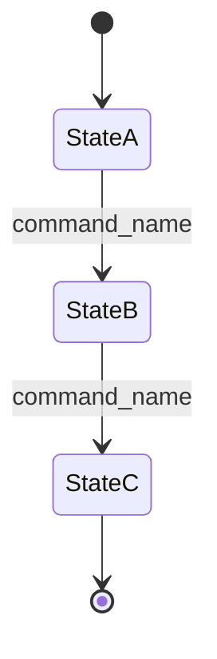

<!--
Authoring template for module pages. Copy this file to <slug>/index.md
and fill in. Sections marked OPTIONAL may be omitted with the literal:

    ## <Section name>

    N/A — <one-line reason>

Filename `_template.md` is excluded from mkdocs nav (leading underscore).

Maturity badge values: alpha | beta | stable | deprecated.

When in doubt about what to include, what to strip, and what shape a
section should take, read the internal lock memo (memory:
project_docs_surfacing_design.md). The short version of the strip rules:

  Strip: [[name]] memory links, external-project comparisons by name,
         Anti-hooks sections, Watch items, Rejections / Alternatives
         considered, commit SHAs, phase numbers in prose, gate-review
         history, facility audit counts, "we rejected X because Y"
         reasoning, Stage-0 corpus citations.

  Keep:  protocols and standards we adopt (RFC numbers, PROV-O,
         ISA-95, SOSA, EPCIS as wire format), the obvious half of
         "Why" paragraphs, anything that's an operational reference
         a reader needs to integrate with the module.
-->

# <Module name> module <span class="md-maturity md-maturity--stable" title="<One-line caption: what the badge implies for this module>"><alpha | beta | stable | deprecated></span>

<!--
  The maturity span must stay on the same line as the H1 so it renders as a
  colored pill chip inline with the title (the .md-typeset h1 > .md-maturity
  CSS rule aligns it there). On its own line it drops to a new paragraph.
  Match the class suffix to the label inside the span:
    md-maturity--alpha       <span class="md-maturity md-maturity--alpha">alpha</span>
    md-maturity--beta        <span class="md-maturity md-maturity--beta">beta</span>
    md-maturity--stable      <span class="md-maturity md-maturity--stable">stable</span>
    md-maturity--deprecated  <span class="md-maturity md-maturity--deprecated">deprecated</span>
  The `title` attribute becomes the tooltip on hover; keep it under ~15 words.
-->

## Purpose & Scope

<1-2 paragraphs in domain language. What this module is responsible for. No DDD jargon beyond what's in the glossary. The ONLY "why" allowed on the page.>

<!--
  OPTIONAL: if there are scope-limit clarifications worth surfacing (what
  this module deliberately does NOT cover — high-frequency telemetry,
  bulk data, governance concerns parked in another module), wrap them in
  the deferred-aside variant below. Omit if there are no such limits.
-->

<div class="cora-aside cora-aside--deferred" markdown>

Out of scope
{: .cora-kicker }

- **<concern>.** <one-line explanation pointing to where it actually lives>.
- **<concern>.** <one-line explanation>.

</div>

## Aggregates

| Name | Identity | State summary | FSM |
|---|---|---|---|
| `<Aggregate>` | `<id field(s)>` | `<one-line description of state shape>` | yes / no / optional |
| `<SubAggregate>` (sub-aggregate VO on `<Parent>`) | `<discriminator>` | `<one-line state shape>` | no |

## Value Objects

<!-- OPTIONAL — omit with "N/A — module has no Value Objects beyond aggregate-internal primitives" -->

| Name | Shape | Where used |
|---|---|---|
| `<VOName>` | `<one-line dataclass sketch or discriminated-union summary>` | `<aggregate.field or slice.context>` |

## FSM

<!-- OPTIONAL — omit with "N/A — aggregate has no load-bearing FSM" (example: Calibration). -->



| From | To | Command | Event |
|---|---|---|---|
| `<state>` | `<state>` | `<command>` | `<Event>` |

**Guards.** Beyond the source-state check, each transition enforces:

`<command_name>`
: `<one-paragraph guard description; cite cross-aggregate context if relevant>`

<!--
  Keep the table at 4 columns (From / To / Command / Event); push guard prose
  into the definition list below so the table never scrolls horizontally.
  Omit the whole Guards block when guards are trivial (just source-state).
-->

## Events

| Event | Payload sketch | When emitted |
|---|---|---|
| `<EventClass>` | `<field: type, ...>` | `<one-line trigger>` |
| `<EventClass>` | (no event emitted; returns `[]`) | `<no-op condition>` |

## Slices

| Command | Category | REST | MCP tool | Idempotency |
|---|---|---|---|---|
| `<DefineX>` | NEW | `POST /<resource>` | `<tool_name>` | required |
| `<UpdateX>` | MODIFIED | `PATCH /<resource>/{id}` | `<tool_name>` | required |
| `<GetX>` | QUERY | `GET /<resource>/{id}` | `<tool_name>` | none |
| `<ListX>` | QUERY | `GET /<resource>` | `<tool_name>` | none |

**Errors per slice.** Beyond Pydantic boundary 422s, each slice raises:

`<DefineX>`
: `<X>AlreadyExists`, `Invalid<X>`, `Unauthorized`

`<UpdateX>`
: `<X>NotFound`, `<X>CannotUpdate`, `Unauthorized`

`<GetX>`
: `<X>NotFound`

`<ListX>`
: (boundary 422 only)

<!--
  Keep the slices table at 5 columns; group repeated errors into per-slice
  definition list entries below so the table stays narrow. When several
  slices share an error set (for example all FSM transitions raising
  `<X>NotFound, <X>Cannot<Verb>, Unauthorized`), group them with a slash
  in the term (for example `<HoldX>` / `<ResumeX>`) so the list doesn't repeat.
-->


## Storage & Projections

<!-- One DDL block per projection + a short prose paragraph on invariants. NOT a full migration; just the shape readers need to integrate. -->

`proj_<name>_summary`:

```sql title="proj_<name>_summary"
CREATE TABLE proj_<name>_summary (
    id UUID PRIMARY KEY,
    <field> <type> NOT NULL,
    ...
);
```

<!--
  Use `title="<table_name>"` on every SQL fence so mkdocs Material renders
  a clean header pill above the code block. Especially useful when several
  projection tables appear on the same page (entries_*, proj_* siblings).
-->


<One paragraph on what invariants the projection holds, any UNIQUE constraints, eventual-consistency notes if relevant.>

## Cross-Module boundaries

| Module | Relationship | What's exchanged |
|---|---|---|
| `<OtherModule>` | reads-from | `<read-side query: list_X / find_X / proj table>` |
| `<OtherModule>` | writes-to via `append_streams` | `<event written>` |
| `<OtherModule>` | shared-id-with | `<id field; explain the sharing convention>` |

## Examples

The <N> examples below follow the canonical path for one <Aggregate>: <describe the sequence>. <OPTIONAL: one extra sentence on a module-specific auth or idempotency wrinkle that only this module has.> For the REST/MCP equivalence, auth, and idempotency conventions these examples share, see [Reading the examples](../index.md) on the Modules landing page.

<!--
  Keep this preamble to ONE paragraph. The shared REST/MCP/auth/idempotency
  explanation lives once on `architecture/modules/index.md` (the Modules
  landing page) so individual module pages don't repeat it. Only mention
  here what's genuinely unique to THIS module's call shape (for example
  "the author_actor_id comes from the X-Principal-Id header" or
  "review-board actor comes from the header, not the body"). When in
  doubt, link out and skip the wrinkle sentence.
-->


<!-- extracted from apps/api/tests/contract/test_<feature>.py -->

### <Short example title>

=== "REST"

    ```http
    POST /<resource>
    Content-Type: application/json
    Idempotency-Key: <uuid>
    X-Principal-Id: <uuid>

    {
      "<field>": "<value>"
    }
    ```

    A successful call returns `<status>` with `<short note on response shape>`.

=== "MCP"

    ```python
    mcp.call_tool("<tool_name>", {"<field>": "<value>"})
    ```

    Returns the same response shape as the REST call.

<!--
  Use the `=== "REST"` / `=== "MCP"` tab pair (pymdownx.tabbed, alternate
  style enabled in mkdocs.yml) for every example. This renders as a tabbed
  widget that lets the reader switch surfaces without scrolling past one
  to find the other. Stacking two raw code fences without tabs reads as a
  visual jam — the tab pair is the canonical pattern.

  Indent the fenced code blocks under each `===` by 4 spaces so they
  belong to the tab.
-->
