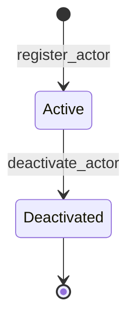

# Access module

<span class="md-maturity md-maturity--stable" title="Foundation BC: one aggregate, two events, two-state lifecycle, shared identity with Agent">stable</span>

## Purpose & Scope

The Access module owns the identity record for every principal CORA recognises: human operators, machine bridges that act on their own credentials, and the AI agents the Agent module configures. One aggregate, `Actor`, is the canonical place where a principal's id, display name, kind, and active-or-not state live; every other module that needs to attribute an event to "who did this" references `Actor.id`.

Access handles authentication identity only. It is the **who you are** layer; authorisation rules live in [Trust](../trust/index.md), and the agent-specific configuration (tool allowlists, budgets, suspended state) lives in [Agent](../agent/index.md). The two modules collaborate by sharing the same id: an Agent and the Actor that represents it have one UUID between them, written atomically in a single transaction.

<div class="cora-aside cora-aside--deferred" markdown>

Out of scope

- **Personal data vault.** Today `Actor.name` lives on the aggregate state and inside `ActorRegistered`. The right-to-erasure design moves display name and any future contact field into a mutable `profile` table referenced by `actor_id`, leaving the events carrying only the id. The convention is documented under [Personal data](../../../reference/conventions.md#personal-data); the migration ships when the first non-greenfield data lands.
- **Reactivation.** The lifecycle has no `reactivate_actor` slice. Once deactivated an Actor stays deactivated; a returning operator gets a new Actor stream with a fresh id and a cross-system note where reconciliation is needed.
- **Authorisation and ReBAC.** "What can this Actor do" is a Policy question owned by Trust. The Authorize port carries `actor_id` but resolves rules against `Zone`, `Conduit`, `Surface`, and `Policy`.
- **Cross-facility federation.** Identity reconciliation across facilities (the same physical operator at APS and MAX IV) is deferred. Today each deployment owns its own Actor stream.
- **Profile fields beyond the display name.** Email, phone, ORCID, affiliation, organisational unit are not on the aggregate today. They land on the future `profile` table when they arrive.

</div>

## Aggregates

| Name | Identity | State summary | FSM |
|---|---|---|---|
| `Actor` | `id: UUID` | `id`, `name: ActorName`, `active: bool`, `kind: ActorKind` | yes (binary, terminal) |

## Value Objects

| Name | Shape | Where used |
|---|---|---|
| `ActorName` | trimmed string, 1-200 chars | `Actor.name` |
| `ActorKind` | closed StrEnum: `human` \| `agent` \| `service_account` | `Actor.kind` |

`ActorKind.human` is the default for human operators registered through the Access surface. `ActorKind.agent` is reserved for the cross-module atomic write that the Agent module performs when it defines a new agent; the Access surface itself rejects attempts to mint agent-kind Actors directly. `ActorKind.service_account` covers machine callers (CI bridges, autonomous-agent runtime processes, future TomoScan and EPICS bridges) whose principal identity comes from a bearer token rather than an interactive session.

## FSM



| From | To | Command | Event |
|---|---|---|---|
| `[*]` | `Active` | `register_actor` | `ActorRegistered` |
| `Active` | `Deactivated` | `deactivate_actor` | `ActorDeactivated` |

The state is carried by the `active` boolean on the aggregate; `Active` and `Deactivated` are read in the FSM sense from that flag plus the existence of the genesis event. `Deactivated` is terminal: there is no command that flips `active` back to True. References to a deactivated Actor remain valid for audit and read paths; downstream modules that need to gate new work on an Actor's active status check `active` at the Authorize port.

## Events

| Event | Payload sketch | When emitted |
|---|---|---|
| `ActorRegistered` | `actor_id`, `kind`, `occurred_at` | `register_actor` succeeds (genesis); also emitted atomically by Agent module's `define_agent` with `kind="agent"`. Display name lives in the `actor_profile` table per the PII vault pattern; legacy V1 writes carried `name` in the payload and are dropped on replay. |
| `ActorDeactivated` | `actor_id`, `occurred_at` | `deactivate_actor` succeeds on an Actor that was active |

## Slices

| Command | Category | REST | MCP tool | Idempotency |
|---|---|---|---|---|
| `RegisterActor` | NEW | `POST /actors` | `register_actor` | required |
| `DeactivateActor` | MODIFIED | `POST /actors/{actor_id}/deactivate` | `deactivate_actor` | none |
| `ForgetActor` | MODIFIED | `DELETE /actors/{actor_id}/profile` | `forget_actor` | optional |
| `GetActor` | QUERY | `GET /actors/{actor_id}` | `get_actor` | none |
| `ListActors` | QUERY | `GET /actors` | `list_actors` | none |

**Errors per slice.** Beyond Pydantic boundary 422s, each slice raises:

`RegisterActor`
: `InvalidActorName`, `InvalidActorKind` (rejects `kind="agent"` on this path; agent-kind Actors come exclusively from Agent module's atomic write), `ActorAlreadyExists`, `Unauthorized`

`DeactivateActor`
: `ActorNotFound`, `ActorAlreadyDeactivated`, `Unauthorized`

`ForgetActor`
: `ActorNotFound`, `Unauthorized`

`GetActor`
: `ActorNotFound`

`ListActors`
: (boundary 422 only)

## Storage & Projections

One read-side table backs the Access module.

```sql title="proj_access_actor_summary"
CREATE TABLE proj_access_actor_summary (
    actor_id    UUID        PRIMARY KEY,
    name        TEXT        NOT NULL,
    status      TEXT        NOT NULL
        CHECK (status IN ('active', 'deactivated')),
    kind        TEXT        NOT NULL DEFAULT 'human'
        CHECK (kind IN ('human', 'agent', 'service_account')),
    created_at  TIMESTAMPTZ NOT NULL,
    updated_at  TIMESTAMPTZ NOT NULL DEFAULT now()
);

CREATE INDEX proj_access_actor_summary_keyset_idx
    ON proj_access_actor_summary (created_at, actor_id);
```

One row per Actor; the lifecycle collapses to a single mutable row by `ON CONFLICT` semantics in the projection. `status` flips from `active` to `deactivated` on `ActorDeactivated`; `kind` is backfilled to `human` for any pre-existing row that predated the addition of the column and never moves once set.

`GET /actors/{id}` folds the event stream so the response reflects the latest committed write without projection lag. `GET /actors` reads from `proj_access_actor_summary` with keyset pagination over `(created_at, actor_id)` and filters on `status` and `kind`.

## Cross-Module boundaries

| Module | Relationship | What's exchanged |
|---|---|---|
| Agent | shared-id-with | `Actor.id` equals `Agent.id` for `kind="agent"` Actors; the cross-module write happens in one transaction via `append_streams` so both events commit together or neither does |
| Trust | reads-from | `Policy.authorize(actor_id, command, conduit_id, surface_id)` resolves an Actor against Zone, Conduit, Surface, and Policy rules |
| Decision | shared-id-with | `Decision.actor_id` references the principal who made the decision |
| Run | shared-id-with | `Run.requested_by_actor_id` and operator-on-the-floor anchors reference Actors |
| Calibration | shared-id-with | `Calibration.defined_by_actor_id`, each revision's `established_by_actor_id`, and `AssertedSource.actor_id` |
| Caution | shared-id-with | `Caution.authored_by_actor_id` |
| Campaign | shared-id-with | `Campaign.lead_actor_id` |
| Safety | shared-id-with | `Clearance` review-board members and approval ids |

Every event written by any module that needs principal attribution carries `actor_id` on the envelope (or a domain field on the payload), and the value is an Actor stream id. Cross-module references are bare UUIDs: the write path of, for example, Calibration does not verify the Actor exists at the time the revision is appended, in line with the eventual-consistency stance on cross-module reference checks.

The table above lists only modules that hold a **named domain reference** to an Actor (`lead_actor_id`, `defined_by_actor_id`, review-board members, and similar). Every other module that emits events with `actor_id` on the envelope alone is intentionally omitted to keep this page from duplicating what every other module page already declares from its own side. To trace the full reverse fan-out, read the `Access | shared-id-with` row on each module's cross-module table.

## Examples

The four examples below cover the canonical Actor lifecycle: register a human, deactivate that human, fetch a single Actor, and page through the directory. The caller's principal goes on the `X-Principal-Id` header and, for `register_actor`, becomes the Actor id when the server generates a fresh one. For the REST/MCP equivalence, auth, and idempotency conventions these examples share, see [Reading the examples](../index.md) on the Modules landing page.

### Register a human Actor

=== "REST"

    ```http
    POST /actors
    Content-Type: application/json
    Idempotency-Key: 6f4a3b1c-8e2d-4f5a-9b8c-1d2e3f4a5b6c
    X-Principal-Id: 11111111-2222-3333-4444-555555555555

    {
      "name": "Ada Lovelace",
      "kind": "human"
    }
    ```

    Returns `201 Created` with the newly-assigned `actor_id` and the registered `kind`. The server rejects `kind="agent"` on this path with a 400; agent-kind Actors come from the Agent module's atomic write.

=== "MCP"

    ```python
    mcp.call_tool(
        "register_actor",
        {"name": "Ada Lovelace", "kind": "human"},
    )
    ```

### Deactivate an Actor

=== "REST"

    ```http
    POST /actors/<actor-id>/deactivate
    X-Principal-Id: 11111111-2222-3333-4444-555555555555
    ```

    Returns `200 OK`. The Actor's `active` flag flips to False and the row's `status` becomes `deactivated`. A second call returns `409 Conflict` with `ActorAlreadyDeactivated`.

=== "MCP"

    ```python
    mcp.call_tool("deactivate_actor", {"actor_id": "<actor-id>"})
    ```

### Get one Actor

=== "REST"

    ```http
    GET /actors/<actor-id>
    X-Principal-Id: 11111111-2222-3333-4444-555555555555
    ```

    Returns `200 OK` with `actor_id`, `name`, `kind`, and `active`. `404 Not Found` if the stream has no events.

=== "MCP"

    ```python
    mcp.call_tool("get_actor", {"actor_id": "<actor-id>"})
    ```

### List active human Actors

=== "REST"

    ```http
    GET /actors?status=active&kind=human&limit=50
    X-Principal-Id: 11111111-2222-3333-4444-555555555555
    ```

    Returns the page of active human Actors with an opaque `next_cursor` for keyset pagination. Drop `status` or `kind` to widen the view; pass them as multi-value filters to enumerate, for example, every machine caller (`kind=service_account&kind=agent`).

=== "MCP"

    ```python
    mcp.call_tool(
        "list_actors",
        {"status": ["active"], "kind": ["human"], "limit": 50},
    )
    ```
