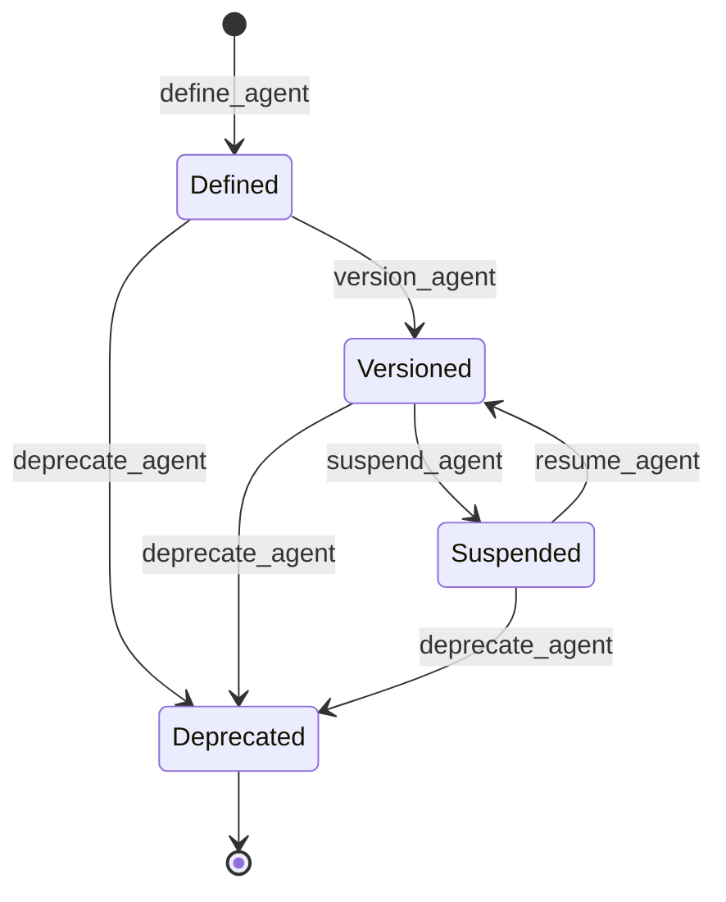

# Agent module <span class="md-maturity md-maturity--stable" title="Eleven slices shipped with two production agents (RunDebriefer, CautionDrafter), four-state lifecycle, tool grants, and budget declarations">stable</span>

## Purpose & Scope

The Agent module records the typed configuration for each AI agent that participates in CORA. An Agent is the digital identity card of a kind of automation: "the RunDebriefer agent runs on Claude Sonnet 4.6 pinned to snapshot `20251001`, gets the prompt template at this id, and writes its findings as Decisions on the Run it watched"; "the CautionDrafter agent watches terminal Run events and proposes Cautions for operator review". The aggregate carries everything needed to identify, version, and gate an agent's behaviour for reproducibility; the runtime lives in the subscriber layer that invokes it.

Agents share their identity with the Access module's Actors: the same UUID names the agent's record here and the agent's Actor record over there, written atomically at definition. Every Decision an agent writes, and every authorisation check that runs against an agent's action, refers to that single id.

An Agent carries five roles:

- **Identity shared with an Actor.** `Agent.id` is the same UUID as Access's `Actor.id` for the same agent. `define_agent` writes `AgentDefined` and `ActorRegistered(kind="agent")` atomically across both BCs in a single transaction. Every cross-BC reference (Decision authorship, Authorize checks, logbook attribution) works uniformly for humans and agents.
- **A four-state lifecycle.** An Agent moves through `Defined` (registered but not yet invocable), `Versioned` (promoted to ready-for-invocation; subscribers filter on this), `Suspended` (operator pause from `Versioned`; non-terminal, returns via `resume_agent`), and `Deprecated` (terminal). Versioning is per-Agent-id rainbow-style: multiple `Versioned` agents may share `kind` concurrently with different `id`s.
- **A typed configuration record.** Required: `kind`, `name`, `version`, `model_ref` (provider plus model plus optional snapshot pin). Optional: `description`, `canonical_uri` (https-only, A2A-forward-compat), `prompt_template_id`, `capabilities` (free-form, cardinality-capped). All bounded-text fields trim and validate at the value-object boundary.
- **Tool grants and budget declarations.** `tools` is a frozenset of MCP tool names the agent is authorised to invoke; grants and revocations are idempotent and stay editable in `Defined`, `Versioned`, and `Suspended` (only `Deprecated` blocks them). `budget` carries optional `monthly_usd_cap` and `daily_token_cap`; declaration only today, with enforcement deferred to the Budget BC.
- **Cross-BC action slices.** Two slices today drive cross-BC writes: `regenerate_run_debrief` invokes the RunDebriefer agent on demand and writes a Decision on the named Run; `promote_caution_proposal` reads a CautionDrafter agent's `CautionProposal` Decision and writes the proposed Caution into the Caution module after operator review.

<div class="cora-aside cora-aside--deferred" markdown>

Out of scope
{: .cora-kicker }

- **Budget enforcement.** `AgentBudget` is declarative today. The Budget BC adoption is the trigger for cap enforcement; cost telemetry already lands on `gen_ai.cost.usd` so the enforcer can ride on existing signals.
- **A2A endpoint serving.** `canonical_uri` and `card_signature` (deferred) are forward-compat fields for the Agent2Agent protocol. CORA does not serve an A2A endpoint today.
- **`acts_on_behalf_of` delegation.** Per-operator agent delegation is deferred until the first concrete need.
- **Strict URI validation.** `canonical_uri` validation is loose today (https scheme, no fragment, length cap). RFC-compliant parsing waits until A2A wiring lands.
- **Tool-name BNF.** `ToolName` accepts any 1-100 char trimmed string. Tightening to MCP's formal tool-naming BNF is a watch item.
- **Closed `AgentKind` enum.** Kinds are free-form strings today. Graduation to a closed StrEnum waits until the vocabulary stabilises in pilot use.
- **Decision integration in the aggregate.** The Agent aggregate is config-only. The runtime that invokes the agent and writes the Decision lives in the subscriber layer; the aggregate never knows it was invoked.

</div>

## Aggregates

| Name | Identity | State summary | FSM |
|---|---|---|---|
| `Agent` | `id: UUID` (same UUID as Access's `Actor.id` for this agent) | `kind`, `name`, `version`, `model_ref`, `description?`, `canonical_uri?`, `prompt_template_id?`, `capabilities`, `status`, `deprecation_reason?`, `tools`, `budget?`, `suspended_at?`, `resumed_at?`, `suspension_reason?` | yes |

Lifecycle timestamps (`defined_at`, `versioned_at`, `deprecated_at`) live on the projection rather than on aggregate state, matching the Method / Plan / Practice / Family / Capability shape from the 2026-05-20 audit. `suspended_at`, `resumed_at`, and `suspension_reason` stay on state because `suspension_reason` is invariant-bearing (deciders read it).

## Value Objects

| Name | Shape | Where used |
|---|---|---|
| `AgentKind` | trimmed string, 1-100 chars | `Agent.kind` (free-form discriminator) |
| `AgentName` | trimmed string, 1-100 chars | `Agent.name` (display name; mirrors A2A AgentCard.name and OTel `gen_ai.agent.name`) |
| `AgentDescription` | trimmed string, 1-2000 chars | `Agent.description` (free-form prose) |
| `AgentVersion` | trimmed string, 1-50 chars | `Agent.version` (semver-like convention; not parsed) |
| `AgentCanonicalUri` | trimmed string, 1-2000 chars, starts with `https://`, no fragment | `Agent.canonical_uri` (A2A-forward-compat) |
| `AgentCapability` | trimmed string, 1-100 chars per entry; frozenset capped at 32 entries | members of `Agent.capabilities` |
| `AgentDeprecationReason` | trimmed string, 1-500 chars; optional | `Agent.deprecation_reason` (operator-supplied) |
| `AgentSuspensionReason` | trimmed string, 1-500 chars; REQUIRED at suspend | `Agent.suspension_reason` |
| `ToolName` | trimmed string, 1-100 chars per entry; frozenset capped at 32 entries | members of `Agent.tools` (MCP tool allowlist) |
| `AgentBudget` | `monthly_usd_cap: float? >= 0`, `daily_token_cap: int? >= 0`; at least one non-None | `Agent.budget` (declarative caps; no enforcement today) |
| `ModelRef` | `provider: str (1-100)`, `model: str (1-200)`, `snapshot_pin: str? (1-100)` | `Agent.model_ref` (required at definition) |

`ModelRef.snapshot_pin` enables reproducibility-by-construction: an Anthropic snapshot string, an OpenAI model fingerprint, or any provider-specific pin that names the exact weights used. Different `model_ref` requires defining a new Agent with a new `id`; the model identity is not a mutable field.

## FSM



| From | To | Command | Event |
|---|---|---|---|
| `(none)` | `Defined` | `define_agent` | `AgentDefined` (plus `ActorRegistered(kind="agent")` on Access stream) |
| `Defined` | `Versioned` | `version_agent` | `AgentVersioned` |
| `Versioned` | `Suspended` | `suspend_agent` | `AgentSuspended` |
| `Suspended` | `Versioned` | `resume_agent` | `AgentResumed` |
| `Defined` / `Versioned` / `Suspended` | `Deprecated` | `deprecate_agent` | `AgentDeprecated` |

**Guards.** Beyond the source-state check, each transition enforces:

`define_agent`
: All required VOs (`kind`, `name`, `version`, `model_ref`) pass bounded-text validation; `capabilities` cardinality 0-32; if `canonical_uri` is set it must be `https://` with no fragment. The slice writes to both the Agent stream and the Access Actor stream via `EventStore.append_streams`; either stream's `ConcurrencyError` rolls back the whole commit.

`version_agent`
: Source set is `{Defined}` only. Cannot re-version a `Versioned` agent (multi-version-per-kind is achieved by defining a new Agent with the same `kind` and a different `id`, not by re-versioning the same `id`).

`suspend_agent`
: Source set is `{Versioned}` only. `reason` is REQUIRED (1-500 chars after trim) so the audit log always carries operator context for the pause.

`resume_agent`
: Source set is `{Suspended}` only. No `reason` field by design: the act of resuming is its own signal; if rationale matters, operators record a Decision separately.

`deprecate_agent`
: Source set is `{Defined, Versioned, Suspended}`. `reason` is optional bounded text. Terminal; cannot be re-deprecated.

`grant_tool_to_agent` / `revoke_tool_from_agent` / `revise_agent_budget`
: All blocked only in `Deprecated`. Open in `Defined`, `Versioned`, and `Suspended` so operators can fix permissions or caps while an agent is paused. Tool grants and revocations are idempotent (a no-op grant or revoke emits no event); budget revision always emits an event.

## Events

| Event | Payload sketch | When emitted |
|---|---|---|
| `AgentDefined` | `agent_id`, `kind`, `name`, `version`, `model_ref`, `description?`, `canonical_uri?`, `prompt_template_id?`, `capabilities`, `tools`, `budget_monthly_usd_cap?`, `budget_daily_token_cap?`, `occurred_at` | `define_agent` succeeds (co-written with `ActorRegistered`) |
| `AgentVersioned` | `agent_id`, `version`, `occurred_at` | `version_agent` succeeds |
| `AgentSuspended` | `agent_id`, `reason`, `occurred_at` | `suspend_agent` succeeds |
| `AgentResumed` | `agent_id`, `occurred_at` | `resume_agent` succeeds |
| `AgentDeprecated` | `agent_id`, `reason?`, `occurred_at` | `deprecate_agent` succeeds; terminal |
| `AgentToolGranted` | `agent_id`, `tool_name`, `occurred_at` | `grant_tool_to_agent` succeeds (no event on a no-op re-grant) |
| `AgentToolRevoked` | `agent_id`, `tool_name`, `occurred_at` | `revoke_tool_from_agent` succeeds (no event on a no-op re-revoke) |
| `AgentBudgetRevised` | `agent_id`, `monthly_usd_cap?`, `daily_token_cap?`, `occurred_at` | `revise_agent_budget` succeeds |

`define_agent` is the only Agent-BC slice that writes across streams. The other lifecycle events are single-stream. The cross-BC action slices (`regenerate_run_debrief`, `promote_caution_proposal`) do not write to the Agent stream at all: they write a `DecisionRegistered` on the Decision stream and (for the promotion path) a `CautionRegistered` on the Caution stream.

## Slices

<!-- arch:slices-table bc=agent -->
_Generated from the code at build time._
<!-- /arch:slices-table -->

**Errors per slice.** Beyond Pydantic boundary 422s, each slice raises:

`DefineAgent`
: `InvalidAgentKind`, `InvalidAgentName`, `InvalidAgentVersion`, `InvalidAgentDescription`, `InvalidAgentCanonicalUri`, `InvalidAgentCapability`, `InvalidAgentCapabilities` (over cardinality cap), `InvalidModelRef`, `AgentAlreadyExists` (defensive; UUIDv7 makes collision near-impossible), `Unauthorized`

`VersionAgent` / `SuspendAgent` / `ResumeAgent` / `DeprecateAgent`
: `AgentNotFound`, `AgentCannotVersion` / `AgentCannotSuspend` / `AgentCannotResume` / `AgentCannotDeprecate` (source-state guard), `Unauthorized`. `SuspendAgent` additionally raises `InvalidAgentSuspensionReason`; `DeprecateAgent` additionally raises `InvalidAgentDeprecationReason`.

`GrantToolToAgent` / `RevokeToolFromAgent`
: `AgentNotFound`, `AgentCannotGrantTool` / `AgentCannotRevokeTool` (blocked in `Deprecated`), `InvalidToolName`, `AgentToolsExceedsLimit` (grant only), `Unauthorized`

`ReviseAgentBudget`
: `AgentNotFound`, `AgentCannotReviseBudget`, `InvalidAgentBudget`, `Unauthorized`

`GetAgent`
: `AgentNotFound`

`RegenerateRunDebrief`
: `Unauthorized`, `AgentNotSeeded` / `AgentDeactivated` (RunDebriefer agent missing or its Actor inactive), Run cross-aggregate-load failures, parent Decision mismatch, `503` if the LLM adapter is not wired

`PromoteCautionProposal`
: `Unauthorized` (including provenance gate: Decision was not emitted by a registered CautionDrafter agent), `DecisionNotFound`, malformed `proposed_caution` payload, `CautionNotFound` / `CautionCannotSupersede` (for the supersede arm)

`DefineAgent`, `RegenerateRunDebrief`, and `PromoteCautionProposal` are wrapped by the `Idempotency-Key` header pattern. The other lifecycle slices return `204 No Content` and are not idempotency-wrapped: a second `version_agent` against an already-`Versioned` agent raises `AgentCannotVersion` rather than no-oping.

## Storage & Projections

One read-side table backs the Agent module today.

```sql title="proj_agent_summary"
CREATE TABLE proj_agent_summary (
    agent_id       UUID        PRIMARY KEY,
    kind           TEXT        NOT NULL,
    name           TEXT        NOT NULL,
    version        TEXT        NOT NULL,
    status         TEXT        NOT NULL CHECK (
        status IN ('Defined', 'Versioned', 'Suspended', 'Deprecated')
    ),
    created_at     TIMESTAMPTZ NOT NULL,
    versioned_at   TIMESTAMPTZ,
    deprecated_at  TIMESTAMPTZ,
    updated_at     TIMESTAMPTZ NOT NULL DEFAULT now()
);
```

The `CHECK` constraint encodes the closed `AgentStatus` enum at the row level. `versioned_at` and `deprecated_at` are nullable for agents that have not transitioned through those states yet; `created_at` is set once at `AgentDefined` and indexed for keyset pagination.

`Suspended` and `Resumed` lifecycle timestamps stay on aggregate state rather than on the projection, because `suspension_reason` is invariant-bearing (deciders read it to make decisions about subsequent transitions). The projection records the `status` field on every event, so a `Suspended` agent's current state is visible in the read model even though the timestamp pair is not.

`GET /agents/{id}` folds the aggregate's event stream and joins the projection for the lifecycle timestamps; `tools`, `budget`, and `suspension_reason` come from the aggregate state.

## Cross-Module boundaries

| Module | Relationship | What's exchanged |
|---|---|---|
| Trust | gated-by | Every write-side Agent slice (lifecycle, grants, budget) is gated by the Authorize port resolving a `Policy` for the `(principal, command, conduit, surface)` tuple; deny outcomes refuse before the decider runs |
| Access | shared-id-with | `Agent.id` is the same UUID as `Actor.id` for this agent; `define_agent` co-writes `ActorRegistered(kind="agent")` on the Access stream via `append_streams` |
| Decision | writes-to (via subscriber and slice) | The RunDebriefer subscriber writes `DecisionRegistered` when a Run reaches a terminal state; `regenerate_run_debrief` writes a new `DecisionRegistered` on operator demand; agent-authored Decisions carry the agent's id in `actor_id` |
| Run | reads-from (via subscriber) | The RunDebriefer subscriber filters on terminal-state Run events and loads the Run aggregate plus its `pinned_calibration_ids` to build the debrief context |
| Caution | writes-to via `append_streams` | `promote_caution_proposal` reads a CautionDrafter Decision's `proposed_caution` payload and writes `CautionRegistered` (plus, for the supersede arm, `CautionSuperseded` on the parent stream) atomically |

The two cross-BC action slices both gate on operator authorisation before any cross-BC write happens: `regenerate_run_debrief` requires the caller to be authorised to invoke the named agent; `promote_caution_proposal` requires the caller to be authorised to author Cautions, plus a provenance check that the named Decision was emitted by a registered CautionDrafter agent. Promotion is operator-initiated by design; the CautionDrafter never writes a Caution itself.

## Examples

The four examples below follow the canonical path for one Agent: define it (atomically registering its Actor in Access), version it for invocation, invoke RunDebriefer on demand against a specific Run, and promote a CautionDrafter Decision into a real Caution. The caller's principal becomes the authoring actor on every write. For the REST/MCP equivalence, auth, and idempotency conventions these examples share, see [Reading the examples](../index.md) on the Modules landing page.

<!-- extracted from tests/contract/agent/test_define_agent.py -->

### Define a new Agent

=== "REST"

    ```http
    POST /agents
    Content-Type: application/json
    Idempotency-Key: 4f5a6b7c-8d9e-0f1a-2b3c-4d5e6f7a8b9c
    X-Principal-Id: 11111111-2222-3333-4444-555555555555

    {
      "kind": "RunDebriefer",
      "name": "Run Debrief (Claude Sonnet 4.6)",
      "version": "v1.0.0",
      "model_ref": {
        "provider": "anthropic",
        "model": "claude-sonnet-4-6",
        "snapshot_pin": "20251001"
      },
      "description": "Watches terminal Run events and writes an advisory Decision summarising what happened.",
      "canonical_uri": "https://agents.cora.aps.anl.gov/run-debrief/v1",
      "capabilities": ["run-debrief", "decision-author"]
    }
    ```

    Returns `201 Created` with the new `agent_id`. The same UUID becomes the agent's `Actor.id` in the Access module, co-written atomically.

=== "MCP"

    ```python
    mcp.call_tool(
        "define_agent",
        {
            "kind": "RunDebriefer",
            "name": "Run Debrief (Claude Sonnet 4.6)",
            "version": "v1.0.0",
            "model_ref": {
                "provider": "anthropic",
                "model": "claude-sonnet-4-6",
                "snapshot_pin": "20251001",
            },
            "description": "Watches terminal Run events and writes an advisory Decision summarising what happened.",
            "canonical_uri": "https://agents.cora.aps.anl.gov/run-debrief/v1",
            "capabilities": ["run-debrief", "decision-author"],
        },
    )
    ```

### Version the Agent so subscribers will invoke it

=== "REST"

    ```http
    POST /agents/<agent-id>/version
    X-Principal-Id: 11111111-2222-3333-4444-555555555555
    ```

    Returns `204 No Content`. The agent moves from `Defined` to `Versioned`; the RunDebriefer subscriber, which filters on `status=Versioned`, will now invoke it on the next terminal Run event.

=== "MCP"

    ```python
    mcp.call_tool(
        "version_agent",
        {"agent_id": "<agent-id>"},
    )
    ```

### Re-invoke RunDebriefer on demand

=== "REST"

    ```http
    POST /agents/run-debriefer/runs/aaaa1111-2222-3333-4444-555555555555/regenerate-debrief
    Content-Type: application/json
    Idempotency-Key: 1a2b3c4d-5e6f-7a8b-9c0d-1e2f3a4b5c6d
    X-Principal-Id: 22222222-3333-4444-5555-666666666666

    {
      "parent_decision_id": "bbbb1111-2222-3333-4444-555555555555"
    }
    ```

    Triggers a fresh RunDebriefer invocation against the named Run and returns `201 Created` with the new `decision_id`. When `parent_decision_id` is supplied, the new Decision links back to the prior debrief via PROV-O `wasInformedBy`. Returns `503 Service Unavailable` when the LLM adapter is not wired (development environment without an API key).

=== "MCP"

    ```python
    mcp.call_tool(
        "regenerate_run_debrief",
        {
            "run_id": "aaaa1111-2222-3333-4444-555555555555",
            "parent_decision_id": "bbbb1111-2222-3333-4444-555555555555",
        },
    )
    ```

### Promote a CautionDrafter Decision into a Caution

=== "REST"

    ```http
    POST /agents/caution-drafter/decisions/<decision-id>/promote
    Idempotency-Key: 9c0d1e2f-3a4b-5c6d-7e8f-9a0b1c2d3e4f
    X-Principal-Id: 33333333-4444-5555-6666-777777777777
    ```

    No request body: the proposed Caution's text, workaround, target, and category are carried by the referenced Decision's `inputs`. Returns `201 Created` with the new `caution_id`. The slice writes `CautionRegistered` on the Caution stream (and, for the supersede arm, `CautionSuperseded` on the parent Caution stream) atomically. Authorisation requires the caller to be authorised to author Cautions and the Decision to have been emitted by a registered CautionDrafter agent.

=== "MCP"

    ```python
    mcp.call_tool(
        "promote_caution_proposal",
        {"decision_id": "<decision-id>"},
    )
    ```
