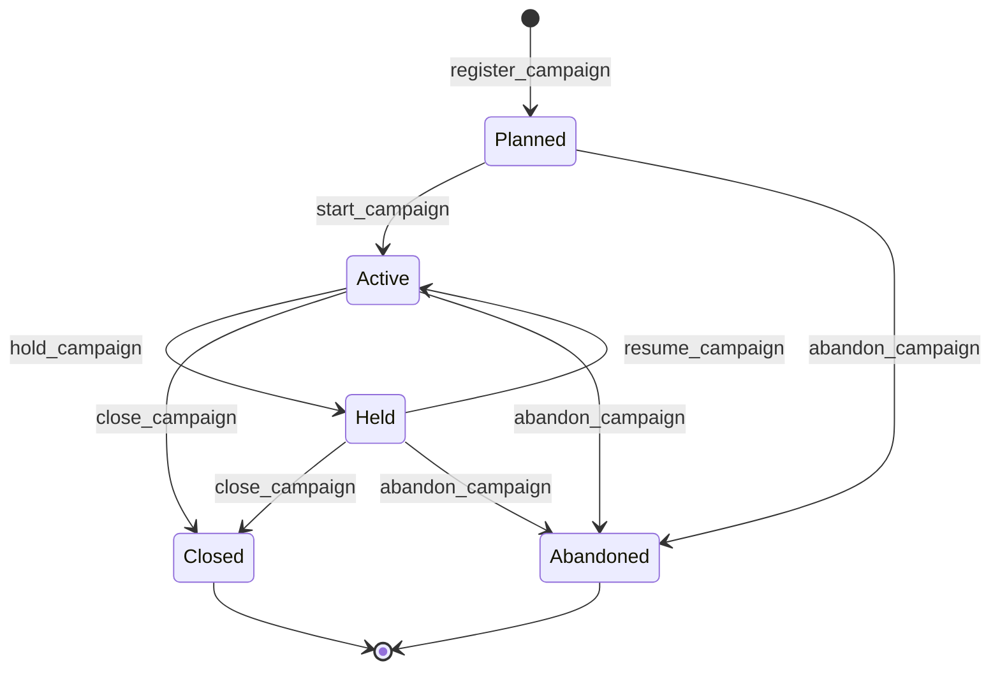

# Campaign module <span class="md-maturity md-maturity--stable" title="Aggregate, FSM, eight events, ten slices, and projection all locked; pilot-deployment ready.">stable</span>

## Purpose & Scope

A Campaign is the operator-declared coordinated study container that sits above Run: a series of measurements over time on shared resources, a parametric sweep, a coordinated multi-modal or multi-Subject acquisition, or a scheduling envelope (proposal, beamtime block, cycle). Operators register a Campaign before the Runs that compose it execute, then add Runs to it (or have Runs join at start) so the post-execution coordination layer has a stable spine.

The module owns the Campaign aggregate, its five-state lifecycle, its membership set, and the read model that powers operator-dashboard and PI-dashboard list views. It is a sibling of the Run module: Campaign composes Runs by id only, holds no execution semantics of its own, and never blocks a Run's own lifecycle.

<div class="cora-aside cora-aside--deferred" markdown>

Out of scope
{: .cora-kicker }

- **Execution semantics.** A Campaign carries no FSM steps that touch instruments. Run owns execution; Campaign only groups.
- **Recipe authoring.** Pre-execution template ladder (Method → Plan → Run scaffolding) lives in the Recipe module. Campaign is the post-execution coordination surface.
- **Multi-Subject coherence checks.** `subject_id` is informational. The aggregate does not validate that member Runs reference the same Subject; Block and cross-Subject Sweep use cases need that freedom.
- **External-id minting.** `external_id` (DataCite Project DOI or facility-assigned PID) is a field on the aggregate but no slice mints it yet; lazy mint at publish time is deferred.

</div>

## Aggregates

| Name | Identity | State summary | FSM |
|---|---|---|---|
| `Campaign` | `id: UUID` (opaque); optional `external_id: str` minted lazily | name, intent, lead actor, optional subject, description, tags, external refs, member `run_ids`, status, last status reason | yes |

## Value Objects

| Name | Shape | Where used |
|---|---|---|
| `CampaignName` | trimmed bounded text, 1-200 chars | `Campaign.name` |
| `CampaignDescription` | trimmed bounded text, 1-2000 chars; optional | `Campaign.description` |
| `CampaignTag` | trimmed bounded text, 1-50 chars per tag | `Campaign.tags` (frozenset) |
| `CampaignIntent` | closed StrEnum `{Series, Sweep, Coordination, Block}` | `Campaign.intent` |
| `CampaignStatus` | closed StrEnum `{Planned, Active, Held, Closed, Abandoned}` | `Campaign.status` |
| `Identifier` | `(scheme: str, value: str)` shared cross-BC VO at `cora.infrastructure.identifier`; day-1 schemes `proposal`, `btr`, `visit`, `cycle` | `Campaign.external_refs` (frozenset) |

`hold_campaign`, `abandon_campaign`, and `remove_run_from_campaign` carry a free-form `reason: str` (1-500 chars after trim) validated at the decider rather than wrapped in a VO, mirroring the audit-breadcrumb precedent set by Run abort / stop reasons.

## FSM



| From | To | Command | Event |
|---|---|---|---|
| `[*]` | `Planned` | `register_campaign` | `CampaignRegistered` |
| `Planned` | `Active` | `start_campaign` | `CampaignStarted` |
| `Active` | `Held` | `hold_campaign` | `CampaignHeld` |
| `Held` | `Active` | `resume_campaign` | `CampaignResumed` |
| `Active` | `Closed` | `close_campaign` | `CampaignClosed` |
| `Held` | `Closed` | `close_campaign` | `CampaignClosed` |
| `Planned` | `Abandoned` | `abandon_campaign` | `CampaignAbandoned` |
| `Active` | `Abandoned` | `abandon_campaign` | `CampaignAbandoned` |
| `Held` | `Abandoned` | `abandon_campaign` | `CampaignAbandoned` |

**Guards.** Beyond the source-state check, each transition enforces:

`hold_campaign` / `abandon_campaign`
: `reason` is REQUIRED and validated 1-500 chars after trim. The Campaign's `last_status_reason` is overwritten on hold and on abandon; `resume_campaign` deliberately preserves it so the audit breadcrumb ("why was it held before the resume?") stays readable.

`add_run_to_campaign` / `remove_run_from_campaign`
: Source set is `{Planned, Active, Held}` on both sides. Terminal Campaigns (Closed, Abandoned) refuse all membership mutation. `add_run_to_campaign` additionally rejects if the Run is already a member of THIS Campaign (membership idempotency) and the Run module rejects if the Run is already assigned to a DIFFERENT Campaign (one-Campaign-per-Run lock). `remove_run_from_campaign` requires a `reason` and rejects when the Run is not a current member.

## Events

| Event | Payload sketch | When emitted |
|---|---|---|
| `CampaignRegistered` | `campaign_id, name, intent, lead_actor_id, subject_id?, description?, tags, external_refs, external_id?, occurred_at` | `register_campaign` accepted; status implicitly `Planned`. |
| `CampaignStarted` | `campaign_id, occurred_at` | `start_campaign` accepted (Planned → Active). |
| `CampaignHeld` | `campaign_id, reason, occurred_at` | `hold_campaign` accepted (Active → Held). |
| `CampaignResumed` | `campaign_id, occurred_at` | `resume_campaign` accepted (Held → Active). |
| `CampaignClosed` | `campaign_id, occurred_at` | `close_campaign` accepted (Active or Held → Closed). |
| `CampaignAbandoned` | `campaign_id, reason, occurred_at` | `abandon_campaign` accepted (Planned, Active, or Held → Abandoned). |
| `CampaignRunAdded` | `campaign_id, run_id, occurred_at` | `add_run_to_campaign` accepted, OR `start_run` accepted with `campaign_id` set. Written atomically with `RunAddedToCampaign` (or `RunStarted`) on the Run stream. |
| `CampaignRunRemoved` | `campaign_id, run_id, reason, occurred_at` | `remove_run_from_campaign` accepted. Written atomically with `RunRemovedFromCampaign` on the Run stream. |

Transitioning-actor identity lives only on `StoredEvent.principal_id`; the genesis payload's `lead_actor_id` is the operator-asserted campaign lead, which may differ from the registering actor (a beamline scientist registering on behalf of a visiting PI).

## Slices

| Command | Category | REST | MCP tool | Idempotency |
|---|---|---|---|---|
| `RegisterCampaign` | NEW | `POST /campaigns` | `register_campaign` | optional |
| `StartCampaign` | MODIFIED | `POST /campaigns/{campaign_id}/start` | `start_campaign` | none |
| `HoldCampaign` | MODIFIED | `POST /campaigns/{campaign_id}/hold` | `hold_campaign` | none |
| `ResumeCampaign` | MODIFIED | `POST /campaigns/{campaign_id}/resume` | `resume_campaign` | none |
| `CloseCampaign` | MODIFIED | `POST /campaigns/{campaign_id}/close` | `close_campaign` | none |
| `AbandonCampaign` | MODIFIED | `POST /campaigns/{campaign_id}/abandon` | `abandon_campaign` | none |
| `AddRunToCampaign` | MODIFIED | `POST /campaigns/{campaign_id}/runs/{run_id}/add` | `add_run_to_campaign` | none |
| `RemoveRunFromCampaign` | MODIFIED | `POST /campaigns/{campaign_id}/runs/{run_id}/remove` | `remove_run_from_campaign` | none |
| `GetCampaign` | QUERY | `GET /campaigns/{campaign_id}` | `get_campaign` | none |
| `ListCampaigns` | QUERY | `GET /campaigns` | `list_campaigns` | none |

**Errors per slice.** Beyond Pydantic boundary 422s, each slice raises:

`RegisterCampaign`
: `CampaignAlreadyExistsError`, `InvalidCampaignNameError`, `InvalidCampaignDescriptionError`, `InvalidCampaignTagError`, `InvalidCampaignExternalIdError`, `Unauthorized`

`StartCampaign` / `HoldCampaign` / `ResumeCampaign` / `CloseCampaign` / `AbandonCampaign`
: `CampaignNotFoundError`, `CampaignCannot<Verb>Error` (single-source for Start / Hold / Resume; multi-source `{Active, Held}` for Close; multi-source `{Planned, Active, Held}` for Abandon), `Unauthorized`. Hold and Abandon additionally raise `InvalidCampaignHoldReasonError` / `InvalidCampaignAbandonReasonError` on whitespace-only or oversize reasons.

`AddRunToCampaign`
: `CampaignNotFoundError`, `RunNotFoundError`, `CampaignCannotAddRunError` (terminal-status guard), `CampaignRunAlreadyMemberError` (already in THIS Campaign), `RunAlreadyAssignedToCampaignError` (in a DIFFERENT Campaign; from Run module), `Unauthorized`

`RemoveRunFromCampaign`
: `CampaignNotFoundError`, `CampaignCannotRemoveRunError` (terminal-status guard), `CampaignRunNotMemberError`, `InvalidCampaignRunRemoveReasonError`, `Unauthorized`

`GetCampaign`
: `CampaignNotFoundError`

`ListCampaigns`
: (boundary 422 only; `?status=all` cannot be combined with explicit status values)

The `add_run_to_campaign` and `remove_run_from_campaign` slices write two streams atomically through `EventStore.append_streams` (Campaign stream + Run stream). An optimistic-concurrency conflict on either stream raises `OptimisticConcurrencyError` and the operator retries.

## Storage & Projections

`proj_campaign_summary`:

```sql title="proj_campaign_summary"
CREATE TABLE proj_campaign_summary (
    campaign_id              UUID        PRIMARY KEY,
    name                     TEXT        NOT NULL,
    intent                   TEXT        NOT NULL CHECK (
        intent IN ('Series', 'Sweep', 'Coordination', 'Block')
    ),
    status                   TEXT        NOT NULL CHECK (
        status IN ('Planned', 'Active', 'Held', 'Closed', 'Abandoned')
    ),
    lead_actor_id            UUID        NOT NULL,
    subject_id               UUID,
    description              TEXT,
    tags                     TEXT[]      NOT NULL DEFAULT '{}',
    external_id              TEXT,
    run_count                INTEGER     NOT NULL DEFAULT 0,
    registered_at            TIMESTAMPTZ NOT NULL,
    started_at               TIMESTAMPTZ,
    last_status_changed_at   TIMESTAMPTZ,
    last_status_reason       TEXT,
    updated_at               TIMESTAMPTZ NOT NULL DEFAULT now()
);

CREATE INDEX proj_campaign_summary_keyset_idx
    ON proj_campaign_summary (registered_at, campaign_id);
CREATE INDEX proj_campaign_summary_lead_actor_idx
    ON proj_campaign_summary (lead_actor_id);
CREATE INDEX proj_campaign_summary_subject_idx
    ON proj_campaign_summary (subject_id);
CREATE INDEX proj_campaign_summary_tags_gin_idx
    ON proj_campaign_summary USING GIN (tags);
CREATE INDEX proj_campaign_summary_open_idx
    ON proj_campaign_summary (status)
    WHERE status IN ('Planned', 'Active', 'Held');
```

`started_at` is set on the first transition out of Planned (CampaignStarted) and never overwritten on a later Resume, preserving "when did this campaign first begin work" as audit truth. `last_status_reason` is populated by Held and Abandoned, preserved across Resume, and left alone by Start and Close. The partial open-status index supports the default list view, which hides terminal Campaigns unless the operator passes `?status=all` or names a terminal value explicitly. `run_count` denormalises `Campaign.run_ids` set size; the full id set lives on the aggregate stream and is read through `get_campaign` when needed.

The Run module's summary projection carries the inverse pointer (a `campaign_id UUID` column with a partial index where the column is non-null), so the `GET /runs?campaign_id=...` query path serves "show me all Runs in Campaign X" without joining through `proj_campaign_summary.run_ids`.

## Cross-Module boundaries

| Module | Relationship | What's exchanged |
|---|---|---|
| `Trust` | gated-by | Every write-side Campaign slice is gated by the Authorize port resolving a `Policy` for the `(principal, command, conduit, surface)` tuple; deny outcomes refuse before the decider runs. |
| `Run` | writes-to via `append_streams` | `CampaignRunAdded` paired with `RunAddedToCampaign` on `add_run_to_campaign`; with `RunStarted` on `start_run` when `campaign_id` is set at start time. `CampaignRunRemoved` paired with `RunRemovedFromCampaign` on `remove_run_from_campaign`. Atomic two-stream commit. |
| `Run` | reads-from | Inverse `campaign_id` column on `proj_run_summary` powers `list_runs?campaign_id=...`. |
| `Access` | shared-id-with | `lead_actor_id` references the Actor aggregate's id, and every Campaign event envelope carries `actor_id` for principal attribution. The Campaign module does not validate the reference (LOOSE policy); operator-dashboard reads denormalise the actor display name via the Access read model. |
| `Subject` | reads-from | Optional `subject_id` references a Subject. Validation is intentionally not enforced at the Campaign aggregate so multi-Subject Coordinated and Block intents stay expressible. |

## Examples

The four examples below follow the canonical Campaign path: register a Planned Campaign, start it, add a Run, then close it. Reasons on hold and abandon transitions are operator audit breadcrumbs and are persisted onto `last_status_reason`; the reason on `remove_run_from_campaign` is a per-membership audit breadcrumb and is NOT promoted onto `last_status_reason`. For the REST/MCP equivalence, auth, and idempotency conventions these examples share, see [Reading the examples](../index.md) on the Modules landing page.

<!-- extracted from tests/contract/campaign/test_*.py -->

### Register a Campaign

=== "REST"

    ```http
    POST /campaigns
    Content-Type: application/json
    Idempotency-Key: 9a7d2c3e-4b1f-4f6a-8a2e-5c2c4f3a7b91
    X-Principal-Id: 7b1f2d4e-2a3c-4d5e-8f9a-1b2c3d4e5f60

    {
      "name": "APS-2026-1 inconel fatigue campaign",
      "intent": "Series",
      "lead_actor_id": "f1e2d3c4-b5a6-4978-8869-7a6b5c4d3e2f",
      "subject_id": "11111111-2222-4333-8444-555555555555",
      "description": "Repeat tomograms every 30 minutes during in-situ tensile loading.",
      "tags": ["in-situ", "tomography", "fatigue"],
      "external_refs": [
        {"scheme": "proposal", "id": "GUP-89421"},
        {"scheme": "btr", "id": "2026-1-APS-035"}
      ]
    }
    ```

    A successful call returns `201 Created` with `{"campaign_id": "<uuid>"}`. The Campaign starts in `Planned`.

=== "MCP"

    ```python
    mcp.call_tool(
        "register_campaign",
        {
            "name": "APS-2026-1 inconel fatigue campaign",
            "intent": "Series",
            "lead_actor_id": "f1e2d3c4-b5a6-4978-8869-7a6b5c4d3e2f",
            "subject_id": "11111111-2222-4333-8444-555555555555",
            "description": "Repeat tomograms every 30 minutes during in-situ tensile loading.",
            "tags": ["in-situ", "tomography", "fatigue"],
            "external_refs": [
                {"scheme": "proposal", "id": "GUP-89421"},
                {"scheme": "btr", "id": "2026-1-APS-035"},
            ],
        },
    )
    ```

    Returns the same response shape as the REST call.

### Start the Campaign

=== "REST"

    ```http
    POST /campaigns/{campaign_id}/start
    X-Principal-Id: 7b1f2d4e-2a3c-4d5e-8f9a-1b2c3d4e5f60
    ```

    A successful call returns `204 No Content`. Status moves to `Active` and `started_at` is set on the projection.

=== "MCP"

    ```python
    mcp.call_tool("start_campaign", {"campaign_id": "<uuid>"})
    ```

    Returns the same response shape as the REST call.

### Add a Run to the Campaign

=== "REST"

    ```http
    POST /campaigns/{campaign_id}/runs/{run_id}/add
    X-Principal-Id: 7b1f2d4e-2a3c-4d5e-8f9a-1b2c3d4e5f60
    ```

    A successful call returns `204 No Content`. `CampaignRunAdded` is written to the Campaign stream atomically with `RunAddedToCampaign` on the Run stream; both `proj_campaign_summary.run_count` and `proj_run_summary.campaign_id` update on the next projection tick.

=== "MCP"

    ```python
    mcp.call_tool(
        "add_run_to_campaign",
        {
            "campaign_id": "<campaign-uuid>",
            "run_id": "<run-uuid>",
        },
    )
    ```

    Returns the same response shape as the REST call.

### Close the Campaign

=== "REST"

    ```http
    POST /campaigns/{campaign_id}/close
    X-Principal-Id: 7b1f2d4e-2a3c-4d5e-8f9a-1b2c3d4e5f60
    ```

    A successful call returns `204 No Content`. Status moves to `Closed`; membership becomes frozen (further `add_run_to_campaign` / `remove_run_from_campaign` calls return `409 Conflict`). The default `GET /campaigns` list view stops showing this Campaign; pass `?status=all` or `?status=Closed` to retrieve it.

=== "MCP"

    ```python
    mcp.call_tool("close_campaign", {"campaign_id": "<uuid>"})
    ```

    Returns the same response shape as the REST call.
