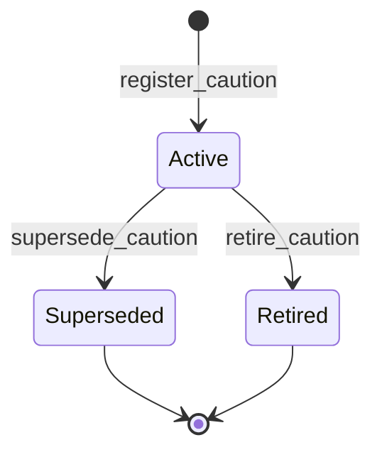

# Caution module <span class="md-maturity md-maturity--stable" title="Five slices shipped and audited; future-additive target kinds (RunTarget, SubjectTarget) tracked separately">stable</span>

## Purpose & Scope

The Caution module records operator-authored tribal-knowledge notes about equipment quirks and procedural gotchas. A Caution is the digital twin of the kind of warning that historically lived in a lab notebook or a Slack thread: "the hexapod stalls below 0.5 mm/s after thermal-soak finishes; wait 10 minutes or override the soak"; "do not skip the encoder home before tomography or the rotation center walks during long scans"; "channel 3 reads 0.2 mA low after the last calibration; subtract before plotting".

Cautions are lightweight and operator-owned. They do not gate work the way Safety Clearances do; instead they show up as banners at the moment work is about to start, so the operator about to launch a Run sees what the previous shift learned the hard way.

A Caution carries five roles:

- **Identity** for one operator note, stable across supersession chains. The Caution id is the internal opaque handle; there is no facility-minted external id today because cautions are internal operational artifacts.
- **A lightweight finite lifecycle** with a three-state machine: a Caution is Active when authored, can be Superseded by a newer Caution carrying revised text or workaround, or Retired when no longer applicable. There is no Approved / Review / Rejected ceremony; the author is the operator who saw the issue.
- **A polymorphic target.** A Caution attaches to either an Asset or a Procedure today. Run-level and Subject-level targets are deferred to a later iteration.
- **Structured payload.** Each Caution carries a closed Category (one of six), a closed Severity (one of three, ANSI Z535-downshifted), a free-text body, a REQUIRED free-text workaround, free tags, an optional expiry, and an opt-in flag for propagation down the Asset hierarchy.
- **Non-blocking read-side surfaces.** The Asset and Procedure detail pages eager-load the Active Cautions for the resource. `GET /cautions` lists them with status and target filters. `Run.start` queries Active Cautions covering the Run's scope and surfaces them as a banner on the response, but never refuses to start.

<div class="cora-aside cora-aside--deferred" markdown>

Out of scope
{: .cora-kicker }

- **Blocking authority.** Cautions never refuse to start a Run or Procedure. Anything that needs to actually stop work belongs in the Safety module as a Clearance.
- **In-place text edit.** There is no `update_caution` slice. The edit path is `supersede_caution`, which atomically retires the parent and writes a new child Caution with revised text. Lineage and audit are preserved.
- **Per-operator acknowledgement state.** A Caution itself does not track which operator has acknowledged it. Acks live on the consumption event (the Run that consumed the caution at start time), not on the Caution aggregate.
- **Promotion to a formal Clearance.** A Warning-severity Caution that accumulates evidence is a candidate for promotion to a Safety Clearance, but today this is a hint only; there is no slice that performs the promotion.
- **Additional target kinds.** RunTarget and SubjectTarget are not modelled today. Runs are short-lived; a note about one is rarely actionable. Subject-level hazards overlap with the Subject module's own hazard field. Both are future-additive.

</div>

## Aggregates

| Name | Identity | State summary | FSM |
|---|---|---|---|
| `Caution` | `id: UUID` | `target`, `category`, `severity`, `text`, `workaround`, `author_actor_id`, `tags`, `expires_at?`, `propagate_to_children`, `status`, `parent_caution_id?`, `superseded_by_caution_id?`, `retired_reason?` | yes |

`parent_caution_id` is populated only on a Caution that supersedes a prior one. `superseded_by_caution_id` is populated only on a Caution that has been replaced. The two pointers together form the lineage chain that downstream readers walk to find the current head of a quirk's history.

`propagate_to_children` is an explicit opt-in: when True, the projection walks `Asset.parent_id` downward at query time so a Caution on an Assembly surfaces on every Device under it.

## Value Objects

| Name | Shape | Where used |
|---|---|---|
| `CautionText` | trimmed string, 1–2000 chars | `Caution.text` (the issue description) |
| `CautionWorkaround` | trimmed string, 1–2000 chars; REQUIRED | `Caution.workaround` (the operator-actionable mitigation) |
| `CautionTag` | trimmed string, 1–50 chars | members of `Caution.tags` (free vocabulary for facility-specific drift) |
| `CautionTarget` | 2-arm discriminated union: `AssetTarget(asset_id)` \| `ProcedureTarget(procedure_id)` | `Caution.target` |

The `workaround` field is mandatory by aggregate invariant. A Caution with no actionable mitigation is just noise; the field's presence is the single strongest convention across operator-knowledge systems.

`CautionTarget` is fixed at registration. A supersede may revise text, workaround, severity, tags, expiry, and propagate-to-children, but not the target; retargeting via supersede confuses the read-side projection's "active cautions on Asset X" query. To move a caution to a different target, retire the original and register a new one.

## FSM



| From | To | Command | Event |
|---|---|---|---|
| `(none)` | `Active` | `register_caution` | `CautionRegistered` |
| `Active` | `Superseded` | `supersede_caution` | `CautionSuperseded` (parent) + `CautionRegistered` (child) |
| `Active` | `Retired` | `retire_caution` | `CautionRetired` |

**Guards.** Beyond the source-state check, each transition enforces:

`register_caution`
: `text` and `workaround` must each be 1–2000 chars after trim (workaround is REQUIRED, not nullable); each `tag` in `tags` must be 1–50 chars; `target` discriminator must be `Asset` or `Procedure`; if `expires_at` is set it must be in the future relative to `occurred_at`.

`supersede_caution`
: Parent must be `Active`; cannot supersede a `Retired` or already-`Superseded` parent (start a new Caution instead). Child Caution fields validated per `register_caution`. The child's `target` MUST equal the parent's `target` (preserving the read-side projection's target-stability invariant across lineage chains).

`retire_caution`
: Source must be `Active`. `reason` is a closed enum: `Resolved` (issue fixed), `NoLongerApplies` (situation changed), or `WrongTarget` (caution should never have been written for this target).

The authoring actor is carried on the event envelope (`StoredEvent.principal_id`); the aggregate state additionally denorms `author_actor_id` on `Caution` for projection-query convenience ("cautions I authored"). Supersession and retirement actors live only on the envelope and may differ from the original author.

## Events

| Event | Payload sketch | When emitted |
|---|---|---|
| `CautionRegistered` | `caution_id`, `target`, `category`, `severity`, `text`, `workaround`, `author_actor_id`, `tags`, `expires_at?`, `propagate_to_children`, `parent_caution_id?`, `occurred_at` | `register_caution` succeeds, or as the child genesis event in `supersede_caution` |
| `CautionSuperseded` | `caution_id` (parent), `by_caution_id` (child), `occurred_at` | `supersede_caution` succeeds, written to the parent stream |
| `CautionRetired` | `caution_id`, `reason`, `occurred_at` | `retire_caution` succeeds |

## Slices

| Command | Category | REST | MCP tool | Idempotency |
|---|---|---|---|---|
| `RegisterCaution` | NEW | `POST /cautions` | `register_caution` | required |
| `SupersedeCaution` | NEW | `POST /cautions/{parent_caution_id}/supersede` | `supersede_caution` | required |
| `RetireCaution` | MODIFIED | `POST /cautions/{caution_id}/retire` | `retire_caution` | none |
| `GetCaution` | QUERY | `GET /cautions/{caution_id}` | `get_caution` | none |
| `ListCautions` | QUERY | `GET /cautions` | `list_cautions` | none |

**Errors per slice.** Beyond Pydantic boundary 422s, each slice raises:

`RegisterCaution`
: `CautionAlreadyExists`, `InvalidCautionText`, `InvalidCautionWorkaround`, `InvalidCautionTag`, `InvalidCautionExpiresAt`, `Unauthorized`

`SupersedeCaution`
: `CautionNotFound` (parent), `CautionCannotSupersede`, `InvalidCautionSupersedeTarget`, plus every error `RegisterCaution` can raise on the child Caution fields, `Unauthorized`

`RetireCaution`
: `CautionNotFound`, `CautionCannotRetire`, `Unauthorized`

`GetCaution`
: `CautionNotFound`

`ListCautions`
: (boundary 422 only)

`RegisterCaution` and `SupersedeCaution` are wrapped by the `Idempotency-Key` header pattern for safe operator retry. `RetireCaution` is strict-not-idempotent: a second retire against an already-Retired Caution raises `CautionCannotRetire` rather than no-oping.

## Storage & Projections

One read-side table backs the Caution module.

```sql title="proj_caution_summary"
CREATE TABLE proj_caution_summary (
    caution_id                UUID         PRIMARY KEY,
    target_kind               TEXT         NOT NULL CHECK (
        target_kind IN ('Asset', 'Procedure')
    ),
    target_id                 UUID         NOT NULL,
    category                  TEXT         NOT NULL CHECK (
        category IN ('Wear', 'Calibration', 'Wiring',
                     'OperationalWindow', 'InterlockQuirk', 'ProcedureGotcha')
    ),
    severity                  TEXT         NOT NULL CHECK (
        severity IN ('Notice', 'Caution', 'Warning')
    ),
    text                      TEXT         NOT NULL,
    workaround                TEXT         NOT NULL,
    author_actor_id           UUID         NOT NULL,
    tags                      TEXT[]       NOT NULL DEFAULT '{}',
    expires_at                TIMESTAMPTZ,
    propagate_to_children     BOOLEAN      NOT NULL DEFAULT FALSE,
    status                    TEXT         NOT NULL CHECK (
        status IN ('Active', 'Superseded', 'Retired')
    ),
    parent_caution_id         UUID,
    superseded_by_caution_id  UUID,
    retired_reason            TEXT         CHECK (
        retired_reason IS NULL OR retired_reason IN (
            'Resolved', 'NoLongerApplies', 'WrongTarget'
        )
    ),
    registered_at             TIMESTAMPTZ  NOT NULL,
    last_status_changed_at    TIMESTAMPTZ
);
```

The `CHECK` constraints encode the closed `CautionStatus`, `CautionCategory`, `CautionSeverity`, and `CautionRetireReason` enums at the row level. The `(target_kind, target_id)` pair is indexed so the Asset and Procedure detail views can fetch their Active Cautions in a single SELECT, and so the cross-module `CautionLookup` port can answer "which Active Cautions cover this Run's Subject / Assets / Procedures?" without loading aggregates.

`GET /cautions/{id}` reads from this projection with fold-on-read fallback for fields not yet projected. `GET /cautions` reads exclusively from the projection with filters on `status`, `target_kind`, `target_id`, `category`, `severity`, and `tags`, plus keyset pagination over `(registered_at, caution_id)`.

The supersession lineage walks `superseded_by_caution_id` forward (to find the head of a chain) and `parent_caution_id` backward (to find the chain's root). Today this walk is client-side; a future projection could materialize a `head_caution_id` column when the rule-of-three trigger fires.

## Cross-Module boundaries

| Module | Relationship | What's exchanged |
|---|---|---|
| Trust | gated-by | Every write-side Caution slice (`register_caution`, `supersede_caution`, lifecycle transitions, `promote_caution_proposal`) is gated by the Authorize port resolving a `Policy` for the `(principal, command, conduit, surface)` tuple; deny outcomes refuse before the decider runs |
| Equipment | shared-id-with | `AssetTarget.asset_id` references the Asset the Caution attaches to; with `propagate_to_children: true`, the projection walks `Asset.parent_id` to surface the Caution on descendant Assets |
| Operation | shared-id-with | `ProcedureTarget.procedure_id` references the Procedure the Caution attaches to |
| Access | shared-id-with | `Caution.author_actor_id` references the Actor who first registered the Caution (or the chain's earliest ancestor) |
| Decision | shared-id-with | Promotion of a CautionDrafter proposal into a Caution copies the originating `Decision.id` onto the resulting Caution as provenance; the link is by value and not verified at write time |
| Run | upstream-of | `Run.start` calls `CautionLookup.find_for_run(subject_id, asset_ids, procedure_ids)` against `proj_caution_summary`; matching Active Cautions are returned as a banner on the response, never gate the start |
| (any) | writes-to via `append_streams` | `supersede_caution` writes `CautionSuperseded` to the parent stream and `CautionRegistered` to the child stream atomically in a single Postgres transaction; all-or-nothing, a `ConcurrencyError` on either stream rolls back the whole commit |

Target references are validated for UUID shape at the API boundary but not for existence at write time; the eventual-consistency stance lets a Caution be registered before its target Asset or Procedure exists in projection state.

## Examples

The four examples below follow the canonical path for one Caution: register an Asset quirk, supersede it with a revised workaround, retire it once the underlying issue is fixed, and query the projection. The caller's principal becomes the `author_actor_id` at registration; subsequent supersede and retire actions carry the actor only on the event envelope. For the REST/MCP equivalence, auth, and idempotency conventions these examples share, see [Reading the examples](../index.md) on the Modules landing page.

<!-- extracted from tests/contract/caution/test_register_caution.py -->

### Register an Asset Caution

=== "REST"

    ```http
    POST /cautions
    Content-Type: application/json
    Idempotency-Key: 9f6a3b1c-8e2d-4f5a-9b8c-1d2e3f4a5b6c
    X-Principal-Id: 11111111-2222-3333-4444-555555555555

    {
      "target": {"target_kind": "Asset", "asset_id": "aaaa1111-2222-3333-4444-555555555555"},
      "category": "OperationalWindow",
      "severity": "Caution",
      "text": "Hexapod stalls below 0.5 mm/s after thermal-soak completes; observed twice in cycle 2026-1.",
      "workaround": "Wait 10 minutes after thermal-soak Completed event before commanding any move; or use stage_speed_override=1.0 mm/s for the first move.",
      "tags": ["hexapod", "thermal", "post-soak"],
      "expires_at": "2026-12-31T23:59:59Z",
      "propagate_to_children": false
    }
    ```

    A successful call returns `201 Created` with the newly-assigned `caution_id`. The Caution starts in `Active` state and surfaces immediately on the Asset's detail page and on `Run.start` banners for Runs that bind the Asset.

=== "MCP"

    ```python
    mcp.call_tool(
        "register_caution",
        {
            "target": {"target_kind": "Asset", "asset_id": "aaaa1111-2222-3333-4444-555555555555"},
            "category": "OperationalWindow",
            "severity": "Caution",
            "text": "Hexapod stalls below 0.5 mm/s after thermal-soak completes; observed twice in cycle 2026-1.",
            "workaround": "Wait 10 minutes after thermal-soak Completed event before commanding any move; or use stage_speed_override=1.0 mm/s for the first move.",
            "tags": ["hexapod", "thermal", "post-soak"],
            "expires_at": "2026-12-31T23:59:59Z",
            "propagate_to_children": False,
        },
    )
    ```

### Supersede with a revised workaround

=== "REST"

    ```http
    POST /cautions/9f6a3b1c-8e2d-4f5a-9b8c-1d2e3f4a5b6c/supersede
    Content-Type: application/json
    Idempotency-Key: 7c8d9e0f-1a2b-3c4d-5e6f-7a8b9c0d1e2f
    X-Principal-Id: 22222222-3333-4444-5555-666666666666

    {
      "category": "OperationalWindow",
      "severity": "Caution",
      "text": "Hexapod stalls below 0.5 mm/s after thermal-soak completes (cycle 2026-1 + 2026-2 observed).",
      "workaround": "Use the new stage_warmup_completed projection signal as the start gate, rather than the 10-minute wait. Falls back to wait if signal is absent.",
      "tags": ["hexapod", "thermal", "post-soak", "warmup-signal"],
      "propagate_to_children": false
    }
    ```

    Supersede atomically retires the parent Caution and creates a new child carrying the revised text and workaround. The child inherits the parent's `target` (an attempt to retarget raises `InvalidCautionSupersedeTarget`); other fields may change freely. The response carries the new child `caution_id`.

=== "MCP"

    ```python
    mcp.call_tool(
        "supersede_caution",
        {
            "parent_caution_id": "9f6a3b1c-8e2d-4f5a-9b8c-1d2e3f4a5b6c",
            "category": "OperationalWindow",
            "severity": "Caution",
            "text": "Hexapod stalls below 0.5 mm/s after thermal-soak completes (cycle 2026-1 + 2026-2 observed).",
            "workaround": "Use the new stage_warmup_completed projection signal as the start gate, rather than the 10-minute wait. Falls back to wait if signal is absent.",
            "tags": ["hexapod", "thermal", "post-soak", "warmup-signal"],
            "propagate_to_children": False,
        },
    )
    ```

### Retire when the underlying issue is fixed

=== "REST"

    ```http
    POST /cautions/<child-caution-id>/retire
    Content-Type: application/json
    X-Principal-Id: 33333333-4444-5555-6666-777777777777

    {"reason": "Resolved"}
    ```

    `reason` is a closed enum: `Resolved` (the underlying defect was fixed and the workaround is no longer needed), `NoLongerApplies` (situation has changed; for example the Asset was replaced), or `WrongTarget` (the Caution should never have been written for this target). The Caution moves to `Retired` and stops appearing in Active queries and Run.start banners.

=== "MCP"

    ```python
    mcp.call_tool(
        "retire_caution",
        {
            "caution_id": "<child-caution-id>",
            "reason": "Resolved",
        },
    )
    ```

### List Active Cautions on an Asset

=== "REST"

    ```http
    GET /cautions?status=Active&target_kind=Asset&target_id=aaaa1111-2222-3333-4444-555555555555
    X-Principal-Id: 11111111-2222-3333-4444-555555555555
    ```

    Returns the page of Active Cautions sorted by severity (Warning, then Caution, then Notice) and registration time. The response shape matches the projection columns: each item carries `caution_id`, `target`, `category`, `severity`, `text`, `workaround`, `tags`, `expires_at`, `registered_at`, plus the supersession lineage pointers for chain navigation.

=== "MCP"

    ```python
    mcp.call_tool(
        "list_cautions",
        {
            "status": "Active",
            "target_kind": "Asset",
            "target_id": "aaaa1111-2222-3333-4444-555555555555",
        },
    )
    ```

The same query without `target_kind` and `target_id` returns Active Cautions across all targets, paginated. The `CautionLookup` port that `Run.start` uses runs essentially the same query for the union of the Run's Subject id, Asset ids, and Procedure ids.
