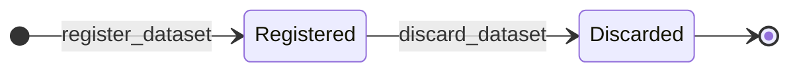
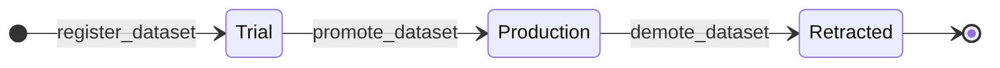
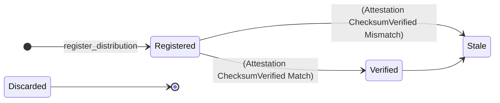
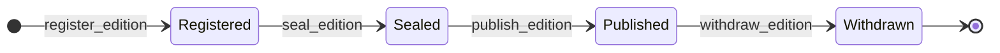

# Data module <span class="md-maturity md-maturity--stable" title="Five aggregates (Dataset, Distribution, Edition, Acquisition, Attestation); Dataset two-state lifecycle plus orthogonal three-state Intent; DCAT-3 Distribution materialization tier; citable Edition with DOI mint and tombstone; recorded-fact-chain Acquisition and Attestation; checksum-verifier, serializer, and DOI-minter ports.">stable</span>

## Purpose & Scope

The Data module owns CORA's record of the research data products the facility produces or registers, from the logical content record down to the byte-copy at a storage backend and up to the citable publication package. Five aggregates carry the responsibility.

`Dataset` is the logical content record: a product's id, name, URI, checksum, byte size, encoding, lineage edges, lifecycle status, and trust intent. It is the metadata record, not the bytes themselves. `Distribution` is one byte-identical materialization of a Dataset at a storage-kind Supply (a DCAT-3 `dcat:Distribution`): the same content reachable at a concrete URI on a concrete backend. `Edition` is a citable publication package over a frozen set of Production-intent Datasets, the aggregate that mints a DOI and serializes a citation manifest. `Acquisition` is the birth-certificate fact that a producing Asset captured bytes into a Dataset under an optional Run context. `Attestation` is the verification fact that some integrity check (checksum, format, bit-rot, conformance) ran against a Dataset or one of its Distributions, with a recorded outcome.

`Dataset` is the hub; the other four reference it. `Acquisition` records how a Dataset came to be; `Distribution` records where its bytes live; `Attestation` records that its bytes were checked; `Edition` records that it was published. The bytes themselves live wherever the URIs point (object storage, transfer service, POSIX filesystem, content-addressed store); the Data module records only what is needed to identify, cite, find, verify, and publish them.

<div class="cora-aside cora-aside--deferred" markdown>

Out of scope

- **Storage tier transitions on Distribution.** The `DistributionStatus` FSM ships its full four-state shape day-one, but only the genesis `Registered` state is reachable today; the `Verified` / `Stale` flips are driven indirectly by Attestation facts through the projection writer, and a request-path `verify` / `mark-stale` / `discard` slice is deferred until a storage-tier consumer ships.
- **A `Transfer` aggregate.** Moving bytes between backends is modeled as a `Method` + `TransferPort` in the Recipe module, not as a Data aggregate. `Distribution` is the resting materialization, not the transfer log.
- **Persistent external identifier minting beyond DOI.** `Edition` mints a DOI through the shared `DoiMinter` port at publish time and tombstones it at withdraw. Handle, ARK, and IGSN flows, and DataCite event-data harvesting, are deferred until a real consumer asks.
- **PROV-O vocabulary in the domain core.** In-domain lineage stays as the `derived_from` edge set on each Dataset plus the `Acquisition` capture fact. PROV-O export (`prov:wasDerivedFrom`, `prov:wasGeneratedBy`) lives at an API export adapter when a real consumer asks.
- **Multi-checksum algorithms.** Only `sha256` is accepted. The `(algorithm, value)` shape is forward-compatible for adding BLAKE3, SHA3, or other algorithms when a real consumer asks.
- **Re-promotion from Retracted.** Retracted is terminal. Operators who want to publish a corrected version register a new Dataset with `derived_from` pointing at the retracted one.
- **Concrete Attestation kinds beyond checksum.** `AttestationKind` ships all four values, but only `ChecksumVerified` has a concrete evidence shape and verifier adapter today; `FormatValidated`, `ConformsToValidated`, and `BitRotChecked` are reserved for follow-on slices.

</div>

## Aggregates

| Name | Identity | State summary | FSM |
|---|---|---|---|
| `Dataset` | `id: UUID` | `id`, `name`, `uri`, `checksum`, `byte_size`, `encoding`, `producing_run_id?`, `subject_id?`, `derived_from: frozenset[UUID]`, `status: DatasetStatus`, `producing_run_end_state: str?`, `intent: Intent`, `used_calibration_ids: frozenset[UUID]` | yes (2-state lifecycle plus orthogonal 3-state Intent) |
| `Distribution` | `id: UUID` | `id`, `dataset_id`, `supply_id`, `uri: DistributionUri`, `checksum`, `byte_size`, `encoding`, `access_protocol: AccessProtocol`, `status: DistributionStatus`, transition attribution (`registered_at/by`, `verified_at/by?`, `marked_stale_at/by?`, `discarded_at/by?`, `discard_reason?`) | yes (4-state; only `Registered` reachable today) |
| `Edition` | `id: UUID` | `id`, `kind: EditionKind`, `title`, `dataset_ids: frozenset[UUID]`, `creators: tuple[Creator]`, `publisher_facility_code?`, `publication_year?`, `license?`, `content_hash?`, `external_pid?`, `status: EditionStatus`, transition attribution (`registered_at/by`, `sealed_at/by?`, `published_at/by?`, `withdrawn_at/by?`, `withdrawal_reason?`) | yes (4-state) |
| `Acquisition` | `id: UUID` | `id`, `dataset_id`, `producing_asset_id`, `producing_run_id?`, `captured_at`, `settings: dict`, `evidence: dict`, `recorded_at`, `recorded_by`, `status: AcquisitionStatus` | no (terminal at genesis) |
| `Attestation` | `id: UUID` | `id`, `dataset_id`, `distribution_id?`, `kind: AttestationKind`, `outcome: AttestationOutcome`, `evidence: AttestationEvidence`, `attested_at`, `attested_by`, `status: AttestationStatus` | no (terminal at genesis) |

`Dataset` cross-aggregate references (`producing_run_id`, `subject_id`, `derived_from`) are eventual-consistency: the handler pre-loads each referenced aggregate to confirm it exists, the decider applies any further checks (no `derived_from` edges into `Discarded` Datasets), and no fold-time re-validation runs. All three are optional: a Dataset can be registered with no producing Run (externally-sourced data), no Subject (calibration scans, dark fields), and no upstream lineage (raw data captured at the source). `producing_run_end_state` captures the producing Run's terminal status at registration time per the capture-don't-recompute principle, and `used_calibration_ids` is the AsShot citation set (the `CalibrationRevision.id` values the product actually used), set once and immutable thereafter.

`Distribution` is the materialization tier: one Dataset may have many Distributions (a raw copy on POSIX, an archived copy on tape, a public copy on object storage), each a byte-identical copy at a different storage-kind Supply. The `checksum` and `byte_size` must equal the parent Dataset's (the byte-identical-copy invariant). `Edition` is the publication tier: a citable package that freezes a set of Production-intent Datasets, records ordered `creators`, and on publish mints a DOI and serializes a manifest in one of several `EditionKind` formats. `Acquisition` and `Attestation` are both recorded-fact-chains: terminal at genesis, one stream per fact, exactly one event ever; they record provenance and verification facts without a lifecycle.

## Value Objects

| Name | Shape | Where used |
|---|---|---|
| `DatasetName` | trimmed string, 1-200 chars | `Dataset.name` |
| `DatasetUri` | trimmed string, 1-2048 chars, must have a URI scheme, scheme must not be in the blocked list | `Dataset.uri` |
| `DatasetChecksum` | `(algorithm, value)` pair; today algorithm must be `sha256`, value must be 64 lowercase hex chars | `Dataset.checksum`, `Distribution.checksum` |
| `DatasetEncoding` | `(media_type, conforms_to)` pair; `media_type` is loose MIME-shape string 1-200 chars, `conforms_to` is a frozenset of up to 16 profile URIs each 1-2048 chars | `Dataset.encoding`, `Distribution.encoding` |
| `DatasetStatus` | closed StrEnum: `Registered` \| `Discarded` | `Dataset.status` |
| `Intent` | open StrEnum (additive); today: `Trial` \| `Production` \| `Retracted` | `Dataset.intent` |
| `PromotionReason` / `DemotionReason` / `DatasetDiscardReason` | trimmed string, 1-500 chars | the respective Dataset transition reasons (serialized as plain `str` on the events) |
| `DistributionUri` | trimmed string, 1-2048 chars; same scheme + blocklist shape as `DatasetUri` | `Distribution.uri` |
| `AccessProtocol` | closed StrEnum: `HTTPS` \| `Globus` \| `S3` \| `POSIX` \| `NFS` \| `OAI_PMH` | `Distribution.access_protocol` |
| `DistributionStatus` | closed StrEnum: `Registered` \| `Verified` \| `Stale` \| `Discarded` | `Distribution.status` |
| `EditionTitle` | trimmed string, 1-500 chars | `Edition.title` |
| `Creator` | `(actor_id, affiliation?)`; `affiliation` trimmed 1-200 chars; order is publication-significant (never sorted) | members of `Edition.creators` |
| `SpdxIdentifier` | trimmed string, 1-100 chars, SPDX license-id char class | `Edition.license` |
| `WithdrawalReason` | trimmed string, 1-500 chars | `EditionWithdrawn.withdrawal_reason` |
| `EditionKind` | closed StrEnum: `ROCrate` \| `DataCite` \| `Croissant` \| `OAIS_AIP` \| `OAIS_DIP` \| `NeXus` (only `ROCrate` has a serializer today) | `Edition.kind` |
| `EditionStatus` | closed StrEnum: `Registered` \| `Sealed` \| `Published` \| `Withdrawn` | `Edition.status` |
| `PersistentIdentifier` | `(scheme, value)`; the DOI minted at publish | `Edition.external_pid` |
| `AcquisitionStatus` | closed StrEnum: `Recorded` (single value; terminal at genesis) | `Acquisition.status` |
| `AttestationKind` | closed StrEnum: `ChecksumVerified` \| `FormatValidated` \| `ConformsToValidated` \| `BitRotChecked` (only `ChecksumVerified` reachable today) | `Attestation.kind` |
| `AttestationOutcome` | closed StrEnum: `Match` \| `Mismatch` \| `Unreachable` | `Attestation.outcome` |
| `AttestationStatus` | closed StrEnum: `Recorded` (single value; terminal at genesis) | `Attestation.status` |
| `AttestationEvidence` | discriminated union keyed on `Attestation.kind`; only the `ChecksumVerifiedEvidence` arm (`algorithm`, `value?`, `verifier_supply_id`, `verifier_kind`, `error_detail?`) is concrete today | `Attestation.evidence` |

`DatasetUri` and `DistributionUri` validation is intentionally loose: anything with a non-empty scheme after trim, within the length cap, whose scheme is not in the blocked list (`javascript`, `vbscript`, `data`, `about`, `view-source`). The blocklist is defensive against storing a URI a downstream UI would render as a clickable XSS vector. Real storage schemes (`s3`, `https`, `file`, `globus`, `posix`, and so on) are not constrained.

`Intent` is the one open StrEnum in the BC, on purpose: future trust values (`Calibration`, `Superseded`, `Authoritative`) can land additively. Every other enum here is closed, with its full value set fixed day-one even where only one value is reachable (`DistributionStatus`, `EditionKind`, `AttestationKind`); the unreachable values are present so follow-on slices add projection-writer code only, with no schema migration.

## FSM

The Data module runs three lifecycles across two aggregates. `Dataset` carries two orthogonal axes; `Edition` carries one four-state lifecycle; `Distribution` carries a four-state lifecycle of which only the genesis state is reachable today. `Acquisition` and `Attestation` have no FSM: each is recorded once and never transitions.

### Dataset





| Axis | From | To | Command | Event |
|---|---|---|---|---|
| status | `[*]` | `Registered` | `register_dataset` | `DatasetRegistered` |
| status | `Registered` | `Discarded` | `discard_dataset` | `DatasetDiscarded` |
| intent | `[*]` | `Trial` | `register_dataset` (default) | `DatasetRegistered` |
| intent | `Trial` | `Production` | `promote_dataset` | `DatasetPromoted` |
| intent | `Production` | `Retracted` | `demote_dataset` | `DatasetDemoted` |

Strict re-entry semantics apply across both axes: re-discarding, re-promoting, and re-demoting all raise.

### Distribution



| From | To | Command | Event |
|---|---|---|---|
| `[*]` | `Registered` | `register_distribution` | `DistributionRegistered` |

Only the genesis transition is request-reachable today. The `Verified` and `Stale` states are written by the Distribution projection writer in response to `AttestationRecorded` facts (a `ChecksumVerified` `Match` flips the row to `Verified`, a `Mismatch` flips it to `Stale`, `Unreachable` is a no-op). No `DistributionVerified` / `DistributionMarkedStale` / `DistributionDiscarded` aggregate event ships yet; those names are reserved.

### Edition



| From | To | Command | Event |
|---|---|---|---|
| `[*]` | `Registered` | `register_edition` | `EditionRegistered` |
| `Registered` | `Registered` | `add_dataset_to_edition` / `remove_dataset_from_edition` | `EditionDatasetAdded` / `EditionDatasetRemoved` |
| `Registered` | `Sealed` | `seal_edition` | `EditionSealed` |
| `Sealed` | `Published` | `publish_edition` | `EditionPublished` |
| `Published` | `Withdrawn` | `withdraw_edition` | `EditionWithdrawn` |

Membership mutates only in `Registered`; `seal_edition` freezes the member set (the `EditionSealed` payload's `sealed_dataset_ids` is the immutability anchor) and computes `content_hash`. `publish_edition` mints the DOI and serializes the manifest, recording `external_pid` and a distinct `published_content_hash`. `Withdrawn` is terminal and tombstones the DOI.

### Acquisition and Attestation

Neither has an FSM. `record_acquisition` and `record_attestation` each append exactly one genesis event (`AcquisitionRecorded`, `AttestationRecorded`) to a fresh stream whose status is `Recorded` and never changes. A correction is a new fact on a new stream, never a transition (the reserved `AttestationSuperseded` event would link the chain when that slice lands).

**Guards.** Beyond source-state checks, the write slices enforce cross-aggregate and cross-field invariants; see [Cross-aggregate invariants](#cross-aggregate-invariants).

## Events

The five aggregates emit thirteen event types. Every event carries a fold-symmetry attribution field (`registered_by`, `promoted_by`, `discarded_by`, `recorded_by`, `attested_by`, and so on), the envelope `principal_id` of the actor that issued the command, paired with the event's `occurred_at`.

### Dataset events

| Event | Payload sketch | When emitted |
|---|---|---|
| `DatasetRegistered` | `dataset_id`, `name`, `uri`, `checksum`, `byte_size`, `encoding`, `producing_run_id?`, `subject_id?`, `derived_from`, `producing_run_end_state?`, `intent` (always `Trial`), `used_calibration_ids`, `registered_by`, `occurred_at` | `register_dataset` succeeds (genesis) |
| `DatasetPromoted` | `dataset_id`, `reason`, `promoted_by`, `occurred_at` | `promote_dataset` succeeds; intent flips to `Production` |
| `DatasetDemoted` | `dataset_id`, `reason`, `demoted_by`, `occurred_at` | `demote_dataset` succeeds; intent flips to `Retracted` |
| `DatasetDiscarded` | `dataset_id`, `reason`, `discarded_by`, `occurred_at` | `discard_dataset` succeeds; status flips to `Discarded` |

`DatasetRegistered` payloads carry `derived_from`, `conforms_to`, and `used_calibration_ids` as sorted lists so the same logical Dataset yields byte-identical jsonb (which keeps the idempotency-key hash stable).

### Distribution events

| Event | Payload sketch | When emitted |
|---|---|---|
| `DistributionRegistered` | `distribution_id`, `dataset_id`, `supply_id`, `uri`, `checksum`, `byte_size`, `encoding`, `access_protocol`, `registered_by`, `occurred_at` | `register_distribution` succeeds (genesis) |

`DistributionVerified`, `DistributionMarkedStale`, and `DistributionDiscarded` are named but not shipped; the `Verified` / `Stale` projection states are driven by Attestation facts, not by these events.

### Edition events

| Event | Payload sketch | When emitted |
|---|---|---|
| `EditionRegistered` | `edition_id`, `kind`, `title`, `dataset_ids`, `creators`, `publisher_facility_code?`, `publication_year?`, `license?`, `registered_by`, `occurred_at` | `register_edition` succeeds (genesis) |
| `EditionDatasetAdded` | `edition_id`, `dataset_id`, `added_by`, `occurred_at` | `add_dataset_to_edition` succeeds (Registered only) |
| `EditionDatasetRemoved` | `edition_id`, `dataset_id`, `removed_by`, `occurred_at` | `remove_dataset_from_edition` succeeds (Registered only) |
| `EditionSealed` | `edition_id`, `content_hash`, `sealed_dataset_ids`, `publisher_facility_code`, `publication_year`, `license`, `sealed_by`, `occurred_at` | `seal_edition` succeeds; member set frozen |
| `EditionPublished` | `edition_id`, `external_pid_scheme`, `external_pid_value`, `published_content_hash`, `published_by`, `occurred_at` | `publish_edition` succeeds; DOI minted |
| `EditionWithdrawn` | `edition_id`, `withdrawal_reason`, `withdrawn_by`, `occurred_at` | `withdraw_edition` succeeds; DOI tombstoned |

### Acquisition events

| Event | Payload sketch | When emitted |
|---|---|---|
| `AcquisitionRecorded` | `acquisition_id`, `dataset_id`, `producing_asset_id`, `producing_run_id?`, `captured_at`, `settings`, `evidence`, `recorded_by`, `occurred_at` | `record_acquisition` succeeds (genesis-and-terminal) |

`captured_at` is the instrument wall-clock (caller-asserted provenance); `occurred_at` is the CORA-side wall-clock when the record landed. The dual-time split is deliberate.

### Attestation events

| Event | Payload sketch | When emitted |
|---|---|---|
| `AttestationRecorded` | `attestation_id`, `dataset_id`, `distribution_id?`, `kind`, `outcome`, `evidence`, `attested_by`, `occurred_at` | `record_attestation` succeeds (genesis-and-terminal) |

`AttestationSuperseded` is reserved for a future correction-chain slice.

## Slices

| Command | Category | REST | MCP tool | Idempotency |
|---|---|---|---|---|
| `RegisterDataset` | NEW | `POST /datasets` | `register_dataset` | required |
| `PromoteDataset` | MODIFIED | `POST /datasets/{dataset_id}/promote` | `promote_dataset` | none |
| `DemoteDataset` | MODIFIED | `POST /datasets/{dataset_id}/demote` | `demote_dataset` | none |
| `DiscardDataset` | MODIFIED | `POST /datasets/{dataset_id}/discard` | `discard_dataset` | none |
| `GetDataset` | QUERY | `GET /datasets/{dataset_id}` | `get_dataset` | none |
| `ListDatasets` | QUERY | `GET /datasets` | `list_datasets` | none |
| `RegisterDistribution` | NEW | `POST /distributions` | `register_distribution` | required |
| `RecordAcquisition` | NEW | `POST /acquisitions` | `record_acquisition` | required |
| `RecordAttestation` | NEW | `POST /attestations` | `record_attestation` | required |
| `RegisterEdition` | NEW | `POST /editions` | `register_edition` | required |
| `AddDatasetToEdition` | MODIFIED | `POST /editions/{edition_id}/datasets/{dataset_id}` | `add_dataset_to_edition` | none |
| `RemoveDatasetFromEdition` | MODIFIED | `DELETE /editions/{edition_id}/datasets/{dataset_id}` | `remove_dataset_from_edition` | none |
| `SealEdition` | MODIFIED | `POST /editions/{edition_id}/seal` | `seal_edition` | none |
| `PublishEdition` | MODIFIED | `POST /editions/{edition_id}/publish` | `publish_edition` | none |
| `WithdrawEdition` | MODIFIED | `POST /editions/{edition_id}/withdraw` | `withdraw_edition` | none |

The five create-style slices (`register_dataset`, `register_distribution`, `record_acquisition`, `register_edition`, `record_attestation`) are idempotency-wrapped (an `Idempotency-Key` header replays the prior result).

**Errors per slice.** Beyond Pydantic boundary 422s, each slice raises (the Dataset slices unchanged from prior shape):

`RegisterDataset`
: `InvalidDatasetName`, `InvalidDatasetUri`, `InvalidDatasetChecksum`, `InvalidDatasetByteSize`, `InvalidDatasetEncoding`, `InvalidDerivedFrom`, `InvalidUsedCalibrations`, `DatasetAlreadyExists`, `ProducingRunNotFound`, `LinkedSubjectNotFound`, `DerivedFromDatasetsNotFound`, `DerivedFromDatasetsDiscarded`, `Unauthorized`

`PromoteDataset` / `DemoteDataset` / `DiscardDataset`
: `DatasetNotFound`, the relevant `Invalid<X>Reason`, the already-in-target guard (`DatasetAlreadyPromoted` / `DatasetAlreadyRetracted`), the cross-field guard (`DatasetCannotPromote` / `DatasetCannotDemote` / `DatasetCannotDiscard`), `Unauthorized`

`RegisterDistribution`
: `DistributionSupplyNotFound` (404), `DistributionCannotRegisterOnNonStorageSupply`, `DistributionCannotRegisterOnDiscardedDataset`, `DistributionChecksumMismatch`, `DistributionByteSizeMismatch`, `DistributionAlreadyExists` (409), boundary `Invalid<X>` (400), `Unauthorized`

`RecordAcquisition`
: `AcquisitionAssetNotFound`, `AcquisitionRunNotFound` (404), `AcquisitionCannotRecordWithoutCapturing` (the producing Asset's Family does not declare the `CAPTURING` affordance), `AcquisitionAlreadyExists` (409), invalid `settings` / `evidence` / `captured_at` (400), `Unauthorized`

`RegisterEdition`
: `EmptyDatasetIdsAtRegistration`, boundary `Invalid<X>` (400), `Unauthorized`

`AddDatasetToEdition` / `RemoveDatasetFromEdition`
: `EditionNotFound` (404), `EditionNotInRegisteredState`, `EditionDatasetAlreadyMember` / `EditionDatasetNotMember`, `EditionCannotBindToDiscardedDataset` (409), `Unauthorized`

`SealEdition`
: `EditionNotFound`, `EditionPublisherNotFound`, `EditionDatasetDistributionNotFound` (404), `EditionCannotSeal`, `EditionCannotBeEmpty`, `EditionDatasetsNotAllProduction`, `EditionCannotSealOnDiscardedDataset`, `EditionLicenseRequiredForKind` (409), `Unauthorized`

`PublishEdition` / `WithdrawEdition`
: `EditionNotFound` (404), `EditionCannotPublish` / `EditionCannotWithdraw` (409), `EditionSerializerError` / `DoiMinterTombstoneError` / `PersistentIdentifierMintError` (502, port failures), `EditionPublishedWithoutContentHash` / `EditionWithdrawnWithoutPersistentId` (500, invariant breach), `Unauthorized`

`RecordAttestation`
: `AttestationDistributionNotFound` (404), `AttestationKindRequiresDistribution`, `AttestationKindRejectsDistribution`, `AttestationDistributionDatasetMismatch`, `AttestationChecksumEvidenceMismatch`, `AttestationAlreadyExists` (409), `AttestationKindNotYetSupported`, `ChecksumVerifierUnsupportedScheme`, invalid `kind` / `outcome` / `evidence` (400), `Unauthorized`

`GetDataset`
: `DatasetNotFound`. `ListDatasets`: boundary 422 only.

### Ports

| Port | Kind | Adapter(s) | Used by |
|---|---|---|---|
| `ChecksumVerifierPort` | BC-local | `HttpRangeChecksumAdapter` | `record_attestation` (ChecksumVerified): fetches the bytes and recomputes the digest, returning `Match` / `Mismatch` / `Unreachable` |
| `DistributionLookup` | BC-local | `PostgresDistributionLookup`, `InMemoryDistributionLookup` | `seal_edition`: confirms each member Dataset has a canonical Distribution |
| `EditionSerializerPort` | BC-local (per-kind) | `RoCrate12Adapter`, stub | `publish_edition`: serializes the citation manifest for the Edition's `kind` |
| `DoiMinter` | shared (`cora/shared/ports`) | `StubDoiMinter` | `publish_edition` mints, `withdraw_edition` tombstones the DOI |
| `SupplyLookup` | cross-BC (Supply) | (Supply BC adapters) | `register_distribution`: resolves `supply_id`, requires a storage-kind Supply |
| `AssetLookup` | cross-BC (Equipment) | (Equipment BC adapters) | `record_acquisition`: resolves `producing_asset_id` and reads `family_affordances` for the `CAPTURING` gate |
| `FacilityLookup` | cross-BC (Federation) | (Federation BC adapters) | `seal_edition` / `publish_edition`: resolves `publisher_facility_code` |

## Cross-aggregate invariants

The five aggregates compose around the `Dataset` hub; the write slices enforce the binding rules so a stranded reference cannot propagate into a downstream read.

- **Byte-identical copy (Distribution).** A `Distribution.checksum` and `byte_size` must equal the parent `Dataset`'s (`DistributionChecksumMismatch` / `DistributionByteSizeMismatch`). A Distribution is a copy of the same bytes at a different address, not a derivative.
- **Storage-kind Supply only (Distribution).** `register_distribution` requires the resolved `supply_id` to name a storage-kind Supply (`DistributionCannotRegisterOnNonStorageSupply`).
- **No Distribution on a Discarded Dataset.** A `Discarded` Dataset has had its bytes deleted, so a new byte-copy is rejected (`DistributionCannotRegisterOnDiscardedDataset`). `Retracted` intent is allowed: intent (trust) and status (lifecycle) are orthogonal, and a retracted-but-not-discarded Dataset still has bytes.
- **Production-only seal (Edition).** `seal_edition` requires the member set to be non-empty, every member Dataset to be `Production` intent and not `Discarded`, and each to have a canonical Distribution; `DataCite` and `Croissant` editions additionally require a `license`, and the publisher Facility must resolve.
- **Attestation dual-binding.** `ChecksumVerified`, `FormatValidated`, and `BitRotChecked` are byte-level and require a `distribution_id`; `ConformsToValidated` is content-level and forbids one (`AttestationKindRequiresDistribution` / `AttestationKindRejectsDistribution`). When a `distribution_id` is present it must belong to the named Dataset (`AttestationDistributionDatasetMismatch`), and a `ChecksumVerified` outcome must agree with its recorded evidence (`AttestationChecksumEvidenceMismatch`).
- **Capture affordance (Acquisition).** `record_acquisition` requires the producing Asset's Family to declare the `CAPTURING` affordance (`AcquisitionCannotRecordWithoutCapturing`), read through `AssetLookup.family_affordances`.

## Storage & Projections

Five read-side tables back the Data module, one per aggregate. Cross-aggregate referential integrity is enforced by decider-time pre-loads, not foreign keys; the new tables carry RLS FORCE policies uniform with the rest of the BC.

```sql title="proj_data_dataset_summary"
CREATE TABLE proj_data_dataset_summary (
    dataset_id          UUID        PRIMARY KEY,
    name                TEXT        NOT NULL,
    uri                 TEXT        NOT NULL,
    producing_run_id    UUID,
    subject_id          UUID,
    status              TEXT        NOT NULL CHECK (
        status IN ('Registered', 'Discarded')
    ),
    used_calibration_ids   UUID[]      NOT NULL DEFAULT '{}',
    created_at          TIMESTAMPTZ NOT NULL,
    updated_at          TIMESTAMPTZ NOT NULL DEFAULT now()
);

CREATE INDEX proj_data_dataset_summary_keyset_idx
    ON proj_data_dataset_summary (created_at, dataset_id);
CREATE INDEX proj_data_dataset_summary_run_idx
    ON proj_data_dataset_summary (producing_run_id)
    WHERE producing_run_id IS NOT NULL;
CREATE INDEX proj_data_dataset_summary_subject_idx
    ON proj_data_dataset_summary (subject_id)
    WHERE subject_id IS NOT NULL;
CREATE INDEX proj_data_dataset_summary_used_calibration_ids_gin_idx
    ON proj_data_dataset_summary USING GIN (used_calibration_ids);
```

The GIN index on `used_calibration_ids` supports the "every Dataset that cites revision X" read pattern through the `@>` containment operator. `checksum`, `byte_size`, `encoding`, `derived_from`, and `intent` are intentionally not projected as filter columns; they are single-record detail or list-shaped and read from `GET /datasets/{id}` or the folded stream.

```sql title="proj_data_distribution_summary"
CREATE TABLE proj_data_distribution_summary (
    distribution_id     UUID         PRIMARY KEY,
    dataset_id          UUID         NOT NULL,
    supply_id           UUID         NOT NULL,
    uri                 TEXT         NOT NULL,
    checksum            JSONB        NOT NULL,
    byte_size           BIGINT       NOT NULL CHECK (byte_size >= 0),
    encoding            JSONB        NOT NULL,
    access_protocol     TEXT         NOT NULL CHECK (
        access_protocol IN ('HTTPS', 'Globus', 'S3', 'POSIX', 'NFS', 'OAI_PMH')
    ),
    status              TEXT         NOT NULL DEFAULT 'Registered' CHECK (
        status IN ('Registered', 'Verified', 'Stale', 'Discarded')
    ),
    registered_at       TIMESTAMPTZ  NOT NULL,
    registered_by       UUID         NOT NULL,
    verified_at         TIMESTAMPTZ,
    verified_by         UUID,
    marked_stale_at     TIMESTAMPTZ,
    marked_stale_by     UUID,
    discarded_at        TIMESTAMPTZ,
    discarded_by        UUID,
    discard_reason      TEXT,
    backfilled          BOOLEAN      NOT NULL DEFAULT FALSE,
    updated_at          TIMESTAMPTZ  NOT NULL DEFAULT now()
);

CREATE UNIQUE INDEX proj_data_distribution_summary_triple_uq
    ON proj_data_distribution_summary (dataset_id, supply_id, uri)
    WHERE status != 'Discarded';
CREATE INDEX proj_data_distribution_summary_dataset_idx
    ON proj_data_distribution_summary (dataset_id);
CREATE INDEX proj_data_distribution_summary_conforms_to_idx
    ON proj_data_distribution_summary USING GIN ((encoding -> 'conforms_to'));
```

The partial UNIQUE index captures "this Dataset has at most one non-Discarded Distribution at this URI on this Supply"; a re-register after discard is permitted. The collision is swallowed writer-side (caught, logged WARN, bookmark advances), so the request path always returns 201. This writer also subscribes to `AttestationRecorded` and flips `status` to `Verified` (ChecksumVerified Match) or `Stale` (Mismatch); `Unreachable` and non-ChecksumVerified kinds are no-ops, and a rowcount-zero update is warned and continued.

```sql title="proj_data_edition_summary"
CREATE TABLE proj_data_edition_summary (
    edition_id              UUID         PRIMARY KEY,
    kind                    TEXT         NOT NULL CHECK (
        kind IN ('ROCrate', 'DataCite', 'Croissant', 'OAIS_AIP', 'OAIS_DIP', 'NeXus')
    ),
    title                   TEXT         NOT NULL,
    dataset_ids             UUID[]       NOT NULL DEFAULT '{}',
    creators                JSONB        NOT NULL DEFAULT '[]'::jsonb,
    license                 TEXT,
    publication_year        INT,
    publisher_facility_code TEXT,
    content_hash            TEXT,
    published_content_hash  TEXT,
    external_pid_scheme     TEXT,
    external_pid_value      TEXT,
    status                  TEXT         NOT NULL DEFAULT 'Registered' CHECK (
        status IN ('Registered', 'Sealed', 'Published', 'Withdrawn')
    ),
    registered_at           TIMESTAMPTZ  NOT NULL,
    registered_by           UUID         NOT NULL,
    sealed_at               TIMESTAMPTZ,
    sealed_by               UUID,
    published_at            TIMESTAMPTZ,
    published_by            UUID,
    withdrawn_at            TIMESTAMPTZ,
    withdrawn_by            UUID,
    withdrawal_reason       TEXT,
    updated_at              TIMESTAMPTZ  NOT NULL DEFAULT now()
);

CREATE INDEX proj_data_edition_summary_status_kind_idx
    ON proj_data_edition_summary (status, kind);
CREATE INDEX proj_data_edition_summary_dataset_ids_idx
    ON proj_data_edition_summary USING GIN (dataset_ids);
CREATE INDEX proj_data_edition_summary_publisher_facility_code_idx
    ON proj_data_edition_summary (publisher_facility_code);
```

`creators` order is publication-significant and never sorted. `content_hash` is set once at seal (the pre-DOI serializer output); `published_content_hash` is the distinct hash of the re-serialized post-DOI bytes (the DOI bake invalidates the sealed hash).

```sql title="proj_data_acquisition_summary"
CREATE TABLE proj_data_acquisition_summary (
    acquisition_id     UUID        PRIMARY KEY,
    dataset_id         UUID        NOT NULL,
    producing_asset_id UUID        NOT NULL,
    producing_run_id   UUID,
    captured_at        TIMESTAMPTZ NOT NULL,
    settings           JSONB       NOT NULL,
    evidence           JSONB       NOT NULL,
    recorded_at        TIMESTAMPTZ NOT NULL,
    recorded_by        UUID        NOT NULL,
    status             TEXT        NOT NULL CHECK (status IN ('Recorded')),
    created_at         TIMESTAMPTZ NOT NULL DEFAULT now(),
    updated_at         TIMESTAMPTZ NOT NULL DEFAULT now()
);

CREATE INDEX proj_data_acquisition_summary_dataset_idx
    ON proj_data_acquisition_summary (dataset_id, captured_at DESC);
CREATE INDEX proj_data_acquisition_summary_asset_idx
    ON proj_data_acquisition_summary (producing_asset_id, captured_at DESC);
CREATE INDEX proj_data_acquisition_summary_run_idx
    ON proj_data_acquisition_summary (producing_run_id, captured_at DESC)
    WHERE producing_run_id IS NOT NULL;
```

No cross-stream UNIQUE: multiple Acquisitions per `(dataset, asset, captured_at)` are legal (calibration replays, paired flat-fields, rapid-fire detector frames). Same-stream strictness is enforced at append time.

```sql title="proj_data_attestation_summary"
CREATE TABLE proj_data_attestation_summary (
    attestation_id   UUID         PRIMARY KEY,
    dataset_id       UUID         NOT NULL,
    distribution_id  UUID         NULL,
    kind             TEXT         NOT NULL CHECK (
        kind IN ('ChecksumVerified', 'FormatValidated',
                 'ConformsToValidated', 'BitRotChecked')
    ),
    outcome          TEXT         NOT NULL CHECK (
        outcome IN ('Match', 'Mismatch', 'Unreachable')
    ),
    evidence         JSONB        NOT NULL,
    attested_at      TIMESTAMPTZ  NOT NULL,
    attested_by      UUID         NOT NULL,
    updated_at       TIMESTAMPTZ  NOT NULL DEFAULT now()
);

CREATE INDEX proj_data_attestation_summary_dataset_idx
    ON proj_data_attestation_summary (dataset_id, attested_at DESC);
CREATE INDEX proj_data_attestation_summary_distribution_idx
    ON proj_data_attestation_summary (distribution_id, attested_at DESC)
    WHERE distribution_id IS NOT NULL;
CREATE INDEX proj_data_attestation_summary_kind_outcome_idx
    ON proj_data_attestation_summary (kind, outcome);
```

The `(distribution_id, attested_at DESC)` partial index is the read the Distribution projection writer uses to drive its status flip.

## Cross-Module boundaries

| Module | Relationship | What's exchanged |
|---|---|---|
| [Trust](../trust/index.md) | gated-by | Every write-side Data slice is gated by the Authorize port resolving a `Policy` for the `(principal, command, conduit, surface)` tuple; deny outcomes refuse before the decider runs |
| [Run](../run/index.md) | reads-from | `register_dataset` pre-loads the Run when `producing_run_id` is set and captures `producing_run_end_state`; `record_acquisition` pre-loads the optional `producing_run_id` |
| [Subject](../subject/index.md) | reads-from | `register_dataset` pre-loads the Subject when `subject_id` is set |
| [Calibration](../calibration/index.md) | shared-id-with | `Dataset.used_calibration_ids` carries `CalibrationRevision.id` values (the AsShot citation) |
| [Supply](../supply/index.md) | reads-from (via `SupplyLookup`) | `register_distribution` resolves `supply_id` and requires a storage-kind Supply |
| [Equipment](../equipment/index.md) | reads-from (via `AssetLookup`) | `record_acquisition` resolves `producing_asset_id` and requires its Family to declare the `CAPTURING` affordance |
| [Federation](../federation/index.md) | reads-from (via `FacilityLookup`) | `seal_edition` / `publish_edition` resolve the publisher `facility_code` |
| DataCite (external) | mints-via (`DoiMinter`) | `publish_edition` mints a DOI; `withdraw_edition` tombstones it |
| [Access](../access/index.md) | shared-id-with | Every Data event carries the actor id on the envelope for principal attribution |
| Data (self) | reads-from | `Dataset.derived_from` references other Datasets; Distribution / Edition / Acquisition / Attestation all reference `Dataset.id`; an Edition references its members' canonical Distributions; an Attestation references an optional Distribution |

Cross-aggregate state mutation stays inside the BC: a `ChecksumVerified` Attestation fact flips the bound Distribution's projected `status` through the Distribution projection writer. No other module mutates Data state; the only inverse direction is the producing Run's end state captured once at Dataset registration.

## Examples

The examples below cover the canonical flow: register a Dataset, materialize it as a Distribution, record how it was acquired, verify its bytes, and publish a citable Edition; plus the original Dataset trust-axis transitions. For the REST and MCP equivalence, auth, and idempotency conventions these examples share, see [Reading the examples](../index.md) on the Modules landing page.

### Register a Dataset against a producing Run

=== "REST"

    ```http
    POST /datasets
    Content-Type: application/json
    Idempotency-Key: 4d2e1a8c-9b3f-4c5d-6e7a-8b9c0d1e2f3a
    X-Principal-Id: 11111111-2222-3333-4444-555555555555

    {
      "name": "Catalyst pellet B-12, run 2026-05-19-007, raw projections",
      "uri": "s3://aps-2bm-raw/2026-05-19/run-007/projections.h5",
      "checksum": {
        "algorithm": "sha256",
        "value": "0123456789abcdef0123456789abcdef0123456789abcdef0123456789abcdef"
      },
      "byte_size": 4831838208,
      "encoding": {
        "media_type": "application/x-hdf5",
        "conforms_to": ["https://manual.nexusformat.org/classes/applications/NXtomo"]
      },
      "producing_run_id": "<run-id>",
      "subject_id": "<subject-id>",
      "derived_from": [],
      "used_calibration_ids": ["<calibration-revision-id>"]
    }
    ```

    Returns `201 Created` with the newly-assigned `dataset_id`. Status is `Registered` and intent is `Trial` by default. The producing Run is pre-loaded, its terminal status is captured on `producing_run_end_state`, and the Subject's existence is confirmed.

=== "MCP"

    ```python
    mcp.call_tool(
        "register_dataset",
        {
            "name": "Catalyst pellet B-12, run 2026-05-19-007, raw projections",
            "uri": "s3://aps-2bm-raw/2026-05-19/run-007/projections.h5",
            "checksum": {"algorithm": "sha256", "value": "0123...cdef"},
            "byte_size": 4831838208,
            "encoding": {
                "media_type": "application/x-hdf5",
                "conforms_to": ["https://manual.nexusformat.org/classes/applications/NXtomo"],
            },
            "producing_run_id": "<run-id>",
            "subject_id": "<subject-id>",
            "derived_from": [],
            "used_calibration_ids": ["<calibration-revision-id>"],
        },
    )
    ```

### Register a Distribution (a byte-copy at a storage Supply)

=== "REST"

    ```http
    POST /distributions
    Content-Type: application/json
    Idempotency-Key: 8f1c2d3e-4a5b-6c7d-8e9f-0a1b2c3d4e5f
    X-Principal-Id: 11111111-2222-3333-4444-555555555555

    {
      "dataset_id": "<dataset-id>",
      "supply_id": "<storage-supply-id>",
      "uri": "globus://aps-archive/2026-05-19/run-007/projections.h5",
      "checksum": {
        "algorithm": "sha256",
        "value": "0123456789abcdef0123456789abcdef0123456789abcdef0123456789abcdef"
      },
      "byte_size": 4831838208,
      "encoding": {
        "media_type": "application/x-hdf5",
        "conforms_to": ["https://manual.nexusformat.org/classes/applications/NXtomo"]
      },
      "access_protocol": "Globus"
    }
    ```

    Returns `201 Created` with the newly-assigned `distribution_id`. The `supply_id` is resolved through `SupplyLookup` and must be a storage-kind Supply; the `checksum` and `byte_size` must equal the parent Dataset's (the byte-identical-copy invariant). Status is `Registered`.

=== "MCP"

    ```python
    mcp.call_tool(
        "register_distribution",
        {
            "dataset_id": "<dataset-id>",
            "supply_id": "<storage-supply-id>",
            "uri": "globus://aps-archive/2026-05-19/run-007/projections.h5",
            "checksum": {"algorithm": "sha256", "value": "0123...cdef"},
            "byte_size": 4831838208,
            "encoding": {"media_type": "application/x-hdf5", "conforms_to": []},
            "access_protocol": "Globus",
        },
    )
    ```

### Record an Acquisition (the capture fact)

=== "REST"

    ```http
    POST /acquisitions
    Content-Type: application/json
    Idempotency-Key: a1b2c3d4-e5f6-7a8b-9c0d-1e2f3a4b5c6d
    X-Principal-Id: 11111111-2222-3333-4444-555555555555

    {
      "dataset_id": "<dataset-id>",
      "producing_asset_id": "<camera-asset-id>",
      "producing_run_id": "<run-id>",
      "captured_at": "2026-05-19T14:03:22Z",
      "settings": {"exposure_ms": 50, "frames": 1500},
      "evidence": {"detector_serial": "MERLIN-2BM-01"}
    }
    ```

    Returns `201 Created`. The producing Asset is resolved through `AssetLookup`; its Family must declare the `CAPTURING` affordance, otherwise the call rejects with `409 AcquisitionCannotRecordWithoutCapturing`. `captured_at` is the instrument wall-clock; CORA stamps `recorded_at` itself.

=== "MCP"

    ```python
    mcp.call_tool(
        "record_acquisition",
        {
            "dataset_id": "<dataset-id>",
            "producing_asset_id": "<camera-asset-id>",
            "producing_run_id": "<run-id>",
            "captured_at": "2026-05-19T14:03:22Z",
            "settings": {"exposure_ms": 50, "frames": 1500},
            "evidence": {"detector_serial": "MERLIN-2BM-01"},
        },
    )
    ```

### Record a checksum Attestation against a Distribution

=== "REST"

    ```http
    POST /attestations
    Content-Type: application/json
    Idempotency-Key: b2c3d4e5-f6a7-8b9c-0d1e-2f3a4b5c6d7e
    X-Principal-Id: 11111111-2222-3333-4444-555555555555

    {
      "dataset_id": "<dataset-id>",
      "distribution_id": "<distribution-id>",
      "kind": "ChecksumVerified"
    }
    ```

    Returns `201 Created`. The `ChecksumVerifierPort` fetches the bytes at the Distribution URI and recomputes the digest; the recorded `outcome` is `Match`, `Mismatch`, or `Unreachable`. A `Match` flips the Distribution's projected `status` to `Verified`; a `Mismatch` flips it to `Stale`. `ChecksumVerified` requires a `distribution_id` (byte-level kinds bind a Distribution; `ConformsToValidated` forbids one).

=== "MCP"

    ```python
    mcp.call_tool(
        "record_attestation",
        {
            "dataset_id": "<dataset-id>",
            "distribution_id": "<distribution-id>",
            "kind": "ChecksumVerified",
        },
    )
    ```

### Register, seal, and publish an Edition

=== "REST"

    ```http
    POST /editions
    Content-Type: application/json
    Idempotency-Key: c3d4e5f6-a7b8-9c0d-1e2f-3a4b5c6d7e8f
    X-Principal-Id: 11111111-2222-3333-4444-555555555555

    {
      "kind": "ROCrate",
      "title": "Catalyst degradation series, beamtime 2026-1",
      "dataset_ids": ["<dataset-id>"],
      "creators": [{"actor_id": "<orcid-actor-id>", "affiliation": "Argonne National Laboratory"}],
      "publisher_facility_code": "aps",
      "publication_year": 2026,
      "license": "CC-BY-4.0"
    }
    ```

    Returns `201 Created` in `Registered`. `POST /editions/{id}/seal` freezes the member set and computes `content_hash` (every member must be `Production` intent, not `Discarded`, and carry a canonical Distribution). `POST /editions/{id}/publish` mints the DOI through `DoiMinter`, serializes the manifest through the per-kind `EditionSerializerPort`, and records `external_pid` plus `published_content_hash`. `POST /editions/{id}/withdraw` tombstones the DOI.

=== "MCP"

    ```python
    mcp.call_tool(
        "register_edition",
        {
            "kind": "ROCrate",
            "title": "Catalyst degradation series, beamtime 2026-1",
            "dataset_ids": ["<dataset-id>"],
            "creators": [{"actor_id": "<orcid-actor-id>", "affiliation": "Argonne National Laboratory"}],
            "publisher_facility_code": "aps",
            "publication_year": 2026,
            "license": "CC-BY-4.0",
        },
    )
    # then: seal_edition -> publish_edition -> (withdraw_edition)
    ```

### Promote, demote, or discard a Dataset

=== "REST"

    ```http
    POST /datasets/<dataset-id>/promote
    Content-Type: application/json
    X-Principal-Id: 11111111-2222-3333-4444-555555555555

    {
      "reason": "Reviewed by beamline lead 2026-05-19; reconstruction passes QA"
    }
    ```

    Returns `204 No Content`; intent flips `Trial -> Production`. `409 DatasetCannotPromote` if the producing Run did not end `Completed`, any `derived_from` Dataset is still `Trial`, or the Dataset is `Discarded`. `demote` (`Production -> Retracted`) and `discard` (`Registered -> Discarded`) follow the same shape with their own reason fields; the original events stay on the stream so the audit log preserves every reason.

=== "MCP"

    ```python
    mcp.call_tool(
        "promote_dataset",
        {"dataset_id": "<dataset-id>", "reason": "Reviewed by beamline lead 2026-05-19; reconstruction passes QA"},
    )
    ```
