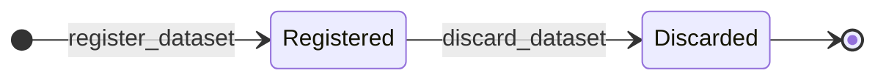
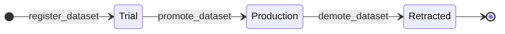

# Data module <span class="md-maturity md-maturity--stable" title="One aggregate, two-state lifecycle, three-state Intent orthogonal axis, lineage edges with existence + status guards, immutable AsShot calibration citation set.">stable</span>

## Purpose & Scope

The Data module owns CORA's record of every logical research data product the facility produces or registers. One aggregate, `Dataset`, is the canonical place where a product's id, name, URI, checksum, byte size, encoding, lineage edges, lifecycle status, and trust intent live. The Dataset is the metadata record, not the bytes themselves; the bytes live wherever the URI points (object storage, transfer service, POSIX filesystem, content-addressed store), and the Dataset aggregate records only what is needed to identify, cite, and find them.

Two orthogonal axes describe the Dataset's state. `DatasetStatus` is the lifecycle axis: `Registered` is the genesis state; `Discarded` is terminal and means the bytes have been deleted from storage but the metadata and discard reason are retained for audit. `Intent` is the trust axis: `Trial` is the default on registration; `Production` is reached by an explicit promote call with a captured reason; `Retracted` is terminal and is reached only from `Production` by an explicit demote call with a captured reason. The two axes move independently through their own slices.

<div class="cora-aside cora-aside--deferred" markdown>

Out of scope

- **Storage tier transitions.** Archive, verify, move, and re-checksum workflows are deferred until a real storage-tier consumer ships. The aggregate has no `Archived` or `Verified` status today.
- **Transfer records.** A separate `Transfer` aggregate that tracks the movement of bytes between storage backends is its own future module. The Dataset itself is not a transfer log.
- **Persistent external identifier minting.** DOI minting (via DataCite, including the IGSN flow for sample-citing datasets) lives at a future export adapter; the internal UUID is the only identifier carried in domain today.
- **PROV-O vocabulary in the domain core.** In-domain lineage stays as the simple `derived_from` edge set on each Dataset. PROV-O export (`prov:wasDerivedFrom`, `prov:wasGeneratedBy`) lives at the API export adapter when a real consumer asks.
- **Inverse-direction projection queries.** "What datasets did Run X produce" and "what datasets cited calibration revision Y" require a future join projection. Today the summary projection carries the producing Run id and the used calibrations array, but a graph-walk read still folds Dataset streams.
- **Multi-checksum algorithms.** Only `sha256` is accepted. The `(algorithm, value)` shape is forward-compatible for adding BLAKE3, SHA3, or other algorithms when a real consumer asks.
- **Re-promotion from Retracted.** Retracted is terminal. Operators who want to publish a corrected version register a new Dataset with `derived_from` pointing at the retracted one.

</div>

## Aggregates

| Name | Identity | State summary | FSM |
|---|---|---|---|
| `Dataset` | `id: UUID` | `id`, `name`, `uri`, `checksum`, `byte_size`, `encoding`, `producing_run_id?`, `subject_id?`, `derived_from: frozenset[UUID]`, `status: DatasetStatus`, `producing_run_end_state: str?`, `intent: Intent`, `used_calibration_ids: frozenset[UUID]` | yes (2-state lifecycle plus orthogonal 3-state Intent) |

`producing_run_id`, `subject_id`, and `derived_from` are eventual-consistency cross-aggregate references: the handler pre-loads each referenced aggregate to confirm it exists, and the decider applies any further checks (no `derived_from` edges into `Discarded` Datasets), but no fold-time re-validation runs. All three are optional. A Dataset can be registered with no producing Run (externally-sourced data, uploaded reference set, pre-existing data being newly cataloged), no Subject (calibration scans, dark fields, synthetic data), and no upstream lineage (raw data captured at the source).

`producing_run_end_state` captures the producing Run's terminal status at the moment of Dataset registration. None when there is no `producing_run_id`. Captured at registration rather than recomputed at promote time, per the capture-don't-recompute principle that runs through every cross-aggregate guard in CORA.

`used_calibration_ids` is the AsShot citation set: the `CalibrationRevision.id` values the data product actually used during reconstruction or analysis. Set once at registration, immutable across every other transition. Symmetric to the pinned calibrations set carried by Run state at acquisition time; the two sets are independent, since a derivative may legitimately cite a refined revision the producing Run never pinned.

## Value Objects

| Name | Shape | Where used |
|---|---|---|
| `DatasetName` | trimmed string, 1-200 chars | `Dataset.name` |
| `DatasetUri` | trimmed string, 1-2048 chars, must have a URI scheme, scheme must not be in the blocked list | `Dataset.uri` |
| `DatasetChecksum` | `(algorithm, value)` pair; today algorithm must be `sha256`, value must be 64 lowercase hex chars | `Dataset.checksum` |
| `DatasetEncoding` | `(media_type, conforms_to)` pair; `media_type` is loose MIME-shape string 1-200 chars, `conforms_to` is a frozenset of up to 16 profile URIs each 1-2048 chars | `Dataset.encoding` |
| `DatasetStatus` | closed StrEnum: `Registered` \| `Discarded` | `Dataset.status` |
| `Intent` | open StrEnum (additive); today: `Trial` \| `Production` \| `Retracted` | `Dataset.intent` |
| `PromotionReason` | trimmed string, 1-500 chars | `promote_dataset` decider input; serialized as plain `str` on `DatasetPromoted.reason` |
| `DemotionReason` | trimmed string, 1-500 chars | `demote_dataset` decider input; serialized as plain `str` on `DatasetDemoted.reason` |
| `DatasetDiscardReason` | trimmed string, 1-500 chars | `discard_dataset` decider input; serialized as plain `str` on `DatasetDiscarded.reason` |

`DatasetUri` validation is intentionally loose. The aggregate accepts anything that has a non-empty scheme after trim, within the length cap, and whose scheme is not in the blocked list (`javascript`, `vbscript`, `data`, `about`, `view-source`). The blocklist is defensive against accidentally storing a URI that a downstream UI would render as a clickable XSS vector. Real storage schemes (`s3`, `https`, `file`, `globus`, `posix`, `ipfs`, `sftp`, `azure`, `gs`, and so on) are not constrained.

`DatasetEncoding.conforms_to` aligns with the schema.org `encodingFormat` plus `conformsTo` pair: real datasets can claim multiple profiles simultaneously (a NeXus-conforming OME-Zarr archive is a documented case), and the structured shape stays forward-compatible with that. The set serializes as a sorted list on the wire so the same logical encoding yields byte-identical jsonb.

`Intent` is an open StrEnum on purpose. Future values (`Calibration`, `Superseded`, `Authoritative`) can land additively without breaking existing payloads; the closed-enum discipline used elsewhere (executor shapes, affordances, surface kinds) is loosened here because the trust-vocabulary is genuinely growing.

## FSM

The Dataset aggregate runs two orthogonal lifecycles: a two-state `DatasetStatus` axis and a three-state `Intent` axis. Both axes move only through their own slices.





| From (status) | To (status) | Command | Event |
|---|---|---|---|
| `[*]` | `Registered` | `register_dataset` | `DatasetRegistered` |
| `Registered` | `Discarded` | `discard_dataset` | `DatasetDiscarded` |

| From (intent) | To (intent) | Command | Event |
|---|---|---|---|
| `[*]` | `Trial` | `register_dataset` (default) | `DatasetRegistered` |
| `Trial` | `Production` | `promote_dataset` | `DatasetPromoted` |
| `Production` | `Retracted` | `demote_dataset` | `DatasetDemoted` |

Strict re-entry semantics apply across both axes: re-discarding a `Discarded` Dataset raises, re-promoting an already-`Production` Dataset raises, re-demoting an already-`Retracted` Dataset raises.

**Guards.** Beyond the source-state check, the following slices enforce cross-aggregate or cross-field state:

`register_dataset`
: When `producing_run_id` is set, the handler pre-loads the Run and confirms its stream is non-empty (`ProducingRunMissing` otherwise; no status check, so Datasets may be registered against `Running` or any terminal Run, since in-situ measurements register Datasets while the Run is still actively running). When `subject_id` is set, the handler confirms the Subject stream is non-empty. When `derived_from` is non-empty, the handler confirms each referenced Dataset stream is non-empty, and the decider rejects any that are currently `Discarded`. `used_calibration_ids` is bounded in cardinality but not existence-checked against the Calibration BC, matching the revision-cited atomic-id model.

`promote_dataset`
: The current status is not `Discarded`. The producing Run (if any) ended in the `Completed` terminal state. Every Dataset in `derived_from` is currently in `Production` intent. The three branches raise through the single `DatasetCannotPromote` error class with a branch-specific reason string.

`demote_dataset`
: The current status is not `Discarded` (Discarded is a stronger terminal than Retracted; bytes are already gone). The current intent is not `Trial` (Trial-to-Retracted would conflate "never authoritative" with "was authoritative but now is not"; operators use `discard_dataset` for the former). The two branches raise through the single `DatasetCannotDemote` error class.

`discard_dataset`
: The current status is `Registered`. Bytes at the URI must be deleted from storage out-of-band before the call; the aggregate records the deletion intent, but it is not the storage-side actor.

## Events

The Dataset aggregate emits four event types.

| Event | Payload sketch | When emitted |
|---|---|---|
| `DatasetRegistered` | `dataset_id`, `name`, `uri`, `checksum`, `byte_size`, `encoding`, `producing_run_id?`, `subject_id?`, `derived_from`, `producing_run_end_state?`, `intent` (always `Trial`), `used_calibration_ids`, `occurred_at` | `register_dataset` succeeds (genesis); cross-aggregate references and the producing Run's terminal status are captured atomically |
| `DatasetPromoted` | `dataset_id`, `reason`, `occurred_at` | `promote_dataset` succeeds; intent flips to `Production`, audit reason is captured immutably |
| `DatasetDemoted` | `dataset_id`, `reason`, `occurred_at` | `demote_dataset` succeeds; intent flips to `Retracted`, audit reason is captured immutably |
| `DatasetDiscarded` | `dataset_id`, `reason`, `occurred_at` | `discard_dataset` succeeds; status flips to `Discarded`, audit reason is captured immutably |

`DatasetRegistered` payloads carry `derived_from`, `conforms_to`, and `used_calibration_ids` as sorted lists for deterministic byte output. The same logical Dataset yields byte-identical jsonb, which keeps the idempotency-key hash stable.

`Intent` is carried on `DatasetRegistered.intent` purely so future bulk-import or backfill events can land with a non-default value additively. Today every `DatasetRegistered` event sets `intent = "Trial"` and the field exists for forward-compatibility.

## Slices

| Command | Category | REST | MCP tool | Idempotency |
|---|---|---|---|---|
| `RegisterDataset` | NEW | `POST /datasets` | `register_dataset` | required |
| `PromoteDataset` | MODIFIED | `POST /datasets/{dataset_id}/promote` | `promote_dataset` | none |
| `DemoteDataset` | MODIFIED | `POST /datasets/{dataset_id}/demote` | `demote_dataset` | none |
| `DiscardDataset` | MODIFIED | `POST /datasets/{dataset_id}/discard` | `discard_dataset` | none |
| `GetDataset` | QUERY | `GET /datasets/{dataset_id}` | `get_dataset` | none |
| `ListDatasets` | QUERY | `GET /datasets` | `list_datasets` | none |

**Errors per slice.** Beyond Pydantic boundary 422s, each slice raises:

`RegisterDataset`
: `InvalidDatasetName`, `InvalidDatasetUri`, `InvalidDatasetChecksum`, `InvalidDatasetByteSize`, `InvalidDatasetEncoding`, `InvalidDerivedFrom`, `InvalidUsedCalibrations`, `DatasetAlreadyExists`, `ProducingRunMissing`, `LinkedSubjectMissing`, `DerivedFromDatasetsMissing`, `DerivedFromDatasetsDiscarded`, `Unauthorized`

`PromoteDataset`
: `DatasetNotFound`, `InvalidPromotionReason`, `DatasetAlreadyPromoted` (already in `Production`), `DatasetCannotPromote` (Discarded, producing Run not Completed, or derived_from still in Trial), `Unauthorized`

`DemoteDataset`
: `DatasetNotFound`, `InvalidDemotionReason`, `DatasetAlreadyRetracted` (already in `Retracted`), `DatasetCannotDemote` (Discarded, or currently in Trial), `Unauthorized`

`DiscardDataset`
: `DatasetNotFound`, `InvalidDatasetDiscardReason`, `DatasetCannotDiscard` (not in `Registered`), `Unauthorized`

`GetDataset`
: `DatasetNotFound`

`ListDatasets`
: (boundary 422 only)

## Storage & Projections

One read-side table backs the Data module.

```sql title="proj_data_dataset_summary"
CREATE TABLE proj_data_dataset_summary (
    dataset_id          UUID        PRIMARY KEY,
    name                TEXT        NOT NULL,
    uri                 TEXT        NOT NULL,
    producing_run_id    UUID,
    subject_id          UUID,
    status              TEXT        NOT NULL CHECK (
        status IN ('Registered', 'Discarded')
    ),
    used_calibration_ids   UUID[]      NOT NULL DEFAULT '{}',
    created_at          TIMESTAMPTZ NOT NULL,
    updated_at          TIMESTAMPTZ NOT NULL DEFAULT now()
);

CREATE INDEX proj_data_dataset_summary_keyset_idx
    ON proj_data_dataset_summary (created_at, dataset_id);

CREATE INDEX proj_data_dataset_summary_run_idx
    ON proj_data_dataset_summary (producing_run_id)
    WHERE producing_run_id IS NOT NULL;

CREATE INDEX proj_data_dataset_summary_subject_idx
    ON proj_data_dataset_summary (subject_id)
    WHERE subject_id IS NOT NULL;

CREATE INDEX proj_data_dataset_summary_used_calibration_ids_gin_idx
    ON proj_data_dataset_summary USING GIN (used_calibration_ids);
```

One row per Dataset; the lifecycle collapses to a single mutable row by `ON CONFLICT` semantics in the projection. `status` flips from `Registered` to `Discarded` on `DatasetDiscarded`; `used_calibration_ids` is written at registration and stays untouched on every other transition. The partial indexes on `producing_run_id` and `subject_id` keep the index small in the externally-sourced and standalone-upload cases where both are null.

The GIN index on `used_calibration_ids` supports the "every Dataset that cites revision X" read pattern through the `@>` containment operator. Queries that use `= ANY` instead are rewritten internally and do not probe the GIN index; consumers must use `@>` to get the index path.

Several fields are intentionally not projected as filter columns. `checksum`, `byte_size`, `encoding`, `derived_from`, and `intent` are either single-record detail (read from `GET /datasets/{id}` or from the folded stream) or list-shaped (deferred to a future join projection when the use case crystallizes). `intent` is the most likely next addition once the trust-axis read pattern materializes.

## Cross-Module boundaries

| Module | Relationship | What's exchanged |
|---|---|---|
| Trust | gated-by | Every write-side Data slice (`register_dataset`, `promote_dataset`, `demote_dataset`, lineage edits) is gated by the Authorize port resolving a `Policy` for the `(principal, command, conduit, surface)` tuple; deny outcomes refuse before the decider runs |
| Run | reads-from | `register_dataset` pre-loads the Run when `producing_run_id` is set; the producing Run's terminal status is captured on `Dataset.producing_run_end_state` and gates `promote_dataset` |
| Subject | reads-from | `register_dataset` pre-loads the Subject when `subject_id` is set; the link is "this Dataset is about that Subject" and is meaningful regardless of the Subject's lifecycle state |
| Data (self) | reads-from | `derived_from` references other Datasets; the lineage edge is verified to exist and to not be `Discarded` at registration |
| Calibration | shared-id-with | `used_calibration_ids` carries `CalibrationRevision.id` values; the link is the AsShot citation that records which revisions the data product actually used |
| Access | shared-id-with | every Dataset command carries `actor_id` on the envelope for principal attribution |

The Data module is read-from by every audit, citation, and lineage consumer. Other modules do not mutate Dataset state; the only inverse direction is the producing Run capturing its end state when the Dataset registers, which is a one-time snapshot, not an ongoing dependency.

## Examples

The five examples below cover the canonical Dataset flow: register a Dataset against a producing Run, promote it to Production with audit reason, demote it back to Retracted with a different audit reason, discard a Trial Dataset whose bytes have been deleted, and list Datasets that cite a specific calibration revision. The caller's principal goes on the `X-Principal-Id` header. For the REST and MCP equivalence, auth, and idempotency conventions these examples share, see [Reading the examples](../index.md) on the Modules landing page.

### Register a Dataset against a producing Run

=== "REST"

    ```http
    POST /datasets
    Content-Type: application/json
    Idempotency-Key: 4d2e1a8c-9b3f-4c5d-6e7a-8b9c0d1e2f3a
    X-Principal-Id: 11111111-2222-3333-4444-555555555555

    {
      "name": "Catalyst pellet B-12, run 2026-05-19-007, raw projections",
      "uri": "s3://aps-35bm-raw/2026-05-19/run-007/projections.h5",
      "checksum": {
        "algorithm": "sha256",
        "value": "0123456789abcdef0123456789abcdef0123456789abcdef0123456789abcdef"
      },
      "byte_size": 4831838208,
      "encoding": {
        "media_type": "application/x-hdf5",
        "conforms_to": ["https://manual.nexusformat.org/classes/applications/NXtomo"]
      },
      "producing_run_id": "<run-id>",
      "subject_id": "<subject-id>",
      "derived_from": [],
      "used_calibration_ids": ["<calibration-revision-id>"]
    }
    ```

    Returns `201 Created` with the newly-assigned `dataset_id`. Status is `Registered` and intent is `Trial` by default. The producing Run is pre-loaded, its terminal status is captured on `producing_run_end_state` (None if the Run is not yet terminal), and the Subject's existence is confirmed.

=== "MCP"

    ```python
    mcp.call_tool(
        "register_dataset",
        {
            "name": "Catalyst pellet B-12, run 2026-05-19-007, raw projections",
            "uri": "s3://aps-35bm-raw/2026-05-19/run-007/projections.h5",
            "checksum": {
                "algorithm": "sha256",
                "value": "0123456789abcdef0123456789abcdef0123456789abcdef0123456789abcdef",
            },
            "byte_size": 4831838208,
            "encoding": {
                "media_type": "application/x-hdf5",
                "conforms_to": [
                    "https://manual.nexusformat.org/classes/applications/NXtomo"
                ],
            },
            "producing_run_id": "<run-id>",
            "subject_id": "<subject-id>",
            "derived_from": [],
            "used_calibration_ids": ["<calibration-revision-id>"],
        },
    )
    ```

### Promote a Dataset to Production

=== "REST"

    ```http
    POST /datasets/<dataset-id>/promote
    Content-Type: application/json
    X-Principal-Id: 11111111-2222-3333-4444-555555555555

    {
      "reason": "Reviewed by beamline lead 2026-05-19; reconstruction passes QA, citing in upcoming Nature submission"
    }
    ```

    Returns `204 No Content`. Intent flips from `Trial` to `Production`. The decider rejects with `409 DatasetCannotPromote` if the producing Run did not end in `Completed`, if any `derived_from` Dataset is still in `Trial`, or if the Dataset is `Discarded`. `409 DatasetAlreadyPromoted` if the Dataset is already in `Production`.

=== "MCP"

    ```python
    mcp.call_tool(
        "promote_dataset",
        {
            "dataset_id": "<dataset-id>",
            "reason": "Reviewed by beamline lead 2026-05-19; reconstruction passes QA, citing in upcoming Nature submission",
        },
    )
    ```

### Demote a Dataset to Retracted

=== "REST"

    ```http
    POST /datasets/<dataset-id>/demote
    Content-Type: application/json
    X-Principal-Id: 11111111-2222-3333-4444-555555555555

    {
      "reason": "Rotation-center calibration revision RC-2026-05-18 found to drift mid-scan; reconstruction is no longer authoritative"
    }
    ```

    Returns `204 No Content`. Intent flips from `Production` to `Retracted`. The original `DatasetPromoted` event remains on the stream; the `DatasetDemoted` event lands additively, so the audit log preserves both the original promotion reason and the retraction reason. Re-publishing a corrected version is done by registering a new Dataset with `derived_from` pointing at this one.

=== "MCP"

    ```python
    mcp.call_tool(
        "demote_dataset",
        {
            "dataset_id": "<dataset-id>",
            "reason": "Rotation-center calibration revision RC-2026-05-18 found to drift mid-scan; reconstruction is no longer authoritative",
        },
    )
    ```

### Discard a Trial Dataset whose bytes have been deleted

=== "REST"

    ```http
    POST /datasets/<dataset-id>/discard
    Content-Type: application/json
    X-Principal-Id: 11111111-2222-3333-4444-555555555555

    {
      "reason": "Trial calibration run; bytes deleted from raw tier by storage rotation 2026-05-19"
    }
    ```

    Returns `204 No Content`. Status flips from `Registered` to `Discarded`. The metadata record (name, URI, checksum, byte size, encoding, lineage, used calibrations, reason) is retained for audit. New Datasets cannot be registered with `derived_from` pointing at this Dataset; the decider rejects with `409 DerivedFromDatasetsDiscarded`.

=== "MCP"

    ```python
    mcp.call_tool(
        "discard_dataset",
        {
            "dataset_id": "<dataset-id>",
            "reason": "Trial calibration run; bytes deleted from raw tier by storage rotation 2026-05-19",
        },
    )
    ```

### List Datasets that cite a specific calibration revision

=== "REST"

    ```http
    GET /datasets?used_calibration_ids=<calibration-revision-id>&limit=50
    X-Principal-Id: 11111111-2222-3333-4444-555555555555
    ```

    Returns the page of Datasets that cite the given calibration revision, with an opaque `next_cursor` for keyset pagination. The query path probes the GIN index on `used_calibration_ids` through the `@>` containment operator. Optional filters for `status` and `producing_run_id` narrow further.

=== "MCP"

    ```python
    mcp.call_tool(
        "list_datasets",
        {
            "used_calibration_ids": ["<calibration-revision-id>"],
            "limit": 50,
        },
    )
    ```
