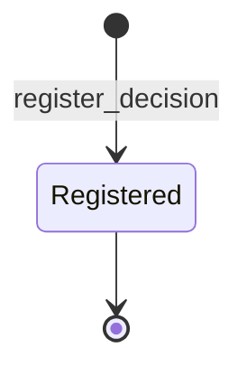

# Decision module <span class="md-maturity md-maturity--stable" title="Structured-audit record for every consequential choice; atomic-immutable with parent_id chains; PROV-AGENT-aligned field names.">stable</span>

## Purpose & Scope

The Decision module owns CORA's audit record for every consequential choice the system or its users make: a human approval, an AI inference, an agent action, an operator override. One aggregate carries the responsibility. `Decision` is a single structured record per choice, append-only, and atomic-immutable for its decision facts. Corrections, appeals, supersessions, and invalidations land as new Decisions with `parent_id` pointing at the original and `override_kind` explaining the transition; the latest entry in a chain is the current Decision.

Decision is the **why** layer. The state change a Decision authorizes lives on the target aggregate's stream; Decision records the rule, the inputs to the rule, the choice, the alternatives that were considered, the confidence and its source, and the actor that decided. Identity (who you are) lives in [Access](../access/index.md); the authorization that gated reaching the decider lives in [Trust](../trust/index.md); the agent-specific configuration of an AI decider lives in [Agent](../agent/index.md).

<div class="cora-aside cora-aside--deferred" markdown>

Out of scope

- **Typed-sum Decision per decider kind.** The aggregate is intentionally a single shape for both human and AI deciders. Type-narrowing at query time via an `Actor.role` discriminator is deferred until an audit-policy demands role-based filtering.
- **PROV-O export at the API boundary.** The in-domain payload uses PROV-aligned field names (`actor_id`, `parent_id`, `occurred_at`), but a PROV-O serialization endpoint lands when the first consumer asks.
- **Context-strict decision-rule enforcement.** `rule` is optional on every Decision. Whether a given context (Recipe approval, dataset discard, run abort) requires a rule citation is a projection-time audit-policy concern. The deferred-with-trigger is the first audit demand for context-strict enforcement.
- **Cross-policy combining and policy-grant decomposition.** Decisions in the `PolicyGrant` context carry determining-policy ids in `alternatives` per the standard policy-decision-log convention. A separate policy-evaluation log table is deferred until per-call policy decomposition is needed at audit time.
- **Confidence calibration consumer.** The `DecisionRated` event accrues `(rating, context, confidence_at_rating)` tuples specifically for a future confidence-calibration consumer (Platt scaling, isotonic regression, or a learned uncertainty estimator). The consumer itself is deferred until a baseline rating corpus exists.
- **Reasoning-entry partitioning.** `entries_decision_reasonings` is a single table with a BRIN index on `recorded_at`. Range partitioning is deferred until the table crosses ~50GB or until time-window reads degrade p95 read latency.

</div>

## Aggregates

| Name | Identity | State summary | FSM |
|---|---|---|---|
| `Decision` | `id: UUID` | `id`, `actor_id`, `context: DecisionContext`, `choice: DecisionChoice`, `parent_id?`, `override_kind?`, `rule?: DecisionRule`, `reasoning?`, `confidence?`, `confidence_source?: DecisionConfidenceSource`, `alternatives: tuple[str, ...]`, `inputs?: dict[str, Any]`, `reasoning_signature?`, `logbooks: dict[str, UUID]`, `ratings: dict[UUID, DecisionRatingRecord]` | atomic-immutable for decision facts; logbook + rating sub-lifecycles |

A `Decision` is the entire record of a single choice. The decision facts (`choice`, `reasoning`, `confidence`, `inputs`, `rule`, `alternatives`, `confidence_source`, `reasoning_signature`) are written once at registration and never updated in place. Two orthogonal annotation channels accrue alongside without changing those facts: `logbooks` carry attached observation logbooks for AI-decider trace data, and `ratings` carry operator acceptance-signal ratings folded latest-per-actor-wins.

`actor_id` is the **who** of the decision (the human or AI that made the choice). The `principal_id` on the persistence envelope is the **who** of the command that triggered the register. The two are normally the same UUID but will diverge when a saga records a Decision on behalf of an originating principal, or when an administrator records a decision made by another actor.

`parent_id` chains carry the corrective relationships. There is no `DecisionUpdated` or `DecisionRevoked` event. A new Decision with `override_kind = "correction"` says the parent was wrong; `"exception"` says the parent's rule still applies but this one grants an exception; `"appeal"` says the parent is being reviewed; `"supersession"` says the parent is being replaced by a newer version of the same conceptual choice; `"invalidation"` says this Decision's authorized action undoes the effect of the parent (additive compensation, never in-place mutation of the parent).

## Value Objects

| Name | Shape | Where used |
|---|---|---|
| `DecisionContext` | trimmed string, 1-100 chars; well-known constants documented (RecipeApproval, RunAbort, RunStop, RunTruncate, ResourceAllocation, PolicyGrant, ProcedureExecution, DatasetDiscard, RunDebrief, CautionProposal) | `Decision.context` |
| `DecisionChoice` | trimmed string, 1-500 chars; closed sub-vocabularies validated at projection time per context | `Decision.choice` |
| `DecisionRule` | trimmed string, 1-500 chars; convention encourages prefixed identifiers like `iso17025:7.1.3:simple_acceptance` or `cora:policy:recipe_approval:v1` | `Decision.rule` |
| `DecisionConfidenceSource` | closed StrEnum: `self_reported` \| `logprob` \| `ensemble` \| `human` | `Decision.confidence_source` |
| `ConfidenceBand` | closed StrEnum: `Low` \| `Medium` \| `High` \| `Certain`; derived from the stored `confidence` float at read time | denormalized into `proj_decision_summary.confidence_band` |
| `DecisionOverrideKind` | closed Literal: `correction` \| `exception` \| `appeal` \| `supersession` \| `invalidation` | `Decision.override_kind` |
| `DecisionRating` | closed StrEnum: `useful` \| `misleading` \| `ignored` | `DecisionRated.rating` |
| `DecisionRatingRecord` | `(rating, comment?, rated_at)`; one per `(decision, actor)` pair after fold | values of `Decision.ratings` |
| `inputs` | `dict[str, Any]`; ≤ 64 keys, each 1-100 chars; every value must round-trip through `json.dumps` | `Decision.inputs` |
| `alternatives` | `tuple[str, ...]`; ≤ 32 entries, each 1-500 chars; caller order preserved | `Decision.alternatives` |
| `reasoning_signature` | trimmed string, 1-4096 chars; typically a sha256 of the full reasoning trace or a vendor-supplied encrypted summary | `Decision.reasoning_signature` |

`DecisionContext` is intentionally an open string with documented well-known constants. New contexts arrive without a schema migration. The well-known set is validated at projection time, not at write time.

`DecisionChoice` is similarly open at the BC boundary, with per-context closed sub-vocabularies enforced at the projection layer. Two such sub-vocabularies exist today: the seven-value `RunDebrief` choice (NominalCompletion, DegradedCompletion, OperatorAbort, EquipmentAbort, DataSuspect, DebriefDeferred, DebriefConflicted) and the six-value `CautionProposal` choice (NoAction, ProposeNotice, ProposeCaution, ProposeWarning, ProposeSupersede, CautionDraftConflicted).

`ConfidenceBand` is never stored on the aggregate. The stored confidence is a single float in `[0, 1]`, and the band is computed at read time via `confidence_band()`: `Low` is below `0.3`, `Medium` is `[0.3, 0.7)`, `High` is `[0.7, 0.95)`, `Certain` is `[0.95, 1.0]`. The projection precomputes the band for fast categorical filtering, but the float is the source of truth. A `None` confidence yields a `None` band: the not-set distinction is preserved rather than silently mapped to `Low`. A `NaN` confidence also yields `None`.

`inputs` values must round-trip through `json.dumps` at the BC boundary. A `datetime`, `set`, or other non-JSON-native value raises here rather than failing deep at jsonb serialization time.

## FSM

`Decision` is atomic-immutable for its decision facts. The only state transition that affects those facts is the genesis transition; corrections and supersessions are NEW Decisions, not transitions on the original.



| From | To | Command | Event |
|---|---|---|---|
| `[*]` | `Registered` | `register_decision` | `DecisionRegistered` |

Two sub-lifecycles accrue alongside without changing decision facts.

**Logbook sub-lifecycle.** `Decision.logbooks` maps logbook kind to the currently-open logbook id. The only kind today is `reasoning`, used for AI-decider trace entries carrying OpenTelemetry GenAI semantic-convention attributes. The state encodes the at-most-one-open-per-kind invariant directly: opening a second logbook of the same kind raises `DecisionLogbookAlreadyOpen` rather than orphaning the first.

| From (per kind) | To | Command | Event |
|---|---|---|---|
| not-open | open | (no direct slice today; opened by the agent subscriber that records the trace) | `DecisionLogbookOpened` |
| open | not-open | (no direct slice today; closes on terminal trace handoff) | `DecisionLogbookClosed` |

The `append_reasoning_entry` slice does not open or close a logbook; it appends one entry row to `entries_decision_reasonings` for a logbook that is already open on the Decision.

**Rating sub-lifecycle.** `Decision.ratings` is a per-actor dict folded latest-per-actor-wins. Multiple `DecisionRated` events per `(decision, actor)` pair are allowed; the evolver keeps only the latest entry per actor in aggregate state. The audit trail (every rating ever submitted) lives in the event log.

| From (per actor) | To | Command | Event |
|---|---|---|---|
| any | latest-per-actor | `rate_decision` | `DecisionRated` |

## Events

`Decision` emits four event types. `DecisionRegistered` is the genesis event and carries the entire decision-fact record. The two logbook events bracket the optional reasoning trace. `DecisionRated` is the additive annotation channel.

| Event | Payload sketch | When emitted |
|---|---|---|
| `DecisionRegistered` | `decision_id`, `actor_id`, `context`, `choice`, `parent_id?`, `override_kind?`, `rule?`, `reasoning?`, `confidence?`, `confidence_source?`, `alternatives`, `inputs?`, `reasoning_signature?`, `occurred_at` | `register_decision` succeeds (genesis) |
| `DecisionLogbookOpened` | `decision_id`, `logbook_id`, `kind`, `schema`, `occurred_at` | a logbook of `kind` is attached to the Decision; carries the per-entry schema for audit |
| `DecisionLogbookClosed` | `decision_id`, `logbook_id`, `occurred_at` | a previously-opened logbook is terminated |
| `DecisionRated` | `decision_id`, `rating`, `comment?`, `rated_by_actor_id`, `rated_at`, `occurred_at`, `confidence_at_rating?` | `rate_decision` succeeds; one event per submission, even when the same actor re-rates the same Decision |

`DecisionRegistered.alternatives` serializes as a list preserving caller order. Top-k ordering matters for AI deciders, and the canonical convention for determining-policy ids on `PolicyGrant` Decisions preserves it too.

`DecisionLogbookOpened.schema` declares the per-row column shape of the entries that will land in `entries_decision_reasonings` for this logbook session. Carrying the schema on the open event means the Decision lifecycle audit captures the schema as of the moment the logbook was opened, which supports per-logbook schema evolution by opening a new logbook with an updated schema.

`DecisionRated.confidence_at_rating` is captured from `Decision.state.confidence` at write time, not recomputed at read time or denormed by the projection. Capture-don't-recompute keeps the rated `(rating, confidence)` pair stable across aggregate rebuilds and projection rewrites.

`DecisionRated.rated_at` is the domain timestamp (when the operator submitted the rating per their wall-clock); `occurred_at` is the envelope timestamp on the persistence envelope. At write time the two are equal by construction. Downstream consumers prefer `rated_at` for domain-aware queries and `occurred_at` for envelope-bound audit ordering.

## Slices

| Command | Category | REST | MCP tool | Idempotency |
|---|---|---|---|---|
| `RegisterDecision` | NEW | `POST /decisions` | `register_decision` | required |
| `GetDecision` | QUERY | `GET /decisions/{decision_id}` | `get_decision` | none |
| `ListDecisions` | QUERY | `GET /decisions` | `list_decisions` | none |
| `AppendReasoningEntry` | APPEND | `POST /decisions/{decision_id}/reasoning_entries` | `append_reasoning_entry` | required |
| `RateDecision` | APPEND | `POST /decisions/{decision_id}/ratings` | `rate_decision` | required |

`register_decision` performs two cross-aggregate pre-loads in the handler before appending. The Actor referenced by `actor_id` must exist; no status check is run (a Decision can be made by an Actor in any lifecycle state, including Deactivated, because the historical fact still holds). The decider then refuses any Actor whose `kind` is `agent`: agent-emitted Decisions are written by the subscriber path (RunDebriefer, CautionDrafter) so the Signer port can wrap each row at the boundary; this slice stays human and service-account only. When `parent_id` is set, the parent Decision must exist. For operator-triggered re-invocations of an agent run-debrief, the handler additionally checks that the parent Decision carries the same `run_id` and the same RunDebrief context.

`list_decisions` is a keyset-paginated read against `proj_decision_summary`. The handler accepts an optional `confidence_band` filter and an optional `actor_id` filter, and uses the same no-smart-logic-in-SQL discipline as every other list slice in CORA. The `confidence_band` filter resolves against the denormalized column, so a low-cardinality categorical predicate stays an indexed lookup.

`append_reasoning_entry` writes one row into `entries_decision_reasonings`. The handler validates that a logbook of the requested kind is currently open on the Decision; mismatches raise `DecisionLogbookNotOpen`. The slice does not open a logbook itself: opening is done by the agent subscriber that captures the trace.

`rate_decision` reads the rated Decision's current `confidence` value and writes it onto the `DecisionRated` payload as `confidence_at_rating`, then appends the event. Latest-per-actor wins in the projection; every event still lands in the audit log.

**Errors per slice.** Beyond Pydantic boundary 422s, each slice raises:

`RegisterDecision`
: `InvalidDecisionChoice`, `InvalidDecisionContext`, `InvalidDecisionReasoning`, `InvalidDecisionRule`, `InvalidDecisionConfidence`, `InvalidDecisionAlternatives`, `InvalidDecisionInputs`, `InvalidReasoningSignature`, `OverrideKindRequiresParent` (set `override_kind` without a `parent_id` and the boundary refuses), `DecisionAlreadyExists` (defensive on the genesis stream), `DeciderActorNotFoundError` (the Actor referenced by `actor_id` has no stream), `InvalidActorKindForDecision` (the slice refuses `actor.kind == AGENT`; agent-emitted Decisions go through the signed subscriber path), `DecisionParentNotFoundError` (the Decision referenced by `parent_id` has no stream), `ParentDecisionRunMismatch` and `ParentDecisionAgentMismatch` (operator-triggered re-debrief whose parent chain references a different Run or a non-RunDebrief context), `Unauthorized`

`GetDecision`
: `DecisionNotFound`

`ListDecisions`
: (boundary 422 only)

`AppendReasoningEntry`
: `DecisionNotFound`, `DecisionLogbookNotOpen`, boundary 422 for the per-row payload shape, `Unauthorized`

`RateDecision`
: `DecisionNotFound`, `InvalidDecisionRatingComment` (empty-after-trim or over-cap), boundary 422 for the rating enum value, `Unauthorized`

## Storage & Projections

Three read-side artefacts back the Decision module: the summary projection that powers `list_decisions`, the ratings projection that powers per-actor rating reads, and the typed entries table for AI-decider reasoning traces.

```sql title="proj_decision_summary"
CREATE TABLE proj_decision_summary (
    decision_id      UUID        PRIMARY KEY,
    actor_id         UUID        NOT NULL,
    decision_rule    TEXT,
    parent_id        UUID,
    confidence       DOUBLE PRECISION,
    confidence_band  TEXT        CHECK (
        confidence_band IS NULL
        OR confidence_band IN ('Low', 'Medium', 'High', 'Certain')
    ),
    created_at       TIMESTAMPTZ NOT NULL,
    updated_at       TIMESTAMPTZ NOT NULL DEFAULT now()
);

CREATE INDEX proj_decision_summary_keyset_idx
    ON proj_decision_summary (created_at, decision_id);

CREATE INDEX proj_decision_summary_actor_idx
    ON proj_decision_summary (actor_id);

CREATE INDEX proj_decision_summary_rule_idx
    ON proj_decision_summary (decision_rule)
    WHERE decision_rule IS NOT NULL;

CREATE INDEX proj_decision_summary_band_idx
    ON proj_decision_summary (confidence_band)
    WHERE confidence_band IS NOT NULL;
```

```sql title="proj_decision_ratings"
CREATE TABLE proj_decision_ratings (
    decision_id              UUID        NOT NULL,
    rated_by_actor_id        UUID        NOT NULL,
    rating                   TEXT        NOT NULL
                                         CHECK (rating IN ('useful', 'misleading', 'ignored')),
    comment                  TEXT,
    rated_at                 TIMESTAMPTZ NOT NULL,
    confidence_at_rating     DOUBLE PRECISION,
    PRIMARY KEY (decision_id, rated_by_actor_id)
);

CREATE INDEX proj_decision_ratings_by_actor_idx
    ON proj_decision_ratings (rated_by_actor_id);
```

```sql title="entries_decision_reasonings"
CREATE TABLE entries_decision_reasonings (
    event_id            UUID         PRIMARY KEY,
    decision_id         UUID         NOT NULL,
    logbook_id          UUID         NOT NULL,
    correlation_id      UUID         NOT NULL,
    causation_id        UUID,
    occurred_at         TIMESTAMPTZ  NOT NULL,
    duration            BIGINT,
    operation_name      TEXT         NOT NULL,
    provider_name       TEXT         NOT NULL,
    request_model       TEXT         NOT NULL,
    response_id         TEXT,
    response_model      TEXT,
    request_temperature DOUBLE PRECISION,
    request_top_p       DOUBLE PRECISION,
    request_max_tokens  INTEGER,
    output_type         TEXT,
    finish_reasons      TEXT[],
    input_tokens        BIGINT,
    output_tokens       BIGINT,
    agent_id            TEXT,
    agent_name          TEXT,
    agent_description   TEXT,
    conversation_id     TEXT,
    tool_name           TEXT,
    tool_call_id        TEXT,
    tool_type           TEXT,
    messages_jsonb      JSONB,
    recorded_at         TIMESTAMPTZ  NOT NULL DEFAULT now()
);

CREATE INDEX entries_decision_reasonings_decision_time_idx
    ON entries_decision_reasonings (decision_id, occurred_at DESC);

CREATE INDEX entries_decision_reasonings_logbook_idx
    ON entries_decision_reasonings (logbook_id);

CREATE INDEX entries_decision_reasonings_conversation_idx
    ON entries_decision_reasonings (conversation_id)
    WHERE conversation_id IS NOT NULL;

CREATE INDEX entries_decision_reasonings_recorded_at_brin_idx
    ON entries_decision_reasonings USING BRIN (recorded_at);
```

`proj_decision_summary` subscribes only to `DecisionRegistered`. The logbook events are internal bookkeeping and do not mutate the summary's columns; the rating events have their own projection. There is no UPDATE path: one Decision is one row, and the chain semantics (corrections, supersessions, invalidations) are queryable via `parent_id` joins rather than via in-place state changes.

`confidence_band` is denormalized into the summary at INSERT time so that low-cardinality categorical filters stay indexed lookups. The float is preserved as the source of truth in the same row, and the band is recomputed from the float by `confidence_band()` for any non-projection caller. The CHECK constraint mirrors the four enum values and tolerates NULL so a Decision with no confidence claim is queryable as `confidence_band IS NULL`.

`proj_decision_ratings` uses a composite primary key on `(decision_id, rated_by_actor_id)`. The latest-per-actor-wins fold is implemented at INSERT time via ON CONFLICT UPDATE keyed on the PK; the projection mirrors the aggregate's `ratings` dict shape. The audit trail of all rating events lives in the event log; the projection carries the snapshot.

`entries_decision_reasonings` is the second concrete entries-table observation logbook in CORA after the conduit-traversal log. Per-trace AI-decider entries are high-cardinality and must not fold into Decision state or bloat the main events table. The field set lifts directly from the OpenTelemetry GenAI semantic-convention attributes: required discriminators (`provider_name`, `operation_name`, `request_model`) plus optional response identity, hyperparameters, usage counts, multi-agent correlation, and tool-call context. The `messages_jsonb` column carries the prompt and completion bodies as a single jsonb blob and is opt-in for PII gating. The `event_id` primary key doubles as the idempotency and dedup key for producer retries.

There is no foreign key from `entries_decision_reasonings` to the Decision aggregate. The Decision lives in `events`, not in its own row, and an FK to `(stream_type, stream_id)` is not a standard SQL shape. The reference is by `decision_id` value; downstream queries join through projections.

## Cross-Module boundaries

| Module | Relationship | What's exchanged |
|---|---|---|
| Access | reads-from | `Decision.actor_id` is an `Actor.id`; the handler pre-loads the Actor at registration to confirm existence |
| Trust | shared-vocabulary-with | `Decision.context = "PolicyGrant"` Decisions are written by the Authorize port path when a policy decision is consequential enough to record; `alternatives` carries the determining-policy ids in those Decisions |
| Agent | writes-into | the agent subscribers for `RunDebriefer` and `CautionDrafter` write one Decision per terminal Run event; the subscriber composes `DecisionRegistered` inline so the decision_id is deterministic from the run_id |
| Run | reads-from | `RunAbort`, `RunStop`, `RunTruncate`, and `RunDebrief` Decisions reference a Run id either in `inputs` or in the context vocabulary; the link is by value, not stored on Run |
| Recipe | reads-from | `RecipeApproval` Decisions cite a Recipe id in `inputs`; the link is by value |
| Data | reads-from | `DatasetDiscard` Decisions cite a Dataset id, and `invalidation`-kind chains pair with the `demote_dataset` slice on the Data module so an authorized retract has a citable rule |
| Caution | reads-from | `CautionProposal` Decisions reference a target via `inputs`; promotion of a proposal into a Caution copies the Decision id onto the resulting Caution as provenance |
| Equipment, Operation, Subject, Supply | reads-from | every consequential operator action on these modules records one Decision with the relevant context, and the link is by value |

The `actor_id` reference is pre-loaded at the registration handler, but no status check is run. A Decision made by an Actor who is later deactivated is still a valid historical fact, and its audit value does not diminish. The `parent_id` reference is also pre-loaded; the cross-Run and cross-context guards on operator re-invocations of agent debriefs are the only structural checks beyond existence.

Decisions are read by many modules and written by few. The two agent subscribers (`RunDebriefer`, `CautionDrafter`) are the only AI authors today; everything else is human or operator path. The Authorize port does not write Decisions for every authorization; the per-decision audit log lives in `entries_conduit_traversals`, and a `PolicyGrant` Decision is reserved for the small subset of policy decisions consequential enough to record at the Decision-aggregate level.

## Examples

The five examples below cover the canonical Decision authoring and read flow: register a Decision for an operator-approved Recipe, get one back by id, list with a confidence-band filter, rate a Decision, and append one reasoning entry to an open logbook. The caller's principal goes on the `X-Principal-Id` header. For the REST and MCP equivalence, auth, and idempotency conventions these examples share, see [Reading the examples](../index.md) on the Modules landing page.

### Register a Decision for an approved Recipe

=== "REST"

    ```http
    POST /decisions
    Content-Type: application/json
    Idempotency-Key: 1a2b3c4d-5e6f-7a8b-9c0d-1e2f3a4b5c6d
    X-Principal-Id: 11111111-2222-3333-4444-555555555555

    {
      "actor_id": "11111111-2222-3333-4444-555555555555",
      "context": "RecipeApproval",
      "choice": "Approve",
      "rule": "cora:policy:recipe_approval:v1",
      "reasoning": "Beam time aligned with proposal scope; method parameters within commissioned envelope.",
      "inputs": {
        "recipe_id": "9c2a8e4f-3b5d-6c7e-8f9a-0b1c2d3e4f5a",
        "proposal_id": "PROP-2026-035",
        "estimated_beam_minutes": 240
      },
      "alternatives": ["Approve", "Defer", "Reject"]
    }
    ```

    Returns `201 Created` with the newly-assigned `decision_id`. A second call with the same idempotency key returns the same id. The handler pre-loads the referenced Actor and raises `409 Conflict` with `DeciderActorNotFoundError` if it does not exist.

=== "MCP"

    ```python
    mcp.call_tool(
        "register_decision",
        {
            "actor_id": "11111111-2222-3333-4444-555555555555",
            "context": "RecipeApproval",
            "choice": "Approve",
            "rule": "cora:policy:recipe_approval:v1",
            "reasoning": (
                "Beam time aligned with proposal scope; method parameters "
                "within commissioned envelope."
            ),
            "inputs": {
                "recipe_id": "9c2a8e4f-3b5d-6c7e-8f9a-0b1c2d3e4f5a",
                "proposal_id": "PROP-2026-035",
                "estimated_beam_minutes": 240,
            },
            "alternatives": ["Approve", "Defer", "Reject"],
        },
    )
    ```

### Get a Decision by id

=== "REST"

    ```http
    GET /decisions/9c2a8e4f-3b5d-6c7e-8f9a-0b1c2d3e4f5a
    X-Principal-Id: 11111111-2222-3333-4444-555555555555
    ```

    Returns `200 OK` with the full Decision payload, including `confidence_band` derived from `confidence` at read time. `404 Not Found` if no Decision exists for that id.

=== "MCP"

    ```python
    mcp.call_tool(
        "get_decision",
        {"decision_id": "9c2a8e4f-3b5d-6c7e-8f9a-0b1c2d3e4f5a"},
    )
    ```

### List Decisions filtered by confidence band

=== "REST"

    ```http
    GET /decisions?confidence_band=Certain&actor_id=22222222-3333-4444-5555-666666666666&limit=50
    X-Principal-Id: 11111111-2222-3333-4444-555555555555
    ```

    Returns `200 OK` with a keyset-paginated list of Decision summaries. The `confidence_band` filter resolves against the denormalized column, so the predicate stays an indexed lookup. Pass the returned `next_cursor` on the following call to page through.

=== "MCP"

    ```python
    mcp.call_tool(
        "list_decisions",
        {
            "confidence_band": "Certain",
            "actor_id": "22222222-3333-4444-5555-666666666666",
            "limit": 50,
        },
    )
    ```

### Rate a Decision

=== "REST"

    ```http
    POST /decisions/9c2a8e4f-3b5d-6c7e-8f9a-0b1c2d3e4f5a/ratings
    Content-Type: application/json
    Idempotency-Key: 4d5e6f7a-8b9c-0d1e-2f3a-4b5c6d7e8f9a
    X-Principal-Id: 22222222-3333-4444-5555-666666666666

    {
      "rating": "useful",
      "comment": "The narrative captured the failure mode I would have written up myself."
    }
    ```

    Returns `204 No Content` (no new resource is created at a stable URL; the rating folds into the rater's slot on the Decision). The rated Decision's current `confidence` is captured onto the `DecisionRated` payload as `confidence_at_rating` at write time. A second rating from the same actor against the same Decision is allowed and folds latest-wins; both events remain in the audit log.

=== "MCP"

    ```python
    mcp.call_tool(
        "rate_decision",
        {
            "decision_id": "9c2a8e4f-3b5d-6c7e-8f9a-0b1c2d3e4f5a",
            "rating": "useful",
            "comment": (
                "The narrative captured the failure mode I would have written "
                "up myself."
            ),
        },
    )
    ```

### Append one reasoning entry to an open logbook

=== "REST"

    ```http
    POST /decisions/9c2a8e4f-3b5d-6c7e-8f9a-0b1c2d3e4f5a/reasoning_entries
    Content-Type: application/json
    Idempotency-Key: 7a8b9c0d-1e2f-3a4b-5c6d-7e8f9a0b1c2d
    X-Principal-Id: 33333333-4444-5555-6666-777777777777

    {
      "logbook_id": "5a6b7c8d-9e0f-1a2b-3c4d-5e6f7a8b9c0d",
      "occurred_at": "2026-05-20T18:42:11.314Z",
      "operation_name": "chat",
      "provider_name": "anthropic",
      "request_model": "claude-opus-4-7",
      "response_model": "claude-opus-4-7",
      "request_temperature": 0.2,
      "request_max_tokens": 4096,
      "input_tokens": 1842,
      "output_tokens": 612,
      "finish_reasons": ["end_turn"],
      "agent_name": "RunDebriefer",
      "conversation_id": "run-debrief:42f7b1a0-...",
      "messages_jsonb": null
    }
    ```

    Returns `200 OK` with the `event_id` that becomes the entries-table primary key. The handler raises `409 Conflict` with `DecisionLogbookNotOpen` if no logbook with the supplied `logbook_id` is currently open on the Decision. The `messages_jsonb` field is opt-in for PII gating and may be null.

=== "MCP"

    ```python
    mcp.call_tool(
        "append_reasoning_entry",
        {
            "decision_id": "9c2a8e4f-3b5d-6c7e-8f9a-0b1c2d3e4f5a",
            "logbook_id": "5a6b7c8d-9e0f-1a2b-3c4d-5e6f7a8b9c0d",
            "occurred_at": "2026-05-20T18:42:11.314Z",
            "operation_name": "chat",
            "provider_name": "anthropic",
            "request_model": "claude-opus-4-7",
            "response_model": "claude-opus-4-7",
            "request_temperature": 0.2,
            "request_max_tokens": 4096,
            "input_tokens": 1842,
            "output_tokens": 612,
            "finish_reasons": ["end_turn"],
            "agent_name": "RunDebriefer",
            "conversation_id": "run-debrief:42f7b1a0-...",
            "messages_jsonb": None,
        },
    )
    ```
