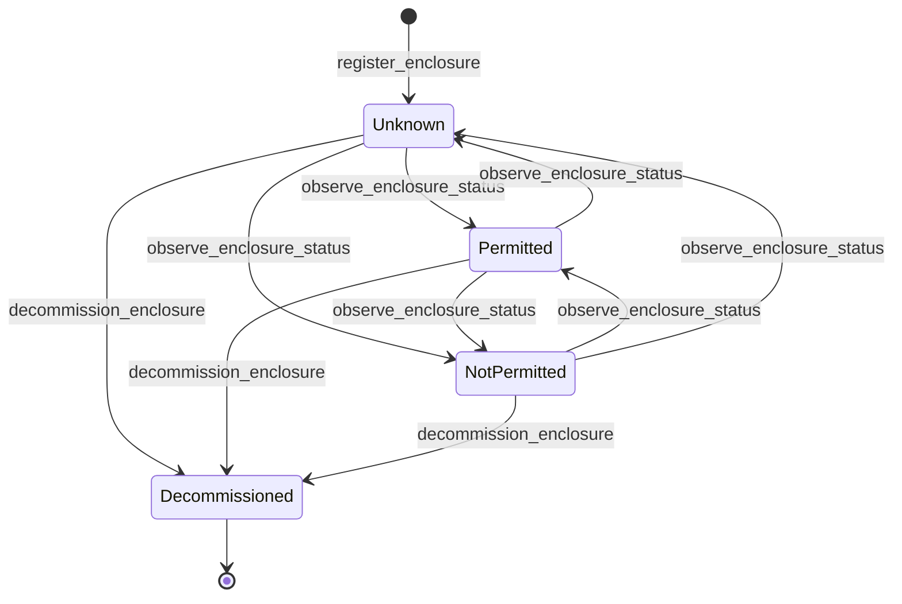

# Enclosure module

<span class="md-maturity md-maturity--alpha" title="Single founding aggregate, two orthogonal enums, three events, three slices, two ports (one cross-BC, one BC-local), stub adapters only; production observer adapter deferred to first pilot integration.">alpha</span>

## Purpose & Scope

The Enclosure module models the observed permit status of physical spaces that gate experiments: beamline hutches, sample-prep cabinets, instrument vaults, the rooms a Personnel Safety System governs. An Enclosure is the observation surface for one such space; whether the space is currently `Permitted` (people may be inside, beam may be on, the door interlocks accept entry), `NotPermitted` (interlocks have tripped or the search-and-secure sequence has not completed), or `Unknown` (the substrate adapter has not reported yet, or observability was lost). Operators register an Enclosure once it has a physical identity and a containing Asset; thereafter the operational status mutates only through monitor-driven observations from a substrate-side adapter that reads the underlying interlock system.

The aggregate is intentionally slim: identity, a containing-Asset back-reference, and two orthogonal state axes. Per-observation audit metadata (reason, monitor reference, source kind, source id) lives only on the event payload and the projection denormalization; the aggregate state stays small so fold-on-read remains cheap and the substrate seam stays observable, not authoritative.

<div class="cora-aside cora-aside--deferred" markdown>

Out of scope
{: .cora-kicker }

- **Operator-asserted Permitted state.** There is no `mark_enclosure_permitted` slice and no operator override. The substrate hardware (PSS, interlock controller) is the only authority that can drive the status to `Permitted`; observations carry `trigger=Monitor` exclusively. If operator intent ever needs to override an observed state, it surfaces through an `InterlockQuirk` Caution, not through a permit-side state mutation.
- **Severity, criticality, hazard-level scalars.** No `severity`, `risk_level`, `sil_level`, `signal_word`, or `vendor_status_code` field on the aggregate, events, port dataclasses, or projection. An ERROR-mode AST fitness test guards this; severity language belongs in the Caution module and in safety documentation, not on an observation-axis aggregate.
- **A `Bypassed` or `MaintenanceMode` status.** The closed `EnclosurePermitStatus` enum carries only `Permitted`, `NotPermitted`, `Unknown`. Bypass observability, when it lands, surfaces via `source_kind` / `source_id` discriminators on the observation envelope, never as a separate state value.
- **Upstream-chain carrier.** An `upstream_enclosure_id` field is not on the aggregate. Cascade-trip prerequisite logic, if a concrete consumer earns it, derives at pre-flight time from the Asset containment ladder via `containing_asset_id` walks; the carrier is deferred until evidence demands it.
- **Production observer adapter.** The Monitor-side substrate seam ships with an inline `AlwaysPermittedEnclosureObserver` stub only. The EPICS / P4P / Tango observer adapters are reserved for the first pilot integration.
- **Production-only cross-BC lookup.** The cross-BC `EnclosureLookup` port ships with both an `InMemoryEnclosureLookup` (used in tests) and the `PostgresEnclosureLookup` production adapter that reads through `proj_enclosure_summary`; only the upstream observer seam is stubbed.

</div>

## Aggregates

| Name | Identity | State summary | FSM |
|---|---|---|---|
| `Enclosure` | `id: EnclosureId` (opaque UUID, BC-local `NewType`) plus address tuple `(containing_asset_id, name)` enforced unique on the projection while lifecycle is `Active` | `id`, `name`, `containing_asset_id`, `permit_status`, `lifecycle`, `registered_at`, `registered_by`, `decommissioned_at?`, `decommissioned_by?` | yes (two orthogonal axes) |

The Enclosure aggregate carries two orthogonal state axes per the multi-axis lifecycle convention. `permit_status: EnclosurePermitStatus` is the operational observation channel mutated only by `observe_enclosure_status`. `lifecycle: EnclosureLifecycle` is the structural channel mutated only by `decommission_enclosure`. The two evolve independently: a decommissioned Enclosure preserves the last observed `permit_status` as audit, and an observed status change never touches `lifecycle`. `containing_asset_id` is a bare `UUID` back-reference to an Equipment Asset; cross-BC existence is not verified at write time (eventual-consistency stance per the cross-BC opaque-pointer convention).

## Value Objects

| Name | Shape | Where used |
|---|---|---|
| `EnclosureId` | `NewType[UUID]` co-located at `cora.enclosure.aggregates._value_types` | `Enclosure.id` |
| `EnclosureName` | trimmed bounded text, 1-200 chars | `Enclosure.name` |
| `EnclosureReason` | trimmed bounded text, 1-500 chars; decider-input only | `observe_enclosure_status` and `decommission_enclosure` `reason` input |
| `EnclosurePermitStatus` | closed StrEnum `{Permitted, NotPermitted, Unknown}` | `Enclosure.permit_status`. Three-value spine-consumer-shaped predicate; the pre-flight gate treats `Permitted` as the only passing value. |
| `EnclosureLifecycle` | closed StrEnum `{Active, Decommissioned}` | `Enclosure.lifecycle`. Mirrors `FacilityStatus` / `AssetLifecycle` shape; `Decommissioned` is the lifecycle terminal added by `decommission_enclosure`. |
| `TriggerSource` | closed StrEnum `{Operator, Monitor, Auto}` | observation-event `trigger` discriminator. `Monitor` is the only legal value for `observe_enclosure_status` today; `Operator` is reserved for the genesis and terminal events; `Auto` is reserved for a future timer-driven slice that does not yet exist. |
| `MonitorRef` | `(source_kind: str, source_id: str)` split on the projection; serialized as `"{source_kind}:{source_id}"` on the event payload | `observe_enclosure_status` audit metadata. Split into separate columns at projection-write so consumers query `WHERE last_source_kind = 'EpicsPv'` without LIKE-substring fragility. |

## FSM

The two axes evolve independently. The operational axis (`permit_status`) accepts only Monitor-driven observations; the structural axis (`lifecycle`) accepts only the operator-driven decommission. The diagram below shows the operational axis; the structural axis is the two-state `Active -> Decommissioned` lifecycle terminal shared with Facility and Supply.



| From | To | Command | Event |
|---|---|---|---|
| `[*]` | `(Active, Unknown)` | `register_enclosure` | `EnclosureRegistered` |
| `Unknown`, `Permitted`, `NotPermitted` | `Permitted` | `observe_enclosure_status` (Monitor-only) | `EnclosurePermitObserved` |
| `Unknown`, `Permitted`, `NotPermitted` | `NotPermitted` | `observe_enclosure_status` (Monitor-only) | `EnclosurePermitObserved` |
| `Permitted`, `NotPermitted` | `Unknown` | `observe_enclosure_status` (Monitor-only; observability loss) | `EnclosurePermitObserved` |
| any `(Active, *)` | `(Decommissioned, *)` | `decommission_enclosure` (operator-only) | `EnclosureDecommissioned` |

**Guards.** Beyond the source-state check, each transition enforces:

`observe_enclosure_status`
: In-process-only port (no REST, no MCP). Rejects `trigger=Operator` at command-tier validation (closes the operator-assert-Permitted backdoor). Rejects any observation targeting `Decommissioned`. Identical-status observations return `[]` and emit no event. Stamps every emitted event with `trigger=Monitor` plus the adapter's `monitor_ref`. The Monitor-only fence is the load-bearing safety property of the module: the substrate hardware is the only authority that can move the operational axis.

`decommission_enclosure`
: Operator escape hatch for mistaken registrations or retired hutches. Accepts any source lifecycle except `Decommissioned` itself. Lifecycle terminal: no transition exits `Decommissioned`. The address tuple `(containing_asset_id, name)` is freed for re-registration because the projection's UNIQUE INDEX is partial on `WHERE lifecycle = 'Active'`. The last observed `permit_status` is preserved on the aggregate and projection as audit.

## Events

| Event | Payload sketch | When emitted |
|---|---|---|
| `EnclosureRegistered` | `enclosure_id, name, containing_asset_id, registered_by, occurred_at` | `register_enclosure` accepted; lifecycle implicitly `Active`, permit_status implicitly `Unknown`. |
| `EnclosurePermitObserved` | `enclosure_id, from_status, to_status, reason, trigger, triggered_by, occurred_at, monitor_ref?` | `observe_enclosure_status` accepted and `to_status != from_status`. Identical-status observations emit no event. |
| `EnclosureDecommissioned` | `enclosure_id, reason, triggered_by, occurred_at` | `decommission_enclosure` accepted (any active source lifecycle to `Decommissioned`). |

Every observation event carries both `from_status` and `to_status` explicitly so that projection apply logic stays uniform across the six legal transition edges and per-event audit reads are self-contained. `monitor_ref` is omitted when `None` (Federation Slice 6E precedent); the projection splits the colon-delimited wire form into `last_source_kind` and `last_source_id` for indexable read access. `EnclosureDecommissioned` carries the minimal four-field shape (operator gesture, no Monitor pairing, no `from_status` because the terminal is single-target).

## Slices

| Command | Category | REST | MCP tool | Idempotency |
|---|---|---|---|---|
| `RegisterEnclosure` | NEW | `POST /enclosures` | `register_enclosure` | required |
| `ObserveEnclosureStatus` | IN-PROCESS | (none, by design) | (none, by design) | none |
| `DecommissionEnclosure` | TERMINAL | `POST /enclosures/{enclosure_id}/decommission` | `decommission_enclosure` | none |

`ObserveEnclosureStatus` ships no REST endpoint or MCP tool by design: operators have buttons, machines have ports. The substrate adapter (today the in-memory stub, tomorrow an EPICS / P4P / Tango observer) calls `EnclosureHandlers.observe_enclosure_status(...)` directly. Exposing the slice on the public surface would invite operators issuing Monitor-tagged events from MCP tools while the system attributes them to a sensor.

**Errors per slice.** Beyond Pydantic boundary 422s, each slice raises:

`RegisterEnclosure`
: `EnclosureAlreadyExistsError` (409), `InvalidEnclosureNameError` (400), `UnauthorizedError` (403). A duplicate active `(containing_asset_id, name)` registration succeeds at the aggregate (different stream) but fails at projection-insert time on the partial UNIQUE INDEX; the projection swallows the conflict with a WARN log so the worker keeps advancing.

`ObserveEnclosureStatus`
: `EnclosureNotFoundError` (404), `MonitorTriggerNotPermittedError` (400; non-`Monitor` trigger), `EnclosureCannotObserveWhileDecommissionedError` (409; observation attempted on a decommissioned Enclosure), `InvalidEnclosureReasonError` (400), `InvalidMonitorRefError` (400; raised at VO construction before the decider runs). The operational FSM is any-to-any across `Unknown`, `Permitted`, `NotPermitted`: there is no per-target source-state allowlist. Identical-status observations return `[]` and emit no event.

`DecommissionEnclosure`
: `EnclosureNotFoundError` (404), `EnclosureCannotDecommissionError` (409, strict-not-idempotent on a Supply-precedent terminal), `InvalidEnclosureReasonError` (400), `UnauthorizedError` (403).

`Run.start_run` / `Operation.start_procedure`
: pre-flight gate raises `RunRequiresPermittedEnclosureError` / `RunEnclosureCoverageMismatchError` and the matching `Procedure*` pair (all HTTP 409) when the Asset scope resolves to no covering Enclosure, or when at least one covering Enclosure is not in `Permitted`. See Cross-Module boundaries below for the wiring shape.

## Storage & Projections

`proj_enclosure_summary`:

```sql title="proj_enclosure_summary"
CREATE TABLE proj_enclosure_summary (
    enclosure_id            UUID         PRIMARY KEY,
    name                    TEXT         NOT NULL CHECK (length(name) > 0),
    containing_asset_id     UUID         NOT NULL,
    lifecycle               TEXT         NOT NULL CHECK (
        lifecycle IN ('Active', 'Decommissioned')
    ),
    permit_status           TEXT         NOT NULL CHECK (
        permit_status IN ('Unknown', 'Permitted', 'NotPermitted')
    ),
    registered_at           TIMESTAMPTZ  NOT NULL,
    registered_by           UUID         NOT NULL,
    last_observed_at        TIMESTAMPTZ,
    last_observed_reason    TEXT,
    last_trigger            TEXT         CHECK (
        last_trigger IS NULL OR last_trigger IN ('Operator', 'Monitor', 'Auto')
    ),
    last_source_kind        TEXT,
    last_source_id          TEXT,
    decommissioned_at       TIMESTAMPTZ,
    decommissioned_by       UUID,
    updated_at              TIMESTAMPTZ  NOT NULL DEFAULT now()
);

CREATE UNIQUE INDEX proj_enclosure_summary_address_uq
    ON proj_enclosure_summary (containing_asset_id, name)
    WHERE lifecycle = 'Active';

CREATE INDEX proj_enclosure_summary_containing_asset_idx
    ON proj_enclosure_summary (containing_asset_id)
    WHERE lifecycle = 'Active';

CREATE INDEX proj_enclosure_summary_gate_idx
    ON proj_enclosure_summary (lifecycle, permit_status);
```

The address tuple `(containing_asset_id, name)` is enforced unique at the projection because aggregates cannot enforce cross-stream invariants. The UNIQUE INDEX is partial on `WHERE lifecycle = 'Active'` so a decommissioned Enclosure does not hold the address against re-registration. CHECK constraints lock all enum values day-one so a future widening of the operational axis lands without a constraint migration. No FK constraints to other projections: rebuild order is arbitrary, and cross-projection consistency is event-driven. `last_observed_*` columns live only on the projection (the slim-aggregate rule keeps the aggregate state cheap to fold); the `last_source_kind` / `last_source_id` split mirrors the colon-delimited wire form so the gate-side queries can filter on adapter kind without LIKE patterns.

## Cross-Module boundaries

| Module | Relationship | What's exchanged |
|---|---|---|
| `Trust` | gated-by | Every write-side Enclosure slice (`register`, `decommission`, the in-process `observe`) is gated by the Authorize port resolving a `Policy` for the `(principal, command, conduit, surface)` tuple; deny outcomes refuse before the decider runs. |
| `Access` | shared-id-with | Every Enclosure event envelope carries `actor_id` for principal attribution; `registered_by`, `triggered_by` on the decommission event, and the genesis attribution pair carry bare `ActorId` values. |
| `Equipment` | reads-from (today, no schema link) | `Enclosure.containing_asset_id` is a bare UUID back-reference to an Equipment Asset. The reference is not verified at write time; cross-BC consistency is eventual. Upstream-chain prerequisite logic, when it is earned, derives at pre-flight time from the Asset containment ladder via `containing_asset_id` walks. |
| `Run` | upstream-of (load-bearing) | `start_run` resolves the Run's Asset scope and reads through the cross-BC `EnclosureLookup.find_for_assets` port; the decider refuses to start the Run when any referencing Enclosure is not Permitted-and-Active. An empty referencing-Enclosure set passes trivially (Permit-by-default). Failure raises `RunRequiresPermittedEnclosureError` (HTTP 409) when EVERY referencing Enclosure fails the gate, and `RunEnclosureCoverageMismatchError` (HTTP 409) when the set is MIXED (at least one passes, at least one fails). |
| `Operation` | upstream-of (load-bearing) | `start_procedure` mirrors the Run-side gate verbatim against the same `EnclosureLookup` port, raising `ProcedureRequiresPermittedEnclosureError` when every referencing Enclosure fails and `ProcedureEnclosureCoverageMismatchError` when the set is mixed. Procedures with no Asset scope (or whose Assets are not contained by any Enclosure) pass the gate trivially. |

The pre-flight gate is `Permitted`-only by design: `Unknown` does not pass, `NotPermitted` does not pass. The cost asymmetry anchor wins (false-positive availability invites entering a hutch the interlock has not cleared). There is no `force=true` parameter and no `accept_unverified=True` opt-in. The `EnclosureLookup` port lives at `cora.infrastructure.ports.enclosure_lookup` so cross-BC consumers depend on shapes that respect the empty `depends_on` tach contract; the BC-local `EnclosureObserver` port lives under `cora.enclosure.ports` because its consumer is the BC's own monitor-trigger runtime and its seam is substrate IO with no cross-BC reach.

## Examples

The three examples below follow the canonical Enclosure path: register a hutch Enclosure under its containing experimental-floor Asset, observe it `Permitted` once the search-and-secure sequence completes, then decommission it cleanly. The `observe_enclosure_status` slice is in-process only and has no public-surface example: substrate adapters invoke the handler directly. For the REST/MCP equivalence, auth, and idempotency conventions these examples share, see [Reading the examples](../index.md) on the Modules landing page.

<!-- extracted from tests/contract/enclosure/test_*.py -->

### Register an Enclosure

=== "REST"

    ```http
    POST /enclosures
    Content-Type: application/json
    Idempotency-Key: 3f7a1d2c-9b4e-4c2a-8d1f-6e5a4b3c2d10
    X-Principal-Id: 7b1f2d4e-2a3c-4d5e-8f9a-1b2c3d4e5f60

    {
      "name": "2-BM Hutch A",
      "containing_asset_id": "5d8e1a2b-3c4d-4e5f-9a0b-1c2d3e4f5a6b"
    }
    ```

    A successful call returns `201 Created` with `{"enclosure_id": "<uuid>"}`. The Enclosure starts in `(Active, Unknown)`; the substrate observer must drive it to `Permitted` before any Run with this Asset scope can start.

=== "MCP"

    ```python
    mcp.call_tool(
        "register_enclosure",
        {
            "name": "2-BM Hutch A",
            "containing_asset_id": "5d8e1a2b-3c4d-4e5f-9a0b-1c2d3e4f5a6b",
        },
    )
    ```

    Returns the same response shape as the REST call.

### Observe the Enclosure Permitted (in-process only)

```python
from cora.enclosure.aggregates._value_types import MonitorRef
from cora.enclosure.aggregates.enclosure import EnclosurePermitStatus
from cora.enclosure.features.observe_enclosure_status import (
    ObserveEnclosureStatus,
)

await enclosure_handlers.observe_enclosure_status(
    ObserveEnclosureStatus(
        enclosure_id=enclosure_id,
        new_status=EnclosurePermitStatus.PERMITTED,
        reason="Search-and-secure complete; PSS reports doors locked and beam-ready.",
        monitor_source_id=monitor_source_id,
        monitor_ref=MonitorRef(source_kind="EpicsPv", source_id="2bma:PSS:HutchA:Permit"),
        trigger="Monitor",
    ),
)
```

The handler returns `[EnclosurePermitObserved(...)]` on a status change and `[]` on an identical-status observation. There is no REST endpoint and no MCP tool: only an in-process substrate adapter may drive this slice.

### Decommission an Enclosure

=== "REST"

    ```http
    POST /enclosures/{enclosure_id}/decommission
    Content-Type: application/json
    X-Principal-Id: 7b1f2d4e-2a3c-4d5e-8f9a-1b2c3d4e5f60

    {
      "reason": "Hutch retired during 2027 long shutdown; replaced by HutchA2 enclosure."
    }
    ```

    A successful call returns `204 No Content`. Lifecycle moves to `Decommissioned`; the projection's partial UNIQUE INDEX frees `(containing_asset_id, name)` for a fresh registration with a new `enclosure_id`.

=== "MCP"

    ```python
    mcp.call_tool(
        "decommission_enclosure",
        {
            "enclosure_id": "<uuid>",
            "reason": "Hutch retired during 2027 long shutdown; replaced by HutchA2 enclosure.",
        },
    )
    ```

    Returns the same response shape as the REST call.
