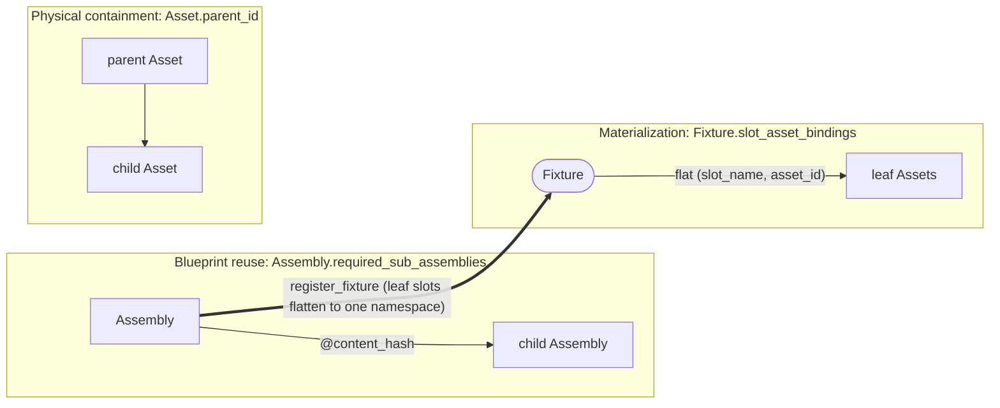
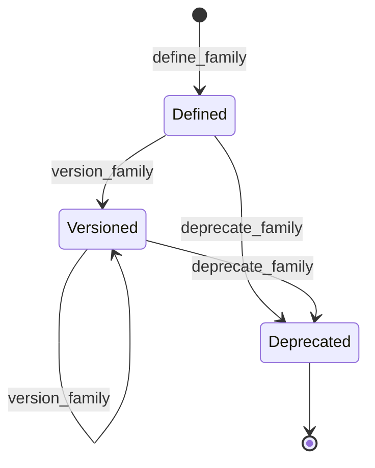
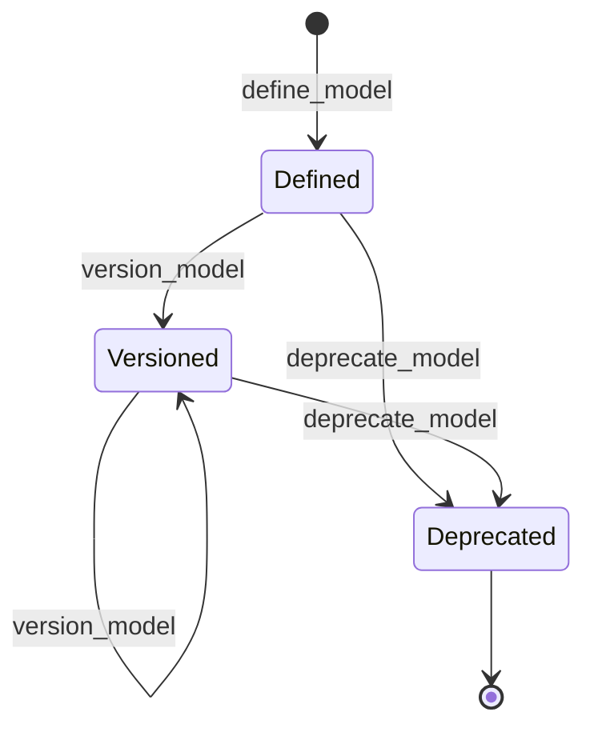
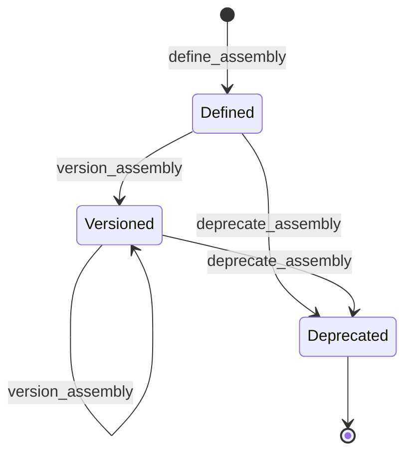
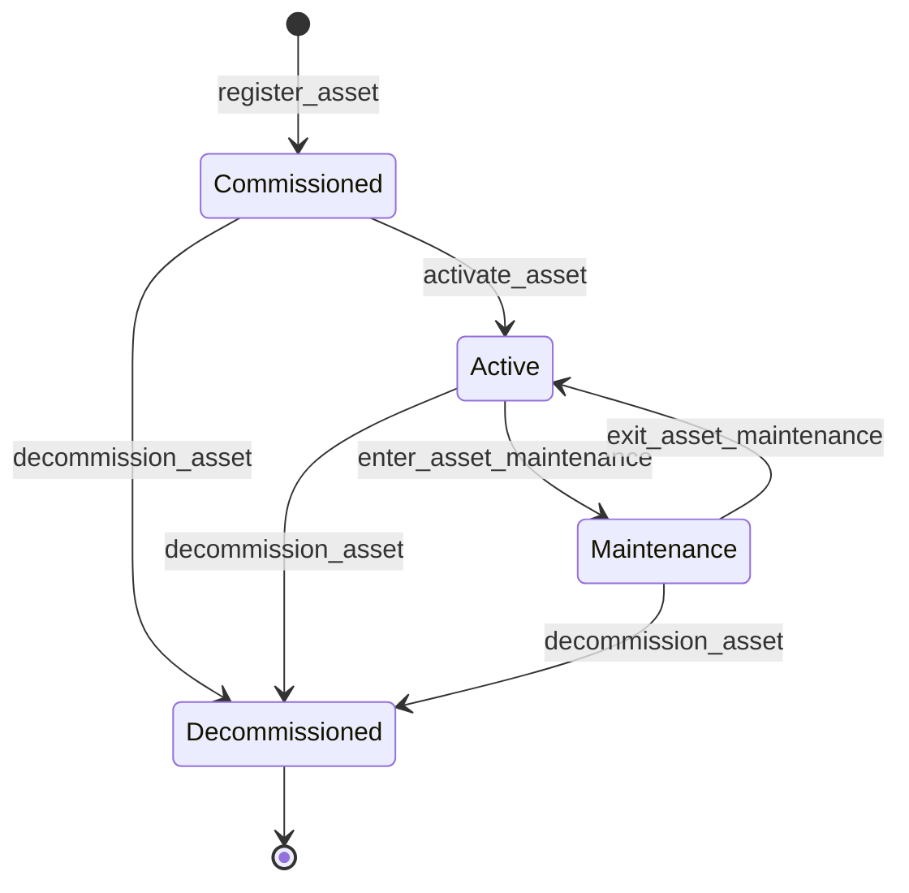
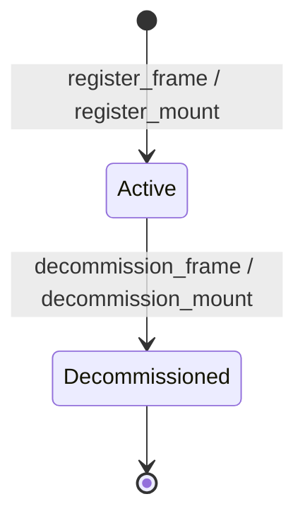

# Equipment module <span class="md-maturity md-maturity--stable" title="Eight aggregates, three-tier Asset structure, vendor catalog, composition blueprints, placement frames, global Role contracts, settings schema validation, typed ports">stable</span>

## Purpose & Scope

The Equipment module owns CORA's record of what physical devices the facility runs, how they are catalogued and composed, where they are mounted, and what operational state each one is in. <!-- arch:count kind=aggregate bc=equipment spell=true cap=true -->Eight<!-- /arch:count --> aggregates carry the responsibility. `Family` is the device-class abstraction (what kind of thing a rotary stage, camera, or scintillator is). `Asset` is one physical instance the facility commissions, maintains, moves, and eventually decommissions. `Model` is the vendor catalog entry that pins a manufacturer plus part number to a set of declared Families. `Mount` is a named installation slot the facility provisions in advance; an Asset is later installed into that slot. `Frame` is a coordinate frame in the placement hierarchy that Mounts use to anchor their position. `Assembly` is a reusable composition blueprint that declares a slot map and wiring for a cluster of Assets, and presents the cluster as a single Family. `Fixture` is the materialization of an Assembly into concrete Asset instances on a particular Trust Surface. `Role` is the global functional binding contract (Detector, Positioner, Controller, Sensor) that names WHAT operational shape a Method needs without pinning the anatomical Family that provides it; Families and Assemblies advertise which Roles they satisfy through a `presents_as` set.

Equipment is Foundation: every other module that needs to point at a specific piece of hardware references an `Asset.id`. The recipe ladder binds Methods to Assets through Plans, and a Method may now require not only Families but specific Assembly blueprints. Procedures target Assets. Calibrations key off an `Asset.id` plus a quantity. Supplies advertise resources whose physical delivery infrastructure lives as Assets. Trust groups Assets into Zones for security policy.

<div class="cora-aside cora-aside--deferred" markdown>

Out of scope
{: .cora-kicker }

- **High-frequency telemetry.** Motor positions during a scan, frame-trigger timestamps, sub-microsecond timing edges. Those are substream records keyed on the Run plus the Asset, not Asset state.
- **DataCite minting and the persistent-id write path.** The PIDINST serializer (`to_pidinst_record`) is shipped at the module root and reachable over HTTP / MCP through `get_asset_pidinst`. The DataCite mint surface that posts the serialized record, plus the slice that writes the resulting persistent id back onto Asset state, are deferred to follow-on slices.
- **Hierarchy descendant projection.** The asset-summary table answers direct-parent queries. Transitive-closure queries ("every device under this beamline") are deferred until the use case lands.
- **Per-Family settings-schema versioning history.** The current schema replaces the prior schema on every `update_family_settings_schema`; the event log carries the history, but no separate projection exposes "schema at time T".
- **Wiring at the Plan tier.** Which Asset port connects to which other Asset port across the whole experiment lives in `Plan.wiring` in the [Recipe](../recipe/index.md) module. Assembly carries the wiring that is INTRINSIC to one composition blueprint; Plan layers experiment-specific wiring on top.
- **Composite Family affordances.** An Assembly does not declare new affordances that only emerge from the composition; it presents through a single declared Family whose affordances are the contract. Composite-only affordances are reserved for a future revision when a real case appears.
- **AssetVariant tier.** Some traditions add a fourth rung (Family / Model / Variant / Asset) for configured-but-not-instantiated specialisations. CORA ships the three-rung Family / Model / Asset cluster today.

</div>

## Aggregates

| Name | Identity | State summary | FSM |
|---|---|---|---|
| `Family` | `id: UUID` | `id`, `name: FamilyName`, `status: FamilyStatus`, `version: str?`, `affordances: frozenset[Affordance]`, `presents_as: frozenset[RoleId]`, `settings_schema: dict?` | yes (3-state) |
| `Model` | `id: UUID` | `id`, `name`, `manufacturer: Manufacturer`, `part_number`, `declared_family_ids: frozenset[UUID]`, `status: ModelStatus`, `version: str?` | yes (3-state) |
| `Asset` | `id: UUID` | `id`, `name`, `tier`, `parent_id?`, `lifecycle`, `condition`, `family_ids: frozenset[UUID]`, `settings: dict`, `ports: frozenset[AssetPort]`, `model_id?`, `owners: frozenset[AssetOwner]`, `alternate_identifiers: frozenset[AlternateIdentifier]`, `fixture_id?`, `drawing?`, `commissioned_at?`, `decommissioned_at?`, `controller_id?`, `facility_code?` | yes (4-state lifecycle, 3-state condition) |
| `Frame` | `id: UUID` | `id`, `name`, `parent_id?`, `placement: Placement?`, `supersedes: FrameRevisionLink?`, `status` | yes (2-state) |
| `Mount` | `id: UUID` | `id`, `slot_code`, `parent_id?`, `placement: Placement`, `drawing?`, `installed_asset_id?`, `status` | yes (2-state) |
| `Assembly` | `id: UUID` | `id`, `name`, `presents_as: frozenset[RoleId]`, `required_slots: frozenset[TemplateSlot]`, `required_sub_assemblies: frozenset[SubAssemblyLink]`, `required_wires: frozenset[TemplateWire]`, `parameter_overrides_schema: dict?`, `drawing?`, `status: AssemblyStatus`, `version: str?`, `content_hash: str?` | yes (3-state) |
| `Fixture` | `id: UUID` | `id`, `assembly_id`, `assembly_content_hash`, `surface_id`, `slot_asset_bindings: frozenset[SlotAssetBinding]`, `parameter_overrides: dict`, `persistent_id?`, `registered_at` | no (genesis + set-once persistent-id assign) |
| `Role` | `id: RoleId` | `id`, `name: RoleName`, `docstring: str`, `required_affordances: frozenset[Affordance]`, `optional_affordances: frozenset[Affordance]`, `produces: frozenset[SignalType]`, `consumes: frozenset[SignalType]` | no (terminal at genesis; status implicit `Defined`) |

`Family` is the device-class abstraction: "RotaryStage", "Camera", "Hexapod", "Mirror", "TimingController". It carries the affordance set (what device-level primitives this class supports) and the JSON Schema that constrains the operational settings any Asset of that class may carry. `Model` is the vendor catalog entry that names a specific manufacturer plus part number and declares which Families that catalog row belongs to. `Asset` is one physical instance: a beamline, a detector, a sample changer. Assets form a single-parent tree through `parent_id`; an Asset may belong to multiple Families simultaneously, and each membership widens what the Asset's settings dict may contain. An Asset may optionally bind to a Model, in which case the Asset's family set must be a subset of the Model's declared families.

`Frame` and `Mount` add the placement axis the facility uses to provision physical space ahead of installation. A Frame is a named coordinate frame; Frames form a parent tree, and a child Frame carries its placement relative to its parent. A Mount is a named installation slot the facility provisions in advance, carries a 6-DoF placement relative to its parent Frame or Mount, and may eventually have an Asset installed into it. Slot codes are facility-unique across active Mounts.

`Assembly` and `Fixture` form a template-realization pair. An Assembly is a reusable composition blueprint that declares a slot map (which Families must occupy which named positions), an intra-cluster wiring map (which slot port connects to which other slot port), and an optional parameter-overrides schema. An Assembly may also compose smaller reusable Assemblies through `required_sub_assemblies`: each `SubAssemblyLink` includes a child Assembly in a named position, version-pinned at the child's `content_hash` (snapshot semantics, so a later child revision does not silently change a parent built today). At `register_fixture` time the child's own leaf slots expand into the parent's slot set (the union), so the materialization still binds only concrete Assets. The Assembly presents through a single declared Family for the purposes of Capability binding, even though the cluster contains several underlying Assets. A Fixture is the materialization of an Assembly into concrete Assets on a particular Trust Surface; the Fixture binds named slots to specific `Asset.id` values, freezes the Assembly's content hash at registration time for federation matching, and carries any parameter overrides applied at this materialization.

`Role` is the global functional binding contract: WHAT operational shape a Method needs (`Detector`, `Positioner`, `Controller`, `Sensor`) without pinning the anatomical Family that provides it. Role is a sister aggregate to Family, not a kind of Family: it carries its own registry, events, and identifier (`RoleId`). A Role is a lightweight contract, `required_affordances` plus `optional_affordances` plus `produces` plus `consumes` plus a `docstring`; it has no settings schema, no instances, and no ports. A Family or Assembly declares it satisfies a Role through `presents_as: frozenset[RoleId]`, and a Method binds a positional role slot to a Role through its `RoleRequirement` in the [Recipe](../recipe/index.md) module. `RoleId` values are uuid5-derived from a fixed namespace (`role_stream_id(name) = uuid5(_ROLE_NAMESPACE, name.value.lower())`, `_ROLE_NAMESPACE = uuid5(NAMESPACE_DNS, 'cora.role')`) so the same Role gets the same id across deployments, which federation portability requires. Four seed Roles (Detector, Positioner, Controller, Sensor) are auto-seeded at lifespan by `bootstrap_equipment`; defining a Role whose case-insensitive name collides with an existing one (a seed or any prior Role) returns `409 Conflict` via the deterministic stream id. Role ships no FSM today: status is implicit (`Defined`) on every Role, and the SiLA-2 FQN-terminal-major versioning slices are deferred until the first satisfaction-breaking affordance change forces them.

`Family` and `Model` ids follow the same deterministic scheme as `RoleId`, for the same federation-portability reason. `family_stream_id(name) = uuid5(_FAMILY_NAMESPACE, name.value.lower())`, so the same-named Family converges across facilities and a duplicate `define_family` collides on the deterministic stream, returning `409`. `model_stream_id(manufacturer, part_number)` derives a Model id as `uuid5` over a canonical `(lowercased manufacturer name, case-preserved part number)` key, so the same vendor product converges and a second `define_model` on the same real vendor key returns `409`. The one exception is the `unknown-pending-confirmation` placeholder part number: a Model recorded with it falls back to a random id, so two genuinely-unconfirmed units stay distinct rather than collapsing onto one identity. Uniqueness is enforced at the deterministic-stream tier (`expected_version=0`), not a projection unique index, so Family deliberately carries no `LOWER(name)` projection index (unlike Role's `proj_equipment_role_summary_name_lower_uq`): the deterministic stream id already makes a duplicate-name Family unreachable on the write path.

## Value Objects

| Name | Shape | Where used |
|---|---|---|
| `FamilyName` | trimmed string, 1-200 chars | `Family.name` |
| `FamilyStatus` | closed StrEnum: `Defined` \| `Versioned` \| `Deprecated` | `Family.status` |
| `Affordance` | closed StrEnum, ~28 values in three patterns (motion, signal, lifecycle) | members of `Family.affordances` |
| `AssetName` | trimmed string, 1-200 chars | `Asset.name` |
| `AssetTier` | closed StrEnum: `Unit` \| `Component` \| `Device` (ISA-88 equipment tiers) | `Asset.tier` (set once at registration, never mutated; the intrinsic-tier facet, orthogonal to the structural Facility binding) |
| `AssetLifecycle` | closed StrEnum: `Commissioned` \| `Active` \| `Maintenance` \| `Decommissioned` | `Asset.lifecycle` |
| `AssetCondition` | closed StrEnum: `Nominal` \| `Degraded` \| `Faulted` | `Asset.condition` |
| `AssetPort` | `(name, direction, signal_type)` triple; direction is `Input` \| `Output`; signal_type is free text, 1-50 chars | members of `Asset.ports` |
| `AssetOwner` | `(name, contact?, identifier?, identifier_type?)`; identifier and identifier_type are paired (both present or both absent) | members of `Asset.owners` |
| `AlternateIdentifier` | `(kind, value)`; kind is closed StrEnum `SerialNumber` \| `InventoryNumber` \| `Other` | members of `Asset.alternate_identifiers` |
| `Drawing` | `(system, number, revision?)`; system is closed StrEnum `ICMS` \| `EDMS` \| `DOI`; revision None means "latest" | `Asset.drawing`, `Mount.drawing`, `Assembly.drawing` |
| `FacilityCode` | trimmed slug `[a-z0-9-]{1,32}` from `cora.shared.facility_code`; cross-deployment convergent identity for the owning Federation Facility | `Asset.facility_code` (optional, set-once at register_asset; mirrors the Supply binding shape) |
| `Manufacturer` | `(name, identifier?, identifier_type?)`; identifier_type is closed StrEnum `ROR` \| `GRID` \| `ISNI` and is paired with identifier | `Model.manufacturer` |
| `ModelStatus` | closed StrEnum: `Defined` \| `Versioned` \| `Deprecated` | `Model.status` |
| `Placement` | 6-DoF rigid-body transform: `(translation_mm, rotation_deg)` where translation is `(x, y, z)` and rotation is `(rx, ry, rz)` extrinsic Tait-Bryan | `Frame.placement`, `Mount.placement` |
| `FrameRevisionLink` | `(previous_frame_id, reason)` audit pointer to the Frame this one supersedes | `Frame.supersedes` |
| `FrameStatus` | closed StrEnum: `Active` \| `Decommissioned` | `Frame.status` |
| `MountStatus` | closed StrEnum: `Active` \| `Decommissioned` | `Mount.status` |
| `AssemblyStatus` | closed StrEnum: `Defined` \| `Versioned` \| `Deprecated` | `Assembly.status` |
| `SlotName` | trimmed string, 1-50 chars, lowercase alphanumeric plus underscore | `TemplateSlot.slot_name`, `SlotAssetBinding.slot_name`, both endpoints of `TemplateWire` |
| `SlotCardinality` | closed StrEnum: `Exactly1` \| `ZeroOrOne` \| `OneOrMore` \| `ZeroOrMore` | `TemplateSlot.cardinality` |
| `TemplateSlot` | `(slot_name, required_family_ids, cardinality)` per-slot Family requirement | members of `Assembly.required_slots` |
| `TemplateWire` | `(source_slot, source_port, target_slot, target_port)` intra-Assembly wiring | members of `Assembly.required_wires` |
| `SubAssemblyLink` | `(slot_name, sub_assembly_id, content_hash)` version-pinned link to a child Assembly | members of `Assembly.required_sub_assemblies` |
| `SlotAssetBinding` | `(slot_name, asset_id)` materialization pair | members of `Fixture.slot_asset_bindings` |
| `RoleId` | `NewType` over `UUID`; uuid5-derived from a fixed namespace so a Role gets the same id across deployments; lives at `cora/equipment/aggregates/_value_types.py` | `Role.id`, members of `Family.presents_as` and `Assembly.presents_as` |
| `RoleName` | trimmed string, 1-200 chars | `Role.name` |
| `SignalType` | `NewType` over `str`; open-vocabulary label, trimmed 1-50 chars at decider time (matches `AssetPort.signal_type`) | members of `Role.produces`, `Role.consumes` |

The three `AssetTier` values are ISA-88 equipment tiers with single-word names. The tier is intrinsic to one Asset, set once at registration and never mutated; the decider does not enforce that a `Device` parents to a `Component`. Smart instruments with addressable sub-modules legitimately put a `Device` under another `Device`.

Facility-envelope scope (institution, site, area) is NOT a tier. It is owned by the Federation `Facility` aggregate, and an Asset binds its owning Facility through `Asset.facility_code` rather than through a tier value. The anchoring rule is XOR, enforced by the `register_asset` decider: a root Asset has `parent_id = None` and binds `facility_code`; a non-root Asset has a `parent_id` and does NOT bind `facility_code`, inheriting facility scope through the `parent_id` tree.

`AssetTier` is an intrinsic-shape label, not the aggregate ladder. The aggregate ladder (`Family`, `Model`, `Assembly`, `Fixture`, `Asset`) answers what kind of identity each row carries; `AssetTier` answers what equipment shape one registered Asset has. The two axes are orthogonal: a Family has no tier, a Fixture has no tier, only an Asset carries one. ISA-88 and ISA-95 readers should note that in those traditions the equipment hierarchy is the type ladder, but in CORA the two are kept apart.

Whether a composite vendor unit is one Asset with a wide settings dict or a parent Asset with several child Assets follows three tests. Any one is sufficient to spawn a child Asset:

- **Lifecycle independence.** The sub-component can be commissioned, swapped, or decommissioned without retiring the parent.
- **External addressability.** Another module needs to reference the sub-component by `asset_id`: `Plan.wiring`, `Calibration.target_id`, `Procedure.target_asset_ids`, `Caution.AssetTarget`, `Clearance.facility_asset_id`, `AssetBinding.asset_id`, Trust Zone membership, or Supply infrastructure linkage.
- **Settings-schema divergence.** The sub-component needs settings keys that would collide with the parent's, or that need independent write-and-validate cycles.

Addressability wins ties: if any other module references the sub-component by id, it is its own Asset. Per-component `Calibration` is the most common trigger at imaging beamlines (each lens position in a turret carries its own magnification calibration). Each Asset is its own event stream, so the choice is irreversible without a migration. A sub-component that fails all three is structural detail on the parent: a value in its `settings` dict or an entry in its `ports` set.

`AssetCondition` is orthogonal to `AssetLifecycle`. A Decommissioned Asset can be discovered Faulted on inventory check; an Active Asset can be Degraded without being pulled out of service. The two enums move independently through their own slices.

`AssetPort` declares what ports the equipment HAS. The connection between two ports lives in `Plan.wiring` for whole-experiment wiring, or in `Assembly.required_wires` for wiring that is intrinsic to a composition blueprint.

`AssetOwner` and `AlternateIdentifier` are sortable VOs whose ordering follows the field that uniquely keys them (`owner_name` for owners, `(kind, value)` for alternate identifiers). Both feed the PIDINST serializer (`to_pidinst_record` at the module root) that maps Asset state into the external PIDINST record shape, which the `get_asset_pidinst` slice exposes at `GET /assets/{asset_id}/pidinst`. The PIDINST property numbers are: 5 for owners, 13 for alternate identifiers.

`Assembly.content_hash` is a SHA-256 over the canonical serialization of the structural content (`name`, `presents_as`, `required_slots`, `required_wires`, `required_sub_assemblies`, `parameter_overrides_schema`); engineering metadata (drawing, version label) is intentionally excluded so two Assemblies with the same structural intent share a hash even when sourced from different facilities. A pinned child's `content_hash` is folded into the parent's, so a structural change deep in a composition ripples up one deliberate re-pin at a time. This cross-facility convergence holds because both the ids the hash folds in are deterministic: the Role ids in `presents_as` (the Role-contract set) come from `role_stream_id`, and each slot's `required_family_ids` come from `family_stream_id`, each deriving its id as `uuid5` over the lowercased name. So two facilities that define the same-named Role and the same-named Family arrive at the same ids and therefore the same hash. (Until these ids were made deterministic, the hash silently did NOT converge, the random per-facility ids broke it even though the canonical serialization was identical.) `Fixture.assembly_content_hash` snapshots that hash at registration time, decoupling the materialization from any later Assembly revision.

## Composition axes

Three mechanisms express "this is made of that", on three different layers, and they stay orthogonal:

- **Physical containment** lives on `Asset.parent_id`: a single-parent tree of real, deployed objects. The camera inside the microscope body is a child Asset of the body. This is where the genuine "what sits inside what" fact lives, and it nests to any depth (a `Device` may parent another `Device`).
- **Blueprint reuse** lives on `Assembly.required_sub_assemblies`: a parent blueprint can include a whole child blueprint (version-pinned) as a named position, so an `Optics` blueprint is authored once and reused across microscopes. One composing level is supported today: a child that itself declares sub-assemblies is rejected at `define_assembly` / `version_assembly` time (the same limit `register_fixture` enforces), so a defined Assembly is always instantiable. Because a non-leaf child is refused, an A-includes-B-includes-A indirect cycle is also impossible for the two-node case. Deeper nesting is deferred until a real case appears.
- **Materialization** lives on `Fixture.slot_asset_bindings`: a flat set of `(slot_name, asset_id)` pairs. At `register_fixture` the parent blueprint's leaf slots and every child blueprint's leaf slots expand into ONE flat namespace, so the Fixture binds only concrete leaf Assets. Leaf slot names must therefore be unique across a composition; a clash is rejected at authoring time rather than at the end of the install-then-register choreography.

The three axes at a glance:



The materialization stays flat on purpose. Everything that points at equipment (a `Calibration`, a `Plan.wiring` entry, a `Caution`, a Trust Zone) wants the real leaf Asset directly; the PIDINST owners and manufacturers record is the honest union over those leaves; and the physical "inside what" fact is already carried by `Asset.parent_id`. A nested-Fixture tree would duplicate that fact and complicate every reader.

The split between the type side and the instance side is deliberate. `Assembly` (a composite blueprint) earns its own materialization aggregate, `Fixture`, because a materialization carries state of its own: the slot bindings, the parameter overrides, and the content-hash snapshot. `Model` (a single-device catalog entry) does NOT get a separate instance aggregate, because a model-realization carries no state beyond a pointer: an Asset simply sets `model_id`. For the same reason `Model` does not compose; a catalog row is atomic. A composite vendor product, a bundle SKU whose sub-SKUs operators reference as a unit, would be modeled as an Assembly, not as a `Model` of sub-Models. A future `Model.sub_models` tier that flattened at the Asset tier (symmetric with `Assembly.sub_assemblies`) is deferred behind a rule-of-three trigger.

## Family naming conventions

Family names are cross-facility vocabulary. Three conventions are load-bearing today:

### Anatomical names, not vendor or hardware-substrate names

A Family names what something IS, device-agnostic across facilities. `Camera`, `Mirror`, `Scintillator`, `Hexapod` are anatomical. Vendor designations live in `Asset.metadata.vendor_designation` and on the bound `Model` row; they never enter the Family name. Hardware-substrate names (FPGA, VME card, PCIe board, the chip technology behind the function) likewise stay out of the Family name. A `MotionController` Family covers an Aerotech Ensemble drive, an Oregon Micro Systems VME58 card, and a hypothetical PCIe servo board with equal honesty; the substrate distinction lives in `MotionController.settings.protocol` or on the bound `Model`. The same convention rules out names like `TriggerFPGA`: the role is timing-signal generation and distribution, not "FPGA"; the right Family name is `TimingController`.

### `<Domain>Controller` for separately-modelled active-control electronics

Any field-replaceable, firmware-versioned active-control-electronics box gets a `<Domain>Controller` Family with a `<stage>.controller_id` back-reference from the driven stage. Two `<Domain>Controller` Families are anchored today:

| Family | Drives | Anchored at |
|---|---|---|
| `MotionController` | Stages, hexapods, sample motors | Aerotech Ensemble (`RotaryDrive`), Aerotech Hexapod drive, Aerotech 2bmbAERO drive, OMS VME58 a-station + b-station drives at 2-BM |
| `TimingController` | Hardware timing signal generation (triggers, gates, sync pulses) | softGlueZynq FPGA (`Timing`) at 2-BM; further trigger sources to follow. Replaces the pre-rename `TriggerFPGA` candidate. Presents_as `Controller`, which carries `Pulsing`. |

Plausible siblings that have NOT yet earned a slot (rule-of-three): `TemperatureController` (Lakeshore cryostats), `FlowController` (Bronkhorst mass flow), `PressureController` (MKS Baratron + PID), `DAQController` (Quantum Detectors Merlin, FPGA frame grabbers), `HVPSU` / `BiasController` (CAEN HV crate). Each lands per its own trigger. The convention is suffix-LAST per the locked R3 family-noun primacy rule.

### Function × anatomy matrix

A useful cross-check on Family naming and gap detection: the function-and-anatomy matrix collects each Family by what it DOES (operational role) and what it IS (substrate). Empty cells are either real gaps or evidence the axes need refinement; cross-anatomy entries flag Families that straddle two substrates.

|              | **Optical**                                   | **Mechanical**                                    | **Electronic**                          | **Composite (Assembly)** |
|--------------|-----------------------------------------------|----------------------------------------------------|-----------------------------------------|--------------------------|
| **Defining** | -                                             | Mask, Slit, Collimator, Baffle                     | -                                       | Slits-with-Filters       |
| **Modifying**| Mirror, Monochromator, Filter, Window         | Foil                                               | -                                       | DMM                      |
| **Sensing**  | Camera, Scintillator, Objective               | -                                                  | -                                       | Microscope (presents_as Detector) |
| **Positioning** | -                                          | LinearStage, RotaryStage, Hexapod, Blade, PseudoAxis | -                                     | SampleStack              |
| **Terminating** | -                                          | BeamStop                                           | Shutter                                 | -                        |
| **Controlling** | -                                          | -                                                  | MotionController, TimingController, `<Domain>Controller` siblings | - |
| **Containing** | Window                                       | BeamPipe, Housing                                  | -                                       | -                        |

`Window` straddles Modifying + Containing (attenuates AND bounds vacuum); `Shutter` straddles Electronic + Mechanical (electromechanical). Both are intentional single-Family typings today; either may split if a future use case forces it. The matrix is the operator-side companion to the beam-path inventory in `docs/deployments/<id>/assets.md`.

## FSM

The Family, Model, and Assembly aggregates run a shared three-state lifecycle (Defined / Versioned / Deprecated). Asset runs a four-state lifecycle plus an orthogonal three-state condition. Frame and Mount each run a two-state lifecycle (Active / Decommissioned). Fixture has no FSM: a Fixture is registered in a genesis event and can later have a persistent identifier assigned once; otherwise it is never updated, and if a materialization needs to change, a new Fixture is registered against the same Assembly. Role also has no FSM today: it is terminal at genesis with status implicit (`Defined`), and the versioning slices that would add a Versioned / Deprecated lifecycle are deferred.

### Family



| From | To | Command | Event |
|---|---|---|---|
| `[*]` | `Defined` | `define_family` | `FamilyDefined` |
| `Defined` | `Versioned` | `version_family` | `FamilyVersioned` |
| `Versioned` | `Versioned` | `version_family` | `FamilyVersioned` |
| `Defined` | `Deprecated` | `deprecate_family` | `FamilyDeprecated` |
| `Versioned` | `Deprecated` | `deprecate_family` | `FamilyDeprecated` |

### Model



| From | To | Command | Event |
|---|---|---|---|
| `[*]` | `Defined` | `define_model` | `ModelDefined` |
| `Defined` | `Versioned` | `version_model` | `ModelVersioned` |
| `Versioned` | `Versioned` | `version_model` | `ModelVersioned` |
| `Defined` | `Deprecated` | `deprecate_model` | `ModelDeprecated` |
| `Versioned` | `Deprecated` | `deprecate_model` | `ModelDeprecated` |

### Assembly



| From | To | Command | Event |
|---|---|---|---|
| `[*]` | `Defined` | `define_assembly` | `AssemblyDefined` |
| `Defined` | `Versioned` | `version_assembly` | `AssemblyVersioned` |
| `Versioned` | `Versioned` | `version_assembly` | `AssemblyVersioned` |
| `Defined` | `Deprecated` | `deprecate_assembly` | `AssemblyDeprecated` |
| `Versioned` | `Deprecated` | `deprecate_assembly` | `AssemblyDeprecated` |

### Asset



| From | To | Command | Event |
|---|---|---|---|
| `[*]` | `Commissioned` | `register_asset` | `AssetRegistered` |
| `Commissioned` | `Active` | `activate_asset` | `AssetActivated` |
| `Active` | `Maintenance` | `enter_asset_maintenance` | `AssetMaintenanceEntered` |
| `Maintenance` | `Active` | `exit_asset_maintenance` | `AssetMaintenanceExited` |
| `Commissioned` | `Decommissioned` | `decommission_asset` | `AssetDecommissioned` |
| `Active` | `Decommissioned` | `decommission_asset` | `AssetDecommissioned` |
| `Maintenance` | `Decommissioned` | `decommission_asset` | `AssetDecommissioned` |

Condition transitions move from any source to a fixed target through three slices: `degrade_asset` lands on `Degraded`, `fault_asset` lands on `Faulted`, `restore_asset` lands on `Nominal`. Condition transitions are allowed in any lifecycle state (including Decommissioned) so the model stays honest about device-state-in-storage.

### Frame and Mount



| Aggregate | From | To | Command | Event |
|---|---|---|---|---|
| `Frame` | `[*]` | `Active` | `register_frame` | `FrameRegistered` |
| `Frame` | `Active` | `Decommissioned` | `decommission_frame` | `FrameDecommissioned` |
| `Mount` | `[*]` | `Active` | `register_mount` | `MountRegistered` |
| `Mount` | `Active` | `Decommissioned` | `decommission_mount` | `MountDecommissioned` |

**Guards.** Beyond the source-state check, several slices enforce cross-state and cross-aggregate invariants:

`relocate_asset`
: The target parent is not the Asset itself (no single-element cycle). The target parent differs from the current parent (no-op rejection). Root Assets cannot relocate (a root has `parent_id = None` and binds `facility_code`). Decommissioned Assets cannot relocate. Cycle detection beyond the trivial self-loop case is deferred.

`add_asset_family` / `remove_asset_family`
: The Asset is not Decommissioned. The Family id is not already present (or is present, for remove). When the Asset has a `model_id` set, the resulting `family_ids` set must remain a subset of `Model.declared_family_ids` (cross-aggregate subset invariant; raises `AssetModelMismatchError` otherwise). The referenced Family is not verified to exist in the Family event stream at write time, matching the eventual-consistency stance on cross-aggregate references.

`add_asset_port` / `remove_asset_port`
: The Asset is not Decommissioned. The port name is not already present (or is present, for remove). Port-name uniqueness is enforced Asset-wide.

`update_asset_settings`
: The proposed settings dict is validated against the union of currently-assigned Families' `settings_schema` declarations. Orphan keys (not declared by any assigned Family) are rejected. Conflicts between two Families that declare the same key with incompatible types are rejected. PATCH semantics follow RFC 7396 merge.

`attach_asset_to_fixture` / `detach_asset_from_fixture`
: Attach sets `Asset.fixture_id` and fails if the Asset is already attached elsewhere or if the target Fixture does not list this Asset in its `slot_asset_bindings`. Detach clears `Asset.fixture_id` and defensively requires the caller to pass the expected current `fixture_id`. Both transitions are lifecycle-agnostic so a Decommissioned Asset can still be unbound.

`add_asset_owner` / `remove_asset_owner` / `add_asset_alternate_identifier` / `remove_asset_alternate_identifier`
: The Asset is not Decommissioned. Owners are keyed on `owner_name`; alternate identifiers are keyed on `(kind, value)`. Strict-not-idempotent: re-adding the same key raises, removing an absent key raises.

`decommission_frame`
: The Frame has no active consumers. A consumer is any Mount whose `placement` references this Frame or any child Frame whose `parent_id` is this Frame. Raises `FrameInUseError` listing the offending consumers.

`decommission_mount`
: The Mount has no Asset currently installed (`installed_asset_id` is NULL). The Mount has no active child Mounts whose `parent_id` references this Mount. Raises `MountHasAssetInstalledError` or `MountHasActiveChildrenError`.

`install_asset` / `uninstall_asset`
: Install sets `Mount.installed_asset_id` and fails if the Mount is already occupied, the Asset does not exist, the Asset is Decommissioned, or the Asset is already installed in any other active Mount. Uninstall clears the slot and fails if the Mount is already empty.

`define_assembly` / `version_assembly`
: the presented Role ids in `presents_as` are verified against the Role registry at the handler edge (an unknown id raises Role not found), and each slot's `required_family_ids` are verified as Families that exist in the Equipment module (via a cross-aggregate load). Every `TemplateWire.source_slot` and `TemplateWire.target_slot` matches a `TemplateSlot.slot_name` declared on the same Assembly. The decider captures the canonical `content_hash` from the new structural content; re-versioning with identical content yields the same hash by design.

`register_fixture`
: Every required slot in the Assembly is covered by exactly one `SlotAssetBinding` whose `asset_id` references an Asset whose `family_ids` includes the slot's required Family. When the Assembly references sub-assemblies, the validated slot set is the union of the Assembly's own leaf slots and each referenced sub-assembly's leaf slots (one composing level deep); a slot name that appears in both is rejected as a collision, and each `SubAssemblyLink`'s pinned `content_hash` is re-checked against the child Assembly's current hash. The Assembly is in `Defined` or `Versioned` (not `Deprecated`). Every bound Asset must not be `Decommissioned` (a terminal lifecycle disallows attachment) and must currently be installed in some Mount (so the choreography is `install_asset` -> `register_fixture`, never the reverse). The Fixture's `surface_id` is read from the caller's authenticated Trust Surface; the Fixture is bound to that Surface for authorization scoping.

`add_model_family` / `remove_model_family`
: The Model is not Deprecated. The Family id is not already present (or is present, for remove). The referenced Family must exist in the Family event stream (verified at decide time via load).

## Events

The <!-- arch:count kind=aggregate bc=equipment spell=true -->eight<!-- /arch:count --> aggregates emit <!-- arch:count kind=event bc=equipment spell=true -->forty-eight<!-- /arch:count --> distinct event types, grouped by aggregate.

### Family events

| Event | Payload sketch | When emitted |
|---|---|---|
| `FamilyDefined` | `family_id`, `name`, `affordances`, `occurred_at` | `define_family` succeeds (genesis) |
| `FamilyVersioned` | `family_id`, `version_tag`, `affordances`, `occurred_at` | `version_family` succeeds; affordance set is the replacement declared at this version |
| `FamilyDeprecated` | `family_id`, `occurred_at` | `deprecate_family` succeeds |
| `FamilySettingsSchemaUpdated` | `family_id`, `settings_schema?`, `occurred_at` | `update_family_settings_schema` succeeds; payload carries the full replacement schema |
| `FamilyPresentsAsAdded` | `family_id`, `role_id`, `occurred_at` | `add_family_presents_as` succeeds; the Family advertises one additional Role contract |
| `FamilyPresentsAsRemoved` | `family_id`, `role_id`, `occurred_at` | `remove_family_presents_as` succeeds; the Family withdraws one previously-advertised Role |

### Model events

| Event | Payload sketch | When emitted |
|---|---|---|
| `ModelDefined` | `model_id`, `name`, `manufacturer`, `part_number`, `declared_family_ids`, `occurred_at` | `define_model` succeeds (genesis) |
| `ModelVersioned` | `model_id`, `version_tag`, `manufacturer`, `part_number`, `declared_family_ids`, `occurred_at` | `version_model` succeeds |
| `ModelDeprecated` | `model_id`, `reason?`, `occurred_at` | `deprecate_model` succeeds |
| `ModelFamilyAdded` | `model_id`, `family_id`, `occurred_at` | `add_model_family` succeeds |
| `ModelFamilyRemoved` | `model_id`, `family_id`, `occurred_at` | `remove_model_family` succeeds |

### Asset events

| Event | Payload sketch | When emitted |
|---|---|---|
| `AssetRegistered` | `asset_id`, `name`, `tier`, `parent_id?`, `model_id?`, `facility_code?`, `owners`, `occurred_at` | `register_asset` succeeds (genesis); a root Asset carries `facility_code` and no `parent_id`, a non-root Asset carries `parent_id` and no `facility_code`; optional `model_id` and seed `owners` may be carried |
| `AssetActivated` | `asset_id`, `occurred_at` | `activate_asset` succeeds |
| `AssetMaintenanceEntered` | `asset_id`, `occurred_at` | `enter_asset_maintenance` succeeds |
| `AssetMaintenanceExited` | `asset_id`, `occurred_at` | `exit_asset_maintenance` succeeds |
| `AssetDecommissioned` | `asset_id`, `occurred_at` | `decommission_asset` succeeds from any of the three permitted lifecycles |
| `AssetRelocated` | `asset_id`, `from_parent_id?`, `to_parent_id`, `reason`, `occurred_at` | `relocate_asset` succeeds; payload carries both source and target for audit |
| `AssetFamilyAdded` | `asset_id`, `family_id`, `occurred_at` | `add_asset_family` succeeds |
| `AssetFamilyRemoved` | `asset_id`, `family_id`, `occurred_at` | `remove_asset_family` succeeds |
| `AssetPortAdded` | `asset_id`, `port_name`, `direction`, `signal_type`, `occurred_at` | `add_asset_port` succeeds |
| `AssetPortRemoved` | `asset_id`, `port_name`, `occurred_at` | `remove_asset_port` succeeds |
| `AssetSettingsUpdated` | `asset_id`, `settings`, `occurred_at` | `update_asset_settings` succeeds; payload carries the post-merge settings dict |
| `AssetDegraded` | `asset_id`, `reason`, `occurred_at` | `degrade_asset` succeeds; `reason` is operator free text (for example "hot pixel detected") |
| `AssetFaulted` | `asset_id`, `reason`, `occurred_at` | `fault_asset` succeeds |
| `AssetRestored` | `asset_id`, `reason`, `occurred_at` | `restore_asset` succeeds |
| `AssetOwnerAdded` | `asset_id`, `owner` (full AssetOwner VO), `occurred_at` | `add_asset_owner` succeeds |
| `AssetOwnerRemoved` | `asset_id`, `owner_name`, `occurred_at` | `remove_asset_owner` succeeds |
| `AssetAlternateIdentifierAdded` | `asset_id`, `alternate_identifier` (full VO), `occurred_at` | `add_asset_alternate_identifier` succeeds |
| `AssetAlternateIdentifierRemoved` | `asset_id`, `alternate_identifier`, `occurred_at` | `remove_asset_alternate_identifier` succeeds; payload carries the full removed VO for audit |
| `AssetAttachedToFixture` | `asset_id`, `fixture_id`, `occurred_at` | `attach_asset_to_fixture` succeeds; sets the back-reference |
| `AssetDetachedFromFixture` | `asset_id`, `previous_fixture_id`, `occurred_at` | `detach_asset_from_fixture` succeeds; clears the back-reference, carrying the prior id for audit |
| `AssetFacilityCodeAssigned` | `asset_id`, `facility_code`, `occurred_at`, `assigned_by` | `bind_asset_to_facility` succeeds; sets the post-genesis Facility binding (set-once per Slice 8 Lock L2; rebind requires decommission + re-register) |

### Frame events

| Event | Payload sketch | When emitted |
|---|---|---|
| `FrameRegistered` | `frame_id`, `name`, `parent_id?`, `placement?`, `supersedes?`, `occurred_at` | `register_frame` succeeds (genesis); a root Frame omits parent and placement |
| `FramePlacementUpdated` | `frame_id`, `placement`, `occurred_at` | `update_frame_placement` succeeds |
| `FrameDecommissioned` | `frame_id`, `occurred_at` | `decommission_frame` succeeds |

### Mount events

| Event | Payload sketch | When emitted |
|---|---|---|
| `MountRegistered` | `mount_id`, `slot_code`, `parent_id?`, `placement`, `drawing?`, `occurred_at` | `register_mount` succeeds (genesis) |
| `MountPlacementUpdated` | `mount_id`, `placement`, `occurred_at` | `update_mount_placement` succeeds |
| `MountAssetInstalled` | `mount_id`, `asset_id`, `occurred_at` | `install_asset` succeeds |
| `MountAssetUninstalled` | `mount_id`, `previous_asset_id`, `occurred_at` | `uninstall_asset` succeeds |
| `MountDecommissioned` | `mount_id`, `occurred_at` | `decommission_mount` succeeds |

### Assembly events

| Event | Payload sketch | When emitted |
|---|---|---|
| `AssemblyDefined` | `assembly_id`, `name`, `presents_as`, `required_slots`, `required_sub_assemblies`, `required_wires`, `parameter_overrides_schema?`, `drawing?`, `content_hash`, `occurred_at` | `define_assembly` succeeds (genesis) |
| `AssemblyVersioned` | `assembly_id`, `version_tag`, `required_slots`, `required_sub_assemblies`, `required_wires`, `parameter_overrides_schema?`, `drawing?`, `content_hash`, `occurred_at` | `version_assembly` succeeds; payload carries the replacement structural content |
| `AssemblyDeprecated` | `assembly_id`, `occurred_at` | `deprecate_assembly` succeeds |
| `AssemblyPresentsAsAdded` | `assembly_id`, `role_id`, `occurred_at` | `add_assembly_presents_as` succeeds; the Assembly advertises one additional Role contract |
| `AssemblyPresentsAsRemoved` | `assembly_id`, `role_id`, `occurred_at` | `remove_assembly_presents_as` succeeds; the Assembly withdraws one previously-advertised Role |

### Fixture events

| Event | Payload sketch | When emitted |
|---|---|---|
| `FixtureRegistered` | `fixture_id`, `assembly_id`, `assembly_content_hash`, `surface_id`, `slot_asset_bindings`, `parameter_overrides`, `occurred_at` | `register_fixture` succeeds (genesis) |
| `FixturePersistentIdAssigned` | `fixture_id`, `persistent_id_scheme`, `persistent_id_value`, `occurred_at` | `assign_fixture_persistent_id` succeeds; set-once at the aggregate level |

### Role events

| Event | Payload sketch | When emitted |
|---|---|---|
| `RoleDefined` | `role_id`, `name`, `docstring`, `required_affordances`, `optional_affordances`, `produces`, `consumes`, `occurred_at` | `define_role` succeeds (genesis); the only Role event today, status is implicit `Defined` |

`AssetRelocated` is the only event in the Equipment module that carries source state in its payload, because `parent_id` is a mutable value across many possible prior states rather than a discrete enum. `AssetDetachedFromFixture` and `MountAssetUninstalled` follow the same pattern for their respective back-references. `Assembly` versioning events carry the full replacement structural content so a downstream consumer can fold to the post-version state without loading the prior version.

## Slices

The <!-- arch:count kind=aggregate bc=equipment spell=true -->eight<!-- /arch:count --> aggregates expose <!-- arch:count kind=slice bc=equipment spell=true -->fifty-six<!-- /arch:count --> slices end to end.

<!-- arch:slices-table bc=equipment -->
_Generated from the code at build time._
<!-- /arch:slices-table -->

**Errors per slice.** Beyond Pydantic boundary 422s, each slice raises:

`DefineFamily`
: `InvalidFamilyName`, `FamilyAlreadyExists`, `Unauthorized`

`VersionFamily` / `DeprecateFamily`
: `FamilyNotFound`, `FamilyCannotVersion` / `FamilyCannotDeprecate`, `InvalidFamilyVersionTag` (version only), `Unauthorized`

`UpdateFamilySettingsSchema`
: `FamilyNotFound`, `InvalidFamilySettingsSchema`, `Unauthorized`

`AddFamilyPresentsAs` / `RemoveFamilyPresentsAs`
: `FamilyNotFound`, `RoleNotFound` (add only, the `role_id` does not resolve via `RoleLookup`), `FamilyCannotPresentAs` (add only, `Family.affordances` does not superset the Role's `required_affordances`), `FamilyRolePresentsAsAlready` (add only) / `FamilyRolePresentsAsNotPresent` (remove only), `Unauthorized`

`DefineModel`
: `InvalidModelName`, `ModelAlreadyExists`, `InvalidDeclaredFamilies`, `FamilyNotFound`, `Unauthorized`

`VersionModel` / `DeprecateModel`
: `ModelNotFound`, `ModelCannotVersion` / `ModelCannotDeprecate`, `InvalidDeclaredFamilies` (version only), `Unauthorized`

`AddModelFamily` / `RemoveModelFamily`
: `ModelNotFound`, `ModelCannotAddFamily` / `ModelCannotRemoveFamily`, `ModelFamilyAlreadyPresent` / `ModelFamilyNotPresent`, `FamilyNotFound` (add only), `Unauthorized`

`RegisterAsset`
: `InvalidAssetName`, `InvalidAssetParent` (the XOR anchoring rule is violated: a root Asset that supplies a `parent_id`, or a non-root Asset that supplies `facility_code` instead of a `parent_id`), `AssetAlreadyExists`, `ModelNotFound`, `AssetOwnerAlreadyPresent` (seed owners with duplicate names), `AssetFacilityNotFound` (facility_code supplied but the Facility is not visible in the Federation projection; Slice 8A binding), `Unauthorized`

`ActivateAsset` / `EnterAssetMaintenance` / `ExitAssetMaintenance` / `DecommissionAsset`
: `AssetNotFound`, `AssetCannot<Activate|EnterMaintenance|ExitMaintenance|Decommission>`, `Unauthorized`

`RelocateAsset`
: `AssetNotFound`, `AssetCannotRelocate` (root Asset, Decommissioned, self-loop, or no-op), `Unauthorized`

`AddAssetFamily` / `RemoveAssetFamily`
: `AssetNotFound`, `AssetCannotAddFamily` / `AssetCannotRemoveFamily` (Decommissioned, or duplicate-add / missing-remove), `AssetModelMismatch` (add only, when Model is bound and the new family set escapes `Model.declared_family_ids`), `ModelNotFound` (add only, when the Asset's `model_id` no longer resolves), `Unauthorized`

`AddAssetPort` / `RemoveAssetPort`
: `AssetNotFound`, `AssetCannotAddPort` / `AssetCannotRemovePort` (Decommissioned, or duplicate-add / missing-remove), `InvalidAssetPortName` / `InvalidAssetPortSignalType` (add only), `Unauthorized`

`UpdateAssetSettings`
: `AssetNotFound`, `InvalidAssetSettings` (orphan key, schema violation, or cross-Family conflict), `Unauthorized`

`DegradeAsset` / `FaultAsset` / `RestoreAsset`
: `AssetNotFound`, `Unauthorized`

`AddAssetOwner` / `RemoveAssetOwner` / `AddAssetAlternateIdentifier` / `RemoveAssetAlternateIdentifier`
: `AssetNotFound`, `AssetCannotAddOwner` / `AssetCannotAddAlternateIdentifier` (Decommissioned), `AssetOwnerAlreadyPresent` / `AssetOwnerNotPresent` / `AssetAlternateIdentifierAlreadyPresent` / `AssetAlternateIdentifierNotPresent`, `Unauthorized`

`AttachAssetToFixture` / `DetachAssetFromFixture`
: `AssetNotFound`, `FixtureNotFound` (attach only), `AssetAlreadyAttachedToFixture` (attach only), `AssetCannotAttachToFixture` (attach only, Asset is Decommissioned), `AssetNotBoundInFixture` (attach only, Asset is not listed in the Fixture's slot bindings), `AssetNotAttachedToFixture` (detach only), `AssetAttachedToDifferentFixture` (detach only, defensive id mismatch), `Unauthorized`

`BindAssetToFacility`
: `AssetNotFound`, `AssetFacilityNotFound` (facility_code supplied but the Facility is not visible in the Federation projection), `AssetFacilityCodeAlreadyAssigned` (set-once per Slice 8 Lock L2: the target Asset already carries a facility_code from register_asset genesis OR a prior bind_asset_to_facility call; rebind path is decommission + re-register), `Unauthorized`

`RegisterFrame` / `UpdateFramePlacement` / `DecommissionFrame`
: `FrameAlreadyExists` (register only), `FrameNotFound` (update / decommission), `FrameCannotSupersede` (register only, supersedes pointer not in Active), `InvalidFrameRoot` (register or update; root Frame placement / parent constraint), `FrameCannotUpdate` (Decommissioned), `FrameCannotDecommission` (Decommissioned), `FrameInUse` (decommission only, active consumers exist), `Unauthorized`

`RegisterMount` / `UpdateMountPlacement` / `InstallAsset` / `UninstallAsset` / `DecommissionMount`
: `MountAlreadyExists` (register only), `MountNotFound`, `MountCannotUpdate` (Decommissioned), `MountAlreadyOccupied` (install only), `MountIsEmpty` (uninstall only), `MountHasAssetInstalled` (decommission only), `MountHasActiveChildren` (decommission only), `MountCannotDecommission` (Decommissioned), `AssetNotFoundForMount` (install only), `AssetNotInstallable` (install only, Asset is Decommissioned), `AssetAlreadyInstalledElsewhere` (install only, Asset is in another active Mount), `Unauthorized`

`DefineAssembly` / `VersionAssembly` / `DeprecateAssembly`
: `AssemblyAlreadyExists` (define only), `AssemblyNotFound`, `AssemblyCannotVersion` / `AssemblyCannotDeprecate`, `FamilyNotFoundForAssembly` (define / version, when a slot's `required_family_ids` references a missing Family), Role not found (define / version / amend, when an id in `presents_as` references a missing Role), `WireReferencesUnknownSlot` (define / version, when a TemplateWire endpoint cites a slot the same Assembly does not declare), `Unauthorized`

`AddAssemblyPresentsAs` / `RemoveAssemblyPresentsAs`
: `AssemblyNotFound`, `RoleNotFound` (add only, the `role_id` does not resolve via `RoleLookup`), `AssemblyRolePresentsAsAlready` (add only) / `AssemblyRolePresentsAsNotPresent` (remove only), `Unauthorized`. No affordance-superset check at the template tier: Assembly affordances derive from the constituent Family union at `register_fixture` time.

`RegisterFixture`
: `AssemblyNotFound`, `AssemblyCannotInstantiate` (Assembly is Deprecated), `FixtureAlreadyExists`, `FixtureAssetNotFound` (a binding references a missing Asset), `FixtureAssetNotAttachable` (a binding's Asset is Decommissioned), `FixtureAssetNotInstalled` (a binding's Asset is not currently installed in any Mount), `FixtureAssetFamilyMismatch` (a binding's Asset does not include the slot's required Family in its `family_ids`), `FixtureMappingIncomplete` (a required slot has no covering binding), `Unauthorized`

`DefineRole`
: `InvalidRoleName`, `InvalidRoleDocstring`, `RoleAffordanceOverlap` (required and optional Affordance sets are not disjoint), `InvalidSignalType` (a `produces` / `consumes` entry is empty or too long), `RoleAlreadyExists` (a Role with the same case-insensitive name already exists, including the four auto-seeded Roles), `Unauthorized`

`GetFamily` / `GetModel` / `GetAsset` / `GetAssetIntegrationView` / `GetFixture`
: `<X>NotFound`

`GetAssetPidinst`
: `AssetNotFound`, `PidinstSerializationError` (and its subclasses: `AssetNameMissing`, `LandingPageMissing`, `OwnerStateNotAvailable`, `ManufacturerStateNotAvailable`, `PidinstRecordInvariant`)

`ListFamilies` / `ListAssets` / `ListFixtures`
: (boundary 422 only)

`GetAssetIntegrationView` is a read-time composition slice that joins the Asset's current state with the schema declarations of its assigned Families, the Capabilities those Families' affordances satisfy, and the active Cautions targeting the Asset. The composition runs at query time; there is no integration-view projection today. The view is the read-side primitive that integration code (a control-system adapter, a measurement broker) uses to discover "what can this Asset actually do". The response carries `asset_id`, `name`, `tier`, `lifecycle`, `condition`, `parent_id`, `families` (each with its settings schema), `ports`, `settings`, `active_cautions`, `applicable_capabilities`, and an `incomplete` boolean that flags partial composition when a referenced Family failed to load (eventual-consistency tolerance).

`GetAssetPidinst` is a read-time serializer slice at `GET /assets/{asset_id}/pidinst`. A feature-local view assembler loads the Asset, its bound `Model`, the Families behind the Model, the Asset's owners, and its alternate identifiers, then hands the assembled view to the `to_pidinst_record` pure function at the module root (`_pidinst_serializer.py` plus `_pidinst_types.py`). The response body is the PIDINST record shape used by external persistent-identifier registries, returned directly so a downstream caller can post it to DataCite or another mint surface without further transformation. Errors map: `AssetNotFound` to 404, `PidinstRecordInvariant` to 422 (the assembled view violated a PIDINST schema invariant), the four pre-construction subclasses (`AssetNameMissing`, `LandingPageMissing`, `OwnerStateNotAvailable`, `ManufacturerStateNotAvailable`) to 409 (the input view was loaded but failed serializer preconditions), and any unexpected failure to 500.

## Cross-aggregate invariants

The Mount, Fixture, and Asset aggregates compose to answer two different questions about a single piece of equipment: Mount answers "where is this Asset bolted in the beamline" (one physical bay, one Asset, a 6-DoF pose, mutable across re-installs), and Fixture answers "which Assets compose this Assembly recipe on this Trust Surface" (one snapshot, N Assets keyed by template slot names, frozen at registration). The two are complementary; a typical specimen is both physically installed in a Mount and logically bound into a Fixture for the run that consumes its Assembly.

The word "slot" carries two distinct meanings in this module, only differentiated by the carrier. `Mount.slot_code` is a facility-unique physical bay (for example, APS 2-BM's `02-BM-A-K-01`); slot codes are facility-wide identifiers operators speak in. `SlotAssetBinding.slot_name` is a template-local name drawn from the Assembly's `required_slots` (for example, `camera`, `rotary`, `detector`); slot names are scoped to one materialization and may repeat under `OneOrMore` cardinality. The two never reference each other directly: a Mount slot and an Assembly template slot are independent axes that the same Asset can be reached through.

| Axis | Mount | Fixture |
|---|---|---|
| Cardinality | one Asset per Mount, facility-unique `slot_code` | N Assets per Fixture, `slot_name` unique only within the materialization |
| Lifecycle | two-state FSM (`Active`, `Decommissioned`), in-place mutation via install / uninstall / `update_mount_placement` | no FSM; single-event genesis; "if it needs to change, register a new Fixture" |
| Relation graph | inbound terminus of the placement tree (`Mount.placement.parent_frame_id` -> Frame; `parent_id` -> Mount) | outbound hub of the composition tree (`Fixture.assembly_id` -> Assembly; `Fixture.surface_id` -> Trust `Surface`) |
| Back-reference shape | `proj_equipment_asset_location` projection (Asset deliberately carries NO `installed_at` field) | denormalized `Asset.fixture_id` scalar set by `attach_asset_to_fixture` on the Asset stream |

The `Mount.installed_asset_id` field is the single source of truth for "what is bolted into this slot right now"; the `proj_equipment_asset_location` projection feeds the back-lookup. The `Asset.fixture_id` field is the back-reference for "what Fixture currently binds this Asset"; it is set and cleared by the `attach_asset_to_fixture` / `detach_asset_from_fixture` slices that mirror the Fixture's `slot_asset_bindings` set.

Four cross-aggregate guards keep the three aggregates from drifting:

| Slice | Source aggregate | Refuses when | Operator must first | Error class |
|---|---|---|---|---|
| `decommission_asset` | Asset | the Asset still carries a `fixture_id` back-reference | `detach_asset_from_fixture` | `AssetHasFixtureBindingError` |
| `decommission_asset` | Asset | the Asset is still installed in a Mount (`proj_equipment_asset_location` row exists) | `uninstall_asset` from that Mount | `AssetIsInstalledError` |
| `uninstall_asset` | Mount | the installed Asset still carries a `fixture_id` back-reference | `detach_asset_from_fixture` | `MountHasFixtureBoundAssetError` |
| `register_fixture` | Fixture | any bound Asset has lifecycle `Decommissioned` | use a different Asset, or activate this one | `FixtureAssetNotAttachableError` |

All four mirror the same precedent: per-reason error class (not a discriminated `*CannotTransition(reason=...)`), HAS/IS micro-grammar for Asset/Mount, negation prefix for the FixtureAsset* sibling family, sorted-first deterministic identification of the offending Asset when more than one applies. The guards surface the cross-aggregate dependency at the natural choreography step rather than letting a stranded back-reference propagate into a downstream operation that fails far from its cause.

The recommended choreography for a typical specimen lifecycle is therefore:

1. `register_asset` (Asset enters `Commissioned`)
2. `activate_asset` (Asset enters `Active`)
3. `register_frame` (if no parent Frame exists yet) and `register_mount` (Mount provisioned at a known `slot_code`)
4. `install_asset` (the Asset is bolted into the Mount; `proj_equipment_asset_location` records the back-lookup)
5. `define_family`, `define_assembly`, `register_fixture` (the Assembly blueprint is materialized into a Fixture binding this Asset by its template slot name)
6. `attach_asset_to_fixture` (the Asset's `fixture_id` back-reference is set)
7. Run consumes the Fixture for the duration of its execution
8. `detach_asset_from_fixture` (the Asset's `fixture_id` is cleared)
9. `uninstall_asset` (the Mount becomes vacant; `proj_equipment_asset_location` clears the row)
10. `decommission_asset` (the Asset enters `Decommissioned`)

Steps 5-9 may repeat many times across runs while a single physical install (step 4) persists; the Mount slot outlives the individual specimens that pass through it. The four guards above hold the order of the teardown side: 8 must precede 9 if the Mount-uninstall guard is not to fire, and 8 + 9 must both precede 10 if the Asset-decommission guards are not to fire.

## Storage & Projections

Fourteen read-side tables back the Equipment module: per-aggregate summaries for the eight aggregates that have one (Asset, Family, Model, Frame, Mount, Assembly, Fixture, Role), join projections for membership and parent-child relations, and uniqueness helpers that back decide-time precondition checks.

```sql title="proj_equipment_asset_summary"
CREATE TABLE proj_equipment_asset_summary (
    asset_id               UUID        PRIMARY KEY,
    name                   TEXT        NOT NULL,
    tier                   TEXT        NOT NULL CHECK (
        tier IN ('Unit', 'Component', 'Device')
    ),
    lifecycle              TEXT        NOT NULL CHECK (
        lifecycle IN ('Commissioned', 'Active', 'Maintenance', 'Decommissioned')
    ),
    condition              TEXT        NOT NULL DEFAULT 'Nominal' CHECK (
        condition IN ('Nominal', 'Degraded', 'Faulted')
    ),
    parent_id              UUID,
    model_id               UUID,
    fixture_id             UUID,
    drawing_system         TEXT,
    drawing_number         TEXT,
    drawing_revision       TEXT,
    owners                 JSONB       NOT NULL DEFAULT '[]'::jsonb,
    alternate_identifiers  JSONB       NOT NULL DEFAULT '[]'::jsonb,
    persistent_id          JSONB,
    commissioned_at        TIMESTAMPTZ,
    decommissioned_at      TIMESTAMPTZ,
    created_at             TIMESTAMPTZ NOT NULL,
    updated_at             TIMESTAMPTZ NOT NULL DEFAULT now()
);

CREATE INDEX proj_equipment_asset_summary_keyset_idx
    ON proj_equipment_asset_summary (created_at, asset_id);

CREATE INDEX proj_equipment_asset_summary_parent_idx
    ON proj_equipment_asset_summary (parent_id)
    WHERE parent_id IS NOT NULL;
```

The Asset summary is the canonical list source for `GET /assets`. The partial index on `parent_id` supports direct-children lookups. The tier, lifecycle, and condition CHECKs match the corresponding closed enums exactly. The summary surfaces every projection-friendly Asset facet: lifecycle and condition states, parent and model and fixture back-references, the optional `Drawing` VO unpacked into three columns, and the JSONB-folded owners and alternate-identifier sets that feed the PIDINST view. `Asset.family_ids`, `Asset.settings`, and `Asset.ports` remain off the summary; single-Asset reads fold the event stream and return them. The reserved `persistent_id` column is empty today and is wired for the future mint-write slice.

```sql title="proj_equipment_family_summary"
CREATE TABLE proj_equipment_family_summary (
    family_id                UUID        PRIMARY KEY,
    name                     TEXT        NOT NULL,
    status                   TEXT        NOT NULL CHECK (
        status IN ('Defined', 'Versioned', 'Deprecated')
    ),
    version_tag              TEXT,
    settings_schema_present  BOOLEAN     NOT NULL DEFAULT FALSE,
    affordances              TEXT[]      NOT NULL DEFAULT ARRAY[]::TEXT[],
    presents_as              UUID[]      NOT NULL DEFAULT ARRAY[]::UUID[],
    versioned_at             TIMESTAMPTZ,
    deprecated_at            TIMESTAMPTZ,
    created_at               TIMESTAMPTZ NOT NULL,
    updated_at               TIMESTAMPTZ NOT NULL DEFAULT now()
);

CREATE INDEX proj_equipment_family_summary_keyset_idx
    ON proj_equipment_family_summary (created_at, family_id);
```

The Family summary backs `GET /families`. `settings_schema_present` is a boolean indicator of whether the Family has any settings schema declared (the schema content itself is folded from the event stream on demand); `versioned_at` and `deprecated_at` are lifecycle timestamps mirrored from the events. `affordances` mirrors the Family's Affordance value strings (wholesale-replaced on `FamilyVersioned`) and backs the affordance-superset check in the `add_family_presents_as` slice and Recipe's Role satisfaction path; `presents_as` is the array of Role ids the Family advertises, mutated incrementally by `add_family_presents_as` (append) and `remove_family_presents_as` (remove).

```sql title="proj_equipment_asset_family_membership"
CREATE TABLE proj_equipment_asset_family_membership (
    asset_id   UUID        NOT NULL,
    family_id  UUID        NOT NULL,
    added_at   TIMESTAMPTZ NOT NULL,
    PRIMARY KEY (asset_id, family_id)
);

CREATE INDEX proj_equipment_asset_family_membership_by_family_idx
    ON proj_equipment_asset_family_membership (family_id, asset_id);
```

The membership join projection mirrors the `Asset.family_ids` relation as one row per `(asset_id, family_id)` pair, folded from `AssetFamilyAdded` (INSERT) and `AssetFamilyRemoved` (DELETE) events. The aggregate state is the canonical source; the projection exists to answer the reverse-direction query "which Assets belong to Family X" efficiently. The `_by_family_idx` secondary index supports the per-Family read used by Recipe's `inspect_plan_binding` candidate enumeration.

```sql title="proj_equipment_model_summary"
CREATE TABLE proj_equipment_model_summary (
    model_id                       UUID        PRIMARY KEY,
    name                           TEXT        NOT NULL,
    manufacturer_name              TEXT        NOT NULL,
    manufacturer_identifier        TEXT,
    manufacturer_identifier_type   TEXT,
    part_number                    TEXT        NOT NULL,
    declared_families              JSONB       NOT NULL,
    status                         TEXT        NOT NULL CHECK (
        status IN ('Defined', 'Versioned', 'Deprecated')
    ),
    version_tag                    TEXT,
    deprecation_reason             TEXT,
    created_at                     TIMESTAMPTZ NOT NULL,
    updated_at                     TIMESTAMPTZ NOT NULL DEFAULT now(),
    CONSTRAINT proj_equipment_model_summary_identifier_type_chk CHECK (
        manufacturer_identifier_type IS NULL
        OR manufacturer_identifier_type IN ('ROR', 'GRID', 'ISNI')
    ),
    CONSTRAINT proj_equipment_model_summary_identifier_paired_chk CHECK (
        (manufacturer_identifier IS NULL AND manufacturer_identifier_type IS NULL)
        OR (manufacturer_identifier IS NOT NULL AND manufacturer_identifier_type IS NOT NULL)
    )
);

CREATE INDEX proj_equipment_model_summary_vendor_key_idx
    ON proj_equipment_model_summary (manufacturer_name, part_number);

CREATE INDEX proj_equipment_model_summary_keyset_idx
    ON proj_equipment_model_summary (created_at, model_id);
```

The Model summary backs `GET /models` and the catalog-lookup pattern (find a model by manufacturer plus part number). The paired-identifier CHECK enforces that `manufacturer_identifier` and `manufacturer_identifier_type` are either both present or both absent; the type CHECK restricts the identifier scheme to ROR, GRID, or ISNI when present. `declared_families` is the JSONB array of family ids the catalog row declares.

```sql title="proj_equipment_frame_summary"
CREATE TABLE proj_equipment_frame_summary (
    frame_id                      UUID        PRIMARY KEY,
    name                          TEXT        NOT NULL,
    parent_id               UUID,
    placement_relative_to_parent  JSONB,
    status                        TEXT        NOT NULL CHECK (
        status IN ('Active', 'Decommissioned')
    ),
    created_at                    TIMESTAMPTZ NOT NULL,
    updated_at                    TIMESTAMPTZ NOT NULL DEFAULT now()
);

CREATE INDEX proj_equipment_frame_summary_parent_idx
    ON proj_equipment_frame_summary (parent_id)
    WHERE parent_id IS NOT NULL;
```

The Frame summary backs Frame queries and tree walks. Root Frames carry NULL parent and NULL placement.

```sql title="proj_equipment_frame_children"
CREATE TABLE proj_equipment_frame_children (
    parent_id  UUID        NOT NULL,
    child_frame_id   UUID        NOT NULL,
    registered_at    TIMESTAMPTZ NOT NULL,
    PRIMARY KEY (parent_id, child_frame_id)
);

CREATE INDEX proj_equipment_frame_children_by_child_idx
    ON proj_equipment_frame_children (child_frame_id);
```

```sql title="proj_equipment_frame_consumers"
CREATE TABLE proj_equipment_frame_consumers (
    referenced_frame_id  UUID        NOT NULL,
    consumer_id          UUID        NOT NULL,
    consumer_type        TEXT        NOT NULL CHECK (
        consumer_type IN ('Frame', 'Mount')
    ),
    registered_at        TIMESTAMPTZ NOT NULL,
    PRIMARY KEY (referenced_frame_id, consumer_id, consumer_type)
);

CREATE INDEX proj_equipment_frame_consumers_by_consumer_idx
    ON proj_equipment_frame_consumers (consumer_id);
```

The Frame children join projection materializes the parent-child edge for tree walks. The Frame consumers projection is the decide-time precondition source for `decommission_frame`: any active Mount whose `placement` references a Frame, plus any active child Frame, blocks decommission.

```sql title="proj_equipment_mount_summary"
CREATE TABLE proj_equipment_mount_summary (
    mount_id            UUID        PRIMARY KEY,
    slot_code           TEXT        NOT NULL,
    parent_id     UUID,
    placement           JSONB       NOT NULL,
    drawing             JSONB,
    installed_asset_id  UUID,
    status              TEXT        NOT NULL CHECK (
        status IN ('Active', 'Decommissioned')
    ),
    created_at          TIMESTAMPTZ NOT NULL,
    updated_at          TIMESTAMPTZ NOT NULL DEFAULT now()
);

CREATE INDEX proj_equipment_mount_summary_parent_idx
    ON proj_equipment_mount_summary (parent_id)
    WHERE parent_id IS NOT NULL;

CREATE INDEX proj_equipment_mount_summary_installed_asset_idx
    ON proj_equipment_mount_summary (installed_asset_id)
    WHERE installed_asset_id IS NOT NULL;
```

```sql title="proj_equipment_mount_slot_code"
CREATE TABLE proj_equipment_mount_slot_code (
    slot_code      TEXT        PRIMARY KEY,
    mount_id       UUID        NOT NULL,
    registered_at  TIMESTAMPTZ NOT NULL
);

CREATE INDEX proj_equipment_mount_slot_code_by_mount_idx
    ON proj_equipment_mount_slot_code (mount_id);
```

```sql title="proj_equipment_mount_children"
CREATE TABLE proj_equipment_mount_children (
    parent_id  UUID        NOT NULL,
    child_mount_id   UUID        NOT NULL,
    registered_at    TIMESTAMPTZ NOT NULL,
    PRIMARY KEY (parent_id, child_mount_id)
);

CREATE INDEX proj_equipment_mount_children_by_child_idx
    ON proj_equipment_mount_children (child_mount_id);
```

```sql title="proj_equipment_asset_location"
CREATE TABLE proj_equipment_asset_location (
    asset_id      UUID        PRIMARY KEY,
    mount_id      UUID        NOT NULL,
    installed_at  TIMESTAMPTZ NOT NULL
);

CREATE INDEX proj_equipment_asset_location_by_mount_idx
    ON proj_equipment_asset_location (mount_id);
```

The Mount summary backs Mount queries and the `installed_asset_id` lookup. The slot-code uniqueness table enforces `slot_code` global uniqueness across active Mounts at decide time. The Mount children projection backs the decommission precondition (parent-with-active-children blocks). The asset-location projection answers "where is Asset X installed right now" with a single-row read keyed on `asset_id`.

```sql title="proj_equipment_assembly_summary"
CREATE TABLE proj_equipment_assembly_summary (
    assembly_id            UUID        PRIMARY KEY,
    name                   TEXT        NOT NULL,
    status                 TEXT        NOT NULL CHECK (
        status IN ('Defined', 'Versioned', 'Deprecated')
    ),
    version                TEXT,
    content_hash           TEXT,
    presents_as            UUID[]      NOT NULL DEFAULT ARRAY[]::UUID[],
    created_at             TIMESTAMPTZ NOT NULL,
    updated_at             TIMESTAMPTZ NOT NULL DEFAULT now()
);

CREATE INDEX proj_equipment_assembly_summary_keyset_idx
    ON proj_equipment_assembly_summary (created_at, assembly_id);

CREATE INDEX proj_equipment_assembly_summary_content_hash_idx
    ON proj_equipment_assembly_summary (content_hash)
    WHERE content_hash IS NOT NULL;
```

The Assembly summary is the read-side anchor for content-hash and `presents_as` lookups. The content-hash index supports federation dedup queries (find the Assembly that materializes the same canonical content). The `presents_as UUID[]` column is the sole presents_as storage: it carries the Role ids the Assembly advertises (folded into `content_hash` at define and version), and is amended by `add_assembly_presents_as` (append) and `remove_assembly_presents_as` (remove). It backs the Role-based binding path. Read slices on Assembly itself (`get_assembly`, `list_assemblies`) are deferred today; operators consume Assembly state indirectly through `get_fixture` and `list_fixtures`, which carry the `assembly_id` and the frozen `assembly_content_hash` for each materialization.

```sql title="proj_equipment_role_summary"
CREATE TABLE proj_equipment_role_summary (
    role_id                UUID         PRIMARY KEY,
    name                   TEXT         NOT NULL CHECK (
        length(name) > 0
    ),
    docstring              TEXT         NOT NULL CHECK (
        length(docstring) > 0
    ),
    required_affordances   TEXT[]       NOT NULL DEFAULT ARRAY[]::TEXT[],
    optional_affordances   TEXT[]       NOT NULL DEFAULT ARRAY[]::TEXT[],
    produces               TEXT[]       NOT NULL DEFAULT ARRAY[]::TEXT[],
    consumes               TEXT[]       NOT NULL DEFAULT ARRAY[]::TEXT[],
    created_at             TIMESTAMPTZ  NOT NULL,
    updated_at             TIMESTAMPTZ  NOT NULL DEFAULT now()
);

CREATE UNIQUE INDEX proj_equipment_role_summary_name_lower_uq
    ON proj_equipment_role_summary (LOWER(name));

CREATE INDEX proj_equipment_role_summary_keyset_idx
    ON proj_equipment_role_summary (created_at, role_id);
```

The Role summary folds `RoleDefined` and is the read-side anchor for the cross-aggregate satisfaction checks (`Family.presents_as` validation, `Assembly.presents_as` validation, Recipe's `bind_plan_role` role_kind path, `Capability.suggested_roles` existence check) and for future operator-facing list / get endpoints. The `LOWER(name)` unique index enforces case-insensitive name uniqueness, matching the deterministic `role_stream_id(name)` derivation so a `define_role` race on the same name collides at the event store before the projection writer. The four affordance / signal arrays default to empty; disjointness of `required_affordances` and `optional_affordances` is enforced at the decider, not the DB.

```sql title="proj_equipment_fixture_summary"
CREATE TABLE proj_equipment_fixture_summary (
    fixture_id              UUID        PRIMARY KEY,
    assembly_id             UUID        NOT NULL,
    assembly_content_hash   TEXT        NOT NULL,
    surface_id              UUID        NOT NULL,
    binding_count           INTEGER     NOT NULL,
    override_count          INTEGER     NOT NULL,
    created_at              TIMESTAMPTZ NOT NULL,
    updated_at              TIMESTAMPTZ NOT NULL DEFAULT now()
);

CREATE INDEX proj_equipment_fixture_summary_keyset_idx
    ON proj_equipment_fixture_summary (created_at, fixture_id);

CREATE INDEX proj_equipment_fixture_summary_content_hash_idx
    ON proj_equipment_fixture_summary (assembly_content_hash);

CREATE INDEX proj_equipment_fixture_summary_surface_assembly_idx
    ON proj_equipment_fixture_summary (surface_id, assembly_id);
```

The Fixture summary backs `GET /fixtures` plus filters by `assembly_id`, `surface_id`, and `assembly_content_hash`. Counts (`binding_count`, `override_count`) keep the summary narrow; the full `slot_asset_bindings` and `parameter_overrides` live in the FixtureRegistered event payload and are loaded on demand by `get_fixture`. The composite `(surface_id, assembly_id)` index supports `Method.needed_assembly_ids` satisfaction lookups scoped to a Trust Surface.

## Cross-Module boundaries

| Module | Relationship | What's exchanged |
|---|---|---|
| [Recipe](../recipe/index.md) | reads-from | `Method.needed_family_ids` references Family ids; Plan binding matches a Method's required Families against `Asset.family_ids` |
| [Recipe](../recipe/index.md) | reads-from | `Method.needed_assembly_ids` references Assembly ids; Plan binding requires each id to be materialized as a `Fixture` whose `assembly_id` matches and whose bound Assets are among the Plan's bound Assets |
| [Recipe](../recipe/index.md) | reads-from (via `FamilyLookup` + `AssemblyLookup` ports) | A Method's `RoleRequirement.role_kind` references a `Role.id`; Recipe's `bind_plan_role` satisfaction path reads each candidate's `presents_as` set through `FamilyLookup` / `AssemblyLookup` and requires the Family's `affordances` to superset the Role's `required_affordances` |
| [Recipe](../recipe/index.md) | reads-from (via `RoleLookup` port) | `Capability.suggested_roles` and the `add_family_presents_as` / `add_assembly_presents_as` slices resolve a `Role.id` to its contract through `RoleLookup`; an unresolved id raises `RoleNotFoundError` (HTTP 404) |
| [Recipe](../recipe/index.md) | reads-from | `Plan.wiring` references Asset ports by `(asset_id, port_name)` |
| [Run](../run/index.md) | reads-from | Each Run's effective parameters are validated against the Method's parameters schema; Run pinned calibrations reference Asset ids transitively |
| [Operation](../operation/index.md) | reads-from | `Procedure.target_asset_ids` references the Assets the procedure acts on |
| [Calibration](../calibration/index.md) | reads-from | `Calibration.target_id` references the Asset whose behaviour is being measured |
| [Supply](../supply/index.md) | reads-from | Physical infrastructure delivering a supply (a gas cabinet, a mass-flow controller) lives as Assets; the resource itself is a Supply |
| [Trust](../trust/index.md) | gated-by | Every write-side Equipment slice (Family / Model / Asset / Frame / Mount / Assembly / Fixture mutations) is gated by the Authorize port resolving a `Policy` for the `(principal, command, conduit, surface)` tuple |
| [Trust](../trust/index.md) | reads-from | Zones group Assets by trust-requirement homogeneity (orthogonal to the `parent_id` structural tree and the `tier` facet) |
| [Trust](../trust/index.md) | shared-id-with | `Fixture.surface_id` references a Trust `Surface` and scopes the Fixture's authorization context |
| [Caution](../caution/index.md) | targeted-by | Cautions with `AssetTarget` point at `Asset.id` values; with `propagate_to_children: true` the Caution surfaces on descendant Assets via projection walk of `Asset.parent_id` |
| [Safety](../safety/index.md) | shared-id-with | `Clearance.facility_code` references the owning Site `Facility` (a Federation aggregate, not an Asset); `AssetBinding.asset_id` references any `Asset` a Clearance gates |
| [Access](../access/index.md) | shared-id-with | Every Equipment event envelope carries the actor id that authored the change |
| [Federation](../federation/index.md) | shared-content-hash-with | `Assembly.content_hash` and `Fixture.assembly_content_hash` are stable across facilities for federation dedup and cross-facility composition sharing (this holds because the Family ids the hash folds in are deterministic `uuid5`-over-name) |
| [Federation](../federation/index.md) | reads-from (via `FacilityLookup` port) | `Asset.facility_code` (optional) binds an Asset to its owning Federation Facility via the cross-deployment convergent slug. The `register_asset` handler resolves the slug via `FacilityLookup.lookup_by_code` and rejects unknown codes with `AssetFacilityNotFoundError` (HTTP 404). Decommissioned-Facility binding is allowed. Set-once at registration; rebind path is decommission + re-register. |

The Asset hierarchy answers "where does this belong structurally"; Trust Zones answer "what security policy applies"; Frame / Mount answers "where is it physically installed". The three classifications are orthogonal: an Asset has all three, and zones, frames, and the structural parent tree all span Sites independently.

The `Method.needed_assembly_ids` reference is eventual-consistency: Recipe does not verify Assembly existence at `define_method` time. Mismatch surfaces at Plan binding. The binding rule is: for each id in `Method.needed_assembly_ids`, the Plan's bound Asset set must contain a `Fixture` whose `assembly_id` equals that id, and that Fixture's `slot_asset_bindings` must reference Assets that are themselves in the Plan's bound Asset set. `Assembly.presents_as` provides the Role contracts Recipe's Capability affordance-cover check binds against, so Method.needed_family_ids satisfaction and Method.needed_assembly_ids satisfaction compose without double-counting.

Two attachment paths exist for binding Assets to a Fixture. `register_fixture` writes the Fixture stream and persists the slot map there; it does NOT mutate the Asset streams. Each bound Asset's `fixture_id` back-reference is set separately through `attach_asset_to_fixture` on the Asset stream. The two-step shape keeps the Fixture's authorization Surface independent of the per-Asset write surfaces and lets the operator stage attachments rather than commit them atomically with the materialization.

## Examples

The five examples below cover the canonical lifecycle of one beamline's installation flow: define the Family classes the equipment fits, register the Asset under a parent, install it into a provisioned Mount, compose it into an Assembly with its peers, and materialize that Assembly as a Fixture on a Trust Surface. For the REST/MCP equivalence, auth, and idempotency conventions these examples share, see [Reading the examples](../index.md) on the Modules landing page.

<!-- extracted from tests/contract/test_families_endpoint.py and siblings -->

### Define a Family

=== "REST"

    ```http
    POST /families
    Content-Type: application/json
    Idempotency-Key: 6f4a3b1c-8e2d-4f5a-9b8c-1d2e3f4a5b6c
    X-Principal-Id: 11111111-2222-3333-4444-555555555555

    {
      "name": "RotaryStage",
      "affordances": ["Move.Continuous", "Move.Step", "Signal.PositionFeedback"]
    }
    ```

    Returns `201 Created` with the newly-assigned `family_id`. The Family starts in `Defined`; a subsequent `update_family_settings_schema` call attaches the JSON Schema that constrains what an Asset of this Family may carry in its settings dict.

=== "MCP"

    ```python
    mcp.call_tool(
        "define_family",
        {
            "name": "RotaryStage",
            "affordances": ["Move.Continuous", "Move.Step", "Signal.PositionFeedback"],
        },
    )
    ```

### Register an Asset under a parent

=== "REST"

    ```http
    POST /assets
    Content-Type: application/json
    Idempotency-Key: 7c8d9e0f-1a2b-3c4d-5e6f-7a8b9c0d1e2f
    X-Principal-Id: 11111111-2222-3333-4444-555555555555

    {
      "name": "Aerotech ABRS-200MP",
      "tier": "Device",
      "parent_id": "aaaa1111-2222-3333-4444-555555555555"
    }
    ```

    Returns `201 Created` with the newly-assigned `asset_id`. Lifecycle starts at `Commissioned`; condition starts at `Nominal`; the Asset has no Families, ports, owners, alternate identifiers, or Fixture binding yet. A subsequent `add_asset_family` call attaches `RotaryStage`, after which `update_asset_settings` may carry the keys that Family's schema declares.

=== "MCP"

    ```python
    mcp.call_tool(
        "register_asset",
        {
            "name": "Aerotech ABRS-200MP",
            "tier": "Device",
            "parent_id": "aaaa1111-2222-3333-4444-555555555555",
        },
    )
    ```

### Install an Asset into a provisioned Mount

=== "REST"

    ```http
    PUT /mounts/<mount-id>/installed-asset
    Content-Type: application/json
    X-Principal-Id: 11111111-2222-3333-4444-555555555555

    {
      "asset_id": "<asset-id>"
    }
    ```

    Returns `200 OK`. The Mount now points at the Asset, and the `proj_equipment_asset_location` row for the Asset is upserted to the Mount's id. The Mount must be `Active` and currently empty; the Asset must exist, not be Decommissioned, and not already be installed in any other active Mount. Calling install on the same Mount with a different Asset returns `409 Conflict` with `MountAlreadyOccupied` until `uninstall_asset` clears the slot.

=== "MCP"

    ```python
    mcp.call_tool(
        "install_asset",
        {
            "mount_id": "<mount-id>",
            "asset_id": "<asset-id>",
        },
    )
    ```

### Define an Assembly composition blueprint

=== "REST"

    ```http
    POST /assemblies
    Content-Type: application/json
    Idempotency-Key: c4f8e1a3-5b7d-9e0f-2c4a-6b8d0e1f3a5c
    X-Principal-Id: 11111111-2222-3333-4444-555555555555

    {
      "name": "ScanChain",
      "presents_as": ["ffff0000-0000-0000-0000-000000000001"],
      "required_slots": [
        {
          "slot_name": "rotary_stage",
          "required_family_ids": ["aaaa1111-1111-1111-1111-111111111111"],
          "cardinality": "Exactly1"
        },
        {
          "slot_name": "camera",
          "required_family_ids": ["bbbb2222-2222-2222-2222-222222222222"],
          "cardinality": "Exactly1"
        },
        {
          "slot_name": "scintillator",
          "required_family_ids": ["cccc3333-3333-3333-3333-333333333333"],
          "cardinality": "Exactly1"
        }
      ],
      "required_wires": [
        {
          "source_slot": "rotary_stage",
          "source_port": "trigger_out",
          "target_slot": "camera",
          "target_port": "trigger_in"
        }
      ]
    }
    ```

    Returns `201 Created` with the newly-assigned `assembly_id`. The Assembly starts in `Defined`; the decider computes the canonical `content_hash` from the structural content (slots, wires, schema) and pins it in the genesis event. Two Assemblies with identical structural intent across facilities share the same content_hash because their `presents_as` Role ids and slot `required_family_ids` are deterministic name-derived ids, which feeds the Federation dedup query.

=== "MCP"

    ```python
    mcp.call_tool(
        "define_assembly",
        {
            "name": "ScanChain",
            "presents_as": ["ffff0000-0000-0000-0000-000000000001"],
            "required_slots": [
                {"slot_name": "rotary_stage", "required_family_ids": ["aaaa1111-1111-1111-1111-111111111111"], "cardinality": "Exactly1"},
                {"slot_name": "camera",       "required_family_ids": ["bbbb2222-2222-2222-2222-222222222222"], "cardinality": "Exactly1"},
                {"slot_name": "scintillator", "required_family_ids": ["cccc3333-3333-3333-3333-333333333333"], "cardinality": "Exactly1"},
            ],
            "required_wires": [
                {"source_slot": "rotary_stage", "source_port": "trigger_out",
                 "target_slot": "camera",       "target_port": "trigger_in"},
            ],
        },
    )
    ```

### Register a Fixture against an Assembly

=== "REST"

    ```http
    POST /assemblies/<assembly-id>/fixtures
    Content-Type: application/json
    Idempotency-Key: 9a8b7c6d-5e4f-3a2b-1c0d-9e8f7a6b5c4d
    X-Principal-Id: 11111111-2222-3333-4444-555555555555

    {
      "slot_asset_bindings": [
        {"slot_name": "rotary_stage", "asset_id": "11111111-2222-3333-4444-555555555555"},
        {"slot_name": "camera",       "asset_id": "22222222-3333-4444-5555-666666666666"},
        {"slot_name": "scintillator", "asset_id": "33333333-4444-5555-6666-777777777777"}
      ],
      "parameter_overrides": {}
    }
    ```

    Returns `201 Created` with the newly-assigned `fixture_id`. The Fixture freezes the Assembly's current `content_hash` at registration time (so a later `version_assembly` does not retroactively change this materialization's identity), reads the caller's `X-Surface-Id` to scope the Fixture's authorization context, and validates every binding: the Asset must exist, must not be Decommissioned, and must include the slot's required Family in its `family_ids`. The Assembly must be in `Defined` or `Versioned` (not `Deprecated`). This call does NOT mutate the Asset streams; each bound Asset's `fixture_id` back-reference is set in a follow-up `attach_asset_to_fixture` call on each Asset.

=== "MCP"

    ```python
    mcp.call_tool(
        "register_fixture",
        {
            "assembly_id": "<assembly-id>",
            "slot_asset_bindings": [
                {"slot_name": "rotary_stage", "asset_id": "11111111-2222-3333-4444-555555555555"},
                {"slot_name": "camera",       "asset_id": "22222222-3333-4444-5555-666666666666"},
                {"slot_name": "scintillator", "asset_id": "33333333-4444-5555-6666-777777777777"},
            ],
            "parameter_overrides": {},
        },
    )
    ```
