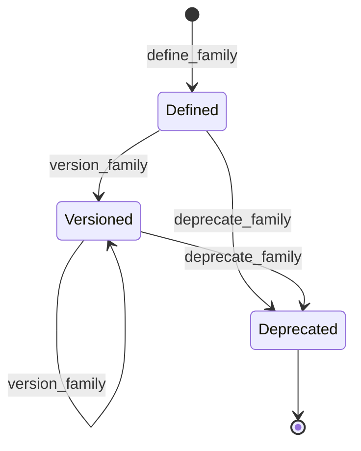
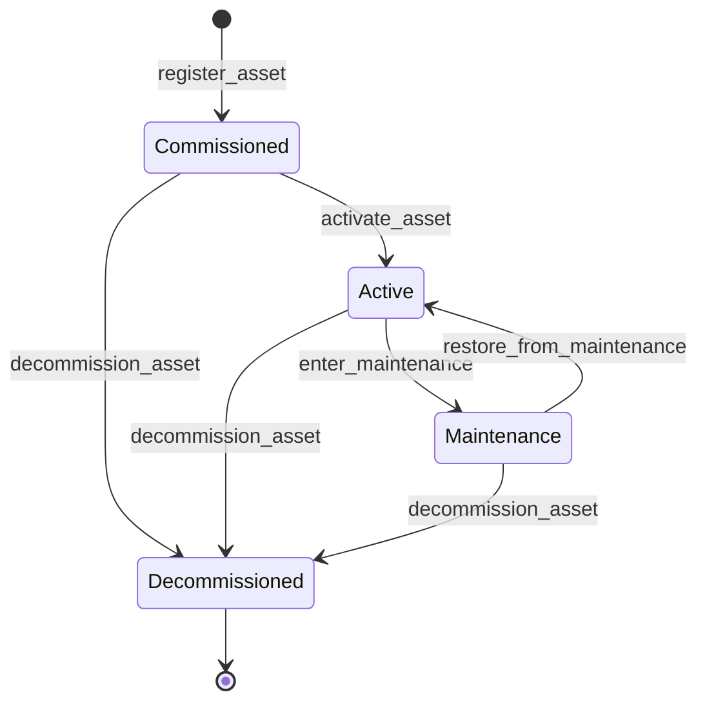

# Equipment module <span class="md-maturity md-maturity--stable" title="Two aggregates, six-level hierarchy, four lifecycle states, three-state condition, settings schema validation, typed ports">stable</span>

## Purpose & Scope

The Equipment module owns CORA's record of what physical devices the facility runs, what classes of device exist, and what operational state each device is in. Two aggregates carry the responsibility: `Family` is the device-class abstraction (the kind of thing a rotary stage, camera, or scintillator is), and `Asset` is one physical instance that the facility commissions, maintains, moves, and eventually decommissions.

Equipment is Foundation: every other module that needs to point at a specific piece of hardware references an `Asset.id`. The recipe ladder binds Methods to Assets through Plans. Procedures target Assets. Calibrations key off an `Asset.id` plus a quantity. Supplies advertise resources whose physical delivery infrastructure lives as Assets. Trust groups Assets into Zones for security policy.

<div class="cora-aside cora-aside--deferred" markdown>

Out of scope

- **High-frequency telemetry.** Motor positions during a scan, frame-trigger timestamps, sub-microsecond timing edges. Those are substream records keyed on the Run plus the Asset, not Asset state.
- **Owner separate from parent.** When equipment is on loan or jointly funded, ownership may diverge from physical location. The `owner` slot on Asset is reserved for a future revision when a real loan case appears; today the parent chain is read as ownership too.
- **Persistent external identifier.** PIDINST or another scheme for citing Assets in publications is a future additive field; today the internal UUID is the only id.
- **Hierarchy descendant projection.** The asset-summary table answers direct-parent queries. Transitive-closure queries ("every device under this beamline") are deferred until the use case lands.
- **Per-Family settings-schema versioning history.** The current schema replaces the prior schema on every `update_family_settings_schema`; the event log carries the history, but no separate projection exposes "schema at time T".
- **Wiring.** Which Asset port connects to which other Asset port lives in `Plan.wiring` in the [Recipe](../recipe/index.md) module, not on the Asset.

</div>

## Aggregates

| Name | Identity | State summary | FSM |
|---|---|---|---|
| `Family` | `id: UUID` | `id`, `name: FamilyName`, `status: FamilyStatus`, `version: str?`, `affordances: frozenset[Affordance]`, `settings_schema: dict?` | yes (3-state) |
| `Asset` | `id: UUID` | `id`, `name`, `level`, `parent_id?`, `lifecycle`, `condition`, `families: frozenset[UUID]`, `settings: dict`, `ports: frozenset[AssetPort]` | yes (4-state lifecycle, 3-state condition) |

A `Family` is the device-class abstraction: "RotaryStage", "Camera", "Hexapod", "Mirror", "TriggerFPGA". It carries the affordance set (what device-level primitives this class supports) and the JSON Schema that constrains the operational settings any Asset of that class may carry. An `Asset` is one physical instance: a Site, a beamline, a detector, a sample changer. Assets form a single-parent tree through `parent_id`; an Asset may belong to multiple Families simultaneously (a camera-on-a-mount belongs to both `Camera` and `MountedDevice`), and each membership widens what the Asset's settings dict may contain.

## Value Objects

| Name | Shape | Where used |
|---|---|---|
| `FamilyName` | trimmed string, 1-200 chars | `Family.name` |
| `FamilyStatus` | closed StrEnum: `Defined` \| `Versioned` \| `Deprecated` | `Family.status` |
| `Affordance` | closed StrEnum, 28 values in 3 patterns (motion, signal, lifecycle) | members of `Family.affordances` |
| `AssetName` | trimmed string, 1-200 chars | `Asset.name` |
| `AssetLevel` | closed StrEnum: `Enterprise` \| `Site` \| `Area` \| `Unit` \| `Assembly` \| `Device` | `Asset.level` |
| `AssetLifecycle` | closed StrEnum: `Commissioned` \| `Active` \| `Maintenance` \| `Decommissioned` | `Asset.lifecycle` |
| `AssetCondition` | closed StrEnum: `Nominal` \| `Degraded` \| `Faulted` | `Asset.condition` |
| `AssetPort` | `(name, direction, signal_type)` triple; direction is `Input` \| `Output`; signal_type is free text, 1-50 chars | members of `Asset.ports` |

The six `AssetLevel` values are ISA-95-derived with single-word names. Levels are conventional: the decider checks that an Enterprise-level Asset has no parent and that every other level has one, but it does not enforce that a `Device` parents to an `Assembly`. Smart instruments with addressable sub-modules legitimately put a `Device` under another `Device`.

Whether a composite vendor unit is one Asset with a wide settings dict or a parent Asset with several child Assets follows three tests. Any one is sufficient to spawn a child Asset:

- **Lifecycle independence.** The sub-component can be commissioned, swapped, or decommissioned without retiring the parent.
- **External addressability.** Another module needs to reference the sub-component by `asset_id`: `Plan.wiring`, `Calibration.target_id`, `Procedure.target_asset_ids`, `Caution.AssetTarget`, `Clearance.facility_asset_id`, `AssetBinding.asset_id`, Trust Zone membership, or Supply infrastructure linkage.
- **Settings-schema divergence.** The sub-component needs settings keys that would collide with the parent's, or that need independent write-and-validate cycles.

Addressability wins ties: if any other module references the sub-component by id, it is its own Asset. Per-component `Calibration` is the most common trigger at imaging beamlines (each lens position in a turret carries its own magnification calibration). Each Asset is its own event stream, so the choice is irreversible without a migration. A sub-component that fails all three is structural detail on the parent: a value in its `settings` dict or an entry in its `ports` set. A swappable detector head in a detector assembly is its own Asset; a fixed cooling loop on that same assembly is not. Each axis of a multi-axis stage is typically its own Asset when wired or calibrated per axis.

`AssetCondition` is orthogonal to `AssetLifecycle`. A Decommissioned Asset can be discovered Faulted on inventory check; an Active Asset can be Degraded without being pulled out of service. The two enums move independently through their own slices.

`AssetPort` declares what ports the equipment HAS. The connection between two ports lives in `Plan.wiring` in the [Recipe](../recipe/index.md) module.

## FSM

The Family aggregate runs a three-state lifecycle:



| From | To | Command | Event |
|---|---|---|---|
| `[*]` | `Defined` | `define_family` | `FamilyDefined` |
| `Defined` | `Versioned` | `version_family` | `FamilyVersioned` |
| `Versioned` | `Versioned` | `version_family` | `FamilyVersioned` |
| `Defined` | `Deprecated` | `deprecate_family` | `FamilyDeprecated` |
| `Versioned` | `Deprecated` | `deprecate_family` | `FamilyDeprecated` |

The Asset aggregate runs a four-state lifecycle plus an orthogonal three-state condition.



| From | To | Command | Event |
|---|---|---|---|
| `[*]` | `Commissioned` | `register_asset` | `AssetRegistered` |
| `Commissioned` | `Active` | `activate_asset` | `AssetActivated` |
| `Active` | `Maintenance` | `enter_maintenance` | `AssetMaintenanceEntered` |
| `Maintenance` | `Active` | `restore_from_maintenance` | `AssetRestoredFromMaintenance` |
| `Commissioned` | `Decommissioned` | `decommission_asset` | `AssetDecommissioned` |
| `Active` | `Decommissioned` | `decommission_asset` | `AssetDecommissioned` |
| `Maintenance` | `Decommissioned` | `decommission_asset` | `AssetDecommissioned` |

Condition transitions move from any source to a fixed target through three slices: `degrade_asset` lands on `Degraded`, `fault_asset` lands on `Faulted`, `restore_asset` lands on `Nominal`. Condition transitions are allowed in any lifecycle state (including Decommissioned) so the model stays honest about device-state-in-storage.

**Guards.** Beyond the source-state check, hierarchy and Family-membership slices enforce:

`relocate_asset`
: The target parent is not the Asset itself (no single-element cycle). The target parent differs from the current parent (no-op rejection). Enterprise-level Assets cannot relocate (they are the root). Decommissioned Assets cannot relocate. Cycle detection beyond the trivial self-loop case is deferred.

`add_asset_family` / `remove_asset_family`
: The Asset is not Decommissioned. The Family id is not already present (or is present, for remove). The referenced Family is not verified to exist in the Family event stream at write time, matching the eventual-consistency stance on cross-aggregate references.

`add_asset_port` / `remove_asset_port`
: The Asset is not Decommissioned. The port name is not already present (or is present, for remove). Port-name uniqueness is enforced Asset-wide.

`update_asset_settings`
: The proposed settings dict is validated against the union of currently-assigned Families' `settings_schema` declarations. Orphan keys (not declared by any assigned Family) are rejected. Conflicts between two Families that declare the same key with incompatible types are rejected. PATCH semantics follow RFC 7396 merge.

## Events

Family emits four event types; Asset emits fifteen.

| Event | Payload sketch | When emitted |
|---|---|---|
| `FamilyDefined` | `family_id`, `name`, `affordances`, `occurred_at` | `define_family` succeeds (genesis) |
| `FamilyVersioned` | `family_id`, `version_tag`, `affordances`, `occurred_at` | `version_family` succeeds; affordance set is the replacement declared at this version |
| `FamilyDeprecated` | `family_id`, `occurred_at` | `deprecate_family` succeeds |
| `FamilySettingsSchemaUpdated` | `family_id`, `settings_schema?`, `occurred_at` | `update_family_settings_schema` succeeds; payload carries the full replacement schema |
| `AssetRegistered` | `asset_id`, `name`, `level`, `parent_id?`, `occurred_at` | `register_asset` succeeds (genesis) |
| `AssetActivated` | `asset_id`, `occurred_at` | `activate_asset` succeeds |
| `AssetMaintenanceEntered` | `asset_id`, `occurred_at` | `enter_maintenance` succeeds |
| `AssetRestoredFromMaintenance` | `asset_id`, `occurred_at` | `restore_from_maintenance` succeeds |
| `AssetDecommissioned` | `asset_id`, `occurred_at` | `decommission_asset` succeeds from any of the three permitted lifecycles |
| `AssetRelocated` | `asset_id`, `from_parent_id?`, `to_parent_id`, `reason`, `occurred_at` | `relocate_asset` succeeds; payload carries both source and target for audit |
| `AssetFamilyAdded` | `asset_id`, `family_id`, `occurred_at` | `add_asset_family` succeeds |
| `AssetFamilyRemoved` | `asset_id`, `family_id`, `occurred_at` | `remove_asset_family` succeeds |
| `AssetPortAdded` | `asset_id`, `port_name`, `direction`, `signal_type`, `occurred_at` | `add_asset_port` succeeds |
| `AssetPortRemoved` | `asset_id`, `port_name`, `occurred_at` | `remove_asset_port` succeeds |
| `AssetSettingsUpdated` | `asset_id`, `settings`, `occurred_at` | `update_asset_settings` succeeds; payload carries the post-merge settings dict |
| `AssetDegraded` | `asset_id`, `occurred_at` | `degrade_asset` succeeds |
| `AssetFaulted` | `asset_id`, `occurred_at` | `fault_asset` succeeds |
| `AssetRestored` | `asset_id`, `occurred_at` | `restore_asset` succeeds |

`AssetRelocated` is the only event in the Equipment module that carries source state in its payload, because `parent_id` is a mutable value across many possible prior states rather than a discrete enum.

## Slices

The Family aggregate has six slices; the Asset aggregate has eighteen.

| Command | Category | REST | MCP tool | Idempotency |
|---|---|---|---|---|
| `DefineFamily` | NEW | `POST /families` | `define_family` | required |
| `VersionFamily` | MODIFIED | `POST /families/{family_id}/version` | `version_family` | none |
| `DeprecateFamily` | MODIFIED | `POST /families/{family_id}/deprecate` | `deprecate_family` | none |
| `UpdateFamilySettingsSchema` | MODIFIED | `PUT /families/{family_id}/settings-schema` | `update_family_settings_schema` | none |
| `GetFamily` | QUERY | `GET /families/{family_id}` | `get_family` | none |
| `ListFamilies` | QUERY | `GET /families` | `list_families` | none |
| `RegisterAsset` | NEW | `POST /assets` | `register_asset` | required |
| `ActivateAsset` | MODIFIED | `POST /assets/{asset_id}/activate` | `activate_asset` | none |
| `EnterMaintenance` | MODIFIED | `POST /assets/{asset_id}/enter-maintenance` | `enter_maintenance` | none |
| `RestoreFromMaintenance` | MODIFIED | `POST /assets/{asset_id}/restore-from-maintenance` | `restore_from_maintenance` | none |
| `DecommissionAsset` | MODIFIED | `POST /assets/{asset_id}/decommission` | `decommission_asset` | none |
| `RelocateAsset` | MODIFIED | `POST /assets/{asset_id}/relocate` | `relocate_asset` | none |
| `AddAssetFamily` | MODIFIED | `POST /assets/{asset_id}/families` | `add_asset_family` | none |
| `RemoveAssetFamily` | MODIFIED | `DELETE /assets/{asset_id}/families/{family_id}` | `remove_asset_family` | none |
| `AddAssetPort` | MODIFIED | `POST /assets/{asset_id}/ports` | `add_asset_port` | none |
| `RemoveAssetPort` | MODIFIED | `DELETE /assets/{asset_id}/ports/{port_name}` | `remove_asset_port` | none |
| `UpdateAssetSettings` | MODIFIED | `PATCH /assets/{asset_id}/settings` | `update_asset_settings` | none |
| `DegradeAsset` | MODIFIED | `POST /assets/{asset_id}/degrade` | `degrade_asset` | none |
| `FaultAsset` | MODIFIED | `POST /assets/{asset_id}/fault` | `fault_asset` | none |
| `RestoreAsset` | MODIFIED | `POST /assets/{asset_id}/restore` | `restore_asset` | none |
| `GetAsset` | QUERY | `GET /assets/{asset_id}` | `get_asset` | none |
| `GetAssetIntegrationView` | QUERY | `GET /assets/{asset_id}/integration-view` | `get_asset_integration_view` | none |
| `ListAssets` | QUERY | `GET /assets` | `list_assets` | none |

**Errors per slice.** Beyond Pydantic boundary 422s, each slice raises:

`DefineFamily`
: `InvalidFamilyName`, `FamilyAlreadyExists`, `Unauthorized`

`VersionFamily` / `DeprecateFamily`
: `FamilyNotFound`, `FamilyCannotVersion` / `FamilyCannotDeprecate`, `InvalidFamilyVersionTag` (version only), `Unauthorized`

`UpdateFamilySettingsSchema`
: `FamilyNotFound`, `InvalidFamilySettingsSchema`, `Unauthorized`

`RegisterAsset`
: `InvalidAssetName`, `InvalidAssetParent` (Enterprise with parent, or non-Enterprise without parent), `AssetAlreadyExists`, `Unauthorized`

`ActivateAsset` / `EnterMaintenance` / `RestoreFromMaintenance` / `DecommissionAsset`
: `AssetNotFound`, `AssetCannot<Activate|EnterMaintenance|RestoreFromMaintenance|Decommission>`, `Unauthorized`

`RelocateAsset`
: `AssetNotFound`, `AssetCannotRelocate` (Enterprise-level, Decommissioned, self-loop, or no-op), `Unauthorized`

`AddAssetFamily` / `RemoveAssetFamily`
: `AssetNotFound`, `AssetCannotAddFamily` / `AssetCannotRemoveFamily` (Decommissioned, or duplicate-add / missing-remove), `Unauthorized`

`AddAssetPort` / `RemoveAssetPort`
: `AssetNotFound`, `AssetCannotAddPort` / `AssetCannotRemovePort` (Decommissioned, or duplicate-add / missing-remove), `InvalidAssetPortName` / `InvalidAssetPortSignalType` (add only), `Unauthorized`

`UpdateAssetSettings`
: `AssetNotFound`, `InvalidAssetSettings` (orphan key, schema violation, or cross-Family conflict), `Unauthorized`

`DegradeAsset` / `FaultAsset` / `RestoreAsset`
: `AssetNotFound`, `Unauthorized`

`GetFamily` / `GetAsset` / `GetAssetIntegrationView`
: `FamilyNotFound` / `AssetNotFound`

`ListFamilies` / `ListAssets`
: (boundary 422 only)

`GetAssetIntegrationView` is a read-time composition slice that joins the Asset's current state with the schema declarations of its assigned Families, the Methods that satisfy those Families' affordance requirements, and the Capabilities those Methods deliver. The composition runs at query time; there is no integration-view projection today. The view is the read-side primitive that integration code (a TomoScan adapter, an EPICS bridge) uses to discover "what can this Asset actually do".

## Storage & Projections

Two read-side tables back the Equipment module.

```sql title="proj_equipment_asset_summary"
CREATE TABLE proj_equipment_asset_summary (
    asset_id    UUID        PRIMARY KEY,
    name        TEXT        NOT NULL,
    level       TEXT        NOT NULL CHECK (
        level IN ('Enterprise', 'Site', 'Area', 'Unit', 'Assembly', 'Device')
    ),
    lifecycle   TEXT        NOT NULL CHECK (
        lifecycle IN ('Commissioned', 'Active', 'Maintenance', 'Decommissioned')
    ),
    parent_id   UUID,
    created_at  TIMESTAMPTZ NOT NULL,
    updated_at  TIMESTAMPTZ NOT NULL DEFAULT now()
);

CREATE INDEX proj_equipment_asset_summary_keyset_idx
    ON proj_equipment_asset_summary (created_at, asset_id);

CREATE INDEX proj_equipment_asset_summary_parent_idx
    ON proj_equipment_asset_summary (parent_id)
    WHERE parent_id IS NOT NULL;
```

```sql title="proj_equipment_capability_summary"
CREATE TABLE proj_equipment_capability_summary (
    capability_id  UUID        PRIMARY KEY,
    name           TEXT        NOT NULL,
    status         TEXT        NOT NULL CHECK (
        status IN ('Defined', 'Versioned', 'Deprecated')
    ),
    version_tag    TEXT,
    created_at     TIMESTAMPTZ NOT NULL,
    updated_at     TIMESTAMPTZ NOT NULL DEFAULT now()
);
```

The Asset summary is the canonical list source for `GET /assets`. The partial index on `parent_id` supports direct-children lookups; transitive-closure traversal (every Device under a Site, say) is deferred. Lifecycle and level columns are CHECK-constrained against the closed enums so the projection writer fails loud if it ever drifts.

The Family summary table is named `proj_equipment_capability_summary` for legacy reasons; the aggregate was renamed but the projection table keeps its original name because forward-only migrations forbid in-place rename of a populated table. The schema and CHECK constraints still match the `FamilyStatus` enum.

`Asset.condition`, `Asset.families`, `Asset.settings`, and `Asset.ports` are not surfaced on the summary table today. Single-Asset reads fold the event stream and return them; list-by-condition or list-by-port queries are deferred until the use case lands.

## Cross-Module boundaries

| Module | Relationship | What's exchanged |
|---|---|---|
| [Recipe](../recipe/index.md) | reads-from | `Method.needs.families` references Family ids; `Plan` binding matches a Method's required Families against `Asset.families` |
| [Recipe](../recipe/index.md) | reads-from | `Plan.wiring` references Asset ports by `(asset_id, port_name)` |
| [Run](../run/index.md) | reads-from | Each Run's effective parameters are validated against the Method's parameters schema; Run pinned calibrations reference Asset ids transitively |
| [Operation](../operation/index.md) | reads-from | `Procedure.target_asset_ids` references the Assets the procedure acts on |
| [Calibration](../calibration/index.md) | reads-from | `Calibration.target_id` references the Asset whose behaviour is being measured |
| [Supply](../supply/index.md) | reads-from | Physical infrastructure delivering a supply (a gas cabinet, a mass-flow controller) lives as Assets; the resource itself is a Supply |
| [Trust](../trust/index.md) | gated-by | Every write-side Equipment slice (Family / Asset registration, lifecycle, condition, settings, ports) is gated by the Authorize port resolving a `Policy` for the `(principal, command, conduit, surface)` tuple |
| [Trust](../trust/index.md) | reads-from | Zones group Assets by trust-requirement homogeneity (orthogonal to the level hierarchy) |
| [Caution](../caution/index.md) | targeted-by | Cautions with `AssetTarget` point at `Asset.id` values; with `propagate_to_children: true` the Caution surfaces on descendant Assets via projection walk of `Asset.parent_id` |
| [Safety](../safety/index.md) | shared-id-with | `Clearance.facility_asset_id` references an `Asset.Level.Site`; `AssetBinding.asset_id` references any `Asset` a Clearance gates |
| [Access](../access/index.md) | shared-id-with | Every Equipment event envelope carries the actor id that authored the change |

The Asset hierarchy answers "where does this belong structurally"; Trust Zones answer "what security policy applies". The two classifications are orthogonal: every Asset has both, and zones can span Sites.

## Examples

The four examples below cover the canonical lifecycle of one Asset: define the Family it belongs to, register the Asset under the right parent, activate it for service, and update its settings. For the REST/MCP equivalence, auth, and idempotency conventions these examples share, see [Reading the examples](../index.md) on the Modules landing page.

### Define a Family

=== "REST"

    ```http
    POST /families
    Content-Type: application/json
    Idempotency-Key: 6f4a3b1c-8e2d-4f5a-9b8c-1d2e3f4a5b6c
    X-Principal-Id: 11111111-2222-3333-4444-555555555555

    {
      "name": "RotaryStage",
      "affordances": ["Move.Continuous", "Move.Step", "Signal.PositionFeedback"]
    }
    ```

    Returns `201 Created` with the newly-assigned `family_id`. The Family starts in `Defined`; a subsequent `update_family_settings_schema` call attaches the JSON Schema that constrains what an Asset of this Family may carry in its settings dict.

=== "MCP"

    ```python
    mcp.call_tool(
        "define_family",
        {
            "name": "RotaryStage",
            "affordances": ["Move.Continuous", "Move.Step", "Signal.PositionFeedback"],
        },
    )
    ```

### Register an Asset under a parent

=== "REST"

    ```http
    POST /assets
    Content-Type: application/json
    Idempotency-Key: 7c8d9e0f-1a2b-3c4d-5e6f-7a8b9c0d1e2f
    X-Principal-Id: 11111111-2222-3333-4444-555555555555

    {
      "name": "Aerotech ABRS-200MP",
      "level": "Device",
      "parent_id": "aaaa1111-2222-3333-4444-555555555555"
    }
    ```

    Returns `201 Created` with the newly-assigned `asset_id`. Lifecycle starts at `Commissioned`; condition starts at `Nominal`; the Asset has no Families or ports yet. A subsequent `add_asset_family` call attaches `RotaryStage`, after which `update_asset_settings` may carry the keys that Family's schema declares.

=== "MCP"

    ```python
    mcp.call_tool(
        "register_asset",
        {
            "name": "Aerotech ABRS-200MP",
            "level": "Device",
            "parent_id": "aaaa1111-2222-3333-4444-555555555555",
        },
    )
    ```

### Activate an Asset for service

=== "REST"

    ```http
    POST /assets/<asset-id>/activate
    X-Principal-Id: 11111111-2222-3333-4444-555555555555
    ```

    Returns `200 OK`. Lifecycle flips from `Commissioned` to `Active`. The Asset is now eligible to be bound into Plans and to be the target of Procedures. A second call returns `409 Conflict` with `AssetCannotActivate`.

=== "MCP"

    ```python
    mcp.call_tool("activate_asset", {"asset_id": "<asset-id>"})
    ```

### Update an Asset's settings

=== "REST"

    ```http
    PATCH /assets/<asset-id>/settings
    Content-Type: application/json
    X-Principal-Id: 11111111-2222-3333-4444-555555555555

    {
      "step_resolution_deg": 0.001,
      "max_velocity_deg_per_s": 60
    }
    ```

    Returns `200 OK` with the post-merge settings dict. The patch is RFC 7396 merge: keys present in the body replace prior values, `null` removes a key, omitted keys are preserved. The merged result is validated against the union of currently-assigned Families' settings schemas; an orphan key (one not declared by any assigned Family) or a value violating a schema constraint returns `400 Bad Request` with `InvalidAssetSettings`.

=== "MCP"

    ```python
    mcp.call_tool(
        "update_asset_settings",
        {
            "asset_id": "<asset-id>",
            "settings": {
                "step_resolution_deg": 0.001,
                "max_velocity_deg_per_s": 60,
            },
        },
    )
    ```
