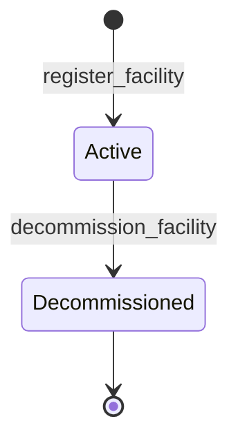
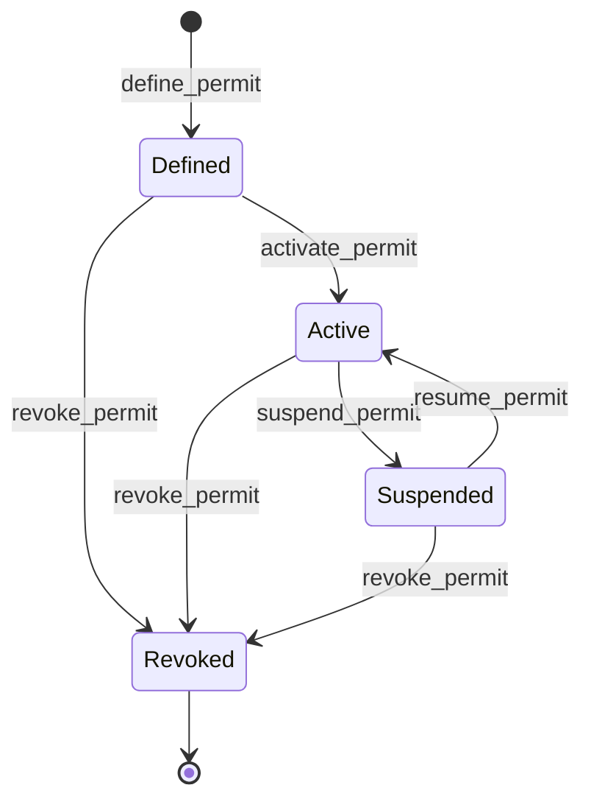
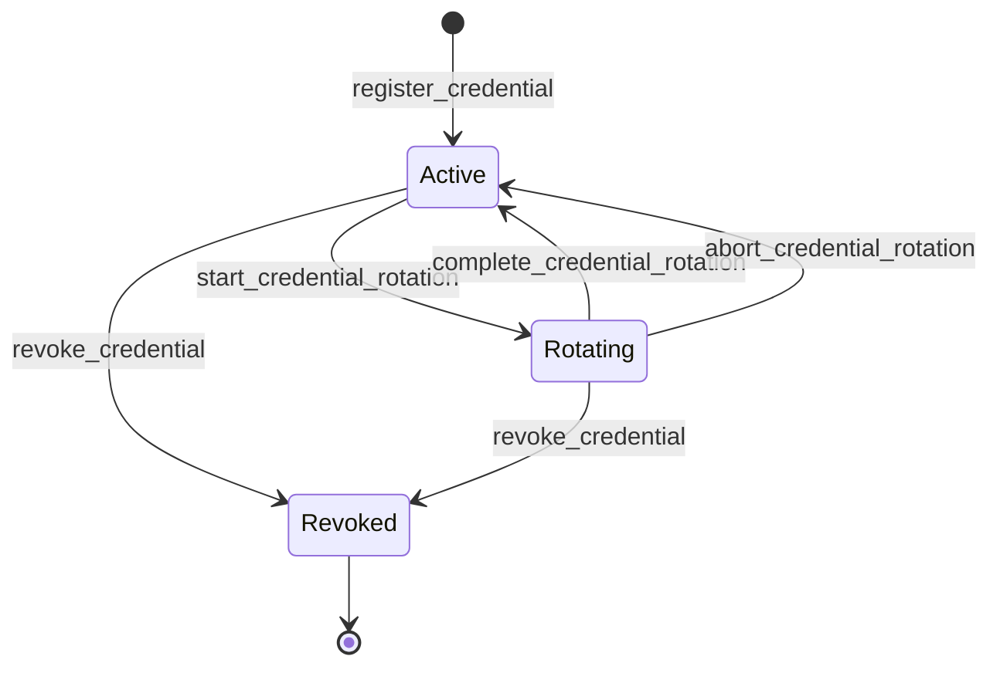
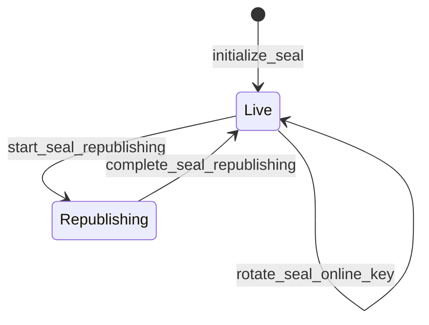

# Federation module <span class="md-maturity md-maturity--beta" title="Four aggregates: Facility carries cross-deployment convergent peer identity, Permit authorizes a peer flow, Credential binds opaque secret material, Seal signs the per-facility head pointer.">beta</span>

## Purpose & Scope

The Federation module owns CORA's outgoing and incoming cross-facility data flows. Four aggregates carry the responsibility: `Facility` is the peer-facility identity record with two-tier identity (opaque UUID PK plus cross-deployment convergent code), `Permit` authorizes one federation flow between this facility and a named peer, `Credential` is a per-facility binding to an opaque secret-material handle for a single purpose, and `Seal` is the per-facility singleton that signs the head pointer over this facility's published registry tree.

Federation is the cross-facility seam. Trust governs who may do what inside this facility; Federation governs what crosses the boundary, in which direction, signed by which key, against which peer's accepted canonicalization. The four aggregates compose: a `Facility` carries the cross-deployment convergent slug for one peer (or for the self-deployment), a `Permit` names the `Credential` ids that may carry traffic under its terms, and the per-facility `Seal` pairs an online-signing `Credential` with an offline-root `Credential` to sign the head pointer that consumers of a federated registry follow.

<div class="cora-aside cora-aside--deferred" markdown>

Out of scope

- **Raw secret material.** The aggregate carries only opaque pointers (`secret_ref`, `public_material_ref`); the bytes live behind the `SecretStore` port and never enter the event log, projections, or logs. Resolving a ref to bytes is the adapter's job at use time, not the aggregate's.
- **The cryptographic act of signing.** The `Signer` port produces signatures over canonicalized payloads outside the decider. The Seal aggregate records that a pointer was signed and at which sequence number, not the signature operation itself.
- **Peer-facility code minting.** `Permit.peer_facility_code` is an operator-supplied `FacilityCode`; CORA does not mint peer codes and does not check that a peer-side directory entry exists at write time.
- **Transparency-log emission.** `ReceiptKind` (`scitt`, `rekor_sct`, `ts_authority`) is recorded on inbound terms as the receipt scheme the inbound side demands; the actual SCITT or Rekor adapter that produces the receipt is out of scope for the aggregate.
- **Cross-facility registry replication.** The Seal records and signs the head pointer; the gossip or pull protocol by which peer facilities discover and fetch a new head lives in the transport adapter, not on the aggregate.
- **Permit terms updates.** Today every Permit lifecycle slice only moves the FSM; the terms tagged union is fixed at `define_permit` time. A `revise_permit_terms` slice is deferred until a real revision case shows up.

</div>

## Aggregates

| Name | Identity | State summary | FSM |
|---|---|---|---|
| `Facility` | `id: FacilityId` (UUID; derived from `code` via UUID5) + `code: FacilityCode` (cross-deployment slug) | `id`, `code`, `display_name`, `kind: Site \| Area`, `parent_id?`, `trust_anchor_credential_ids: frozenset[CredentialId]`, `status`, `persistent_id?`, `alternate_identifiers`, `registered_at`, `registered_by`, `decommissioned_at?`, `decommissioned_by?` | yes (2-state) |
| `Permit` | `id: UUID` | `id`, `peer_facility_code: FacilityCode`, `direction`, `allowed_credential_ids: frozenset[UUID]`, `allowed_payload_types`, `allowed_artifact_kinds`, `abi_tier_floor`, `expires_at`, `defined_by_actor_id`, `status`, `terms: OutboundTerms \| InboundTerms` | yes (4-state) |
| `Credential` | `id: UUID` (unique triple `(facility_code, audience, purpose)`) | `id`, `facility_code: FacilityCode`, `audience`, `purpose`, `secret_ref`, `public_material_ref?`, `expires_at?`, `registered_by_actor_id`, `rotation_pending_secret_ref?`, `rotation_pending_public_material_ref?`, `status` | yes (3-state + rotation overlay) |
| `Seal` | `facility_code: FacilityCode` (singleton per facility) | `facility_code`, `online_credential_id`, `offline_credential_id`, `current_head_hash?`, `current_sequence_number`, `initialized_by_actor_id`, `status` | yes (mini-FSM, `Live <-> Republishing`) |

The `Permit`, `Credential`, and `Seal` aggregate states carry the facility reference as a typed `FacilityCode` (`peer_facility_code` / `facility_code`), and the REST and MCP wire bodies use the same `facility_code` / `peer_facility_code` keys. The on-disk event-payload JSON keys and the projection columns keep the bare-string names `facility_id` / `peer_facility_id` (the cryptographic-chain immutability convention: renaming a persisted payload key would break the signed seal chain), and `seal_stream_id(facility_code)` threads the bare slug through the stream-id boundary. So the event tables and projection DDL below intentionally read `facility_id` while the aggregate state and wire read `facility_code`.

A `Facility` is one peer-facility record, with two-tier identity per the locked design: `id: FacilityId` is the opaque UUID PK for spine references within this deployment, derived deterministically from `code` via `uuid5`; `code: FacilityCode` is the cross-deployment convergent slug (lowercase ASCII alphanumeric plus dash, 1-32 chars). Cross-BC and cross-deployment references to a facility MUST use `code`, not `id`; the `test_cross_bc_refs_facility_code_not_id.py` architecture fitness pins the rule. The aggregate is additive in this slice (no Asset / Supply / Federation binding yet; those land in slices 6-9 of the structural-scope masquerade resolution per [project_facility_aggregate_design](../../../../memory/project_facility_aggregate_design.md)).

A `Permit` authorizes one federation flow between this facility and one peer in one direction. The polymorphic `terms` field carries the direction-specific contractual fields, and the aggregate's `direction` enum mirrors `type(terms)` as a query-convenience discriminator that read-side filters and projections can index on without crossing the polymorphic boundary. A `Credential` is a per-facility binding for one of six purposes; the aggregate holds opaque pointers only and the actual bytes live behind the `SecretStore` port. A `Seal` is the singleton-per-facility record of the current head pointer over this facility's published registry, signed by an online-signing Credential with an offline-root Credential held in reserve for online-key rotation and full republish.

The self-Facility row (the deployment's own facility identity in the cross-deployment convergent code namespace) is seeded at lifespan startup by `bootstrap_federation` from `settings.self_facility_code` (env var `SELF_FACILITY_CODE`; default `"cora"`, production overrides without exception). Idempotent across boots via the `ConcurrencyError`-as-already-seeded pattern. The seed runs BEFORE any Federation slice consumes the self-Facility row.

**Operator bootstrap sequence for sealing.** The self-Facility seed ships with an empty `trust_anchor_credential_ids` set. Before `initialize_seal` can succeed, an operator runs three steps in order. (1) Register the two seal credentials via `register_credential` (one `SealOnlineSigning`, one `SealOfflineRoot`). (2) Anchor each credential id via `add_facility_trust_anchor_credential(self_facility_id, credential_id)`. (3) Call `initialize_seal` with the same two credential ids; the decider's structural cross-tenant defense checks set-membership against the anchored set. `rotate_seal_online_key` requires the new online credential to be anchored beforehand via the same `add_facility_trust_anchor_credential` slice; an operator typically anchors the replacement credential, rotates, then removes the retired credential via `remove_facility_trust_anchor_credential`.

`Seal.facility_code` is a typed `FacilityCode` (not a UUID) because the per-facility singleton is keyed on the cross-deployment convergent slug. The handler mints the event-store stream UUID deterministically via `seal_stream_id(facility_code)` (UUID5 over the federation namespace and the bare slug string), so the stream is addressable from the same code the operator types, and the on-disk payload + projection keep the bare-string `facility_id` key.

`Credential` keys an identity triple `(facility_code, audience, purpose)` at the aggregate and wire layers; the UNIQUE constraint that enforces it on `proj_federation_credential_summary` is on the bare-string `facility_id` column. The aggregate id is the internal opaque handle; the identity triple is what operators query by.

## Value Objects

| Name | Shape | Where used |
|---|---|---|
| `FacilityCode` | trimmed `value: str` matching `^[a-z0-9-]{1,32}$` | `Facility.code`, `Permit.peer_facility_code`, `Credential.facility_code`, `Seal.facility_code` (aggregate state + REST/MCP wire); event-payload and projection columns keep the bare-string `facility_id` / `peer_facility_id` keys per the immutability convention |
| `FacilityName` | trimmed `value: str`, 1-200 chars | `Facility.display_name` |
| `FacilityKind` | closed StrEnum: `Site` \| `Area` | `Facility.kind` (Institution + Sector deferred per the design memo) |
| `FacilityStatus` | closed StrEnum: `Active` \| `Decommissioned` | `Facility.status` |
| `FacilityId` | `NewType[UUID]` co-located at `cora.federation.aggregates._value_types` | `Facility.id`, `Facility.parent_id` (intra-aggregate only; cross-BC refs use `code`) |
| `CredentialId` | `NewType[UUID]` co-located at `cora.federation.aggregates._value_types` | `Facility.trust_anchor_credential_ids` member type (populated via the `add_facility_trust_anchor_credential` / `remove_facility_trust_anchor_credential` transitions) |
| `Direction` | closed StrEnum: `Outbound` \| `Inbound` | `Permit.direction` (mirrors `type(terms)`) |
| `PermitStatus` | closed StrEnum: `Defined` \| `Active` \| `Suspended` \| `Revoked` | `Permit.status` |
| `OutboundTerms` | `(scope_set: frozenset[ScopeRef], read_scope, onward_action_scope)` | `Permit.terms` when `direction == Outbound` |
| `InboundTerms` | `(inbound_allowed_artifact_kinds, accepted_canonicalization_versions, required_receipt_kinds, publisher_grant_correlation_handle?)` | `Permit.terms` when `direction == Inbound` |
| `ScopeRef` | `(kind: str, name: str, qualifier: str?)` triple | members of `OutboundTerms.scope_set` |
| `ReadScope` | closed StrEnum: `ListMetadataOnly` \| `ReadAllArtifacts` \| `ReadByABITierMinimum` | `OutboundTerms.read_scope` |
| `OnwardActionScope` | closed StrEnum: `ReadOnly` \| `MayCacheLocally` \| `MayRePublishToOwnPeers` \| `MayExportOffPlatform` | `OutboundTerms.onward_action_scope` |
| `ReceiptKind` | closed StrEnum: `scitt` \| `rekor_sct` \| `ts_authority` | members of `InboundTerms.required_receipt_kinds` |
| `AbiTier` | closed StrEnum: `Testing` \| `Stable` \| `Obsolete` \| `Removed` | `Permit.abi_tier_floor` (shared with Seal) |
| `CredentialPurpose` | closed StrEnum: `Signing` \| `Verification` \| `Authentication` \| `Encryption` \| `SealOnlineSigning` \| `SealOfflineRoot` | `Credential.purpose` |
| `CredentialStatus` | closed StrEnum: `Active` \| `Rotating` \| `Revoked` | `Credential.status` |
| `SealStatus` | closed StrEnum: `Live` \| `Republishing` | `Seal.status` |

`OutboundTerms` and `InboundTerms` are a tagged union on `Permit.terms` rather than two sibling aggregates. The shape mirrors the `Observation` polymorphism precedent: identity and lifecycle fields live on the root, direction-specific contractual fields ride on the `terms` arm. Structural enforcement is one consequence: an outbound payload cannot smuggle `accepted_canonicalization_versions` because that field does not exist on `OutboundTerms`.

`CredentialPurpose` is closed at six arms on purpose: the four generic purposes plus the two seal-specific arms (`SealOnlineSigning`, `SealOfflineRoot`) that the Seal aggregate's key-separation invariant depends on. Splitting the seal purposes into distinct enum values rather than one `Seal` arm lets the Seal decider statically detect a same-purpose collision between the online and offline references.

`AbiTier` lives in the Permit module as its canonical home; the Seal aggregate consumes it through the same import. Hoist to a federation-level value-types module the moment a third symbol fires rule-of-three.

## FSM

The Facility aggregate runs a two-state terminal lifecycle. Genesis lands in `Active`; `decommission_facility` is the terminal transition. The aggregate is strict-not-idempotent on re-decommission (the second call raises `FacilityCannotDecommissionError` rather than no-opping). A decommissioned facility's `code` stays reserved by the projection's `UNIQUE INDEX` on `code` (no partial `WHERE` clause); re-registering with the same code is forbidden.



| From | To | Command | Event |
|---|---|---|---|
| `[*]` | `Active` | `register_facility` | `FacilityRegistered` |
| `Active` | `Decommissioned` | `decommission_facility` | `FacilityDecommissioned` |

The Permit aggregate runs a four-state lifecycle, shared across both directions:



| From | To | Command | Event |
|---|---|---|---|
| `[*]` | `Defined` | `define_permit` | `PermitDefined` |
| `Defined` | `Active` | `activate_permit` | `PermitActivated` |
| `Active` | `Suspended` | `suspend_permit` | `PermitSuspended` |
| `Suspended` | `Active` | `resume_permit` | `PermitResumed` |
| `Defined`, `Active`, `Suspended` | `Revoked` | `revoke_permit` | `PermitRevoked` |

The Credential aggregate runs a three-state lifecycle with a rotation overlay. Rotation captures pending refs alongside the current refs and either promotes them (completion) or discards them (abort); revocation is terminal from either `Active` or `Rotating`.



| From | To | Command | Event |
|---|---|---|---|
| `[*]` | `Active` | `register_credential` | `CredentialRegistered` |
| `Active` | `Rotating` | `start_credential_rotation` | `CredentialRotationStarted` |
| `Rotating` | `Active` | `complete_credential_rotation` | `CredentialRotationCompleted` |
| `Rotating` | `Active` | `abort_credential_rotation` | `CredentialRotationAborted` |
| `Active`, `Rotating` | `Revoked` | `revoke_credential` | `CredentialRevoked` |

The Seal aggregate is a singleton-per-facility with a mini-FSM. The online key keeps signing during the republishing window; consumers may use the `Republishing` indicator to defer trust until the window closes.



| From | To | Command | Event |
|---|---|---|---|
| `[*]` | `Live` | `initialize_seal` | `SealInitialized` |
| `Live` | `Live` | `sign_seal_pointer` | `SealPointerSigned` |
| `Live` | `Live` | `rotate_seal_online_key` | `SealOnlineKeyRotated` |
| `Live` | `Republishing` | `start_seal_republishing` | `SealRepublishingStarted` |
| `Republishing` | `Live` | `complete_seal_republishing` | `SealRepublishingCompleted` |

**Guards.** Beyond the source-state check, transitions enforce:

`define_permit`
: `allowed_credential_ids`, `allowed_payload_types`, and `allowed_artifact_kinds` are each non-empty (rejected as `InvalidPermitScopeError`; there is no wildcard fallback). `expires_at` lies in the future. `direction == Outbound iff isinstance(terms, OutboundTerms)`. Outbound terms whose `(read_scope, onward_action_scope)` pair collapses the matrix (for example exporting off-platform with metadata-only read) are rejected as `PermitScopeCollapseError`. Every member of `accepted_canonicalization_versions` on inbound terms is a recognized scheme (today only `cora/v1`).

`register_credential`
: `secret_ref`, `facility_code`, and `audience` are non-empty after trimming. The identity triple `(facility_code, audience, purpose)` is not already taken (a partial UNIQUE on the projection's bare-string `facility_id` column enforces this at the storage layer; the genesis collision raises `CredentialAlreadyExistsError`).

`start_credential_rotation`
: `pending_secret_ref` is non-empty. The credential is `Active` and not past `expires_at`.

`initialize_seal`
: The supplied `online_credential_id` and `offline_credential_id` differ (`SealKeyCollisionError`). Each ref resolves through the `CredentialLookup` port to a Credential at status `Active` (`SealCannotInitializeWithInactiveCredentialError`); the online slot's Credential carries purpose `SealOnlineSigning` and the offline slot's carries `SealOfflineRoot` (`SealKeyPurposeMismatchError`). The self-Facility row resolves through the `FacilityLookup` port (a missing row surfaces as `FacilityNotFoundError`), and BOTH credential ids must appear in that row's `trust_anchor_credential_ids` set (`SealCredentialNotTrustAnchorError`). The structural set-membership check replaces an older three-way string-equality cross-check on `facility_id`; the operator pre-seeds the trust-anchor set via `add_facility_trust_anchor_credential` before initialization.

`sign_seal_pointer`
: The Seal is `Live`. `new_head_hash` is non-empty after trimming. `new_sequence_number` is strictly greater than `current_sequence_number` (`SealSequenceNumberRegressionError`).

`rotate_seal_online_key`
: The Seal is `Live`. The new online Credential differs from the existing offline Credential, resolves via `CredentialLookup` to status `Active`, and carries purpose `SealOnlineSigning`. The self-Facility row resolves through the `FacilityLookup` port (a missing row surfaces as `FacilityNotFoundError`), and the new online credential id must appear in that row's `trust_anchor_credential_ids` set (`SealCredentialNotTrustAnchorError`).

`start_seal_republishing` / `complete_seal_republishing`
: The Seal is in the matching source status. On completion, if `new_head_hash` and `new_sequence_number` are supplied they are supplied together (half-pair rejected as `InvalidSealHeadHashError`), `new_sequence_number` is strictly greater than the prior value, and if both are omitted then a prior `current_head_hash` exists to reuse.

## Events

`Permit` emits five event types. `Credential` emits five. `Seal` emits five. Every event carries `occurred_at` and a `<verb>_by_actor_id` denorm of the envelope `principal_id` so projection consumers do not need to join the envelope table for the most common per-event queries. Status is not carried in event payloads; the event type IS the state-change indicator.

| Event | Payload sketch | When emitted |
|---|---|---|
| `PermitDefined` | `permit_id`, `peer_facility_id`, `direction`, `allowed_credential_ids`, `allowed_payload_types`, `allowed_artifact_kinds`, `abi_tier_floor`, `expires_at`, `defined_by_actor_id`, `terms`, `occurred_at` | `define_permit` succeeds (genesis); `terms` serializes as a tagged dict `{"kind": "Outbound" \| "Inbound", ...}` |
| `PermitActivated` | `permit_id`, `activated_by_actor_id`, `occurred_at` | `activate_permit` succeeds |
| `PermitSuspended` | `permit_id`, `suspended_by_actor_id`, `reason?`, `occurred_at` | `suspend_permit` succeeds |
| `PermitResumed` | `permit_id`, `resumed_by_actor_id`, `occurred_at` | `resume_permit` succeeds |
| `PermitRevoked` | `permit_id`, `revoked_by_actor_id`, `reason?`, `occurred_at` | `revoke_permit` succeeds from any non-revoked status |
| `CredentialRegistered` | `credential_id`, `facility_id`, `audience`, `purpose`, `secret_ref`, `public_material_ref?`, `expires_at?`, `registered_by_actor_id`, `occurred_at` | `register_credential` succeeds (genesis); status starts at `Active` |
| `CredentialRotationStarted` | `credential_id`, `pending_secret_ref`, `pending_public_material_ref?`, `rotation_started_by_actor_id`, `occurred_at` | `start_credential_rotation` succeeds |
| `CredentialRotationCompleted` | `credential_id`, `rotation_completed_by_actor_id`, `occurred_at` | `complete_credential_rotation` succeeds; pending refs promoted to current |
| `CredentialRotationAborted` | `credential_id`, `rotation_aborted_by_actor_id`, `reason?`, `occurred_at` | `abort_credential_rotation` succeeds; pending refs discarded |
| `CredentialRevoked` | `credential_id`, `revoked_by_actor_id`, `reason?`, `occurred_at` | `revoke_credential` succeeds (terminal) |
| `SealInitialized` | `facility_id`, `online_credential_id`, `offline_credential_id`, `initialized_by_actor_id`, `occurred_at` | `initialize_seal` succeeds (genesis); `current_sequence_number` starts at 0, `current_head_hash` is null |
| `SealPointerSigned` | `facility_id`, `head_hash`, `sequence_number`, `signed_at`, `signed_by_actor_id`, `occurred_at` | `sign_seal_pointer` succeeds; `signed_at` is the domain wall-clock of signature, distinct from envelope `occurred_at` |
| `SealOnlineKeyRotated` | `facility_id`, `new_online_credential_id`, `signed_by_offline_root`, `rotated_by_actor_id`, `occurred_at` | `rotate_seal_online_key` succeeds; the offline root is unchanged |
| `SealRepublishingStarted` | `facility_id`, `started_by_actor_id`, `reason?`, `occurred_at` | `start_seal_republishing` succeeds |
| `SealRepublishingCompleted` | `facility_id`, `new_head_hash`, `new_sequence_number`, `completed_by_actor_id`, `occurred_at` | `complete_seal_republishing` succeeds; sequence number strictly increases |

`SealPointerSigned.signed_at` is carried as a separate payload field, distinct from the event envelope's `occurred_at`, so the projection's `last_signed_at` reflects domain signing time rather than the moment the event was appended (mirrors Calibration revision `established_at` precedent).

`Permit.terms` is serialized as a tagged dict with a `kind` discriminator (`"Outbound"` / `"Inbound"`) so the polymorphic shape survives jsonb round-trips. The decoder rebuilds the typed dataclass from the discriminator; unknown discriminators raise tagged `ValueError`. `scope_set` rides as a sorted list of `[kind, name, qualifier]` triples; all frozenset fields ride as sorted lists for deterministic payload bytes.

## Slices

Twenty-five slices ship: nineteen lifecycle slices (four on Facility, five each on Permit / Credential / Seal) and six query slices. Every transition slice carries the actor stamping pattern: the handler factory closes over the aggregate's codec quartet and injects the envelope's `principal_id` into the decider under the per-event `<verb>_by_actor_id` parameter name.

| Command | Category | REST | MCP tool | Idempotency |
|---|---|---|---|---|
| `RegisterFacility` | NEW | `POST /federation/facilities` | `register_facility` | required |
| `DecommissionFacility` | MODIFIED | `POST /federation/facilities/{facility_id}/decommission` | `decommission_facility` | none |
| `AddFacilityTrustAnchorCredential` | MODIFIED | `POST /federation/facilities/{facility_id}/add-trust-anchor-credential` | `add_facility_trust_anchor_credential` | none |
| `RemoveFacilityTrustAnchorCredential` | MODIFIED | `POST /federation/facilities/{facility_id}/remove-trust-anchor-credential` | `remove_facility_trust_anchor_credential` | none |
| `DefinePermit` | NEW | `POST /federation/permits` | `define_permit` | required |
| `ActivatePermit` | MODIFIED | `POST /federation/permits/{permit_id}/activate` | `activate_permit` | none |
| `SuspendPermit` | MODIFIED | `POST /federation/permits/{permit_id}/suspend` | `suspend_permit` | none |
| `ResumePermit` | MODIFIED | `POST /federation/permits/{permit_id}/resume` | `resume_permit` | none |
| `RevokePermit` | MODIFIED | `POST /federation/permits/{permit_id}/revoke` | `revoke_permit` | none |
| `RegisterCredential` | NEW | `POST /federation/credentials` | `register_credential` | required |
| `StartCredentialRotation` | MODIFIED | `POST /federation/credentials/{credential_id}/rotation/start` | `start_credential_rotation` | none |
| `CompleteCredentialRotation` | MODIFIED | `POST /federation/credentials/{credential_id}/rotation/complete` | `complete_credential_rotation` | none |
| `AbortCredentialRotation` | MODIFIED | `POST /federation/credentials/{credential_id}/rotation/abort` | `abort_credential_rotation` | none |
| `RevokeCredential` | MODIFIED | `POST /federation/credentials/{credential_id}/revoke` | `revoke_credential` | none |
| `InitializeSeal` | NEW | `POST /federation/seals` | `initialize_seal` | required |
| `SignSealPointer` | MODIFIED | `POST /federation/seals/{facility_code}/pointer/sign` | `sign_seal_pointer` | none |
| `RotateSealOnlineKey` | MODIFIED | `POST /federation/seals/{facility_code}/online-key/rotate` | `rotate_seal_online_key` | none |
| `StartSealRepublishing` | MODIFIED | `POST /federation/seals/{facility_code}/republishing/start` | `start_seal_republishing` | none |
| `CompleteSealRepublishing` | MODIFIED | `POST /federation/seals/{facility_code}/republishing/complete` | `complete_seal_republishing` | none |
| `GetPermit` | QUERY | `GET /federation/permits/{permit_id}` | `get_permit` | none |
| `ListPermits` | QUERY | `GET /federation/permits` | `list_permits` | none |
| `GetCredential` | QUERY | `GET /federation/credentials/{credential_id}` | `get_credential` | none |
| `ListCredentials` | QUERY | `GET /federation/credentials` | `list_credentials` | none |
| `GetSeal` | QUERY | `GET /federation/seals/{facility_code}` | `get_seal` | none |
| `ListSeals` | QUERY | `GET /federation/seals` | `list_seals` | none |

Three slices write more than one stream in a single Postgres transaction: `initialize_seal` and `rotate_seal_online_key` each append a `DecisionRegistered` audit on the Decision BC alongside the Seal-stream event, and `revoke_credential` audits the revocation in the same shape. Both use `EventStore.append_streams` rather than `append`; the BC-local `_actor_update_handler` factory does not cover multi-stream writes, and those three slices stay longhand by design.

**Errors per slice.** Beyond Pydantic boundary 422s, each slice raises:

`DefinePermit`
: `InvalidPermitScopeError`, `PermitScopeCollapseError`, `UnsupportedCanonicalizationVersionError`, `PermitAlreadyExistsError`, `Unauthorized`

`ActivatePermit` / `SuspendPermit` / `ResumePermit` / `RevokePermit`
: `PermitNotFoundError`, `PermitCannot<Activate|Suspend|Resume|Revoke>Error`, `Unauthorized`

`RegisterCredential`
: `InvalidCredentialSecretRefError`, `CredentialAlreadyExistsError`, `Unauthorized`

`StartCredentialRotation` / `CompleteCredentialRotation` / `AbortCredentialRotation`
: `CredentialNotFoundError`, `CredentialCannotRotateError`, `CredentialExpiredError` (start only), `InvalidCredentialSecretRefError` (start only), `Unauthorized`

`RevokeCredential`
: `CredentialNotFoundError`, `CredentialCannotRevokeError`, `Unauthorized`

`InitializeSeal`
: `InvalidSealFacilityIdError`, `SealAlreadyExistsError`, `SealKeyCollisionError`, `SealKeyPurposeMismatchError`, `SealCannotInitializeWithInactiveCredentialError`, `SealCredentialNotTrustAnchorError`, `CredentialNotFoundError`, `FacilityNotFoundError`, `Unauthorized`

`SignSealPointer`
: `SealNotFoundError`, `SealCannotSignError`, `InvalidSealHeadHashError`, `SealSequenceNumberRegressionError`, `Unauthorized`

`RotateSealOnlineKey`
: `SealNotFoundError`, `SealCannotRotateError`, `SealKeyCollisionError`, `SealKeyPurposeMismatchError`, `SealCannotRotateWithInactiveCredentialError`, `SealCredentialNotTrustAnchorError`, `CredentialNotFoundError`, `FacilityNotFoundError`, `Unauthorized`

`StartSealRepublishing` / `CompleteSealRepublishing`
: `SealNotFoundError`, `SealCannotStartRepublishingError` / `SealCannotCompleteRepublishingError`, `InvalidSealHeadHashError` (complete only), `SealSequenceNumberRegressionError` (complete only), `Unauthorized`

`GetPermit` / `GetCredential` / `GetSeal`
: `PermitNotFoundError` / `CredentialNotFoundError` / `SealNotFoundError`

`ListPermits` / `ListCredentials` / `ListSeals`
: (boundary 422 only)

## Storage & Projections

Three summary projections back the Federation module, one per aggregate. All three enable RLS with `FORCE` so the per-row policies apply to the table owner as well as `cora_app`; the projections hold sensitive references (signing-chain heads, opaque secret refs, peer permit terms) and warrant the defense-in-depth posture used by `actor_profile` for PII.

```sql title="proj_federation_permit_summary"
CREATE TABLE proj_federation_permit_summary (
    permit_id                              UUID        PRIMARY KEY,
    peer_facility_id                       TEXT        NOT NULL,
    direction                              TEXT        NOT NULL CHECK (
        direction IN ('Outbound', 'Inbound')
    ),
    allowed_credential_ids                    JSONB       NOT NULL,
    allowed_payload_types                  JSONB       NOT NULL,
    allowed_artifact_kinds                 JSONB       NOT NULL,
    abi_tier_floor                         TEXT        NOT NULL,
    expires_at                             TIMESTAMPTZ,
    defined_by_actor_id                    UUID        NOT NULL,
    status                                 TEXT        NOT NULL CHECK (
        status IN ('Defined', 'Active', 'Suspended', 'Revoked')
    ),
    terms_kind                             TEXT        NOT NULL CHECK (
        terms_kind IN ('Outbound', 'Inbound')
    ),
    read_scope                             JSONB,
    onward_action_scope                    JSONB,
    scope_set                              JSONB,
    accepted_canonicalization_versions     JSONB,
    required_receipt_kinds                 JSONB,
    publisher_grant_correlation_handle     TEXT,
    inbound_allowed_artifact_kinds         JSONB,
    defined_at                             TIMESTAMPTZ NOT NULL,
    activated_at                           TIMESTAMPTZ,
    suspended_at                           TIMESTAMPTZ,
    resumed_at                             TIMESTAMPTZ,
    revoked_at                             TIMESTAMPTZ,
    updated_at                             TIMESTAMPTZ NOT NULL DEFAULT now(),
    CONSTRAINT proj_federation_permit_summary_terms_exclusive_arc CHECK (
        (terms_kind = 'Outbound'
         AND read_scope IS NOT NULL
         AND onward_action_scope IS NOT NULL
         AND scope_set IS NOT NULL
         AND accepted_canonicalization_versions IS NULL
         AND required_receipt_kinds IS NULL
         AND publisher_grant_correlation_handle IS NULL
         AND inbound_allowed_artifact_kinds IS NULL)
        OR
        (terms_kind = 'Inbound'
         AND accepted_canonicalization_versions IS NOT NULL
         AND required_receipt_kinds IS NOT NULL
         AND inbound_allowed_artifact_kinds IS NOT NULL
         AND read_scope IS NULL
         AND onward_action_scope IS NULL
         AND scope_set IS NULL)
    ),
    CONSTRAINT proj_federation_permit_summary_terms_kind_matches_direction CHECK (
        terms_kind = direction
    )
);
```

`terms_kind` is the polymorphic discriminator written verbatim from the `Permit.direction` enum string. The exclusive-arc CHECK enforces that exactly one direction's columns are populated; the matching CHECK pins `terms_kind = direction` so the discriminator and the indexable column never drift. Two filter indexes back the common operator queries (`(peer_facility_id, status)` and `(direction, status)`); a partial expiry index excludes the nullable arc.

```sql title="proj_federation_credential_summary"
CREATE TABLE proj_federation_credential_summary (
    credential_id                          UUID        PRIMARY KEY,
    facility_id                            TEXT        NOT NULL,
    audience                               TEXT        NOT NULL,
    purpose                                TEXT        NOT NULL CHECK (
        purpose IN (
            'Signing', 'Verification', 'Authentication', 'Encryption',
            'SealOnlineSigning', 'SealOfflineRoot'
        )
    ),
    secret_ref                             TEXT        NOT NULL CHECK (
        length(secret_ref) > 0
    ),
    public_material_ref                    TEXT,
    expires_at                             TIMESTAMPTZ,
    status                                 TEXT        NOT NULL CHECK (
        status IN ('Active', 'Rotating', 'Revoked')
    ),
    rotation_pending_secret_ref            TEXT,
    rotation_pending_public_material_ref   TEXT,
    registered_at                          TIMESTAMPTZ NOT NULL,
    rotation_started_at                    TIMESTAMPTZ,
    revoked_at                             TIMESTAMPTZ,
    updated_at                             TIMESTAMPTZ NOT NULL DEFAULT now(),
    CONSTRAINT proj_federation_credential_summary_identity_unique
        UNIQUE (facility_id, audience, purpose)
);
```

`secret_ref` is an opaque handle into the `SecretStore` port: a URI, KMS ARN, vault path. It is never the secret bytes; the `length(secret_ref) > 0` CHECK is defense in depth against a contaminated payload writing an empty pointer that would silently bind nothing. The UNIQUE constraint on the identity triple `(facility_id, audience, purpose)` enforces the aggregate's identity rule at the storage layer; re-registration after revocation requires the operator to first delete the prior row (a deferred slice; the UNIQUE blocks accidental double-register until then).

```sql title="proj_federation_seal_summary"
CREATE TABLE proj_federation_seal_summary (
    facility_id                 TEXT        PRIMARY KEY,
    online_key_ref              UUID        NOT NULL,
    offline_key_ref             UUID        NOT NULL,
    current_head_hash           TEXT,
    current_sequence_number     BIGINT      NOT NULL DEFAULT 0
        CHECK (current_sequence_number >= 0),
    initialized_by_actor_id     UUID        NOT NULL,
    last_signed_by_actor_id     UUID,
    status                      TEXT        NOT NULL CHECK (
        status IN ('Live', 'Republishing')
    ),
    initialized_at              TIMESTAMPTZ NOT NULL,
    last_signed_at              TIMESTAMPTZ,
    updated_at                  TIMESTAMPTZ NOT NULL DEFAULT now(),
    CONSTRAINT proj_federation_seal_summary_singleton_per_facility
        UNIQUE (facility_id),
    CONSTRAINT proj_federation_seal_summary_keys_distinct
        CHECK (online_key_ref != offline_key_ref)
);
```

`facility_id` is both PK and a redundant UNIQUE so the singleton invariant is documented twice in the schema. The `keys_distinct` CHECK is defense in depth for the aggregate's key-separation rule: the decider already rejects equal references, but a contaminated payload writing through the projection apply would still trip the constraint. `current_sequence_number` is a monotonically-increasing `BIGINT` seeded to 0; `last_signed_at` is sourced from the `SealPointerSigned.signed_at` payload field rather than the event envelope, so the projection column reflects domain signing time. The status filter index supports the background worker that periodically scans facilities currently republishing.

All three projections register on `projection_bookmarks` so the worker's at-most-once apply semantics extend cleanly to Federation. Path C lifecycle bookkeeping timestamps (`defined_at`, `activated_at`, `suspended_at`, `resumed_at`, `revoked_at`, `registered_at`, `rotation_started_at`, `initialized_at`, `last_signed_at`) live on the projections rather than on aggregate state, mirroring the Calibration / Method / Plan / Family convention.

## Cross-Module boundaries

| Module | Relationship | What's exchanged |
|---|---|---|
| `Trust` | gated-by | `Authorize` port sits in front of every Federation write slice; the BC-local `_actor_update_handler` factory calls `deps.authz.authorize` with the resolved `principal_id` before loading state |
| `Decision` | writes-to via `append_streams` | `initialize_seal`, `rotate_seal_online_key`, and `revoke_credential` each append a `DecisionRegistered` audit event onto a fresh Decision stream in the same transaction as the Federation stream write |
| `Access` | shared-id-with | every event's `<verb>_by_actor_id` denorm is an `Actor.id` resolved from the request envelope's `principal_id`; the BC-local `_actor_update_handler` is the only factory that injects this kwarg into the decider call |
| `Federation` (internal) | reads-from | the Seal aggregate's `initialize_seal` and `rotate_seal_online_key` deciders read `proj_federation_credential_summary` through the `CredentialLookup` port to enforce cross-aggregate purpose binding and status-Active checks on Credential refs |

Federation ships one cross-BC port that it both owns and consumes: `CredentialLookup` at `cora.infrastructure.ports.credential_lookup` is shaped around the Seal decider's need ("what is this Credential's purpose and status, for purpose-binding and Active-only checks at commit time"), and the `PostgresCredentialLookup` adapter at `cora.federation.adapters.postgres_credential_lookup` reads `proj_federation_credential_summary` to satisfy it. The port's `purpose` and `status` fields are typed as plain `str` rather than `CredentialPurpose` / `CredentialStatus` so the port stays free of Federation BC imports and `cora.infrastructure` keeps its `depends_on = []` tach contract. The pattern follows `Authorize` and `ClearanceLookup` precedent: consumer-shaped port, single implementor, many potential consumers.

Two ports owned by `cora.infrastructure` are consumed by Federation handlers without crossing the aggregate boundary. `SecretStore` resolves an opaque `secret_ref` to bytes at the handler's call site, never inside the decider, so the aggregate stays bytes-free. `Signer` produces a signature over a canonicalized payload as a separate seam; the Seal aggregate records that a pointer was signed and at which sequence number, not the signature operation itself. Both ship `InMemory*` adapters for dev and tests today; production-grade adapters land additively against the same protocol.

The federation module also ships a BC-local helper at `cora.federation._actor_update_handler` (`make_permit_update_handler`, `make_credential_update_handler`, `make_seal_update_handler`) that mirrors the cross-BC `make_update_handler` factory byte-for-byte but adds one delta: the decide call appends `**{actor_kwarg: principal_id}` so per-event `<verb>_by_actor_id` denorms are stamped from the envelope. Hoist to `cora.infrastructure.update_handler` once a second BC ships the same shape (rule-of-three discipline).

## Examples

The four examples below cover the canonical Federation flow: register two Credentials with seal-specific purposes, initialize the per-facility Seal binding them, sign the first head pointer, and define an Outbound Permit that names one of those Credentials as carrier. The caller's principal goes on the `X-Principal-Id` header. For the REST and MCP equivalence, auth, and idempotency conventions these examples share, see [Reading the examples](../index.md) on the Modules landing page.

### Register a seal-online-signing Credential

=== "REST"

    ```http
    POST /federation/credentials
    Content-Type: application/json
    Idempotency-Key: 7a1b9c0d-2e3f-4a5b-6c7d-8e9f0a1b2c3d
    X-Principal-Id: 11111111-2222-3333-4444-555555555555

    {
      "facility_code": "aps-2bm",
      "audience": "federation-peers",
      "purpose": "SealOnlineSigning",
      "secret_ref": "vault://kv/federation/aps-2bm/seal-online#v1",
      "public_material_ref": "vault://kv/federation/aps-2bm/seal-online-pub#v1",
      "expires_at": "2027-05-31T00:00:00Z"
    }
    ```

    Returns `201 Created` with `credential_id`. The `secret_ref` is an opaque handle; the bytes live behind the `SecretStore` adapter and never enter the event log or projection. The identity triple `(facility_code, audience, purpose)` is unique; a second call with the same triple returns `409 Conflict` (`CredentialAlreadyExistsError`).

=== "MCP"

    ```python
    mcp.call_tool(
        "register_credential",
        {
            "facility_code": "aps-2bm",
            "audience": "federation-peers",
            "purpose": "SealOnlineSigning",
            "secret_ref": "vault://kv/federation/aps-2bm/seal-online#v1",
            "public_material_ref": "vault://kv/federation/aps-2bm/seal-online-pub#v1",
            "expires_at": "2027-05-31T00:00:00Z",
        },
    )
    ```

### Initialize the per-facility Seal

=== "REST"

    ```http
    POST /federation/seals
    Content-Type: application/json
    Idempotency-Key: 9c2a8e4f-3b5d-6c7e-8f9a-0b1c2d3e4f5a
    X-Principal-Id: 11111111-2222-3333-4444-555555555555

    {
      "facility_code": "aps-2bm",
      "online_credential_id": "<online-credential-id>",
      "offline_credential_id": "<offline-credential-id>"
    }
    ```

    Returns `201 Created` with the Seal envelope. The handler resolves both Credential ids through the `CredentialLookup` port to enforce purpose binding (`SealOnlineSigning` vs `SealOfflineRoot`), status-Active, and `facility_code` agreement before commit. The two ids must differ (`SealKeyCollisionError`); collision into the same Credential collapses the cold-root attestation guarantee. The Seal stream UUID is derived deterministically from `facility_code` via UUID5, so the per-facility singleton is addressable from the slug alone. The Seal-stream write and a `DecisionRegistered` audit on the Decision BC land atomically in one `append_streams` transaction.

=== "MCP"

    ```python
    mcp.call_tool(
        "initialize_seal",
        {
            "facility_code": "aps-2bm",
            "online_credential_id": "<online-credential-id>",
            "offline_credential_id": "<offline-credential-id>",
        },
    )
    ```

### Sign the first head pointer

=== "REST"

    ```http
    POST /federation/seals/aps-2bm/pointer/sign
    Content-Type: application/json
    Idempotency-Key: 4d5e6f7a-8b9c-0d1e-2f3a-4b5c6d7e8f9a
    X-Principal-Id: 11111111-2222-3333-4444-555555555555

    {
      "new_head_hash": "9f86d081884c7d659a2feaa0c55ad015a3bf4f1b2b0b822cd15d6c15b0f00a08",
      "new_sequence_number": 1,
      "signed_at": "2026-06-01T14:30:00Z"
    }
    ```

    Returns `204 No Content`. `new_sequence_number` must be strictly greater than the prior value (seeded to 0 at initialization); the decider rejects regressions and re-signs at the same sequence as `SealSequenceNumberRegressionError`. `signed_at` is the domain wall-clock of signature, distinct from the event envelope's `occurred_at`; the projection's `last_signed_at` column reflects this field so cross-facility consumers see signing time rather than append time.

=== "MCP"

    ```python
    mcp.call_tool(
        "sign_seal_pointer",
        {
            "facility_code": "aps-2bm",
            "new_head_hash": "9f86d081884c7d659a2feaa0c55ad015a3bf4f1b2b0b822cd15d6c15b0f00a08",
            "new_sequence_number": 1,
            "signed_at": "2026-06-01T14:30:00Z",
        },
    )
    ```

### Define an Outbound Permit

=== "REST"

    ```http
    POST /federation/permits
    Content-Type: application/json
    Idempotency-Key: 5e6f7a8b-9c0d-1e2f-3a4b-5c6d7e8f9a0b
    X-Principal-Id: 11111111-2222-3333-4444-555555555555

    {
      "peer_facility_code": "max-iv",
      "direction": "Outbound",
      "allowed_credential_ids": ["<signing-credential-id>"],
      "allowed_payload_types": ["application/cora-manifest+json"],
      "allowed_artifact_kinds": ["dataset-summary", "calibration-revision"],
      "abi_tier_floor": "Stable",
      "expires_at": "2027-05-31T00:00:00Z",
      "terms": {
        "kind": "Outbound",
        "scope_set": [
          {"kind": "beamline", "name": "aps-2bm", "qualifier": "public"}
        ],
        "read_scope": "ReadAllArtifacts",
        "onward_action_scope": "MayCacheLocally"
      }
    }
    ```

    Returns `201 Created` with `permit_id` and status `Defined`. The decider rejects empty `allowed_credential_ids` / `allowed_payload_types` / `allowed_artifact_kinds` (no wildcard fallback), rejects an `expires_at` in the past, and rejects collapsing combinations on the Outbound `(read_scope, onward_action_scope)` matrix (`PermitScopeCollapseError`). The newly-defined Permit needs an `activate_permit` call before traffic flows; the FSM's `Defined -> Active -> Suspended <-> Active -> Revoked` shape lets operators stage a permit, switch it on, pause it without revoking, and only retire it terminally.

=== "MCP"

    ```python
    mcp.call_tool(
        "define_permit",
        {
            "peer_facility_code": "max-iv",
            "direction": "Outbound",
            "allowed_credential_ids": ["<signing-credential-id>"],
            "allowed_payload_types": ["application/cora-manifest+json"],
            "allowed_artifact_kinds": ["dataset-summary", "calibration-revision"],
            "abi_tier_floor": "Stable",
            "expires_at": "2027-05-31T00:00:00Z",
            "terms": {
                "kind": "Outbound",
                "scope_set": [
                    {"kind": "beamline", "name": "aps-2bm", "qualifier": "public"}
                ],
                "read_scope": "ReadAllArtifacts",
                "onward_action_scope": "MayCacheLocally",
            },
        },
    )
    ```
