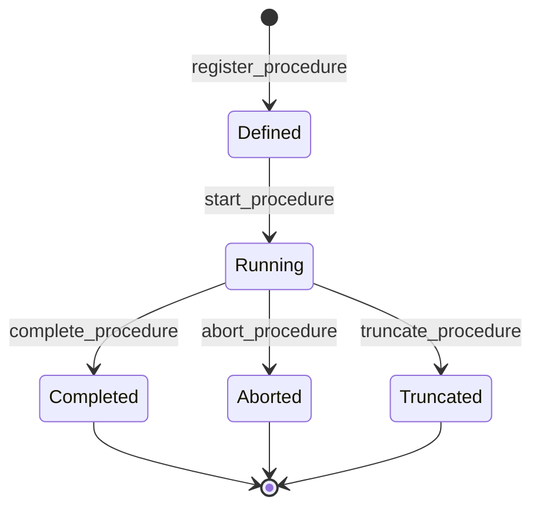

# Operation module <span class="md-maturity md-maturity--stable" title="Aggregate, FSM, six events, ten slices, projection, and per-step entry table all locked.">stable</span>

## Purpose & Scope

The Operation module models one execution of an episodic operational task: bakeout, calibration sweep, optical alignment, beam-mode change, recovery procedure, ID maintenance, KB switching. Operators register a Procedure, start it, append per-step records (setpoint applied, action performed, check verified), then close it via complete, abort, or truncate. Both instrument-level and facility-envelope procedures share this aggregate.

A Procedure is distinct from a Run: a Run executes one Plan against a Subject through the experiment lifecycle (ISA-88 batch lens); a Procedure executes one episodic task that may or may not be bound to a Run (ISA-106 lens). When `parent_run_id` is set, the Procedure is a Phase-of-Run (calibration sweep invoked mid-Run); when None, it stands alone (bakeout run between Runs).

<div class="cora-aside cora-aside--deferred" markdown>

Out of scope
{: .cora-kicker }

- **Held / Resumed transitions.** No pause-and-resume cycle today. The pilot will surface whether operators need it; the additive-state pattern keeps the door open.
- **Verifying as a first-class FSM state.** Per-step Check happens inside Running synchronously; the standards corpus does not bless a separate Verifying state.
- **Per-kind payload validation at the API.** The step `payload` body is `dict[str, Any]` today; per-kind Pydantic models land once pilot vocabulary settles.
- **Asset-existence verification at register time.** `target_asset_ids` is taken at face value; existence and decommission-state gating runs at start-procedure time.

</div>

## Aggregates

| Name | Identity | State summary | FSM |
|---|---|---|---|
| `Procedure` | `id: UUID` (opaque) | name, kind, target asset ids, status, optional `parent_run_id`, optional `steps_logbook_id`, optional `capability_id`, optional `recipe_id` | yes |

## Value Objects

| Name | Shape | Where used |
|---|---|---|
| `ProcedureName` | trimmed bounded text, 1-200 chars | `Procedure.name` |
| `ProcedureAbortReason` | trimmed bounded text, 1-500 chars; decider-input only | `abort_procedure` body |
| `ProcedureTruncateReason` | trimmed bounded text, 1-500 chars; decider-input only | `truncate_procedure` body |
| `ProcedureStatus` | closed StrEnum `{Defined, Running, Completed, Aborted, Truncated}` | `Procedure.status` |
| `StepKind` | closed `Literal["setpoint", "action", "check"]` | per-step entry rows |

`Procedure.kind` is a bare `str` (1-50 chars, validated at the decider) rather than a VO, mirroring the `Supply.kind` precedent: pilot vocabulary will settle and the field will graduate to a closed `ProcedureKind` StrEnum later. Documented starter vocabulary: `bakeout`, `calibration`, `alignment`, `recovery`, `beam_mode_change`, `id_maintenance`, `kb_switching`, `optical_alignment`, `vacuum_regeneration`.

## FSM



| From | To | Command | Event |
|---|---|---|---|
| `[*]` | `Defined` | `register_procedure` | `ProcedureRegistered` |
| `Defined` | `Running` | `start_procedure` | `ProcedureStarted` |
| `Running` | `Completed` | `complete_procedure` | `ProcedureCompleted` |
| `Running` | `Aborted` | `abort_procedure` | `ProcedureAborted` |
| `Running` | `Truncated` | `truncate_procedure` | `ProcedureTruncated` |

**Guards.** Beyond the source-state check, each transition enforces:

`start_procedure`
: Re-loads every target Asset and refuses to start if any are Decommissioned, raising `ProcedurePlanAssetDecommissionedError`. Bound Capability (when `capability_id` is set) must list `Procedure` in its `executor_shapes`, otherwise `ProcedureCapabilityExecutorMismatchError`.

`abort_procedure` / `truncate_procedure`
: `reason` is REQUIRED, trimmed, 1-500 chars. `truncate_procedure` accepts an optional `interrupted_at` (operator's best guess at the actual interruption time); validated to be not later than `now`.

`append_procedure_steps`
: Status must be `Running`. Appending to a `Defined`, `Completed`, `Aborted`, or `Truncated` Procedure raises `ProcedureStepsLogbookClosedError` (the steps logbook is implicitly closed on every terminal). `step_kind` must be one of `setpoint`, `action`, `check`. Producer-supplied `event_id` deduplicates retries silently via `ON CONFLICT (event_id) DO NOTHING`.

## Events

| Event | Payload sketch | When emitted |
|---|---|---|
| `ProcedureRegistered` | `procedure_id, name, kind, target_asset_ids, parent_run_id?, capability_id?, occurred_at` | `register_procedure` accepted; status implicitly `Defined`. |
| `ProcedureStarted` | `procedure_id, occurred_at` | `start_procedure` accepted (Defined → Running). |
| `ProcedureStepsLogbookOpened` | `procedure_id, logbook_id, kind="steps", schema, occurred_at` | First `append_procedure_steps` call for the Procedure (lazy open). |
| `ProcedureCompleted` | `procedure_id, occurred_at` | `complete_procedure` accepted (Running → Completed). |
| `ProcedureAborted` | `procedure_id, reason, occurred_at` | `abort_procedure` accepted (Running → Aborted). |
| `ProcedureTruncated` | `procedure_id, reason, interrupted_at?, occurred_at` | `truncate_procedure` accepted (Running → Truncated). |

Per-step records (one row per setpoint, action, or check) write directly to the `entries_operation_procedure_steps` table via the StepStore port, NOT as events on the Procedure stream. No `ProcedureStepsLogbookClosed` event is emitted; the FSM terminal IS the close signal.

## Slices

| Command | Category | REST | MCP tool | Idempotency |
|---|---|---|---|---|
| `RegisterProcedure` | NEW | `POST /procedures` | `register_procedure` | required |
| `RegisterProcedureFromRecipe` | NEW | `POST /procedures/from-recipe` | `register_procedure_from_recipe` | required |
| `StartProcedure` | MODIFIED | `POST /procedures/{procedure_id}/start` | `start_procedure` | none |
| `AppendProcedureSteps` | MODIFIED | `POST /procedures/{procedure_id}/steps` | `append_procedure_steps` | producer-supplied `event_id` per entry |
| `ConductProcedure` | MODIFIED | `POST /procedures/{procedure_id}/conduct` | `conduct_procedure` | none |
| `CompleteProcedure` | MODIFIED | `POST /procedures/{procedure_id}/complete` | `complete_procedure` | none |
| `AbortProcedure` | MODIFIED | `POST /procedures/{procedure_id}/abort` | `abort_procedure` | none |
| `TruncateProcedure` | MODIFIED | `POST /procedures/{procedure_id}/truncate` | `truncate_procedure` | none |
| `GetProcedure` | QUERY | `GET /procedures/{procedure_id}` | `get_procedure` | none |
| `ListProcedures` | QUERY | `GET /procedures` | `list_procedures` | none |

**Errors per slice.** Beyond Pydantic boundary 422s, each slice raises:

`RegisterProcedure`
: `ProcedureAlreadyExistsError`, `InvalidProcedureNameError`, `InvalidProcedureKindError`, `Unauthorized`

`StartProcedure`
: `ProcedureNotFoundError`, `ProcedureCannotStartError`, `ProcedurePlanAssetDecommissionedError`, `ProcedureCapabilityExecutorMismatchError`, `ProcedureRequiresAvailableSupplyError` (no Supply registered for a kind in the parent Run's `Method.needed_supplies`), `ProcedureSupplyCoverageMismatchError` (Supplies exist but none Available), and (for Phase-of-Run Procedures only) `RunNotFoundError` / `PlanNotFoundError` / `PracticeNotFoundError` / `MethodNotFoundError` if the parent-resolution chain has a broken link, `Unauthorized`. The Supply gate fires only when `parent_run_id` is set; standalone Procedures pass trivially today (Capability-level `needed_supplies` is a watch item).

`AppendProcedureSteps`
: `ProcedureNotFoundError`, `ProcedureStepsLogbookClosedError`, `InvalidStepKindError`, `Unauthorized`

`CompleteProcedure` / `AbortProcedure` / `TruncateProcedure`
: `ProcedureNotFoundError`, `ProcedureCannot<Verb>Error` (single-source from `Running`), `Unauthorized`. Abort additionally raises `InvalidProcedureAbortReasonError`; Truncate additionally raises `InvalidProcedureTruncateReasonError` and `InvalidProcedureInterruptedAtError`.

`GetProcedure`
: `ProcedureNotFoundError`

`ListProcedures`
: (boundary 422 only)

## Storage & Projections

`proj_operation_procedure_summary`:

```sql title="proj_operation_procedure_summary"
CREATE TABLE proj_operation_procedure_summary (
    procedure_id           UUID        PRIMARY KEY,
    name                   TEXT        NOT NULL,
    kind                   TEXT        NOT NULL,
    target_asset_ids       UUID[]      NOT NULL DEFAULT '{}',
    parent_run_id          UUID,
    status                 TEXT        NOT NULL CHECK (
        status IN ('Defined', 'Running', 'Completed', 'Aborted', 'Truncated')
    ),
    steps_logbook_id       UUID,
    registered_at          TIMESTAMPTZ NOT NULL,
    last_status_changed_at TIMESTAMPTZ,
    last_status_reason     TEXT,
    interrupted_at         TIMESTAMPTZ,
    updated_at             TIMESTAMPTZ NOT NULL DEFAULT now()
);

CREATE INDEX proj_operation_procedure_summary_keyset_idx
    ON proj_operation_procedure_summary (registered_at, procedure_id);
CREATE INDEX proj_operation_procedure_summary_target_assets_gin_idx
    ON proj_operation_procedure_summary USING GIN (target_asset_ids);
```

`last_status_changed_at` updates on every transition out of Defined; `last_status_reason` is populated by Aborted and Truncated only (Completed is happy-path, no reason). `interrupted_at` is Truncated-only and carries the operator's best guess at when the actual interruption happened (distinct from `last_status_changed_at`, which is when the truncate command was processed). `steps_logbook_id` is NULL until the first step is appended and is set by `ProcedureStepsLogbookOpened` independently of any lifecycle transition.

`entries_operation_procedure_steps`:

```sql title="entries_operation_procedure_steps"
CREATE TABLE entries_operation_procedure_steps (
    event_id            uuid              PRIMARY KEY,
    procedure_id        uuid              NOT NULL,
    logbook_id          uuid              NOT NULL,
    actor_id            uuid              NOT NULL,
    command_name        text              NOT NULL,
    step_kind           text              NOT NULL,
    payload             jsonb             NOT NULL,
    sampled_at          timestamptz       NOT NULL,
    occurred_at         timestamptz       NOT NULL,
    correlation_id      uuid              NOT NULL,
    causation_id        uuid,
    recorded_at         timestamptz       NOT NULL DEFAULT now()
);

CREATE INDEX entries_operation_procedure_steps_proc_sampled_idx
    ON entries_operation_procedure_steps (procedure_id, sampled_at DESC);
CREATE INDEX entries_operation_procedure_steps_proc_kind_sampled_idx
    ON entries_operation_procedure_steps (procedure_id, step_kind, sampled_at DESC);
CREATE INDEX entries_operation_procedure_steps_logbook_idx
    ON entries_operation_procedure_steps (logbook_id);
CREATE INDEX entries_operation_procedure_steps_recorded_at_brin_idx
    ON entries_operation_procedure_steps USING BRIN (recorded_at);

REVOKE UPDATE, DELETE, TRUNCATE ON entries_operation_procedure_steps FROM cora_app;
```

Polymorphic-with-discriminator: one row per step, with `step_kind` discriminating between `setpoint`, `action`, and `check`, and the per-kind body shape carried in the `payload` jsonb column. The table is append-only at the role level (UPDATE / DELETE / TRUNCATE revoked); `event_id` is the producer-supplied UUIDv7 idempotency key, so retrying a step submission with the same id is a silent no-op via `ON CONFLICT (event_id) DO NOTHING`. Three timestamps are recorded per entry: `sampled_at` (when the step physically happened in the field), `occurred_at` (when the handler processed the append), and `recorded_at` (when Postgres wrote the row).

## Cross-Module boundaries

| Module | Relationship | What's exchanged |
|---|---|---|
| `Trust` | gated-by | Every write-side Operation slice (`register_procedure`, `start_procedure`, step appenders, terminal transitions) is gated by the Authorize port resolving a `Policy` for the `(principal, command, conduit, surface)` tuple; deny outcomes refuse before the decider runs. |
| `Access` | shared-id-with | Every Procedure event envelope carries `actor_id` for principal attribution; cross-module references are bare UUIDs and not verified at write time. |
| `Equipment` | reads-from | `target_asset_ids` references Asset aggregates. Existence and Decommissioned-lifecycle gating runs at `start_procedure` time via `ProcedureStartContext`, NOT at register-time. |
| `Run` | reads-from (load-bearing for Supply gate) | Optional `parent_run_id` resolves the Phase-of-Run question: a Procedure with `parent_run_id` set is a Phase invoked mid-Run; `None` is a standalone Procedure. For Phase-of-Run Procedures, `start_procedure` loads the parent Run (then Plan → Practice → Method) to derive the `needed_supplies` for the Supply gate. A broken link anywhere in that chain raises a strict `<Aggregate>NotFoundError` rather than silently bypassing the gate. The Operation module does NOT load Run for standalone Procedures. |
| `Recipe` | reads-from (load-bearing) | Optional `capability_id` binds a Procedure to the universal Capability template. The bound Capability must list `Procedure` in its `executor_shapes`, enforced at `start_procedure`. For Phase-of-Run Procedures `start_procedure` also loads `Plan` → `Practice` → `Method` to derive the parent's `needed_supplies` for the Supply pre-flight gate. |
| `Supply` | reads-from (load-bearing for Phase-of-Run) | `SupplyLookup.find_supplies_by_kind(kinds=method.needed_supplies)` returns every non-`Decommissioned` Supply grouped by kind; the decider refuses to start unless every required kind has ≥1 Supply in `Available`. Raises `ProcedureRequiresAvailableSupplyError` or `ProcedureSupplyCoverageMismatchError` (both 409). Only fires for Phase-of-Run Procedures; standalone Procedures skip the gate today. |
| `Safety` | reads-from | `start_procedure` calls the Clearance lookup via `ProcedureBinding` references; at least one `Active` Clearance must cover the Procedure scope or start rejects. |
| `Caution` | reads-from | `start_procedure` calls `CautionLookup` for matching Active Cautions; non-blocking, surfaced as a banner on the response, never refuses start. |

## Examples

The four examples below follow the canonical Procedure path: register a calibration sweep targeting one Asset, start it, append one setpoint step + one check step, then complete it. The `append_procedure_steps` slice carries producer-supplied `event_id` per entry for safe retries (Idempotency-Key is not used at this slice). For the REST/MCP equivalence, auth, and idempotency conventions these examples share, see [Reading the examples](../index.md) on the Modules landing page.

<!-- extracted from tests/contract/operation/test_*.py -->

### Register a Procedure

=== "REST"

    ```http
    POST /procedures
    Content-Type: application/json
    Idempotency-Key: 9a7d2c3e-4b1f-4f6a-8a2e-5c2c4f3a7b91
    X-Principal-Id: 7b1f2d4e-2a3c-4d5e-8f9a-1b2c3d4e5f60

    {
      "name": "Beamline 2-BM rotary stage calibration sweep",
      "kind": "calibration",
      "target_asset_ids": ["c1f2d3c4-b5a6-4978-8869-7a6b5c4d3e2f"]
    }
    ```

    A successful call returns `201 Created` with `{"procedure_id": "<uuid>"}`. The Procedure starts in `Defined`.

=== "MCP"

    ```python
    mcp.call_tool(
        "register_procedure",
        {
            "name": "Beamline 2-BM rotary stage calibration sweep",
            "kind": "calibration",
            "target_asset_ids": ["c1f2d3c4-b5a6-4978-8869-7a6b5c4d3e2f"],
        },
    )
    ```

    Returns the same response shape as the REST call.

### Start the Procedure

=== "REST"

    ```http
    POST /procedures/{procedure_id}/start
    X-Principal-Id: 7b1f2d4e-2a3c-4d5e-8f9a-1b2c3d4e5f60
    ```

    A successful call returns `204 No Content`. Status moves to `Running`; the handler pre-loads each target Asset and refuses to start if any are Decommissioned.

=== "MCP"

    ```python
    mcp.call_tool("start_procedure", {"procedure_id": "<uuid>"})
    ```

    Returns the same response shape as the REST call.

### Append a setpoint and a check step

=== "REST"

    ```http
    POST /procedures/{procedure_id}/steps
    Content-Type: application/json
    X-Principal-Id: 7b1f2d4e-2a3c-4d5e-8f9a-1b2c3d4e5f60

    {
      "entries": [
        {
          "event_id": "0190f001-aaaa-7000-8000-000000000001",
          "step_kind": "setpoint",
          "payload": {
            "channel": "rotary.theta",
            "target_value": 90.0,
            "units": "deg",
            "ramp_rate": 5.0
          },
          "sampled_at": "2026-05-20T14:32:11Z"
        },
        {
          "event_id": "0190f001-aaaa-7000-8000-000000000002",
          "step_kind": "check",
          "payload": {
            "channel": "rotary.theta",
            "expected": 90.0,
            "actual": 89.998,
            "tolerance": 0.01,
            "passed": true
          },
          "sampled_at": "2026-05-20T14:32:18Z"
        }
      ]
    }
    ```

    A successful call returns `200 OK` with `{"event_count": 2}`. The first call also emits `ProcedureStepsLogbookOpened` on the Procedure stream (lazy open). Re-issuing the same `event_id` values silently dedupes via `ON CONFLICT (event_id) DO NOTHING`.

=== "MCP"

    ```python
    mcp.call_tool(
        "append_procedure_steps",
        {
            "procedure_id": "<uuid>",
            "entries": [
                {
                    "event_id": "0190f001-aaaa-7000-8000-000000000001",
                    "step_kind": "setpoint",
                    "payload": {
                        "channel": "rotary.theta",
                        "target_value": 90.0,
                        "units": "deg",
                        "ramp_rate": 5.0,
                    },
                    "sampled_at": "2026-05-20T14:32:11Z",
                },
                {
                    "event_id": "0190f001-aaaa-7000-8000-000000000002",
                    "step_kind": "check",
                    "payload": {
                        "channel": "rotary.theta",
                        "expected": 90.0,
                        "actual": 89.998,
                        "tolerance": 0.01,
                        "passed": True,
                    },
                    "sampled_at": "2026-05-20T14:32:18Z",
                },
            ],
        },
    )
    ```

    Returns the same response shape as the REST call.

### Complete the Procedure

=== "REST"

    ```http
    POST /procedures/{procedure_id}/complete
    X-Principal-Id: 7b1f2d4e-2a3c-4d5e-8f9a-1b2c3d4e5f60
    ```

    A successful call returns `204 No Content`. Status moves to `Completed`; the steps logbook is implicitly closed (subsequent `append_procedure_steps` calls return `409 Conflict`).

=== "MCP"

    ```python
    mcp.call_tool("complete_procedure", {"procedure_id": "<uuid>"})
    ```

    Returns the same response shape as the REST call.
