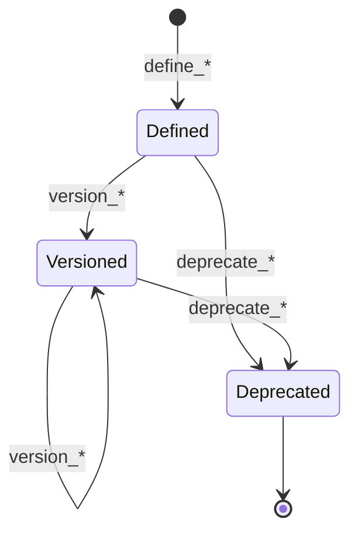

# Recipe module <span class="md-maturity md-maturity--stable" title="Track A core: four aggregates form the abstract→bound recipe ladder">stable</span>

## Purpose & Scope

The Recipe module owns the abstract description of how to run an experiment, from the universal operations template down to the asset-bound plan that a Run will execute. Four aggregates form a ladder: `Capability` is the universal declarative template that says what a class of operation does; `Method` is the science-community technique class; `Practice` is the facility's curated adaptation; and `Plan` binds a Practice to specific Asset instances and wires their ports together. The ladder follows the ISA-88 General → Site → Master/Control Recipe progression, with Capability sitting above the ladder as the executor-agnostic template that both Method-shaped science recipes and Procedure-shaped operational ceremonies (in the [Operation module](../operation/index.md)) realize.

Recipe is the "what we plan to do" layer. The "what actually happened" layer lives in the [Run module](../run/index.md), which takes a `Plan` and runs it. Recipe knows nothing about scheduling, execution, or runtime parameter capture; it knows about declaration, versioning, deprecation, and the cross-aggregate validation that catches mismatches at bind time.

<div class="cora-aside cora-aside--deferred" markdown>

Out of scope

- **Approval workflow.** No `approve_plan` / `withdraw_plan` slices today. Whether a Plan is allowed to run is a question owned by the Decision module (with a `RecipeApproval` context shape that lands when the first facility needs gated rollout). Recipe's lifecycle is purely declarative.
- **Per-Plan parameter overrides.** `Plan.default_parameters` is the operator's "what to use when nothing is overridden" baseline. The per-Run override and merged `effective_parameters` snapshot live on the Run aggregate.
- **Calibration binding.** Plans do not pin calibrations today; the [Calibration module](../calibration/index.md) resolves the active revision at Run start. A `Plan.pinned_calibration_ids` field lands when a facility needs reproducible runs against a frozen calibration set.
- **Capability code namespaces beyond `cora.capability.*`.** Facility-scoped extensions under `cora.capability.<facility>.*` are reserved but rejected today; the closed core opens when the first real cross-facility divergence demands it.
- **PaNET / EXPO trajectory facets.** Capability carries an executor-agnostic parameter schema and a required-affordance set; richer scientific-taxonomy facets defer until a pilot consumer asks for them.
- **Plan archiving and bulk export.** Plans accumulate forever today. Cold-storage hooks land when the first deployment outgrows the projection's working set.

</div>

## Aggregates

| Name | Identity | State summary | FSM |
|---|---|---|---|
| `Capability` | `id: UUID` | `id`, `code`, `name`, `status`, `version`, `description`, `required_affordances`, `executor_shapes`, `parameters_schema`, `replaced_by_capability_id`, `suggested_role_ids` | yes (3-state) |
| `Method` | `id: UUID` | `id`, `name`, `capability_id`, `needed_family_ids`, `needed_assembly_ids`, `needed_supplies`, `required_roles`, `parameters_schema`, `status`, `version`, `content_hash` | yes (3-state) |
| `Practice` | `id: UUID` | `id`, `name`, `method_id`, `site_id`, `status`, `version` | yes (3-state) |
| `Plan` | `id: UUID` | `id`, `name`, `practice_id`, `method_id`, `asset_ids`, `default_parameters`, `wires`, `role_bindings`, `status`, `version` | yes (3-state) |

## Value Objects

| Name | Shape | Where used |
|---|---|---|
| `CapabilityCode` | trimmed string under namespace prefix `cora.capability.`, 1-200 chars after prefix | `Capability.code` |
| `CapabilityName` | trimmed string, 1-200 chars | `Capability.name` |
| `ExecutorShape` | closed StrEnum: `Method` \| `Procedure` | `Capability.executor_shapes` |
| `CapabilityStatus` | closed StrEnum: `Defined` \| `Versioned` \| `Deprecated` | `Capability.status` |
| `MethodName` | trimmed string, 1-200 chars | `Method.name` |
| `MethodStatus` | closed StrEnum: `Defined` \| `Versioned` \| `Deprecated` | `Method.status` |
| `PracticeName` | trimmed string, 1-200 chars | `Practice.name` |
| `PracticeStatus` | closed StrEnum: `Defined` \| `Versioned` \| `Deprecated` | `Practice.status` |
| `PlanName` | trimmed string, 1-200 chars | `Plan.name` |
| `PlanStatus` | closed StrEnum: `Defined` \| `Versioned` \| `Deprecated` | `Plan.status` |
| `Wire` | 4-tuple `(source_asset_id, source_port_name, target_asset_id, target_port_name)`; port names 1-100 chars after trim | `Plan.wires` |
| `RoleName` | trimmed string, 1-50 chars; Method-local positional role label | `RoleRequirement.role_name`, `RoleBinding.role_name` |
| `PortRequirement` | 3-tuple `(port_name, direction, signal_type)`; `direction` is the Equipment `PortDirection` enum; port name + signal type bounds mirror Asset.ports | `RoleRequirement.required_ports` |
| `RoleRequirement` | tuple `(role_name, role_kind, family_id, required_ports, optional)`; `role_kind: UUID \| None` targets a global Role contract, `family_id: UUID \| None` is the anatomical escape hatch, with an XOR invariant (exactly one set) | `Method.required_roles` |
| `RoleBinding` | tuple `(role_name, asset_id)`; pins which Asset fills a declared role slot | `Plan.role_bindings` |

Version tags (`version_tag`) are operator-supplied free text, 1-50 chars after trim, validated at the API boundary and defensively in the decider; no value-object wrapper. Tags can be semver (`v2.1.0`), date-stamped (`2026-Q3`), or institution-specific.

`RoleRequirement` carries either `role_kind` (the federation-portable path: any Asset whose bound Family advertises `role_kind` in its `presents_as` and whose affordances superset the Role's `required_affordances` satisfies it) or `family_id` (the slice-1 anatomical escape hatch: direct family-id membership). The XOR is enforced in the `RoleRequirement.__post_init__` (both-set raises `RoleRequirementBindingDuplicateError`, neither-set raises `InvalidRoleRequirementTargetError`) and again at the wire layer. The `MethodRequiredRoleAdded` payload evolved additively to carry `role_kind` (no new event class); `Method.content_subset` renders `role_kind` only when non-None so pre-`role_kind` Methods keep their `content_hash` byte-stable.

The `Affordance` enum used in `Capability.required_affordances` is owned by the [Equipment module](../equipment/index.md) and imported here; Capability's required-affordance set is the contract any implementer's bound Family.affordances must cover.

## FSM

All four aggregates share the same three-state lifecycle. The genesis command differs; the version and deprecate transitions are identical.



| From | To | Command (per aggregate `*`) | Event |
|---|---|---|---|
| `[*]` | `Defined` | `define_*` | `*Defined` |
| `Defined` \| `Versioned` | `Versioned` | `version_*` | `*Versioned` |
| `Defined` \| `Versioned` | `Deprecated` | `deprecate_*` | `*Deprecated` |

`Deprecated` is terminal: no command re-activates a deprecated declaration. Existing carriers that reference a deprecated upstream entry remain valid for read paths; downstream bind-time checks (see `define_plan` guards) reject *new* bindings against deprecated Practices or Methods. Re-deprecating an already-`Deprecated` aggregate raises (strict-not-idempotent). Re-versioning a `Versioned` aggregate with the same tag succeeds and emits a fresh event; re-attestation is a legitimate audit moment.

Schema and wiring updates (`update_method_parameters_schema`, `update_plan_default_parameters`, `add_plan_wire`, `remove_plan_wire`) are orthogonal to the lifecycle: they are permitted in `Defined`, `Versioned`, and `Deprecated` alike.

## Events

### Capability

| Event | Payload sketch | When emitted |
|---|---|---|
| `CapabilityDefined` | `capability_id`, `code`, `name`, `required_affordances`, `executor_shapes`, `parameters_schema?`, `description?`, `occurred_at` | `define_capability` succeeds (genesis) |
| `CapabilityVersioned` | `capability_id`, `version_tag`, `required_affordances`, `executor_shapes`, `parameters_schema?`, `description?`, `occurred_at` | `version_capability` succeeds; the full declarative contract replaces wholesale |
| `CapabilityDeprecated` | `capability_id`, `replaced_by_capability_id?`, `occurred_at` | `deprecate_capability` succeeds; the optional pointer marks a successor |
| `CapabilitySuggestedRolesUpdated` | `capability_id`, `suggested_role_ids`, `occurred_at` | `update_capability_suggested_roles` succeeds; the editorial set replaces wholesale (orthogonal to the lifecycle) |

### Method

| Event | Payload sketch | When emitted |
|---|---|---|
| `MethodDefined` | `method_id`, `name`, `capability_id`, `needed_family_ids`, `needed_supplies`, `occurred_at` | `define_method` succeeds (genesis) |
| `MethodVersioned` | `method_id`, `version_tag`, `occurred_at` | `version_method` succeeds |
| `MethodDeprecated` | `method_id`, `occurred_at` | `deprecate_method` succeeds |
| `MethodParametersSchemaUpdated` | `method_id`, `parameters_schema?`, `occurred_at` | `update_method_parameters_schema` succeeds; the schema replaces wholesale (None clears) |

### Practice

| Event | Payload sketch | When emitted |
|---|---|---|
| `PracticeDefined` | `practice_id`, `name`, `method_id`, `site_id`, `occurred_at` | `define_practice` succeeds (genesis) |
| `PracticeVersioned` | `practice_id`, `version_tag`, `occurred_at` | `version_practice` succeeds |
| `PracticeDeprecated` | `practice_id`, `occurred_at` | `deprecate_practice` succeeds |

### Plan

| Event | Payload sketch | When emitted |
|---|---|---|
| `PlanDefined` | `plan_id`, `name`, `practice_id`, `asset_ids`, `method_id`, `method_needed_family_ids_snapshot`, `asset_families_snapshot`, `occurred_at` | `define_plan` succeeds (genesis); audit snapshots are payload-only, not folded into state |
| `PlanVersioned` | `plan_id`, `version_tag`, `occurred_at` | `version_plan` succeeds |
| `PlanDeprecated` | `plan_id`, `occurred_at` | `deprecate_plan` succeeds |
| `PlanDefaultParametersUpdated` | `plan_id`, `default_parameters`, `occurred_at` | `update_plan_default_parameters` succeeds; the resolved post-merge dict is captured |
| `PlanWireAdded` | `plan_id`, `source_asset_id`, `source_port_name`, `target_asset_id`, `target_port_name`, `occurred_at` | `add_plan_wire` succeeds |
| `PlanWireRemoved` | `plan_id`, `source_asset_id`, `source_port_name`, `target_asset_id`, `target_port_name`, `occurred_at` | `remove_plan_wire` succeeds |

The `PlanDefined` audit snapshots pin what was checked at bind time (`method_needed_family_ids_snapshot`, `asset_families_snapshot`) so the audit trail reproduces the validation even if Method or Asset state evolves later. The snapshots are payload-only; the evolver does not fold them into state.

## Slices

| Command | Category | REST | MCP tool | Idempotency |
|---|---|---|---|---|
| `DefineCapability` | NEW | `POST /capabilities` | `define_capability` | required |
| `VersionCapability` | MODIFIED | `POST /capabilities/{capability_id}/version` | `version_capability` | none |
| `DeprecateCapability` | MODIFIED | `POST /capabilities/{capability_id}/deprecate` | `deprecate_capability` | none |
| `UpdateCapabilitySuggestedRoles` | NEW | `POST /capabilities/{capability_id}/suggested-roles` | `update_capability_suggested_roles` | none |
| `GetCapability` | QUERY | `GET /capabilities/{capability_id}` | `get_capability` | none |
| `DefineMethod` | NEW | `POST /methods` | `define_method` | required |
| `VersionMethod` | MODIFIED | `POST /methods/{method_id}/version` | `version_method` | none |
| `DeprecateMethod` | MODIFIED | `POST /methods/{method_id}/deprecate` | `deprecate_method` | none |
| `UpdateMethodParametersSchema` | MODIFIED | `PUT /methods/{method_id}/parameters-schema` | `update_method_parameters_schema` | none |
| `GetMethod` | QUERY | `GET /methods/{method_id}` | `get_method` | none |
| `ListMethods` | QUERY | `GET /methods` | `list_methods` | none |
| `DefinePractice` | NEW | `POST /practices` | `define_practice` | required |
| `VersionPractice` | MODIFIED | `POST /practices/{practice_id}/version` | `version_practice` | none |
| `DeprecatePractice` | MODIFIED | `POST /practices/{practice_id}/deprecate` | `deprecate_practice` | none |
| `GetPractice` | QUERY | `GET /practices/{practice_id}` | `get_practice` | none |
| `ListPractices` | QUERY | `GET /practices` | `list_practices` | none |
| `DefinePlan` | NEW | `POST /plans` | `define_plan` | required |
| `VersionPlan` | MODIFIED | `POST /plans/{plan_id}/version` | `version_plan` | none |
| `DeprecatePlan` | MODIFIED | `POST /plans/{plan_id}/deprecate` | `deprecate_plan` | none |
| `UpdatePlanDefaultParameters` | MODIFIED | `PATCH /plans/{plan_id}/default-parameters` | `update_plan_default_parameters` | none |
| `AddPlanWire` | MODIFIED | `POST /plans/{plan_id}/wires` | `add_plan_wire` | none |
| `RemovePlanWire` | MODIFIED | `DELETE /plans/{plan_id}/wires` | `remove_plan_wire` | none |
| `BindPlanRole` | MODIFIED | `POST /plans/{plan_id}/bind-role` | `bind_plan_role` | none |
| `GetPlan` | QUERY | `GET /plans/{plan_id}` | `get_plan` | none |
| `ListPlans` | QUERY | `GET /plans` | `list_plans` | none |
| `InspectPlanBinding` | QUERY | `POST /plans/inspect-binding` | `inspect_plan_binding` | none |

`define_plan` is the only slice with cross-aggregate state validation in the decider. The handler pre-loads the Practice, the Method (via `practice.method_id`), and every bound Asset, then hands them to the pure decider as a `PlanBindingContext`. The decider rejects bindings against deprecated upstream entries, against decommissioned Assets, against family sets that do not cover the Method's needs, and against affordance sets that do not cover the bound Capability's contract.

`inspect_plan_binding` is the read-only preview-before-define companion to `define_plan`. It runs the same Practice -> Method -> Capability -> per-Asset -> per-Family load fan-out without emitting events, then returns a diagnostic with the wired Assets' conditions, their contributed affordances, any missing families or affordances, and (when a pool is configured) other facility Assets whose Families could cover each missing affordance. Operators use it to see condition (Nominal / Degraded / Faulted) and lifecycle (Commissioned / Decommissioned / Maintenance) of candidate Assets before committing the bind. The candidate enumeration is projection-backed: it cross-reads Equipment's `proj_equipment_asset_family_membership` join projection via the `cora.equipment.aggregates.family.read` aggregate surface (`list_family_ids` + `list_asset_ids_in_families`). In in-memory test mode (no pool) the candidate lookup is skipped gracefully and the field is empty.

`update_plan_default_parameters` accepts a JSON Merge Patch (RFC 7396); the slice merges against the current state, then the decider validates the merged result against the owning Method's `parameters_schema`. The event payload carries the resolved snapshot, not the patch.

`add_plan_wire` and `remove_plan_wire` enforce port-graph invariants in the decider: source ports must have `direction=OUTPUT`, target ports must have `direction=INPUT`, `signal_type` values must match exactly, both endpoint Assets must be in the Plan's bound set, both endpoint port names must exist on those Assets, target ports may receive at most one incoming wire (fan-in forbidden), and self-loops are allowed only between distinct ports on the same Asset.

`bind_plan_role` pins which Asset fills a `RoleRequirement` declared on the Plan's Method. The satisfaction check bifurcates on the matching `RoleRequirement`'s XOR target. The `family_id` path is the existing direct-membership check (`role.family_id in asset.family_ids`). The `role_kind` path is an ANY-single-family disjunction: the handler edge-loads the Role via `RoleLookup` plus a `FamilyLookup` batch over the Asset's `family_ids` (and, when the Asset is part of a Fixture, the materialized Assembly via `AssemblyLookup`), then the decider accepts the binding iff at least one bound Family advertises `role_kind` in its `presents_as` and carries affordances superset of the Role's `required_affordances`, or the composed Assembly's `presents_as` contains `role_kind`. A Role contract id that does not resolve at the handler edge surfaces as `RoleNotFoundError` (404). Port-coverage and wire-graph consistency checks run after satisfaction, unchanged.

`update_capability_suggested_roles` authors the editorial `Capability.suggested_role_ids` set wholesale (the body key is `suggested_role_ids`, an empty list clears it). The field is documentation-only: it records which global Role contracts an operator suggests the Capability is naturally satisfied by, and no fitness test or decider gates Method authoring against it. The handler edge-loads every `role_id` via `RoleLookup` (parallel batch) so an unresolved id returns `RoleNotFoundError` (404) rather than recording a dangling suggestion. The slice is restricted to `Defined` and `Versioned` Capabilities; a `Deprecated` Capability rejects with `CapabilityCannotUpdateSuggestedRolesError`.

**Errors per slice.** Beyond Pydantic boundary 422s, each slice raises:

`DefineCapability`
: `InvalidCapabilityCodeError`, `InvalidCapabilityNameError`, `InvalidCapabilityDescriptionError`, `InvalidExecutorShapesError`, `CapabilityAlreadyExistsError`, `Unauthorized`

`VersionCapability`
: `CapabilityNotFoundError`, `CapabilityCannotVersionError`, `InvalidCapabilityVersionTagError`, `InvalidExecutorShapesError`, `Unauthorized`

`DeprecateCapability`
: `CapabilityNotFoundError`, `CapabilityCannotDeprecateError`, `Unauthorized`

`UpdateCapabilitySuggestedRoles`
: `CapabilityNotFoundError`, `CapabilityCannotUpdateSuggestedRolesError` (Deprecated rejects), `RoleNotFoundError` (any supplied role_id fails the handler-side `RoleLookup`), `Unauthorized`

`GetCapability`
: `CapabilityNotFoundError`

`DefineMethod`
: `InvalidMethodNameError`, `InvalidMethodNeededSuppliesError`, `MethodAlreadyExistsError`, `CapabilityNotFoundError` (handler-load), `MethodParametersNotSubsetError` (when the Method's schema does not subset the bound Capability's contract), `Unauthorized`

`VersionMethod`
: `MethodNotFoundError`, `MethodCannotVersionError`, `InvalidMethodVersionTagError`, `Unauthorized`

`DeprecateMethod`
: `MethodNotFoundError`, `MethodCannotDeprecateError`, `Unauthorized`

`UpdateMethodParametersSchema`
: `MethodNotFoundError`, `InvalidMethodParametersSchemaError`, `MethodParametersNotSubsetError`, `Unauthorized`

`GetMethod`, `ListMethods`
: `MethodNotFoundError` (Get only); boundary 422 only otherwise

`DefinePractice`
: `InvalidPracticeNameError`, `PracticeAlreadyExistsError`, `Unauthorized`

`VersionPractice`
: `PracticeNotFoundError`, `PracticeCannotVersionError`, `InvalidPracticeVersionTagError`, `Unauthorized`

`DeprecatePractice`
: `PracticeNotFoundError`, `PracticeCannotDeprecateError`, `Unauthorized`

`GetPractice`, `ListPractices`
: `PracticeNotFoundError` (Get only); boundary 422 only otherwise

`DefinePlan`
: `InvalidPlanNameError`, `PlanAssetsRequiredError` (empty `asset_ids`), `PlanAlreadyExistsError`, `PracticeNotFoundError`, `MethodNotFoundError`, `AssetNotFoundError`, `PlanBoundPracticeDeprecatedError`, `PlanBoundMethodDeprecatedError`, `PlanAssetDecommissionedError`, `PlanFamiliesNotSatisfiedError`, `PlanAffordancesNotSatisfiedError`, `Unauthorized`

`VersionPlan`
: `PlanNotFoundError`, `PlanCannotVersionError`, `InvalidPlanVersionTagError`, `Unauthorized`

`DeprecatePlan`
: `PlanNotFoundError`, `PlanCannotDeprecateError`, `Unauthorized`

`UpdatePlanDefaultParameters`
: `PlanNotFoundError`, `InvalidPlanDefaultParametersError`, `Unauthorized`

`AddPlanWire`
: `PlanNotFoundError`, `InvalidWireError`, `PlanWireAlreadyExistsError`, `PlanWireAssetNotBoundError`, `PlanWirePortNotFoundError`, `PlanWireDirectionMismatchError`, `PlanWireSignalTypeMismatchError`, `PlanWireTargetAlreadyConnectedError`, `PlanWireSelfLoopError`, `Unauthorized`

`RemovePlanWire`
: `PlanNotFoundError`, `InvalidWireError`, `PlanWireNotFoundError`, `Unauthorized`

`BindPlanRole`
: `PlanNotFoundError`, `PlanCannotMutateRoleBindingsError` (Plan not `Defined`), `PlanRoleAssetNotBoundError`, `PlanRoleAlreadyBoundError`, `MethodNotFoundError`, `PlanRoleNameNotDeclaredError`, `AssetNotFoundError`, `RoleNotFoundError` (`role_kind` path edge-load), `PlanRoleFamilyMismatchError` (`family_id` path), `PlanRoleFamilyNotResolvableError` (`role_kind` path; an Asset Family does not resolve via `FamilyLookup`), `PlanRoleAssetCannotPresentError` (`role_kind` path; no Family or composed Assembly presents the Role with covering affordances), `PlanRolePortCoverageNotSatisfiedError`, `PlanWireRoleEndpointMismatchError`, `Unauthorized`

`GetPlan`, `ListPlans`
: `PlanNotFoundError` (Get only); boundary 422 only otherwise

`InspectPlanBinding`
: `PracticeNotFoundError`, `MethodNotFoundError`, `AssetNotFoundError`, `CapabilityNotFoundError`, `FamilyNotFoundError`, `Unauthorized` (same NotFound set as `DefinePlan` since both share the load fan-out)

## Storage & Projections

Four read-side tables back the Recipe module, one per aggregate. All four follow the same lifecycle-summary shape: a single row per aggregate, mutated by `ON CONFLICT` upserts as the lifecycle events arrive.

```sql title="proj_recipe_capability_summary"
CREATE TABLE proj_recipe_capability_summary (
    capability_id              UUID        PRIMARY KEY,
    code                       TEXT        NOT NULL,
    name                       TEXT        NOT NULL,
    status                     TEXT        NOT NULL
        CHECK (status IN ('Defined', 'Versioned', 'Deprecated')),
    version_tag                TEXT,
    description                TEXT,
    required_affordances       TEXT[]      NOT NULL DEFAULT ARRAY[]::TEXT[],
    executor_shapes            TEXT[]      NOT NULL DEFAULT ARRAY[]::TEXT[],
    parameters_schema_present  BOOLEAN     NOT NULL DEFAULT FALSE,
    replaced_by_capability_id  UUID,
    suggested_role_ids         UUID[]      NOT NULL DEFAULT ARRAY[]::UUID[],
    versioned_at               TIMESTAMPTZ,
    deprecated_at              TIMESTAMPTZ,
    created_at                 TIMESTAMPTZ NOT NULL,
    updated_at                 TIMESTAMPTZ NOT NULL DEFAULT now()
);

CREATE INDEX proj_recipe_capability_summary_keyset_idx
    ON proj_recipe_capability_summary (created_at, capability_id);
```

```sql title="proj_recipe_method_summary"
CREATE TABLE proj_recipe_method_summary (
    method_id                 UUID        PRIMARY KEY,
    name                      TEXT        NOT NULL,
    status                    TEXT        NOT NULL
        CHECK (status IN ('Defined', 'Versioned', 'Deprecated')),
    version_tag               TEXT,
    parameters_schema_present BOOLEAN     NOT NULL DEFAULT FALSE,
    versioned_at              TIMESTAMPTZ,
    deprecated_at             TIMESTAMPTZ,
    content_hash              TEXT,
    created_at                TIMESTAMPTZ NOT NULL,
    updated_at                TIMESTAMPTZ NOT NULL DEFAULT now()
);

CREATE INDEX proj_recipe_method_summary_keyset_idx
    ON proj_recipe_method_summary (created_at, method_id);
```

```sql title="proj_recipe_practice_summary"
CREATE TABLE proj_recipe_practice_summary (
    practice_id    UUID        PRIMARY KEY,
    name           TEXT        NOT NULL,
    method_id      UUID        NOT NULL,
    site_id        UUID        NOT NULL,
    status         TEXT        NOT NULL
        CHECK (status IN ('Defined', 'Versioned', 'Deprecated')),
    version_tag    TEXT,
    versioned_at   TIMESTAMPTZ,
    deprecated_at  TIMESTAMPTZ,
    created_at     TIMESTAMPTZ NOT NULL,
    updated_at     TIMESTAMPTZ NOT NULL DEFAULT now()
);

CREATE INDEX proj_recipe_practice_summary_keyset_idx
    ON proj_recipe_practice_summary (created_at, practice_id);
CREATE INDEX proj_recipe_practice_summary_method_idx
    ON proj_recipe_practice_summary (method_id);
```

```sql title="proj_recipe_plan_summary"
CREATE TABLE proj_recipe_plan_summary (
    plan_id                    UUID        PRIMARY KEY,
    name                       TEXT        NOT NULL,
    practice_id                UUID        NOT NULL,
    method_id                  UUID        NOT NULL,
    status                     TEXT        NOT NULL
        CHECK (status IN ('Defined', 'Versioned', 'Deprecated')),
    version_tag                TEXT,
    default_parameters_present BOOLEAN     NOT NULL DEFAULT FALSE,
    versioned_at               TIMESTAMPTZ,
    deprecated_at              TIMESTAMPTZ,
    content_hash               TEXT,
    created_at                 TIMESTAMPTZ NOT NULL,
    updated_at                 TIMESTAMPTZ NOT NULL DEFAULT now()
);

CREATE INDEX proj_recipe_plan_summary_keyset_idx
    ON proj_recipe_plan_summary (created_at, plan_id);
CREATE INDEX proj_recipe_plan_summary_practice_idx
    ON proj_recipe_plan_summary (practice_id);
```

`GET /{aggregate}/{id}` for Method, Practice, and Plan folds the event stream so the response reflects the latest committed write without projection lag. `GET /capabilities/{id}` does the same. The four `list_*` slices (and `get_capability`'s list variants when they land) read from the projections with keyset pagination over `(created_at, {aggregate}_id)`.

The Capability summary carries `required_affordances` and `executor_shapes` as `TEXT[]` so a future filter on "list capabilities affording X" is an index add, not a column add. `parameters_schema_present` is a boolean; the schema content itself stays in the event stream to keep the summary row small. `suggested_role_ids` is a `UUID[]` maintained by `CapabilitySuggestedRolesUpdated` wholesale-replace; it is documentation-only (no fitness check binds Methods to it) and defaults to the empty array for every pre-existing row. The Plan summary intentionally omits `asset_ids` (a multi-valued binding); a future `proj_recipe_plan_assets` join table will surface "all plans using Asset X" when use cases demand it. `Plan.default_parameters` and `Plan.wires` also stay out of the summary; both fold from the event stream on single-Plan reads.

All four summaries carry `versioned_at` + `deprecated_at` lifecycle timestamps (Path C: state stays minimal, projection holds the timeline). Method and Plan also carry `content_hash` for content-addressed identity lookup. The Capability summary previously had a UNIQUE index on `code` for write-time collision detection; that constraint was dropped (the decider already enforces code uniqueness against the aggregate stream, and the index added migration friction for re-versioning workflows) and the constraint is reachable via a future projection-level check if pilot demand surfaces.

## Cross-Module boundaries

| Module | Relationship | What's exchanged |
|---|---|---|
| Equipment | depends-on | `Method.needed_family_ids` references `Family.id` values; `Plan.asset_ids` references `Asset.id` values; `Plan.wires` reference `Asset.ports` declared on bound Assets; `Capability.required_affordances` uses the `Affordance` enum owned by Equipment; `RoleRequirement.role_kind` and `Capability.suggested_role_ids` reference global `Role` contract ids resolved at the handler edge via `RoleLookup`; the `bind_plan_role` `role_kind` path reads `Family.presents_as` + `Family.affordances` (via `FamilyLookup`) and a composed `Assembly.presents_as` (via `AssemblyLookup`) |
| Operation | shared-enum-with | `Capability.executor_shapes` lists `Procedure` as a valid implementer; `Procedure.capability_id` (Operation BC) points back at a Capability declared here |
| Supply | depends-on-kind | `Method.needed_supplies` references `Supply.kind` strings (instance-aggregate vs type-aggregate asymmetry, since kinds are facility-portable and instance UUIDs are not) |
| Run | upstream-of | `Run.plan_id` references a Plan; the Method's `parameters_schema` is the validation contract for Run parameter overrides |
| Calibration | upstream-of | `Run.pinned_calibration_ids` (resolved at Run start) is keyed by Asset and Capability/quantity tuples that originate in the Recipe ladder |
| Decision | shared-id-with | `Decision.subject_id` may point at a Plan when the decision relates to recipe approval or rollback (advisory today) |
| Trust | gated-by | every Recipe slice is gated by an `Authorize` check; new Plan-binding may carry a Zone scope when a facility wires policy against beamline ownership |
| Access | shared-id-with | every event carries `actor_id` on the envelope; the originating principal is an Actor |

Cross-aggregate references inside Recipe (Practice → Method, Plan → Practice, Plan → Asset) and cross-module references (Method → Family, Method → Supply kind) follow the eventual-consistency stance: deciders do not verify the reference exists at write time. Mismatch surfaces at Plan binding, where the `define_plan` handler pre-loads the entire dependency graph and the decider rejects structurally invalid bindings.

## Examples

The four examples below cover a typical declaration walk: a universal Capability, a Method that realizes it, a Plan that binds the Method (via a Practice) to specific Assets, and a wire added to the Plan to connect two ports. Practice definition follows the same shape as Method and is omitted for brevity. For the REST/MCP equivalence, auth, and idempotency conventions these examples share, see [Reading the examples](../index.md) on the Modules landing page.

### Define a Capability

=== "REST"

    ```http
    POST /capabilities
    Content-Type: application/json
    Idempotency-Key: 7e2c1a4b-9f3d-4a2c-8b1e-5d4f3a2b1c0d
    X-Principal-Id: 11111111-2222-3333-4444-555555555555

    {
      "code": "cora.capability.continuous_rotation_sweep",
      "name": "Continuous Rotation Sweep",
      "description": "Sample rotates continuously while the camera streams projections at fixed angular spacing.",
      "required_affordances": ["rotates", "captures_images"],
      "executor_shapes": ["Method"],
      "parameters_schema": {
        "type": "object",
        "properties": {
          "exposure_ms": {
            "type": "number", "minimum": 0,
            "unit": {"system": "udunits", "code": "ms"}
          },
          "rotation_speed": {
            "type": "number", "minimum": 0,
            "unit": {"system": "udunits", "code": "deg/s"}
          }
        },
        "required": ["exposure_ms", "rotation_speed"]
      }
    }
    ```

    Returns `201 Created` with the newly-assigned `capability_id`. The code must start with `cora.capability.` and carry a non-empty suffix; `executor_shapes` must be a non-empty subset of `{Method, Procedure}`.

=== "MCP"

    ```python
    mcp.call_tool(
        "define_capability",
        {
            "code": "cora.capability.continuous_rotation_sweep",
            "name": "Continuous Rotation Sweep",
            "description": "Sample rotates continuously while the camera streams projections.",
            "required_affordances": ["rotates", "captures_images"],
            "executor_shapes": ["Method"],
            "parameters_schema": {...},
        },
    )
    ```

### Define a Method realizing a Capability

=== "REST"

    ```http
    POST /methods
    Content-Type: application/json
    Idempotency-Key: 9a8b7c6d-5e4f-3a2b-1c0d-9e8f7a6b5c4d
    X-Principal-Id: 11111111-2222-3333-4444-555555555555

    {
      "name": "Fly-Scan Tomography",
      "capability_id": "<capability-id>",
      "needed_family_ids": ["<rotary-stage-family-id>", "<camera-family-id>"],
      "needed_supplies": ["liquid_nitrogen"],
      "parameters_schema": {
        "type": "object",
        "properties": {
          "exposure_ms": {
            "type": "number", "minimum": 1, "maximum": 1000,
            "unit": {"system": "udunits", "code": "ms"}
          },
          "rotation_speed": {
            "type": "number", "minimum": 0.1, "maximum": 30.0,
            "unit": {"system": "udunits", "code": "deg/s"}
          }
        },
        "required": ["exposure_ms", "rotation_speed"]
      }
    }
    ```

    Returns `201 Created`. The supplied `parameters_schema` must validate as a subset of the bound Capability's `parameters_schema`; widening the contract (introducing a property the Capability does not declare, widening a bound, dropping a Capability-required field) returns `409 Conflict` with `MethodParametersNotSubsetError`.

=== "MCP"

    ```python
    mcp.call_tool(
        "define_method",
        {
            "name": "Fly-Scan Tomography",
            "capability_id": "<capability-id>",
            "needed_family_ids": ["<rotary-stage-family-id>", "<camera-family-id>"],
            "needed_supplies": ["liquid_nitrogen"],
            "parameters_schema": {...},
        },
    )
    ```

### Bind a Plan to a Practice and Assets

=== "REST"

    ```http
    POST /plans
    Content-Type: application/json
    Idempotency-Key: 1f2e3d4c-5b6a-7980-1a2b-3c4d5e6f7a8b
    X-Principal-Id: 11111111-2222-3333-4444-555555555555

    {
      "name": "2-BM fly-scan tomography, 2026 spring run",
      "practice_id": "<practice-id>",
      "asset_ids": [
        "<aerotech-rotary-stage-id>",
        "<flir-camera-id>"
      ]
    }
    ```

    Returns `201 Created` with the assigned `plan_id`. The decider pre-loads the Practice and Method (rejects if either is `Deprecated`), every bound Asset (rejects if any is `Decommissioned`), and computes the union of each Asset's `family_ids`; if that union does not cover the Method's `needed_family_ids` the response is `409 Conflict` with `PlanFamiliesNotSatisfiedError` and the missing family ids. The same check runs for `Capability.required_affordances` against the union of bound Assets' Family.affordances.

=== "MCP"

    ```python
    mcp.call_tool(
        "define_plan",
        {
            "name": "2-BM fly-scan tomography, 2026 spring run",
            "practice_id": "<practice-id>",
            "asset_ids": ["<aerotech-rotary-stage-id>", "<flir-camera-id>"],
        },
    )
    ```

### Wire two bound Assets in a Plan

=== "REST"

    ```http
    POST /plans/<plan-id>/wires
    Content-Type: application/json
    X-Principal-Id: 11111111-2222-3333-4444-555555555555

    {
      "source_asset_id": "<pandabox-id>",
      "source_port_name": "trigger_out",
      "target_asset_id": "<flir-camera-id>",
      "target_port_name": "trigger_in"
    }
    ```

    Returns `201 Created`. The decider checks that both endpoint Assets are in the Plan's `asset_ids`, both endpoint ports exist on those Assets, source has `direction=OUTPUT` and target has `direction=INPUT`, the two ports' `signal_type` values match exactly, and the target port is not already the destination of another wire (fan-in forbidden). `DELETE /plans/<plan-id>/wires` with the same 4-tuple body removes a wire; both add and remove are strict-not-idempotent and reject duplicate or missing wires with `409`.

=== "MCP"

    ```python
    mcp.call_tool(
        "add_plan_wire",
        {
            "plan_id": "<plan-id>",
            "source_asset_id": "<pandabox-id>",
            "source_port_name": "trigger_out",
            "target_asset_id": "<flir-camera-id>",
            "target_port_name": "trigger_in",
        },
    )
    ```
