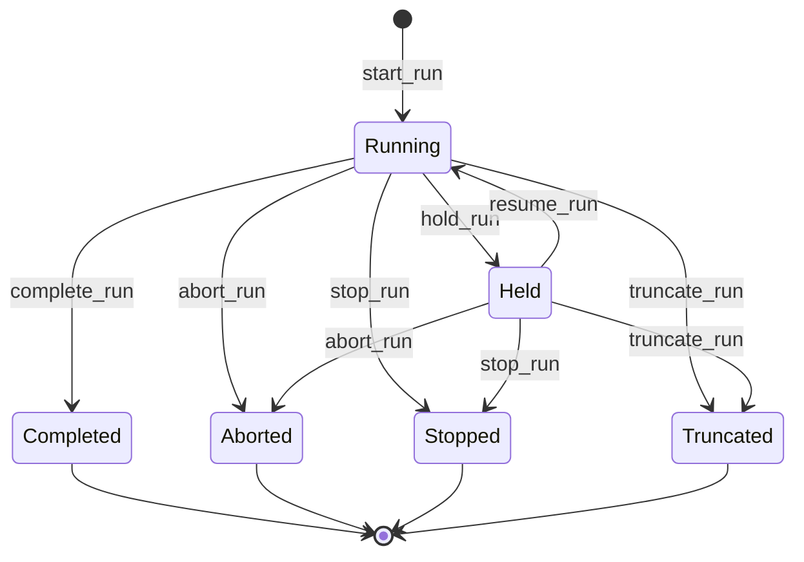

# Run module <span class="md-maturity md-maturity--stable" title="Shipped, audited (property-based + mutation testing), public surface is forward-compatible">stable</span>

## Purpose & Scope

The Run module records the execution layer of CORA's recipe ladder. Where Method, Practice, and Plan describe *what* should be done and *how*, a Run records *what actually happened*: one Run is one execution instance, with batch identity, a finite lifecycle, an immutable audit trail, and references to the bound Plan and (optionally) Subject. Every sensor reading, every parameter adjustment, every operator hold or termination during the execution lands on the Run's event stream.

A Run carries five roles:

- **Identity** for one execution. The Run id is the stable handle that all downstream artifacts (datasets, reports, decisions, calibration citations) reference.
- **A finite lifecycle** with a closed state machine: a Run runs, may be held and resumed, and ends in exactly one of four terminal states (Completed / Aborted / Stopped / Truncated).
- **Parameter resolution.** A Run starts with parameters resolved from the Plan's defaults plus operator-supplied overrides, validated against the Method's parameter schema. The resolved snapshot is recorded on `RunStarted` and remains queryable for the life of the Run.
- **A reading logbook.** Sensor and motor readings during the Run land on a polymorphic per-Run logbook (`entries_run_observations`) keyed by a SOSA-aligned `sampling_procedure` discriminator. The logbook opens lazily on the first reading and closes implicitly when the Run reaches a terminal state.
- **Cross-module anchors.** A Run pins the Calibration revisions that were active at start time (AsShot semantics, immutable for the life of the Run); references the Safety clearances that authorize it; can join a Campaign for coordinated multi-Run studies; and may cite the Decision that justified a mid-flight parameter adjustment.

<div class="cora-aside cora-aside--deferred" markdown>

Out of scope
{: .cora-kicker }

- **High-frequency telemetry.** Per-frame triggers and sub-millisecond timing edges live on observation channels, not on the Run's main event stream. See [the recording spine and the optional execution edge](../../standards.md#the-recording-spine-and-the-optional-execution-edge) for where this line sits.
- **Bulk data.** Frame bytes and reconstructed volumes live in the Data module's Datasets, referenced from the Run by URI plus checksum.

</div>

## Aggregates

| Name | Identity | State summary | FSM |
|---|---|---|---|
| `Run` | `id: UUID` | `name`, `plan_id`, `subject_id?`, `raid?`, `status`, `override_parameters`, `effective_parameters`, `trigger_source?`, `observation_logbook_id?`, `external_refs`, `campaign_id?`, `last_adjusted_at?`, `adjustment_count`, `pinned_calibration_ids` | yes |
| `Observation` (sub-aggregate VO on `Run`) | `event_id: UUID` (per row) | `channel_name`, `value`, `units?`, `sampling_procedure`, `sampled_at`, `occurred_at`, `recorded_at` | no |

`Run.subject_id` is optional because some execution shapes have no Subject: dark-field acquisition, flat-field acquisition, energy characterization with a standard reference. These share the full Run lifecycle with sample Runs; only the Subject binding differs.

`Run.raid` carries an optional Research Activity Identifier (ISO 23527), enabling cross-facility project attribution.

## Value Objects

| Name | Shape | Where used |
|---|---|---|
| `RunName` | trimmed string, 1–200 chars | `Run.name` |
| `RunAbortReason` | trimmed string, 1–500 chars | `RunAborted.reason` (decider-input VO) |
| `RunStopReason` | trimmed string, 1–500 chars | `RunStopped.reason` (decider-input VO) |
| `RunTruncateReason` | trimmed string, 1–500 chars | `RunTruncated.reason` (decider-input VO) |
| `ChannelName` | trimmed string, 1–255 chars | `Observation.channel_name` |
| `Identifier` | `(scheme: str, value: str)` shared cross-BC VO at `cora.infrastructure.identifier` | `Run.external_refs` (anti-corruption refs to upstream concepts like proposal / btr / lab_visit / session) |

The wire representation of each reason is a plain `str` (post-trim); the VO exists at decider-input time to centralize validation. Reason fields are free-form today; a structured taxonomy is a future-additive change behind the same triggers across all four reason fields.

## FSM



| From | To | Command | Event |
|---|---|---|---|
| `(none)` | `Running` | `start_run` | `RunStarted` |
| `Running` | `Held` | `hold_run` | `RunHeld` |
| `Held` | `Running` | `resume_run` | `RunResumed` |
| `Running` | `Completed` | `complete_run` | `RunCompleted` |
| `Running` \| `Held` | `Aborted` | `abort_run` | `RunAborted` |
| `Running` \| `Held` | `Stopped` | `stop_run` | `RunStopped` |
| `Running` \| `Held` | `Truncated` | `truncate_run` | `RunTruncated` |

**Guards.** Beyond the source-state check shown in the From column, each transition enforces:

`start_run`
: Plan not `Deprecated`; Subject in `{Mounted, Measured}` when present; no bound Asset is `Decommissioned`; the family superset is re-validated from current Asset state (the Plan-bind snapshot is not trusted); at least one `Active` Safety Clearance covers the Run scope `(run_id, subject_id, asset_ids)`; the Campaign (if cited) is in `{Planned, Active, Held}`.

`hold_run` / `resume_run`
: Strict source-state. `hold` requires `Running`; `resume` requires `Held`. Re-holding a `Held` Run or re-resuming a `Running` Run raises rather than no-oping.

`complete_run`
: Single-source from `Running` only. Completion claims active achievement, so it cannot fire from `Held`. An operator wanting to complete a held Run must `resume` first.

`abort_run` / `stop_run` / `truncate_run`
: Multi-source from `{Running, Held}`. Exits don't require active work, only any non-terminal state. Each requires a free-form `reason` (1–500 chars). `truncate_run` additionally takes an optional `interrupted_at` timestamp that must not be in the future.

`hold ⇄ resume` is bidirectional and unlimited-cycle; the event stream may interleave any number of hold/resume pairs between `RunStarted` and the terminal event. The aggregate state preserves only the latest status; per-cycle audit lives in the event stream itself.

`Stopped` vs `Truncated`: both are operator-initiated terminals reachable from `Running` or `Held`. `Stopped` is a controlled exit while the system is responsive and the operator decides to end early; data up to the stop point is valid. `Truncated` is a cleanup terminal for a Run that became de-facto dead through interruption (power loss, process crash, hardware fault) and is being closed retroactively; the optional `interrupted_at` captures the operator's best guess at when the actual interruption happened, separate from `occurred_at` (when the truncate command was processed).

## Events

| Event | Payload sketch | When emitted |
|---|---|---|
| `RunStarted` | `run_id`, `name`, `plan_id`, `subject_id?`, `raid?`, `override_parameters`, `effective_parameters`, `trigger_source?`, `external_refs`, `acknowledged_cautions`, `campaign_id?`, `decided_by_decision_id?`, `pinned_calibration_ids`, `occurred_at` | `start_run` succeeds |
| `RunHeld` | `run_id`, `occurred_at` | `hold_run` succeeds |
| `RunResumed` | `run_id`, `occurred_at` | `resume_run` succeeds |
| `RunCompleted` | `run_id`, `occurred_at` | `complete_run` succeeds |
| `RunAborted` | `run_id`, `reason`, `decided_by_decision_id?`, `occurred_at` | `abort_run` succeeds |
| `RunStopped` | `run_id`, `reason`, `occurred_at` | `stop_run` succeeds |
| `RunTruncated` | `run_id`, `reason`, `interrupted_at?`, `occurred_at` | `truncate_run` succeeds |
| `RunAdjusted` | `run_id`, `parameter_patch`, `effective_parameters`, `reason`, `decided_by_decision_id?`, `occurred_at` | `adjust_run` succeeds; carries both the RFC 7396 patch and the post-merge snapshot |
| `RunObservationLogbookOpened` | `run_id`, `logbook_id`, `schema`, `occurred_at` | `append_observations` first write per Run (lazy open) |
| `RunAddedToCampaign` | `run_id`, `campaign_id`, `occurred_at` | post-hoc Campaign membership write (see Campaign module) |
| `RunRemovedFromCampaign` | `run_id`, `campaign_id`, `occurred_at` | post-hoc Campaign membership removal |
| `DecisionDebriefRequested` | `run_id`, `debriefer_agent_id`, `terminal_event_id`, `occurred_at` | appended by an Agent BC subscriber (RunDebriefer / CautionDrafter) BEFORE invoking its LLM as a per-(run, terminal-event, agent) lease marker; first writer wins via the existing `UNIQUE(stream_type, stream_id, version)` constraint; audit-only with a no-op evolver fold |

Individual reading rows do not emit per-row events on the Run stream; they are written directly to `entries_run_observations` via the `ObservationStore` port. The row's `event_id`, `correlation_id`, and `causation_id` constitute the audit trail without bloating the main event log.

## Slices

<!-- arch:slices-table bc=run -->
_Generated from the code at build time._
<!-- /arch:slices-table -->

**Errors per slice.** Beyond Pydantic boundary 422s, each slice raises:

`StartRun`
: `RunAlreadyExists`, `InvalidRunName`, `PlanNotFound`, `PlanDeprecated`, `SubjectNotMountable`, `RunAssetDecommissioned`, `RunCapabilitiesNotSatisfied`, `RunRequiresActiveClearance`, `RunClearanceCoverageMismatch`, `RunRequiresAvailableSupply` (no Supply registered for a kind in `Method.needed_supplies`), `RunSupplyCoverageMismatch` (Supplies exist but none Available), `RunCannotJoinCampaign`, `InvalidRunExternalRef`, `InvalidRunParameters`, `InvalidPinnedCalibrations`, `Unauthorized`

`HoldRun` / `ResumeRun` / `CompleteRun`
: `RunNotFound`, `RunCannot{Hold,Resume,Complete}`, `Unauthorized`

`AbortRun` / `StopRun`
: `RunNotFound`, `RunCannot{Abort,Stop}`, `InvalidRun{Abort,Stop}Reason`, `Unauthorized`

`TruncateRun`
: `RunNotFound`, `RunCannotTruncate`, `InvalidRunTruncateReason`, `InvalidRunInterruptedAt`, `Unauthorized`

`AdjustRun`
: `RunNotFound`, `RunCannotAdjust`, `InvalidRunAdjustPatch`, `InvalidRunAdjustSchema`, `InvalidRunAdjustReason`, `Unauthorized`

`AppendObservations`
: `RunNotFound`, `RunObservationLogbookClosed`, `InvalidChannelName`, `InvalidReadingValue`, `InvalidSamplingProcedure`, `Unauthorized`

`GetRun`
: `RunNotFound`

`ListRuns`
: (boundary 422 only)

`StartRun` and `AdjustRun` are wrapped by the `Idempotency-Key` header pattern for safe operator retry. The terminal and pause transitions are strict-not-idempotent: a second `complete_run` against an already-`Completed` Run raises `RunCannotComplete`, not a silent no-op, so the audit log never carries a "did nothing" entry.

`AdjustRun` is the mid-flight parameter steering slice. Its source-state guard is `{Running, Held}` and its scope is strictly the parameter merge: Subject, Plan, Asset, and Method changes still require abort-and-restart by design. The optional `decided_by_decision_id` field links a steering action to the Decision that justified it; this maps to the PROV-O `wasInformedBy` relationship at the export adapter.

## Storage & Projections

Two read-side tables back the Run module.

**`proj_run_summary`** is the per-Run summary projection. One row per Run, updated as the FSM advances:

```sql title="proj_run_summary"
CREATE TABLE proj_run_summary (
    run_id      UUID         PRIMARY KEY,
    name        TEXT         NOT NULL,
    plan_id     UUID         NOT NULL,
    subject_id  UUID,
    raid        TEXT,
    status      TEXT         NOT NULL CHECK (
        status IN ('Running', 'Held', 'Completed',
                   'Aborted', 'Stopped', 'Truncated')
    ),
    created_at  TIMESTAMPTZ  NOT NULL,
    updated_at  TIMESTAMPTZ  NOT NULL DEFAULT now()
);
```

The `CHECK` constraint encodes the closed `RunStatus` enum at the row level. `GET /runs/{id}` reads from this projection (with fold-on-read fallback for fields not yet projected); `GET /runs` reads exclusively from this projection with keyset pagination over `(created_at, run_id)` and additive filters.

**`entries_run_observations`** is the polymorphic per-Run reading logbook. One row per reading; the `sampling_procedure` column carries the SOSA-aligned discriminator (`baseline` for snapshots at Run boundaries; `monitor` for sub-Hz time-series during a Run). Defense-in-depth: NaN and Infinity are rejected at three layers (Pydantic at the API boundary, the in-decider `InvalidObservationValueError`, and a Postgres `CHECK` constraint on `value`).

```sql title="entries_run_observations"
CREATE TABLE entries_run_observations (
    event_id            UUID              PRIMARY KEY,
    run_id              UUID              NOT NULL,
    logbook_id          UUID              NOT NULL,
    actor_id            UUID              NOT NULL,
    command_name        TEXT              NOT NULL,
    channel_name        TEXT              NOT NULL CHECK (length(channel_name) BETWEEN 1 AND 255),
    value               DOUBLE PRECISION  NOT NULL CHECK (
        value = value
        AND value <> 'Infinity'::DOUBLE PRECISION
        AND value <> '-Infinity'::DOUBLE PRECISION
    ),
    units               TEXT              CHECK (units IS NULL OR length(units) <= 64),
    sampling_procedure  TEXT              NOT NULL,
    sampled_at          TIMESTAMPTZ       NOT NULL,
    occurred_at         TIMESTAMPTZ       NOT NULL,
    recorded_at         TIMESTAMPTZ       NOT NULL DEFAULT now()
);
```

The three timestamps each carry distinct meaning:

- `sampled_at` is the SOSA `phenomenonTime`: when the sensor captured the value.
- `occurred_at` is when the handler appended the row.
- `recorded_at` is when Postgres wrote the row.

Clock skew between the sensor (`sampled_at`) and the handler (`occurred_at`) is real and expected; the three timestamps preserve all three observations rather than collapsing them.

## Cross-Module boundaries

| Module | Relationship | What's exchanged |
|---|---|---|
| Trust | gated-by | Every write-side Run slice is gated by the Authorize port resolving a `Policy` for the `(principal, command, conduit, surface)` tuple; deny outcomes refuse before the decider runs |
| Recipe | reads-from | Loads `Plan` for status and `asset_ids`; walks `Plan → Practice → Method` for `parameters_schema` to validate `effective_parameters` (strict by default) |
| Subject | reads-from | Loads `Subject` (when `subject_id` set) to enforce the Mounted-or-Measured guard at start |
| Equipment | reads-from | Loads each bound `Asset` to re-validate the family superset against the Method's needed families (drift is real; the Plan-bind snapshot is not trusted at start) |
| Safety | reads-from | `ClearanceLookup.find_referencing_run(run_id, subject_id, asset_ids)` returns clearances whose bindings cover the Run scope; ≥1 must be `Active` |
| Supply | reads-from (load-bearing) | `SupplyLookup.find_supplies_by_kind(kinds=method.needed_supplies)` returns every non-`Decommissioned` Supply grouped by kind; the decider refuses to start unless every required kind has ≥1 Supply in `Available` (raises `RunRequiresAvailableSupply` or `RunSupplyCoverageMismatch`, 409). `Available`-only by design; `Degraded` does not pass. |
| Caution | reads-from | `CautionLookup` returns Active Cautions for the Run scope; non-blocking, surfaced as a banner on the response, never refuses start |
| Campaign | shared-id-with | `Run.campaign_id` (single-Campaign-per-Run invariant); the post-hoc `add_run_to_campaign` / `remove_run_from_campaign` slices are owned by the Campaign module and atomically write `RunAddedToCampaign` / `RunRemovedFromCampaign` plus the Campaign-side membership event via `EventStore.append_streams` |
| Decision | shared-id-with | `RunAdjusted.decided_by_decision_id` cites the Decision that justified a mid-flight adjustment; no existence check at write time (eventual-consistency stance) |
| Calibration | reads-from | `Run.pinned_calibration_ids` is a frozen set of `CalibrationRevision.id`s captured at `start_run` and **immutable** for the life of the Run; every FSM transition preserves the set verbatim, and downstream consumers cite this set to answer "what calibration was this scan acquired against?" deterministically |
| Agent | writes-to (Decision stream) | Terminal Run events (`RunCompleted`, `RunAborted`, `RunStopped`, `RunTruncated`) are subscribed by the RunDebriefer and CautionDrafter agents, each of which emits an advisory `Decision` per terminal Run |
| Agent | writes-to (Run stream, lease marker) | Each terminal-Run-event subscriber appends `DecisionDebriefRequested` to the Run stream BEFORE invoking its LLM as a per-(run, terminal-event, agent) lease primitive; first writer wins via the existing optimistic-concurrency constraint, losing agents emit a `DebriefConflicted` / `CautionDraftConflicted` audit Decision on their own Decision stream with zero LLM cost (no Run-state mutation) |
| Access | shared-id-with | Every Run event envelope carries `actor_id` for principal attribution; cross-module references are bare UUIDs and not verified at write time |

`Plan`, `Subject`, `Asset`, `Campaign`, `Clearance`, and `Calibration` references are validated at handler load-time but treated as opaque by the decider; the decider operates on pre-loaded context bundles rather than re-fetching, which keeps the pure-decider boundary clean.

## Examples

The four examples below follow the happy path for one Run: start it, steer it mid-flight, append a sensor reading, end it. For the REST/MCP equivalence, auth, and idempotency conventions these examples share, see [Reading the examples](../index.md) on the Modules landing page.

<!-- extracted from tests/contract/run/test_start_run.py -->

### Start a Run with operator parameter overrides

=== "REST"

    ```http
    POST /runs
    Content-Type: application/json
    Idempotency-Key: 9f6a3b1c-8e2d-4f5a-9b8c-1d2e3f4a5b6c
    X-Principal-Id: 11111111-2222-3333-4444-555555555555

    {
      "name": "2-BM continuous-rotation acquisition (Subject sn-2024-038)",
      "plan_id": "12345678-1234-1234-1234-123456789abc",
      "subject_id": "abcdef12-3456-7890-abcd-ef1234567890",
      "override_parameters": {
        "rotation_speed_deg_per_s": 0.5,
        "exposure_time_ms": 50
      },
      "trigger_source": "operator:opid:42",
      "pinned_calibration_ids": [
        "cal-rev-aaaa1111-2222-3333-4444-555555555555",
        "cal-rev-bbbb2222-3333-4444-5555-666666666666"
      ]
    }
    ```

    A successful call returns `201 Created` with the newly-assigned `run_id` and the resolved `effective_parameters` (Plan defaults merged with the overrides above).

=== "MCP"

    ```python
    mcp.call_tool(
        "start_run",
        {
            "name": "2-BM continuous-rotation acquisition (Subject sn-2024-038)",
            "plan_id": "12345678-1234-1234-1234-123456789abc",
            "subject_id": "abcdef12-3456-7890-abcd-ef1234567890",
            "override_parameters": {
                "rotation_speed_deg_per_s": 0.5,
                "exposure_time_ms": 50,
            },
            "trigger_source": "operator:opid:42",
            "pinned_calibration_ids": [
                "cal-rev-aaaa1111-2222-3333-4444-555555555555",
                "cal-rev-bbbb2222-3333-4444-5555-666666666666",
            ],
        },
    )
    ```

    Returns the same `run_id` + `effective_parameters` shape as the REST call.

### Mid-flight parameter steering

=== "REST"

    ```http
    POST /runs/9f6a3b1c-8e2d-4f5a-9b8c-1d2e3f4a5b6c/adjust
    Content-Type: application/json
    Idempotency-Key: 7c8d9e0f-1a2b-3c4d-5e6f-7a8b9c0d1e2f
    X-Principal-Id: 11111111-2222-3333-4444-555555555555

    {
      "parameter_patch": {
        "exposure_time_ms": 75
      },
      "reason": "increased exposure to recover signal after detector temperature drift",
      "decided_by_decision_id": "decision-aaaa-bbbb-cccc-dddd-eeeeeeeeeeee"
    }
    ```

=== "MCP"

    ```python
    mcp.call_tool(
        "adjust_run",
        {
            "run_id": "9f6a3b1c-8e2d-4f5a-9b8c-1d2e3f4a5b6c",
            "parameter_patch": {"exposure_time_ms": 75},
            "reason": "increased exposure to recover signal after detector temperature drift",
            "decided_by_decision_id": "decision-aaaa-bbbb-cccc-dddd-eeeeeeeeeeee",
        },
    )
    ```

The response carries the post-merge `effective_parameters` so the caller can confirm what the Run is now executing against.

### Append a baseline reading

=== "REST"

    ```http
    POST /runs/9f6a3b1c-8e2d-4f5a-9b8c-1d2e3f4a5b6c/readings
    Content-Type: application/json
    X-Principal-Id: 11111111-2222-3333-4444-555555555555

    {
      "channel_name": "ring_current",
      "value": 102.3,
      "units": "mA",
      "sampling_procedure": "baseline",
      "sampled_at": "2026-05-20T14:30:15.123456Z"
    }
    ```

=== "MCP"

    ```python
    mcp.call_tool(
        "append_observations",
        {
            "run_id": "9f6a3b1c-8e2d-4f5a-9b8c-1d2e3f4a5b6c",
            "channel_name": "ring_current",
            "value": 102.3,
            "units": "mA",
            "sampling_procedure": "baseline",
            "sampled_at": "2026-05-20T14:30:15.123456Z",
        },
    )
    ```

The first reading per Run lazily opens the reading logbook (one `RunObservationLogbookOpened` event on the Run stream); subsequent readings write directly to `entries_run_observations` with no per-row event.

### Terminate the Run

=== "REST"

    ```http
    POST /runs/9f6a3b1c-8e2d-4f5a-9b8c-1d2e3f4a5b6c/complete
    X-Principal-Id: 11111111-2222-3333-4444-555555555555
    ```

=== "MCP"

    ```python
    mcp.call_tool(
        "complete_run",
        {"run_id": "9f6a3b1c-8e2d-4f5a-9b8c-1d2e3f4a5b6c"},
    )
    ```

A second `complete` against the same Run returns `409 RunCannotComplete` rather than a silent no-op. Terminal transitions are strict-not-idempotent, so the audit log never carries a "did nothing" entry.
