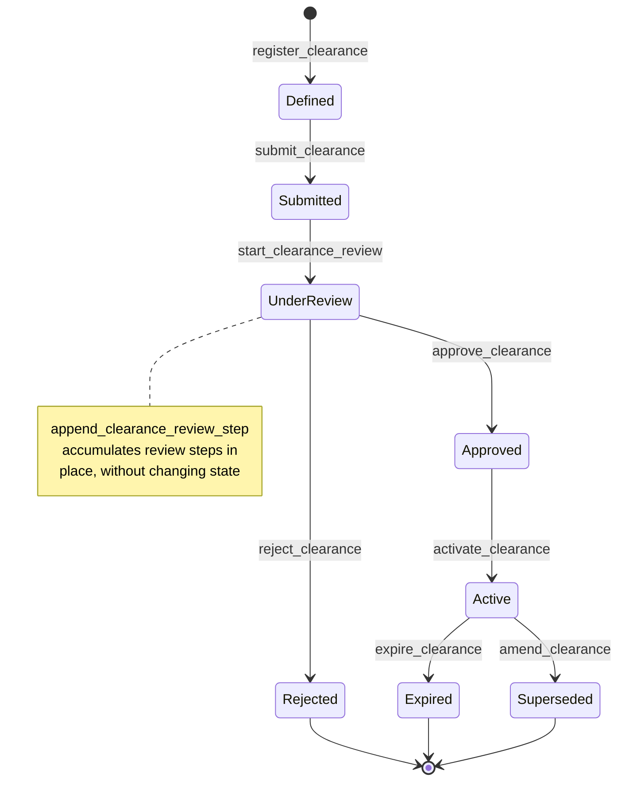
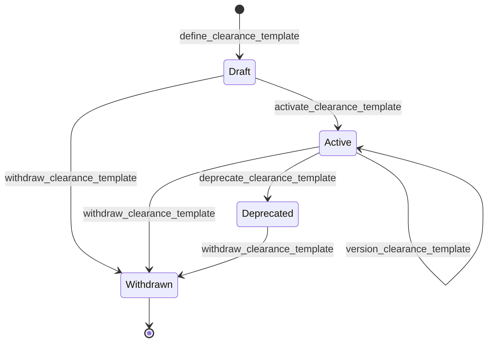

# Safety module <span class="md-maturity md-maturity--stable" title="Two aggregates (Clearance, ClearanceTemplate); eight-state Clearance lifecycle instantiating a per-facility four-state ClearanceTemplate; auto-expiry on valid_until is operator-triggered today (see Out of scope)">stable</span>

## Purpose & Scope

The Safety module records the formal regulatory clearances that gate work at the facility. <!-- arch:count kind=aggregate bc=safety spell=true cap=true -->Two<!-- /arch:count --> aggregates carry the responsibility. A `ClearanceTemplate` is the per-facility form definition: the typed catalog entry for one form-type (experiment-safety assessment, radiation-safety review, beamtime-allocation form, and so on), identified by a facility-scoped `code` and curated through its own draft-to-active lifecycle. A `Clearance` is the digital twin of one filled-in safety form: it instantiates a `ClearanceTemplate` by `template_id` and owns the lifecycle that takes a draft submission through the review board to an Active state, plus the read-side queries downstream modules call when they need to know "is there an Active clearance covering this Run / Subject / Asset / Procedure?".

Each deployment auto-seeds a fixed set of ten form-type templates per Active Facility at startup (ESAF, SAF, AForm, DUO, ESRA, ERA, PLHD, DOOR, BTR, Form9), so a `Clearance` always binds a real template even before an operator curates a facility-specific one.

A Clearance carries five roles:

- **Identity** for one regulatory authorization, stable across the form's lifetime. The Clearance id is the internal opaque handle; the optional `external_id` carries the facility-minted ID (`ESAF-12345`, `SAF-67890`, and so on), assigned lazily once the facility commits.
- **A finite lifecycle** with an eight-state machine: a Clearance moves from Defined through Submitted, UnderReview, Approved, and Active, with terminal exits to Rejected, Expired, and Superseded.
- **The form payload** that the facility's review board cares about: the `ClearanceTemplate` it instantiates (by `template_id`, with the template's `code` denormalized for read-side display), the bindings it gates, the hazards declared against those bindings, the optional summary risk band, the multi-step review chain that produced the decision.
- **A polymorphic binding set.** A single Clearance can gate one or more Subjects, Assets, Runs, or Procedures, and can also reference upstream concepts the platform does not model itself (proposals, beamtime requests, lab visits) via an `ExternalBinding` anti-corruption pair.
- **Read-side coverage queries.** Other modules check Clearance coverage at the moment they need to start work. The Run module asks "is there at least one Active clearance whose bindings cover this Run?" before allowing `start_run` to proceed; the Operation module asks the same before `start_procedure`.

<div class="cora-aside cora-aside--deferred" markdown>

Out of scope
{: .cora-kicker }

- **Typed form-field schema on `ClearanceTemplate`.** The template carries identity (`code`, `title`, `version`) and its own lifecycle, but not yet a typed schema for the form's fields; the field structure is still convention plus the `Clearance` payload shape. A per-template field schema lands when a facility needs machine-validated form bodies.
- **Per-user certifications.** Operator training records (radiation safety cards, cryogenic handling certs) are deferred to a sibling `ParticipantCertification` aggregate.
- **Typed mitigation and risk aggregates.** `HazardDeclaration.mitigations` is a free-form set of reference strings today; a typed `Mitigation` aggregate and a separate `Risk` aggregate (per the four-primitive Hazard / Hazardous Situation / Risk / Barrier split) are deferred.

</div>

## Aggregates

| Name | Identity | State summary | FSM |
|---|---|---|---|
| `Clearance` | `id: UUID` (+ optional facility-minted `external_id: str`) | `template_id`, `facility_code`, `title`, `bindings`, `declarations`, `risk_band?`, `review_steps`, `status`, `parent_id?`, `valid_from?`, `valid_until?`, `next_review_due_at?` | yes (8-state) |
| `ClearanceTemplate` | `id: UUID` | `id`, `facility_code`, `code: ClearanceTemplateCode`, `title: ClearanceTemplateTitle`, `version: ClearanceTemplateVersion`, `supersedes_template_id?`, `external_ref?`, `defined_at`, `defined_by`, `status: ClearanceTemplateStatus` | yes (4-state) |

`Clearance.template_id` references the `ClearanceTemplate` this clearance instantiates; the template's `code` is denormalized onto the `ClearanceRegistered` event and the projection so reads avoid a cross-aggregate join. There is no `ClearanceKind` enum: form-type identity now lives on the bound `ClearanceTemplate` via its `(facility_code, code)` address.

`facility_code` is the `FacilityCode` of the Federation `Facility` (a `Facility` with `FacilityKind = Site`) that owns the clearance or template. Facility identity is owned by the Federation module; the Safety module references it by code and does not duplicate it as a parallel enum. A `ClearanceTemplate` is facility-scoped: its `(facility_code, code)` pair is unique among non-withdrawn templates, so the same `code` (for example `ESAF`) names a distinct template per facility.

`parent_id` is populated only on a Clearance that supersedes a prior one via the amendment flow. On a `ClearanceTemplate`, `supersedes_template_id` plays the analogous role across version bumps.

## Value Objects

| Name | Shape | Where used |
|---|---|---|
| `ClearanceTitle` | trimmed string, 1–200 chars | `Clearance.title` |
| `ClearanceBinding` | 5-arm discriminated union: `SubjectBinding(subject_id)` \| `AssetBinding(asset_id)` \| `RunBinding(run_id)` \| `ProcedureBinding(procedure_id)` \| `ExternalBinding(scheme, id)` | `Clearance.bindings` (frozenset; at least one required) |
| `ExternalBinding` | `(scheme: str, id: str)` shared kernel | One variant of `ClearanceBinding`; covers proposal / btr / lab_visit / session and other upstream-deferred references |
| `HazardDeclaration` | `target: ClearanceBinding`, `classifications: frozenset[HazardClassification]`, `mitigations: frozenset[str]`, `notes?` | `Clearance.declarations` (target must be one of the Clearance's own bindings) |
| `HazardClassification` | 4-arm discriminated union: `NFPA704Rating(health, flammability, instability, special?)` \| `RiskBand(value)` \| `GHSPictogram(code)` \| `SchemeCode(scheme, code)` | `HazardDeclaration.classifications` |
| `ReviewStep` | `step_index`, `role`, `actor_id`, `decision` (Approved \| Rejected \| RequestedChanges), `decided_at`, `notes?` | `Clearance.review_steps` (tuple, append-only) |
| `ClearanceTemplateCode` | trimmed string, 1-50 chars | `ClearanceTemplate.code` |
| `ClearanceTemplateTitle` | trimmed string, 1-200 chars | `ClearanceTemplate.title` |
| `ClearanceTemplateVersion` | positive int (starts at 1, +1 per version bump) | `ClearanceTemplate.version` |
| `ClearanceTemplateStatus` | closed StrEnum: `Draft` \| `Active` \| `Deprecated` \| `Withdrawn` | `ClearanceTemplate.status` |

The four `HazardClassification` arms map to the systems operators see at the facility: NFPA 704 fire diamonds on chemical labels, the green/yellow/red triage band on operator dashboards, GHS pictograms on transport paperwork, and a generic `SchemeCode` slot for facility-local hazard schemes that don't fit the first three.

`RiskBand` is also surfaced as a single optional summary field on the `Clearance` itself (`risk_band: RiskBand | None`) for fast triage queries, distinct from the per-declaration classifications.

## FSM

### Clearance



| From | To | Command | Event |
|---|---|---|---|
| `(none)` | `Defined` | `register_clearance` | `ClearanceRegistered` |
| `Defined` | `Submitted` | `submit_clearance` | `ClearanceSubmitted` |
| `Submitted` | `UnderReview` | `start_clearance_review` | `ClearanceReviewStarted` |
| `UnderReview` | `UnderReview` | `append_clearance_review_step` | `ClearanceReviewStepAppended` |
| `UnderReview` | `Approved` | `approve_clearance` | `ClearanceApproved` |
| `UnderReview` | `Rejected` | `reject_clearance` | `ClearanceRejected` |
| `Approved` | `Active` | `activate_clearance` | `ClearanceActivated` |
| `Active` | `Expired` | `expire_clearance` | `ClearanceExpired` |
| `Active` | `Superseded` | `amend_clearance` | `ClearanceSuperseded` (parent) + `ClearanceRegistered` (child) |

**Guards.** Beyond the source-state check, each transition enforces:

`register_clearance`
: `bindings` must be non-empty (a Clearance with zero bindings can never gate anything); each `declarations[i].target` must be a member of `bindings` (declarations cannot reference out-of-scope targets); if both `valid_from` and `valid_until` are set, `valid_from < valid_until` strictly.

`submit_clearance` / `start_clearance_review` / `activate_clearance`
: Strict single-source transitions. `submit` requires `Defined`, `start_review` requires `Submitted`, `activate` requires `Approved`. Each rejects rather than no-oping when the source is wrong.

`append_clearance_review_step`
: `step_index` must equal `len(state.review_steps)` (append-only contract; no out-of-order or skipped indexes). `decision` is one of `Approved`, `Rejected`, `RequestedChanges` (boundary 422 at the API). `decided_at` cannot be in the future and must be monotonically non-decreasing across the chain.

`approve_clearance`
: Requires `UnderReview` AND at least one step in `review_steps` whose `decision` is `Approved`. Approving without any approving step in the chain raises.

`reject_clearance` / `expire_clearance`
: Both require a free-form `reason` (1–500 chars). `reject` from `UnderReview`; `expire` from `Active`. `expire_clearance` is now issued both by operators and automatically by the deterministic ClearanceExpirer agent, which sweeps Active clearances and expires those whose `valid_until` has passed (the agent supplies the reason "validity window elapsed"). The decider stays a pure `Active -> Expired` transition; it does not re-check `valid_until`, so the agent's window check is what gates the automatic path.

`amend_clearance`
: Parent must be `Active`. The slice creates a new child Clearance (with `parent_id` pointing back) and atomically supersedes the parent in a single cross-stream write (see Cross-Module boundaries).

The approving and rejecting actor is carried on the event envelope (`StoredEvent.principal_id`); the aggregate state does not duplicate it.

### ClearanceTemplate



| From | To | Command | Event |
|---|---|---|---|
| `(none)` | `Draft` | `define_clearance_template` | `ClearanceTemplateDefined` |
| `Draft` | `Active` | `activate_clearance_template` | `ClearanceTemplateActivated` |
| `Active` | `Active` | `version_clearance_template` | `ClearanceTemplateVersioned` |
| `Active` | `Deprecated` | `deprecate_clearance_template` | `ClearanceTemplateDeprecated` |
| `Draft` \| `Active` \| `Deprecated` | `Withdrawn` | `withdraw_clearance_template` | `ClearanceTemplateWithdrawn` |

`version_clearance_template` keeps the template `Active` while bumping `version` by exactly one and setting `supersedes_template_id` to the prior template id (same-facility parent chain enforced). `Withdrawn` is terminal. A `Clearance` can only bind a template that is currently `Active`: `register_clearance` and `amend_clearance` reject a Draft, Deprecated, or Withdrawn template with `ClearanceTemplateNotBindable`. The ten per-facility seed templates are written as an atomic define-then-activate pair at startup, so they land directly in `Active`.

## Events

| Event | Payload sketch | When emitted |
|---|---|---|
| `ClearanceRegistered` | `clearance_id`, `template_id`, `template_code`, `facility_code`, `title`, `bindings`, `declarations`, `risk_band?`, `external_id?`, `valid_from?`, `valid_until?`, `parent_id?`, `occurred_at` | `register_clearance` succeeds, or as the child genesis event in `amend_clearance` |
| `ClearanceSubmitted` | `clearance_id`, `occurred_at` | `submit_clearance` succeeds |
| `ClearanceReviewStarted` | `clearance_id`, `first_reviewer_role`, `occurred_at` | `start_clearance_review` succeeds |
| `ClearanceReviewStepAppended` | `clearance_id`, `step_index`, `role`, `decision`, `actor_id`, `decided_at`, `notes?`, `occurred_at` | `append_clearance_review_step` succeeds |
| `ClearanceApproved` | `clearance_id`, `valid_from?`, `valid_until?`, `occurred_at` | `approve_clearance` succeeds (`valid_from`/`valid_until` override register-time defaults if supplied) |
| `ClearanceRejected` | `clearance_id`, `reason`, `occurred_at` | `reject_clearance` succeeds |
| `ClearanceActivated` | `clearance_id`, `occurred_at` | `activate_clearance` succeeds |
| `ClearanceExpired` | `clearance_id`, `reason`, `occurred_at` | `expire_clearance` succeeds |
| `ClearanceSuperseded` | `clearance_id` (parent), `by_clearance_id` (child), `occurred_at` | `amend_clearance` succeeds, written to the parent stream |

The <!-- arch:count kind=event bc=safety agg=clearance_template spell=true -->five<!-- /arch:count --> `ClearanceTemplate` events (each carries a fold-symmetry `<verb>_by` actor):

| Event | Payload sketch | When emitted |
|---|---|---|
| `ClearanceTemplateDefined` | `template_id`, `facility_code`, `code`, `title`, `version` (1), `supersedes_template_id?`, `external_ref?`, `defined_by`, `occurred_at` | `define_clearance_template` succeeds (genesis) |
| `ClearanceTemplateActivated` | `template_id`, `activated_by`, `occurred_at` | `activate_clearance_template` succeeds |
| `ClearanceTemplateVersioned` | `template_id`, `new_version`, `supersedes_template_id`, `versioned_by`, `occurred_at` | `version_clearance_template` succeeds |
| `ClearanceTemplateDeprecated` | `template_id`, `deprecated_by`, `occurred_at` | `deprecate_clearance_template` succeeds |
| `ClearanceTemplateWithdrawn` | `template_id`, `withdrawn_by`, `occurred_at` | `withdraw_clearance_template` succeeds |

## Slices

<!-- arch:slices-table bc=safety -->
_Generated from the code at build time._
<!-- /arch:slices-table -->

**Errors per slice.** Beyond Pydantic boundary 422s, each slice raises:

`RegisterClearance`
: `ClearanceAlreadyExists`, `ClearanceFacilityNotFound` (the `facility_code` does not resolve via `FacilityLookup`), `ClearanceTemplateNotFound` (the `template_id` does not resolve via `ClearanceTemplateLookup`), `ClearanceTemplateNotBindable` (the template is not `Active`), `InvalidClearanceTitle`, `InvalidClearanceExternalId`, `InvalidClearanceBindings`, `InvalidClearanceValidityWindow`, `InvalidClearanceDeclarationTarget`, `InvalidClearanceExternalBinding`, `InvalidClearanceMitigationRef`, `InvalidClearanceHazardNotes`, `Unauthorized`

`SubmitClearance` / `StartClearanceReview` / `ApproveClearance` / `ActivateClearance`
: `ClearanceNotFound`, `ClearanceCannot{Submit,StartReview,Approve,Activate}`, `Unauthorized`

`AppendClearanceReviewStep`
: `ClearanceNotFound`, `ClearanceCannotAppendReviewStep`, `InvalidClearanceReviewStepIndex`, `InvalidClearanceReviewerRole`, `InvalidClearanceReviewerNotes`, `InvalidClearanceReviewStepDecidedAt`, `Unauthorized`

`RejectClearance`
: `ClearanceNotFound`, `ClearanceCannotReject`, `InvalidClearanceRejectReason`, `Unauthorized`

`ExpireClearance`
: `ClearanceNotFound`, `ClearanceCannotExpire`, `InvalidClearanceExpireReason`, `Unauthorized`

`AmendClearance`
: `ClearanceNotFound` (parent), `ClearanceCannotAmend`, plus every error `RegisterClearance` can raise on the child Clearance fields, `Unauthorized`

`GetClearance`
: `ClearanceNotFound`

`ListClearances`
: (boundary 422 only)

`DefineClearanceTemplate`
: `ClearanceTemplateAlreadyExists` (the `(facility_code, code)` pair is already taken by a non-withdrawn template), `ClearanceTemplateFacilityNotFound`, `InvalidClearanceTemplateCode`, `InvalidClearanceTemplateTitle`, `Unauthorized`

`ActivateClearanceTemplate` / `DeprecateClearanceTemplate` / `WithdrawClearanceTemplate`
: `ClearanceTemplateNotFound`, `ClearanceTemplateCannot{Activate,Deprecate,Withdraw}`, `Unauthorized`

`VersionClearanceTemplate`
: `ClearanceTemplateNotFound`, `ClearanceTemplateCannotVersion`, `ClearanceTemplateFacilityMismatch`, `InvalidClearanceTemplateVersion`, `Unauthorized`

`GetClearanceTemplate`
: `ClearanceTemplateNotFound`. `ListClearanceTemplates`: boundary 422 only.

`RegisterClearance` and `AmendClearance` are wrapped by the `Idempotency-Key` header for safe operator retry. The transition slices are strict-not-idempotent: a second `submit` against an already-`Submitted` Clearance raises `ClearanceCannotSubmit`, not a silent no-op.

## Storage & Projections

Two read-side tables back the Safety module.

```sql title="proj_safety_clearance_summary"
CREATE TABLE proj_safety_clearance_summary (
    clearance_id              UUID         PRIMARY KEY,
    template_id               UUID         NOT NULL,
    template_code             TEXT         NOT NULL,
    facility_code             TEXT         NOT NULL,
    title                     TEXT         NOT NULL,
    external_id               TEXT,
    status                    TEXT         NOT NULL CHECK (
        status IN ('Defined', 'Submitted', 'UnderReview', 'Approved',
                   'Active', 'Expired', 'Rejected', 'Superseded')
    ),
    risk_band                 TEXT         CHECK (
        risk_band IS NULL OR risk_band IN ('Green', 'Yellow', 'Red')
    ),
    subject_binding_ids       UUID[]       NOT NULL DEFAULT '{}',
    asset_binding_ids         UUID[]       NOT NULL DEFAULT '{}',
    run_binding_ids           UUID[]       NOT NULL DEFAULT '{}',
    procedure_binding_ids     UUID[]       NOT NULL DEFAULT '{}',
    parent_id       UUID,
    registered_at             TIMESTAMPTZ  NOT NULL,
    last_status_changed_at    TIMESTAMPTZ,
    last_status_reason        TEXT,
    last_reviewed_by_actor_id UUID,
    valid_from                TIMESTAMPTZ,
    valid_until               TIMESTAMPTZ,
    next_review_due_at        TIMESTAMPTZ,
    updated_at                TIMESTAMPTZ  NOT NULL DEFAULT now()
);

CREATE INDEX proj_safety_clearance_summary_template_id_idx
    ON proj_safety_clearance_summary (template_id);
```

The `template_id` and `template_code` columns replace the former `kind` column: form-type identity now comes from the bound `ClearanceTemplate`, so there is no row-level `CHECK` against a closed kind enum (the template aggregate plus the template projection's address index own that integrity). The `status` and `risk_band` `CHECK` constraints remain. The four per-binding-kind `UUID[]` columns are GIN-indexed so the cross-module coverage query (used by Run.start and Procedure.start) can find clearances by `subject_id`, `asset_id`, `run_id`, or `procedure_id` in a single SELECT. `external_id` carries no DB-level uniqueness constraint today: the prior `(kind, external_id)` partial unique index was dropped together with the `kind` column in the template-id migration and has not been re-established.

`GET /clearances/{id}` reads from this projection with fold-on-read fallback for fields not yet projected. `GET /clearances` reads exclusively from the projection with filters on status, risk_band, facility_code, template_id, and the four binding-target ids, and keyset pagination over `(registered_at, clearance_id)`.

`ExternalBinding` references are not stored in projection columns today; they live only on the event payload and are folded into aggregate state when needed. Reading clearances by `external_ref.scheme` plus `id` requires loading the aggregate.

```sql title="proj_safety_clearance_template_summary"
CREATE TABLE proj_safety_clearance_template_summary (
    template_id             UUID         PRIMARY KEY,
    code                    TEXT         NOT NULL,
    title                   TEXT         NOT NULL,
    facility_code           TEXT         NOT NULL,
    version                 INTEGER      NOT NULL DEFAULT 1,
    supersedes_template_id  UUID,
    external_ref            TEXT,
    status                  TEXT         NOT NULL CHECK (
        status IN ('Draft', 'Active', 'Deprecated', 'Withdrawn')
    ),
    defined_at              TIMESTAMPTZ  NOT NULL,
    defined_by              UUID         NOT NULL,
    created_at              TIMESTAMPTZ  NOT NULL DEFAULT now(),
    updated_at              TIMESTAMPTZ  NOT NULL DEFAULT now()
);

CREATE UNIQUE INDEX proj_safety_clearance_template_summary_address_uq
    ON proj_safety_clearance_template_summary (facility_code, code)
    WHERE status != 'Withdrawn';

CREATE INDEX proj_safety_clearance_template_summary_keyset_idx
    ON proj_safety_clearance_template_summary (defined_at, template_id);
```

The partial UNIQUE index on `(facility_code, code) WHERE status != 'Withdrawn'` is the facility-scoped uniqueness guarantee: at most one live template per `code` per facility, while a withdrawn `code` can be re-defined. It also backs the `ClearanceTemplateLookup` that `register_clearance` calls to resolve `template_id` and confirm the template is `Active`.

## Cross-Module boundaries

| Module | Relationship | What's exchanged |
|---|---|---|
| Trust | gated-by | `register_clearance`, the review-board step slices, `approve_clearance`, and `activate_clearance` are all gated by the Authorize port resolving a `Policy` for the `(principal, command, conduit, surface)` tuple |
| Federation | reads-from (via `FacilityLookup`) | `Clearance.facility_code` and `ClearanceTemplate.facility_code` reference the `FacilityCode` of a `Facility` with `FacilityKind = Site`; `register_clearance` and `define_clearance_template` resolve the code at write time, and the startup seed iterates every Active Facility to seed its ten form-type templates |
| Equipment | shared-id-with | `AssetBinding.asset_id` references any `Asset` the Clearance gates |
| Subject | shared-id-with | `SubjectBinding.subject_id` references a Subject the Clearance gates |
| Run | reads-from | Run.start calls `ClearanceLookup.find_covering(run_id, subject_id, asset_ids)` against `proj_safety_clearance_summary`; at least one `Active` Clearance must cover the Run scope or `start_run` rejects with `RunRequiresActiveClearance` |
| Operation | reads-from | Procedure.start performs the analogous check via `ProcedureBinding` references |
| Agent | written-by | the deterministic ClearanceExpirer agent issues `expire_clearance` on Active clearances whose `valid_until` has passed, through the same authorized command path an operator uses; the resulting `ClearanceExpired` is byte-identical to an operator-driven expiry |
| (any) | writes-to via `append_streams` | `amend_clearance` writes `ClearanceSuperseded` to the parent stream and `ClearanceRegistered` to the child stream atomically in a single Postgres transaction; all-or-nothing, a `ConcurrencyError` on either stream rolls back the whole commit |

Binding-target references are validated for UUID shape at the API boundary but not for existence at write time; the eventual-consistency stance lets a Clearance be registered before its target Subject or Run exists, which matches how facility paperwork actually flows (the form is filed before beamtime, then bound to the Run at start).

## Examples

The four examples below follow the canonical path for one Clearance: register it, walk the review chain, approve it, activate it. The approving and rejecting actor on review-board steps comes from the `X-Principal-Id` header on the call, not from the request body. For the REST/MCP equivalence, auth, and idempotency conventions these examples share, see [Reading the examples](../index.md) on the Modules landing page.

<!-- extracted from tests/contract/safety/test_register_clearance.py -->

### Register a Clearance with bindings and hazard declarations

=== "REST"

    ```http
    POST /clearances
    Content-Type: application/json
    Idempotency-Key: 9f6a3b1c-8e2d-4f5a-9b8c-1d2e3f4a5b6c
    X-Principal-Id: 11111111-2222-3333-4444-555555555555

    {
      "template_id": "<esaf-template-id>",
      "facility_code": "aps",
      "title": "Cycle 2026-2 in-situ tomography of Pt/CeO2 catalyst (2-BM)",
      "bindings": [
        {"kind": "Subject", "id": "subject-1111-2222-3333-4444-555555555555"},
        {"kind": "Asset", "id": "aaaa1111-2222-3333-4444-666666666666"},
        {"kind": "External", "scheme": "proposal", "id": "GUP-79431"}
      ],
      "declarations": [
        {
          "target": {"kind": "Subject", "id": "subject-1111-2222-3333-4444-555555555555"},
          "classifications": [
            {"kind": "NFPA704", "health": 2, "flammability": 0, "instability": 0},
            {"kind": "RiskBand", "band": "Yellow"}
          ],
          "mitigations": ["PPE:lab_coat", "PPE:safety_glasses", "TRAIN:ESH-101"],
          "notes": "Subject contains 50 mg of nano-Pt; nominal toxicity, standard handling."
        }
      ],
      "risk_band": "Yellow",
      "valid_from": "2026-06-01T00:00:00Z",
      "valid_until": "2026-09-30T23:59:59Z"
    }
    ```

    A successful call returns `201 Created` with the newly-assigned `clearance_id`. The Clearance starts in `Defined` state.

=== "MCP"

    ```python
    mcp.call_tool(
        "register_clearance",
        {
            "template_id": "<esaf-template-id>",
            "facility_code": "aps",
            "title": "Cycle 2026-2 in-situ tomography of Pt/CeO2 catalyst (2-BM)",
            "bindings": [
                {"kind": "Subject", "id": "subject-1111-2222-3333-4444-555555555555"},
                {"kind": "Asset", "id": "aaaa1111-2222-3333-4444-666666666666"},
                {"kind": "External", "scheme": "proposal", "id": "GUP-79431"},
            ],
            "declarations": [
                {
                    "target": {"kind": "Subject", "id": "subject-1111-2222-3333-4444-555555555555"},
                    "classifications": [
                        {"kind": "NFPA704", "health": 2, "flammability": 0, "instability": 0},
                        {"kind": "RiskBand", "band": "Yellow"},
                    ],
                    "mitigations": ["PPE:lab_coat", "PPE:safety_glasses", "TRAIN:ESH-101"],
                    "notes": "Subject contains 50 mg of nano-Pt; nominal toxicity, standard handling.",
                },
            ],
            "risk_band": "Yellow",
            "valid_from": "2026-06-01T00:00:00Z",
            "valid_until": "2026-09-30T23:59:59Z",
        },
    )
    ```

### Submit and start the review chain

=== "REST"

    ```http
    POST /clearances/9f6a3b1c-8e2d-4f5a-9b8c-1d2e3f4a5b6c/submit
    X-Principal-Id: 11111111-2222-3333-4444-555555555555
    ```

    Then, by the first reviewer:

    ```http
    POST /clearances/9f6a3b1c-8e2d-4f5a-9b8c-1d2e3f4a5b6c/start-review
    Content-Type: application/json
    X-Principal-Id: 22222222-3333-4444-5555-666666666666

    {"first_reviewer_role": "BeamlineScientist"}
    ```

=== "MCP"

    ```python
    mcp.call_tool("submit_clearance", {"clearance_id": "9f6a3b1c-8e2d-4f5a-9b8c-1d2e3f4a5b6c"})

    mcp.call_tool(
        "start_clearance_review",
        {
            "clearance_id": "9f6a3b1c-8e2d-4f5a-9b8c-1d2e3f4a5b6c",
            "first_reviewer_role": "BeamlineScientist",
        },
    )
    ```

### Append a review step

=== "REST"

    ```http
    POST /clearances/9f6a3b1c-8e2d-4f5a-9b8c-1d2e3f4a5b6c/review-steps
    Content-Type: application/json
    X-Principal-Id: 22222222-3333-4444-5555-666666666666

    {
      "step_index": 0,
      "role": "BeamlineScientist",
      "decision": "Approved",
      "decided_at": "2026-05-20T10:15:00Z",
      "notes": "Subject and hazards consistent with prior cycle; standard PPE adequate."
    }
    ```

    `step_index` must equal the current length of the review chain. Reviewers add steps in order; out-of-order or skipped indexes raise `InvalidClearanceReviewStepIndex`.

=== "MCP"

    ```python
    mcp.call_tool(
        "append_clearance_review_step",
        {
            "clearance_id": "9f6a3b1c-8e2d-4f5a-9b8c-1d2e3f4a5b6c",
            "step_index": 0,
            "role": "BeamlineScientist",
            "decision": "Approved",
            "decided_at": "2026-05-20T10:15:00Z",
            "notes": "Subject and hazards consistent with prior cycle; standard PPE adequate.",
        },
    )
    ```

### Approve and activate

=== "REST"

    ```http
    POST /clearances/9f6a3b1c-8e2d-4f5a-9b8c-1d2e3f4a5b6c/approve
    Content-Type: application/json
    X-Principal-Id: 33333333-4444-5555-6666-777777777777

    {}
    ```

    Approve transitions the Clearance to `Approved`. Approved is intentionally not yet effective; a separate `activate` call moves the Clearance into `Active`:

    ```http
    POST /clearances/9f6a3b1c-8e2d-4f5a-9b8c-1d2e3f4a5b6c/activate
    X-Principal-Id: 33333333-4444-5555-6666-777777777777
    ```

=== "MCP"

    ```python
    mcp.call_tool("approve_clearance", {"clearance_id": "9f6a3b1c-8e2d-4f5a-9b8c-1d2e3f4a5b6c"})

    mcp.call_tool("activate_clearance", {"clearance_id": "9f6a3b1c-8e2d-4f5a-9b8c-1d2e3f4a5b6c"})
    ```

The two-step Approved-then-Active ceremony matches facility practice where a review board can sign off ahead of the beamtime window, with the Clearance only becoming gating-effective once activated. From `Active`, the Clearance gates `start_run` and `start_procedure` calls for matching bindings until either an operator calls `expire_clearance` or a newer Clearance is created via `amend_clearance` (which atomically supersedes the parent).
