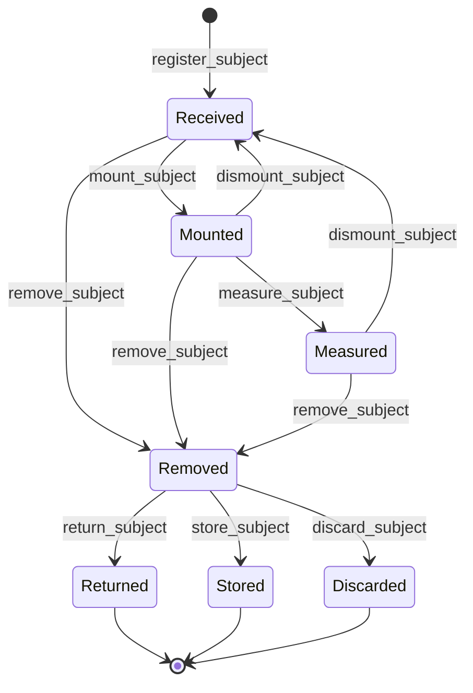

# Subject module <span class="md-maturity md-maturity--stable" title="One aggregate, seven-state lifecycle with three terminal dispositions, mount/dismount cycle, cross-aggregate Asset-lifecycle guard on mount.">stable</span>

## Purpose & Scope

The Subject module owns CORA's record of every entity that the facility measures, observes, or studies. <!-- arch:count kind=aggregate bc=subject spell=true cap=true -->One<!-- /arch:count --> aggregate, `Subject`, is the canonical place where a sample's id, display name, current lifecycle status, and current sample-environment mount live. Subjects are generic across science domains: materials samples, biological specimens, manufactured parts (including in-flight additively-manufactured prints being formed during the experiment), astronomical targets, and computational subjects all flow through the same lifecycle.

Subject identity crosses Run boundaries. The same `Subject.id` can be referenced by multiple Runs (in-situ and operando experiments, repeat measurements, calibration re-checks); the Subject aggregate does not maintain a list of Runs against it. The sample-environment apparatus the Subject is mounted on is an [Equipment](../equipment/index.md) `Asset`, not part of the Subject itself; the binding is one field on Subject state pointing at the Asset id.

<div class="cora-aside cora-aside--deferred" markdown>

Out of scope

- **Hazard, custody, and owner fields.** The aggregate carries id, name, and lifecycle today. Hazard classifications align with the [Safety](../safety/index.md) and [Caution](../caution/index.md) modules and will land on the Subject only when a hazard-bearing real sample needs them. Custody chains and owner attribution land on the same trigger.
- **Per-measurement detail.** The aggregate-level `Measured` status records "has been measured at least once". Which scan, which parameters, which results are not Subject state. Per-measurement records live in the [Run](../run/index.md) module's run reading entries table.
- **In-situ formation state.** For in-flight subjects (additively-manufactured prints, in-situ-formed materials), `Mounted` overloads to cover the active-formation period. If the overloading causes operator confusion, a separate `Forming` status lands additively without an event upcaster.
- **Persistent external identifier.** A scheme for citing Subjects in publications (an external persistent id) is a future additive field; today the internal UUID is the only identifier.
- **Per-Subject observation logbook.** A typed entries table for fine-grained Subject observations (environment temperature curves during a soak, weight-change traces during a chemistry step) is deferred until the use case lands. Same shape as the conduit traversals entries table in [Trust](../trust/index.md).

</div>

## Aggregates

| Name | Identity | State summary | FSM |
|---|---|---|---|
| `Subject` | `id: UUID` | `id`, `name: SubjectName`, `status: SubjectStatus`, `mounted_on_asset_id: UUID?` | yes (7-state with three terminal dispositions) |

A `Subject` is the entity being measured, observed, or studied. The state record is small: identity, display name, current lifecycle status, and the Asset id the sample is currently mounted on (None when the Subject is not mounted). The state field count stays small on purpose so the aggregate is a single transactional consistency boundary around the lifecycle decision.

## Value Objects

| Name | Shape | Where used |
|---|---|---|
| `SubjectName` | trimmed string, 1-200 chars | `Subject.name` |
| `SubjectStatus` | closed StrEnum: `Received` \| `Mounted` \| `Measured` \| `Removed` \| `Returned` \| `Stored` \| `Discarded` | `Subject.status` |
| `SubjectDiscardReason` | trimmed string, 1-500 chars | `discard_subject` decider input; serialized as plain `str` on `SubjectDiscarded.reason` |

`SubjectStatus.Returned`, `Stored`, and `Discarded` are terminal. `SubjectStatus.Received` is the genesis status set by the evolver on `SubjectRegistered`; no event payload ever carries a `status` field, since the event type itself encodes the state change. The same precedent runs through the Access module's `Actor.active`.

`SubjectDiscardReason` is required free text on every discard: the irrecoverable terminal disposition must carry the operator's stated reason. The two intermediate-mount-cycle events (`SubjectMounted`, `SubjectDismounted`) also carry a reason field for full sample-handling provenance.

## FSM

The Subject aggregate runs a seven-state lifecycle with three terminal dispositions, a multi-source `remove_subject` transition, and a mount-dismount cycle that returns the Subject to `Received` for re-use.



| From | To | Command | Event |
|---|---|---|---|
| `[*]` | `Received` | `register_subject` | `SubjectRegistered` |
| `Received` | `Mounted` | `mount_subject` | `SubjectMounted` |
| `Mounted` | `Measured` | `measure_subject` | `SubjectMeasured` |
| `Mounted` \| `Measured` | `Received` | `dismount_subject` | `SubjectDismounted` |
| `Received` \| `Mounted` \| `Measured` | `Removed` | `remove_subject` | `SubjectRemoved` |
| `Removed` | `Returned` | `return_subject` | `SubjectReturned` |
| `Removed` | `Stored` | `store_subject` | `SubjectStored` |
| `Removed` | `Discarded` | `discard_subject` | `SubjectDiscarded` |

The mount and dismount transitions form a re-usable cycle: a Subject can be mounted, dismounted, mounted again on a different Asset, measured, dismounted again, and finally removed; each cycle leaves a `SubjectMounted` and `SubjectDismounted` event pair on the stream with the operator's reason captured on both.

**Guards.** Beyond the source-state check, two slices enforce cross-aggregate state:

`mount_subject`
: The target sample-environment `Asset` exists and is in lifecycle `Active`. A `Commissioned`, `Maintenance`, or `Decommissioned` Asset cannot mount a Subject. The handler pre-loads the Asset and hands its lifecycle to the pure decider; existence resolution lives at the handler boundary and surfaces as `404`, lifecycle resolution lives in the decider and surfaces as `409`.

`dismount_subject`
: The current status is `Mounted` or `Measured`. A `Received` Subject has nothing to dismount; terminal-state Subjects are out of bounds entirely. The Asset the Subject was previously mounted on is read from `Subject.mounted_on_asset_id` and stamped onto `SubjectDismounted.from_asset_id` for self-contained audit.

Strict re-entry semantics apply across the board: re-measuring an already-`Measured` Subject raises; re-returning, re-storing, or re-discarding a terminal Subject raises. The decider does not no-op or always-emit on these calls; each non-source-state attempt produces a per-transition error class.

## Events

The Subject aggregate emits <!-- arch:count kind=event bc=subject spell=true agg=subject -->eight<!-- /arch:count --> event types.

| Event | Payload sketch | When emitted |
|---|---|---|
| `SubjectRegistered` | `subject_id`, `name`, `occurred_at` | `register_subject` succeeds (genesis); status implicitly `Received` |
| `SubjectMounted` | `subject_id`, `asset_id`, `reason`, `occurred_at` | `mount_subject` succeeds; `asset_id` is the sample-environment Asset the Subject was mounted on, `reason` is operator narrative |
| `SubjectMeasured` | `subject_id`, `occurred_at` | `measure_subject` succeeds; aggregate-level "has been measured at least once" |
| `SubjectDismounted` | `subject_id`, `from_asset_id`, `reason`, `occurred_at` | `dismount_subject` succeeds; carries the Asset the Subject was previously mounted on for self-contained audit |
| `SubjectRemoved` | `subject_id`, `occurred_at` | `remove_subject` succeeds from any of `Received`, `Mounted`, or `Measured` |
| `SubjectReturned` | `subject_id`, `occurred_at` | `return_subject` succeeds; terminal disposition (sample returned to its submitter) |
| `SubjectStored` | `subject_id`, `occurred_at` | `store_subject` succeeds; terminal disposition (sample archived on-site) |
| `SubjectDiscarded` | `subject_id`, `reason`, `occurred_at` | `discard_subject` succeeds; terminal disposition (sample destroyed); `reason` is required free text |

`SubjectMounted` and `SubjectDismounted` are the two events that carry an Asset id in their payload. Both fields are bare UUIDs and are not verified against the Equipment stream at write time; the Asset-lifecycle guard on `mount_subject` is the only cross-aggregate check, and it runs against the pre-loaded Asset, not the event stream.

## Slices

<!-- arch:slices-table bc=subject -->
_Generated from the code at build time._
<!-- /arch:slices-table -->

**Errors per slice.** Beyond Pydantic boundary 422s, each slice raises:

`RegisterSubject`
: `InvalidSubjectName`, `SubjectAlreadyExists`, `Unauthorized`

`MountSubject`
: `SubjectNotFound`, `SubjectCannotMount` (not in `Received`), `AssetNotFound`, `SubjectMountTargetUnavailable` (Asset not in `Active` lifecycle), `Unauthorized`

`MeasureSubject`
: `SubjectNotFound`, `SubjectCannotMeasure` (not in `Mounted`), `Unauthorized`

`DismountSubject`
: `SubjectNotFound`, `SubjectCannotDismount` (not in `Mounted` or `Measured`), `Unauthorized`

`RemoveSubject`
: `SubjectNotFound`, `SubjectCannotRemove` (not in `Received`, `Mounted`, or `Measured`), `Unauthorized`

`ReturnSubject`
: `SubjectNotFound`, `SubjectCannotReturn` (not in `Removed`), `Unauthorized`

`StoreSubject`
: `SubjectNotFound`, `SubjectCannotStore` (not in `Removed`), `Unauthorized`

`DiscardSubject`
: `SubjectNotFound`, `SubjectCannotDiscard` (not in `Removed`), `InvalidSubjectDiscardReason`, `Unauthorized`

`GetSubject`
: `SubjectNotFound`

`ListSubjects`
: (boundary 422 only)

## Storage & Projections

One read-side table backs the Subject module.

```sql title="proj_subject_summary"
CREATE TABLE proj_subject_summary (
    subject_id  UUID        PRIMARY KEY,
    name        TEXT        NOT NULL,
    status      TEXT        NOT NULL CHECK (
        status IN (
            'Received', 'Mounted', 'Measured', 'Removed',
            'Returned', 'Stored', 'Discarded'
        )
    ),
    created_at  TIMESTAMPTZ NOT NULL,
    updated_at  TIMESTAMPTZ NOT NULL DEFAULT now()
);

CREATE INDEX proj_subject_summary_keyset_idx
    ON proj_subject_summary (created_at, subject_id);
```

One row per Subject; the lifecycle collapses to a single mutable row by `ON CONFLICT` semantics in the projection. `status` flips with every transition (`Received` on `SubjectRegistered`, `Mounted` on `SubjectMounted`, `Received` on `SubjectDismounted`, and so on). Adding a new event type that produces a new status value requires a forward migration to widen the CHECK constraint.

`GET /subjects/{id}` folds the event stream so the response reflects the latest committed write without projection lag. `GET /subjects` reads from `proj_subject_summary` with keyset pagination over `(created_at, subject_id)` and an optional `status` filter. The Asset binding (`mounted_on_asset_id`) is not on the summary projection today; readers that need "what is mounted on Asset X" fold the Subject stream or wait for a future binding-shaped projection.

## Cross-Module boundaries

| Module | Relationship | What's exchanged |
|---|---|---|
| Trust | gated-by | Every write-side Subject slice (register, lifecycle, mount/dismount) is gated by the Authorize port resolving a `Policy` for the `(principal, command, conduit, surface)` tuple; deny outcomes refuse before the decider runs |
| Equipment | reads-from | `mount_subject` requires the target `Asset` exists and is in `Active` lifecycle; the handler pre-loads the Asset and hands it to the pure decider |
| Equipment | shared-id-with | `SubjectMounted.asset_id` and `SubjectDismounted.from_asset_id` are `Asset.id` values; the link is read-time and the Subject side does not verify Asset stream membership at write time |
| Run | shared-id-with | Run events reference `Subject.id` as the sample being measured; the binding is one-directional from Run to Subject |
| Access | shared-id-with | every Subject command carries `actor_id` on the envelope for principal attribution |
| Safety / Caution | aligns-with | future hazard classifications attach to `Subject.id` once the Subject aggregate gains a hazard field |

The Subject aggregate is the authoritative source of "where is sample X right now" for any module that needs it. Other modules read by folding Subject events or by querying the summary projection; nothing else mutates Subject state.

## Examples

The five examples below cover the canonical Subject lifecycle: register a sample, mount it on a sample-environment Asset, measure it, dismount it for re-use, and run it through a terminal disposition. The caller's principal goes on the `X-Principal-Id` header. For the REST and MCP equivalence, auth, and idempotency conventions these examples share, see [Reading the examples](../index.md) on the Modules landing page.

### Register a Subject

=== "REST"

    ```http
    POST /subjects
    Content-Type: application/json
    Idempotency-Key: 3f1a2b8c-9d4e-5f6a-7b8c-9d0e1f2a3b4c
    X-Principal-Id: 11111111-2222-3333-4444-555555555555

    {
      "name": "Catalyst pellet B-12 (operator A. Lovelace, batch 2026-05-19)"
    }
    ```

    Returns `201 Created` with the newly-assigned `subject_id`. Status is implicitly `Received`. A second call with the same idempotency key returns the same id.

=== "MCP"

    ```python
    mcp.call_tool(
        "register_subject",
        {"name": "Catalyst pellet B-12 (operator A. Lovelace, batch 2026-05-19)"},
    )
    ```

### Mount a Subject on a sample-environment Asset

=== "REST"

    ```http
    POST /subjects/<subject-id>/mount
    Content-Type: application/json
    X-Principal-Id: 11111111-2222-3333-4444-555555555555

    {
      "asset_id": "<rotary-stage-asset-id>",
      "reason": "Loaded for run 2026-05-19-007"
    }
    ```

    Returns `204 No Content`. The Subject's status flips to `Mounted` and `mounted_on_asset_id` records the Asset. The decider returns `404` if the Asset stream has no events; `409 SubjectMountTargetUnavailable` if the Asset exists but is in any lifecycle other than `Active`; `409 SubjectCannotMount` if the Subject is not in `Received`.

=== "MCP"

    ```python
    mcp.call_tool(
        "mount_subject",
        {
            "subject_id": "<subject-id>",
            "asset_id": "<rotary-stage-asset-id>",
            "reason": "Loaded for run 2026-05-19-007",
        },
    )
    ```

### Measure a Subject

=== "REST"

    ```http
    POST /subjects/<subject-id>/measure
    X-Principal-Id: 11111111-2222-3333-4444-555555555555
    ```

    Returns `204 No Content`. Status flips to `Measured`. The aggregate-level `Measured` status only records that the Subject was measured at least once; per-measurement detail (which scan, which parameters, which results) lives in Run events. `409 SubjectCannotMeasure` if the Subject is not in `Mounted` (re-measuring an already-`Measured` Subject also raises).

=== "MCP"

    ```python
    mcp.call_tool("measure_subject", {"subject_id": "<subject-id>"})
    ```

### Dismount a Subject for re-use

=== "REST"

    ```http
    POST /subjects/<subject-id>/dismount
    Content-Type: application/json
    X-Principal-Id: 11111111-2222-3333-4444-555555555555

    {
      "reason": "Run complete; returning sample to lab bench for SEM follow-up before re-mount"
    }
    ```

    Returns `204 No Content`. Status flips back to `Received` and `mounted_on_asset_id` clears. The previously-mounted Asset id is stamped onto `SubjectDismounted.from_asset_id` for self-contained audit. The Subject can now be re-mounted on a different Asset, measured again, or removed. `409 SubjectCannotDismount` if the Subject is not in `Mounted` or `Measured`.

=== "MCP"

    ```python
    mcp.call_tool(
        "dismount_subject",
        {
            "subject_id": "<subject-id>",
            "reason": "Run complete; returning sample to lab bench for SEM follow-up before re-mount",
        },
    )
    ```

### Move a Subject to terminal disposition

=== "REST"

    ```http
    POST /subjects/<subject-id>/remove
    X-Principal-Id: 11111111-2222-3333-4444-555555555555
    ```

    ```http
    POST /subjects/<subject-id>/discard
    Content-Type: application/json
    X-Principal-Id: 11111111-2222-3333-4444-555555555555

    {
      "reason": "Sample destroyed during chemistry step; no recoverable material"
    }
    ```

    Two calls: first `remove_subject` flips status to `Removed`, then one of `return_subject`, `store_subject`, or `discard_subject` lands the Subject on its terminal disposition. Only `discard_subject` requires a reason; the other two terminal events carry only the id and timestamp. All three terminal states are sinks; no further transitions are accepted.

=== "MCP"

    ```python
    mcp.call_tool("remove_subject", {"subject_id": "<subject-id>"})
    mcp.call_tool(
        "discard_subject",
        {
            "subject_id": "<subject-id>",
            "reason": "Sample destroyed during chemistry step; no recoverable material",
        },
    )
    ```
