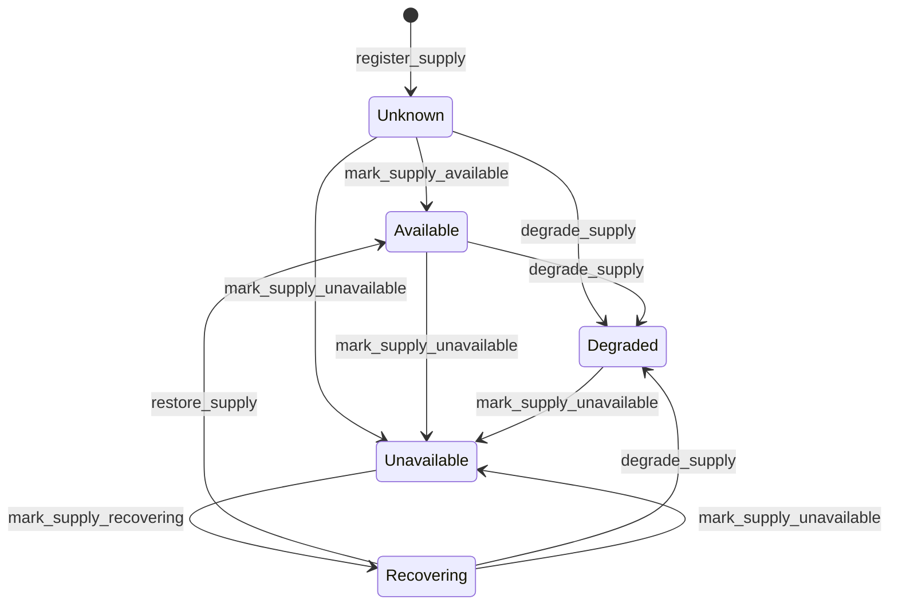

# Supply module

<span class="md-maturity md-maturity--stable" title="Aggregate, five-state FSM, six events, eight slices, and projection all locked.">stable</span>

## Purpose & Scope

The Supply module models continuously-available resources that other aggregates depend on: photon beam, FEL pulses, neutrons, ion beam, liquid nitrogen, liquid helium, compressed air, cooling water, chilled water, electrical power, process gases, vacuum, compute pool. Operators register a Supply, then mark its availability as observations and incidents arrive. A Supply is the resource itself; the physical infrastructure delivering it (gas cabinets, compressors, mass-flow controllers, manifolds) stays modeled as Assets in the Equipment module.

The aggregate is intentionally slim: identity plus a typed `(scope, kind, name)` address plus a single `status` field driving the FSM. Per-transition audit metadata (reason, trigger, timestamps) lives only on events; the projection denormalises the latest transition for at-a-glance queries.

<div class="cora-aside cora-aside--deferred" markdown>

Out of scope
{: .cora-kicker }

- **Capacity and quantity tracking.** No `capacity` field today. Will land additively when a real consumer needs quantity, not before.
- **Physical-equipment binding.** No link from `Supply` to the Asset(s) that deliver it. Additive `bound_asset_id` is on the watch list.
- **Auto-restore on observation.** `Recovering → Available` requires an explicit operator `restore_supply` gesture. Timer-based or substream-driven auto-restore is deferred.
- **Monitor and Auto trigger paths.** Only `Operator` triggers are wired today; `Monitor` and `Auto` are reserved in the enum so the future slice families land without an enum migration.

</div>

## Aggregates

| Name | Identity | State summary | FSM |
|---|---|---|---|
| `Supply` | `id: UUID` (opaque) plus typed address `(scope, kind, name)` enforced unique on the projection | scope, kind, name, status | yes |

## Value Objects

| Name | Shape | Where used |
|---|---|---|
| `SupplyName` | trimmed bounded text, 1-200 chars | `Supply.name` |
| `SupplyReason` | trimmed bounded text, 1-500 chars; decider-input only | every transition slice's `reason` |
| `SupplyStatus` | closed StrEnum `{Unknown, Available, Degraded, Unavailable, Recovering}` | `Supply.status` |
| `SupplyScope` | closed StrEnum `{Facility, Sector, Beamline}` | `Supply.scope` |
| `TriggerSource` | closed StrEnum `{Operator, Monitor, Auto}` | transition-event `trigger` discriminator |

`Supply.kind` is a bare `str` (1-50 chars, validated at the decider), not a VO, mirroring the `AssetPort.signal_type` and `Procedure.kind` precedents. Future graduation to a closed `SupplyKind` StrEnum once pilot vocabulary settles is a clean parser change; making it a VO first would break every type-annotated call site at promotion. Documented starter vocabulary: `PhotonBeam`, `FELPulses`, `Neutrons`, `IonBeam`, `LiquidNitrogen`, `LiquidHelium`, `CompressedAir`, `CoolingWater`, `ChilledWater`, `ElectricalPower`, `ProcessGas`, `Vacuum`, `ComputePool`.

## FSM



| From | To | Command | Event |
|---|---|---|---|
| `[*]` | `Unknown` | `register_supply` | `SupplyRegistered` |
| `Unknown` | `Available` | `mark_supply_available` | `SupplyMarkedAvailable` |
| `Unknown`, `Available`, `Recovering` | `Degraded` | `degrade_supply` | `SupplyDegraded` |
| `Unknown`, `Available`, `Degraded`, `Recovering` | `Unavailable` | `mark_supply_unavailable` | `SupplyMarkedUnavailable` |
| `Unavailable` | `Recovering` | `mark_supply_recovering` | `SupplyMarkedRecovering` |
| `Recovering` | `Available` | `restore_supply` | `SupplyRestored` |

**Guards.** Beyond the source-state check, each transition enforces:

`mark_supply_available` / `restore_supply`
: Two distinct paths to `Available` with distinct audit semantics. `mark_supply_available` is the first-observation declaration out of `Unknown`; `restore_supply` is the operator-acknowledgement that confirms a `Recovering` Supply is fully back. Re-using the wrong slice on the wrong source state raises (strict-not-idempotent on both). Mirrors the Phoebus latched-alarm precedent: first-observation and recovery-confirmation are two different operator gestures.

`degrade_supply` / `mark_supply_unavailable` / `mark_supply_recovering`
: All carry a REQUIRED `reason` (1-500 chars after trim) and a `trigger` value. The trigger is constrained to `Operator` today; `Monitor` and `Auto` are reserved in the enum for the future monitor-substream and auto-recovery slice families.

## Events

| Event | Payload sketch | When emitted |
|---|---|---|
| `SupplyRegistered` | `supply_id, scope, kind, name, occurred_at` | `register_supply` accepted; status implicitly `Unknown`. |
| `SupplyMarkedAvailable` | `supply_id, from_status, reason, trigger, occurred_at` | `mark_supply_available` accepted (Unknown → Available). |
| `SupplyDegraded` | `supply_id, from_status, reason, trigger, occurred_at` | `degrade_supply` accepted (Unknown, Available, or Recovering → Degraded). |
| `SupplyMarkedUnavailable` | `supply_id, from_status, reason, trigger, occurred_at` | `mark_supply_unavailable` accepted (Unknown, Available, Degraded, or Recovering → Unavailable). |
| `SupplyMarkedRecovering` | `supply_id, from_status, reason, trigger, occurred_at` | `mark_supply_recovering` accepted (Unavailable → Recovering). |
| `SupplyRestored` | `supply_id, from_status, reason, trigger, occurred_at` | `restore_supply` accepted (Recovering → Available). |

Every transition event carries `from_status` explicitly (even though the FSM constrains it) to keep projection apply logic uniform across the five transition slices and to make per-event audit reads self-contained.

## Slices

| Command | Category | REST | MCP tool | Idempotency |
|---|---|---|---|---|
| `RegisterSupply` | NEW | `POST /supplies` | `register_supply` | required |
| `MarkSupplyAvailable` | MODIFIED | `POST /supplies/{supply_id}/mark_available` | `mark_supply_available` | none |
| `DegradeSupply` | MODIFIED | `POST /supplies/{supply_id}/degrade` | `degrade_supply` | none |
| `MarkSupplyUnavailable` | MODIFIED | `POST /supplies/{supply_id}/mark_unavailable` | `mark_supply_unavailable` | none |
| `MarkSupplyRecovering` | MODIFIED | `POST /supplies/{supply_id}/mark_recovering` | `mark_supply_recovering` | none |
| `RestoreSupply` | MODIFIED | `POST /supplies/{supply_id}/restore` | `restore_supply` | none |
| `GetSupply` | QUERY | `GET /supplies/{supply_id}` | `get_supply` | none |
| `ListSupplies` | QUERY | `GET /supplies` | `list_supplies` | none |

**Errors per slice.** Beyond Pydantic boundary 422s, each slice raises:

`RegisterSupply`
: `SupplyAlreadyExistsError`, `InvalidSupplyNameError`, `InvalidSupplyKindError`, `Unauthorized`. A duplicate `(scope, kind, name)` registration succeeds at the aggregate (different stream) but fails at projection-insert time on the UNIQUE INDEX; the operator de-registers the duplicate via a future deregister slice.

`MarkSupplyAvailable` / `DegradeSupply` / `MarkSupplyUnavailable` / `MarkSupplyRecovering` / `RestoreSupply`
: `SupplyNotFoundError`, `SupplyCannot<Verb>Error` (single-source for MarkAvailable, MarkRecovering, Restore; multi-source for Degrade `{Unknown, Available, Recovering}` and MarkUnavailable `{Unknown, Available, Degraded, Recovering}`), `InvalidSupplyReasonError`, `Unauthorized`

`GetSupply`
: `SupplyNotFoundError`

`ListSupplies`
: (boundary 422 only)

## Storage & Projections

`proj_supply_summary`:

```sql title="proj_supply_summary"
CREATE TABLE proj_supply_summary (
    supply_id              UUID        PRIMARY KEY,
    scope                  TEXT        NOT NULL CHECK (
        scope IN ('Facility', 'Sector', 'Beamline')
    ),
    kind                   TEXT        NOT NULL,
    name                   TEXT        NOT NULL,
    status                 TEXT        NOT NULL CHECK (
        status IN ('Unknown', 'Available', 'Degraded', 'Unavailable', 'Recovering')
    ),
    registered_at          TIMESTAMPTZ NOT NULL,
    last_status_changed_at TIMESTAMPTZ,
    last_status_reason     TEXT,
    last_trigger           TEXT        CHECK (
        last_trigger IS NULL OR last_trigger IN ('Operator', 'Monitor', 'Auto')
    ),
    updated_at             TIMESTAMPTZ NOT NULL DEFAULT now()
);

CREATE UNIQUE INDEX proj_supply_summary_address_uq
    ON proj_supply_summary (scope, kind, name);
CREATE INDEX proj_supply_summary_keyset_idx
    ON proj_supply_summary (registered_at, supply_id);
```

`(scope, kind, name)` is enforced unique at the projection because aggregates cannot enforce cross-stream invariants without dynamic consistency boundaries. The CHECK constraints are locked with the full enum values day one (five statuses, three triggers) so the transition slices and the deferred Monitor and Auto trigger paths all land without a constraint migration. `last_status_changed_at`, `last_status_reason`, and `last_trigger` stay NULL until the first transition out of `Unknown` and denormalise the latest transition's audit metadata for at-a-glance ops queries.

## Cross-Module boundaries

| Module | Relationship | What's exchanged |
|---|---|---|
| `Equipment` | reads-from (today, no schema link) | The physical infrastructure delivering a resource stays modeled as Assets in Equipment; Supply describes the resource itself. The additive `bound_asset_id` link is a watch item and will surface when a consumer needs equipment-to-resource traversal. |

Day-1 the Supply module has no synchronous cross-BC writes. Run and Operation consumers read Supply status to make pre-flight checks (operator-decided, not aggregate-enforced); the read path uses `list_supplies` filtered by scope or kind.

## Examples

The four examples below follow the canonical Supply path: register a beamline-local LN2 supply, mark it Available for the first time, mark it Unavailable on a dewar-empty incident, then progress through Recovering and Restore back to Available. Reasons on every transition are operator-supplied audit breadcrumbs. For the REST/MCP equivalence, auth, and idempotency conventions these examples share, see [Reading the examples](../index.md) on the Modules landing page.

<!-- extracted from tests/contract/supply/test_*.py -->

### Register a Supply

=== "REST"

    ```http
    POST /supplies
    Content-Type: application/json
    Idempotency-Key: 9a7d2c3e-4b1f-4f6a-8a2e-5c2c4f3a7b91
    X-Principal-Id: 7b1f2d4e-2a3c-4d5e-8f9a-1b2c3d4e5f60

    {
      "scope": "Beamline",
      "kind": "LiquidNitrogen",
      "name": "35-BM LN2 drop"
    }
    ```

    A successful call returns `201 Created` with `{"supply_id": "<uuid>"}`. The Supply starts in `Unknown`.

=== "MCP"

    ```python
    mcp.call_tool(
        "register_supply",
        {
            "scope": "Beamline",
            "kind": "LiquidNitrogen",
            "name": "35-BM LN2 drop",
        },
    )
    ```

    Returns the same response shape as the REST call.

### Mark the Supply Available for the first time

=== "REST"

    ```http
    POST /supplies/{supply_id}/mark_available
    Content-Type: application/json
    X-Principal-Id: 7b1f2d4e-2a3c-4d5e-8f9a-1b2c3d4e5f60

    {
      "reason": "Dewar topped off; pressure 1.4 bar; consumer flow nominal.",
      "trigger": "Operator"
    }
    ```

    A successful call returns `204 No Content`. Status moves to `Available`; the projection records `last_status_changed_at`, `last_status_reason`, and `last_trigger`.

=== "MCP"

    ```python
    mcp.call_tool(
        "mark_supply_available",
        {
            "supply_id": "<uuid>",
            "reason": "Dewar topped off; pressure 1.4 bar; consumer flow nominal.",
            "trigger": "Operator",
        },
    )
    ```

    Returns the same response shape as the REST call.

### Mark the Supply Unavailable on an incident

=== "REST"

    ```http
    POST /supplies/{supply_id}/mark_unavailable
    Content-Type: application/json
    X-Principal-Id: 7b1f2d4e-2a3c-4d5e-8f9a-1b2c3d4e5f60

    {
      "reason": "Dewar pressure dropped to 0.2 bar after fill-line freeze; consumers held.",
      "trigger": "Operator"
    }
    ```

    A successful call returns `204 No Content`. Status moves to `Unavailable`. Downstream consumers gate on this status via `list_supplies?status=Unavailable` or per-Supply `GET /supplies/{supply_id}` reads.

=== "MCP"

    ```python
    mcp.call_tool(
        "mark_supply_unavailable",
        {
            "supply_id": "<uuid>",
            "reason": "Dewar pressure dropped to 0.2 bar after fill-line freeze; consumers held.",
            "trigger": "Operator",
        },
    )
    ```

    Returns the same response shape as the REST call.

### Mark Recovering and Restore

=== "REST"

    ```http
    POST /supplies/{supply_id}/mark_recovering
    Content-Type: application/json
    X-Principal-Id: 7b1f2d4e-2a3c-4d5e-8f9a-1b2c3d4e5f60

    {
      "reason": "Fill line thawed; pressure climbing through 0.9 bar.",
      "trigger": "Operator"
    }
    ```

    Then, once the operator has confirmed full availability:

    ```http
    POST /supplies/{supply_id}/restore
    Content-Type: application/json
    X-Principal-Id: 7b1f2d4e-2a3c-4d5e-8f9a-1b2c3d4e5f60

    {
      "reason": "Pressure stable at 1.4 bar for 15 minutes; consumer flow nominal.",
      "trigger": "Operator"
    }
    ```

    Both calls return `204 No Content`. The two-step path keeps the recovery-acknowledgement explicit: an observation that the resource may be coming back is distinct from operator confirmation that it is fully back.

=== "MCP"

    ```python
    mcp.call_tool(
        "mark_supply_recovering",
        {
            "supply_id": "<uuid>",
            "reason": "Fill line thawed; pressure climbing through 0.9 bar.",
            "trigger": "Operator",
        },
    )
    mcp.call_tool(
        "restore_supply",
        {
            "supply_id": "<uuid>",
            "reason": "Pressure stable at 1.4 bar for 15 minutes; consumer flow nominal.",
            "trigger": "Operator",
        },
    )
    ```

    Returns the same response shape as the REST calls.
