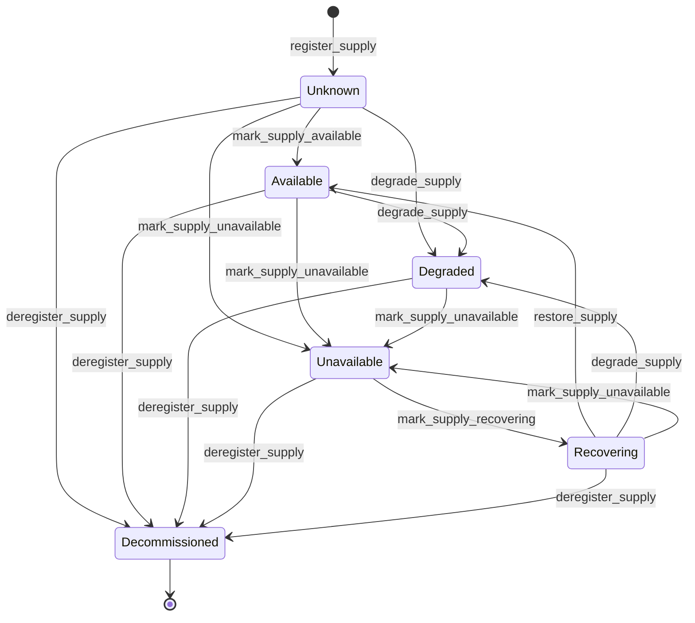

# Supply module

<span class="md-maturity md-maturity--stable" title="Aggregate, five-state health FSM + Decommissioned lifecycle terminal, seven events, ten slices (one in-process-only), projection all locked.">stable</span>

## Purpose & Scope

The Supply module models continuously-available resources that other aggregates depend on: photon beam, FEL pulses, neutrons, ion beam, liquid nitrogen, liquid helium, compressed air, cooling water, chilled water, electrical power, process gases, vacuum, compute pool. Operators register a Supply, then mark its availability as observations and incidents arrive. A Supply is the resource itself; the physical infrastructure delivering it (gas cabinets, compressors, mass-flow controllers, manifolds) stays modeled as Assets in the Equipment module.

The aggregate is intentionally slim: identity plus a typed `(facility_code, containing_asset_id, kind, name)` address plus a single `status` field driving the FSM. Per-transition audit metadata (reason, trigger, timestamps) lives only on events; the projection denormalises the latest transition for at-a-glance queries.

<div class="cora-aside cora-aside--deferred" markdown>

Out of scope
{: .cora-kicker }

- **Capacity and quantity tracking.** No `capacity` field today. Will land additively when a real consumer needs quantity, not before.
- **Auto-restore on observation.** `Recovering → Available` requires an explicit operator `restore_supply` gesture. `Monitor` cannot drive this transition either (the latched-alarm fence at the `observe_supply_status` decider). Timer-based `Auto` recovery is deferred.
- **Monitor trigger Port A (EPICS subscriber).** Port B (the Supply-side inbound `observe_supply_status` slice) has shipped; Port A (the EPICS subscriber that calls Port B with PV updates) defers to the 2-BM controls adapter discovery work.
- **REST or MCP surface for `observe_supply_status`.** In-process-only by design (operators have buttons, machines have ports). Adapters call `SupplyHandlers.observe_supply_status(...)` directly.

</div>

## Aggregates

| Name | Identity | State summary | FSM |
|---|---|---|---|
| `Supply` | `id: UUID` (opaque) plus typed address `(facility_code, containing_asset_id, kind, name)` enforced unique on the projection | scope, kind, name, facility_code, containing_asset_id, status | yes |

## Value Objects

| Name | Shape | Where used |
|---|---|---|
| `SupplyName` | trimmed bounded text, 1-200 chars | `Supply.name` |
| `SupplyReason` | trimmed bounded text, 1-500 chars; decider-input only | every transition slice's `reason` |
| `SupplyStatus` | closed StrEnum `{Unknown, Available, Degraded, Unavailable, Recovering, Decommissioned}` | `Supply.status`. The first five are health states on the FSM; `Decommissioned` is a lifecycle terminal (no transition exits) added by `deregister_supply`. Parallel to `Asset.lifecycle=Decommissioned` and `Subject.status=Discarded`. |
| `SupplyScope` | closed StrEnum `{Facility, Sector, Beamline}` | `Supply.scope` (decorative since Slice 7C; the structural address tuple is `(facility_code, containing_asset_id, kind, name)` per [[project_supply_sector_disposition]] Option A. SupplyScope retirement is queued behind one release cycle.) |
| `FacilityCode` | bounded text VO from `cora.shared.facility_code` (lowercase ASCII alphanumeric + dash, 1-32 chars) | `Supply.facility_code` (cross-deployment convergent slug of the owning Federation Facility; required) |
| `TriggerSource` | closed StrEnum `{Operator, Monitor, Auto}` | transition-event `trigger` discriminator. `Operator` is used by the operator-gesture slices; `Monitor` is used by the `observe_supply_status` slice (in-process port for sensor-driven transitions); `Auto` is reserved for the future timer-driven recovery slice. |
| `MonitorRef` | frozen dataclass `(source_kind: str 1-50, source_id: str 1-200)` | `observe_supply_status` command input; serialized as `"{source_kind}:{source_id}"` on the transition event's `monitor_ref` audit field. |

`Supply.kind` is a bare `str` (1-50 chars, validated at the decider), not a VO, mirroring the `AssetPort.signal_type` and `Procedure.kind` precedents. Future graduation to a closed `SupplyKind` StrEnum once pilot vocabulary settles is a clean parser change; making it a VO first would break every type-annotated call site at promotion. Documented starter vocabulary: `PhotonBeam`, `FELPulses`, `Neutrons`, `IonBeam`, `LiquidNitrogen`, `LiquidHelium`, `CompressedAir`, `CoolingWater`, `ChilledWater`, `ElectricalPower`, `ProcessGas`, `Vacuum`, `ComputePool`.

## FSM



| From | To | Command | Event |
|---|---|---|---|
| `[*]` | `Unknown` | `register_supply` | `SupplyRegistered` |
| `Unknown` | `Available` | `mark_supply_available` | `SupplyMarkedAvailable` |
| `Unknown`, `Available`, `Recovering` | `Degraded` | `degrade_supply` *or* `observe_supply_status` | `SupplyDegraded` |
| `Unknown`, `Available`, `Degraded`, `Recovering` | `Unavailable` | `mark_supply_unavailable` *or* `observe_supply_status` | `SupplyMarkedUnavailable` |
| `Unavailable` | `Recovering` | `mark_supply_recovering` *or* `observe_supply_status` | `SupplyMarkedRecovering` |
| `Recovering` | `Available` | `restore_supply` (operator-only; Monitor is fenced out) | `SupplyRestored` |
| any non-`Decommissioned` | `Decommissioned` | `deregister_supply` (operator-only) | `SupplyDeregistered` |

**Guards.** Beyond the source-state check, each transition enforces:

`mark_supply_available` / `restore_supply`
: Two distinct paths to `Available` with distinct audit semantics. `mark_supply_available` is the first-observation declaration out of `Unknown`; `restore_supply` is the operator-acknowledgement that confirms a `Recovering` Supply is fully back. Re-using the wrong slice on the wrong source state raises (strict-not-idempotent on both). Mirrors the Phoebus latched-alarm precedent: first-observation and recovery-confirmation are two different operator gestures.

`degrade_supply` / `mark_supply_unavailable` / `mark_supply_recovering`
: All carry a REQUIRED `reason` (1-500 chars after trim). The operator-gesture slices hardcode `trigger=Operator`; the same source-state allowlists apply when these transitions are driven by `observe_supply_status` (in which case `trigger=Monitor` and an audit `monitor_ref` lands on the event). `Auto` is reserved for the future timer-driven recovery slice.

`deregister_supply`
: Operator escape hatch for mistaken registrations. Accepts any non-`Decommissioned` source. Lifecycle terminal: no transition exits `Decommissioned`; if the operator needs the resource back, they re-register at the same `(scope, kind, name)` and get a fresh `supply_id` (the projection's partial UNIQUE INDEX excludes `Decommissioned` rows from uniqueness). Raises `SupplyCannotDeregisterError` (HTTP 409) on a Supply already in `Decommissioned`.

`observe_supply_status`
: In-process-only port (no REST, no MCP). Routes by the requested `new_status` to the corresponding transition event, fences `Monitor` out of `Recovering → Available` and `Unknown → Available` (operator-only; latched-alarm + first-observation declaration semantics), and stamps every emitted event with `trigger=Monitor` plus the adapter's `monitor_ref` for audit. Source-state allowlists per target mirror the operator slices verbatim.

## Events

| Event | Payload sketch | When emitted |
|---|---|---|
| `SupplyRegistered` | `supply_id, scope, kind, name, occurred_at` | `register_supply` accepted; status implicitly `Unknown`. |
| `SupplyMarkedAvailable` | `supply_id, from_status, reason, trigger, occurred_at, monitor_ref?` | `mark_supply_available` accepted (Unknown → Available). Operator-only target; `monitor_ref` is always absent. |
| `SupplyDegraded` | `supply_id, from_status, reason, trigger, occurred_at, monitor_ref?` | `degrade_supply` or `observe_supply_status` accepted (Unknown, Available, or Recovering → Degraded). |
| `SupplyMarkedUnavailable` | `supply_id, from_status, reason, trigger, occurred_at, monitor_ref?` | `mark_supply_unavailable` or `observe_supply_status` accepted (Unknown, Available, Degraded, or Recovering → Unavailable). |
| `SupplyMarkedRecovering` | `supply_id, from_status, reason, trigger, occurred_at, monitor_ref?` | `mark_supply_recovering` or `observe_supply_status` accepted (Unavailable → Recovering). |
| `SupplyRestored` | `supply_id, from_status, reason, trigger, occurred_at, monitor_ref?` | `restore_supply` accepted (Recovering → Available). Operator-only target; `monitor_ref` is always absent. |
| `SupplyDeregistered` | `supply_id, from_status, reason, trigger, occurred_at, monitor_ref?` | `deregister_supply` accepted (any non-`Decommissioned` → `Decommissioned`). Operator-only target; `monitor_ref` is always absent. |

Every transition event carries `from_status` explicitly (even though the FSM constrains it) to keep projection apply logic uniform across the six transition slices and to make per-event audit reads self-contained. `monitor_ref` is an additive optional field: present when the transition was driven by `observe_supply_status` (carries the originating sensor's `"{source_kind}:{source_id}"` for audit), absent for operator-gesture transitions.

## Slices

| Command | Category | REST | MCP tool | Idempotency |
|---|---|---|---|---|
| `RegisterSupply` | NEW | `POST /supplies` | `register_supply` | required |
| `MarkSupplyAvailable` | MODIFIED | `POST /supplies/{supply_id}/mark-available` | `mark_supply_available` | none |
| `DegradeSupply` | MODIFIED | `POST /supplies/{supply_id}/degrade` | `degrade_supply` | none |
| `MarkSupplyUnavailable` | MODIFIED | `POST /supplies/{supply_id}/mark-unavailable` | `mark_supply_unavailable` | none |
| `MarkSupplyRecovering` | MODIFIED | `POST /supplies/{supply_id}/mark-recovering` | `mark_supply_recovering` | none |
| `RestoreSupply` | MODIFIED | `POST /supplies/{supply_id}/restore` | `restore_supply` | none |
| `DeregisterSupply` | TERMINAL | `POST /supplies/{supply_id}/deregister` | `deregister_supply` | none |
| `ObserveSupplyStatus` | IN-PROCESS | (none, by design) | (none, by design) | none |
| `GetSupply` | QUERY | `GET /supplies/{supply_id}` | `get_supply` | none |
| `ListSupplies` | QUERY | `GET /supplies` | `list_supplies` | none |

`ObserveSupplyStatus` ships no REST endpoint or MCP tool by design: operators have buttons, machines have ports. In-process adapters (the future EPICS subscriber per the 2-BM controls work, a TomoScan watchdog, future facility-bridges) call `SupplyHandlers.observe_supply_status(...)` directly. Exposing the slice on the public surface would invite operators issuing Monitor-tagged events from MCP tools while the system attributes them to a sensor.

**Errors per slice.** Beyond Pydantic boundary 422s, each slice raises:

`RegisterSupply`
: `SupplyAlreadyExistsError`, `InvalidSupplyNameError`, `InvalidSupplyKindError`, `Unauthorized`. A duplicate active `(scope, kind, name)` registration succeeds at the aggregate (different stream) but fails at projection-insert time on the partial UNIQUE INDEX; the projection swallows the conflict with a WARN log so the worker keeps advancing. The duplicate event stays in the audit log; the operator can deregister one via `DeregisterSupply` and re-register cleanly (the partial index excludes `Decommissioned` rows from uniqueness).

`MarkSupplyAvailable` / `DegradeSupply` / `MarkSupplyUnavailable` / `MarkSupplyRecovering` / `RestoreSupply`
: `SupplyNotFoundError`, `SupplyCannot<Verb>Error` (single-source for MarkAvailable, MarkRecovering, Restore; multi-source for Degrade `{Unknown, Available, Recovering}` and MarkUnavailable `{Unknown, Available, Degraded, Recovering}`), `InvalidSupplyReasonError`, `Unauthorized`

`DeregisterSupply`
: `SupplyNotFoundError`, `SupplyCannotDeregisterError` (single disqualifying source: `Decommissioned` itself; strict-not-idempotent), `InvalidSupplyReasonError`, `Unauthorized`

`ObserveSupplyStatus`
: `SupplyNotFoundError`, `MonitorTriggerNotPermittedError` (the requested `new_status` is operator-only: `Available` via either path, or `Decommissioned`, or `Unknown`), the same `SupplyCannot<Verb>Error` family the operator slices use when a source-state allowlist rejects, `InvalidSupplyReasonError`, `InvalidMonitorRefError`

`GetSupply`
: `SupplyNotFoundError`

`ListSupplies`
: (boundary 422 only). Four optional filters: `facility_code` (lowercase-ASCII-slug exact match), `containing_asset_id` (Equipment Asset UUID; non-null projection rows only), `kind` (free-form exact match), `status`. Status filter accepts `Decommissioned` alongside the five health values; an unfiltered list returns every status (no default-exclude, matching the Asset / Subject sibling-BC convention). The legacy `?scope=` filter was retired in Slice 7D; clients still passing it get HTTP 200 with the parameter silently ignored.

## Storage & Projections

`proj_supply_summary`:

```sql title="proj_supply_summary"
CREATE TABLE proj_supply_summary (
    supply_id              UUID        PRIMARY KEY,
    scope                  TEXT        NOT NULL CHECK (
        scope IN ('Facility', 'Sector', 'Beamline')
    ),
    kind                   TEXT        NOT NULL,
    name                   TEXT        NOT NULL,
    facility_code          TEXT        NOT NULL,
    containing_asset_id    UUID,
    status                 TEXT        NOT NULL CHECK (
        status IN ('Unknown', 'Available', 'Degraded', 'Unavailable',
                   'Recovering', 'Decommissioned')
    ),
    registered_at          TIMESTAMPTZ NOT NULL,
    last_status_changed_at TIMESTAMPTZ,
    last_status_reason     TEXT,
    last_trigger           TEXT        CHECK (
        last_trigger IS NULL OR last_trigger IN ('Operator', 'Monitor', 'Auto')
    ),
    updated_at             TIMESTAMPTZ NOT NULL DEFAULT now()
);

CREATE UNIQUE INDEX proj_supply_summary_address_uq
    ON proj_supply_summary (
        facility_code,
        COALESCE(containing_asset_id::text, ''),
        kind,
        name
    )
    WHERE status != 'Decommissioned';

CREATE INDEX proj_supply_summary_containing_asset_id_idx
    ON proj_supply_summary (containing_asset_id)
    WHERE containing_asset_id IS NOT NULL;

CREATE INDEX proj_supply_summary_keyset_idx
    ON proj_supply_summary (registered_at, supply_id);
```

`(facility_code, COALESCE(containing_asset_id::text, ''), kind, name)` is enforced unique at the projection because aggregates cannot enforce cross-stream invariants without dynamic consistency boundaries. Two facilities can each own a `(LiquidNitrogen, "2-BM LN2 dewar")` row without colliding (`facility_code` distinguishes); two distinct containing-Asset bindings within one facility can each own the same `(kind, name)` pair (the COALESCE-stringified UUID distinguishes); facility-scope Supplies (NULL `containing_asset_id`) share the empty-string sentinel slot per facility so per-`(facility_code, kind, name)` uniqueness still holds. The UNIQUE INDEX is **partial** on `WHERE status != 'Decommissioned'` so a tombstoned Supply does not hold the address against re-registration: deregister the typo, register again cleanly, and both rows coexist (one `Decommissioned` for audit, one active). The non-unique `containing_asset_id` index backs the `?containing_asset_id=` operator-list filter introduced by Slice 7D. The `status` CHECK widened to six values when `deregister_supply` shipped (forward-only migration `20260527160000_widen_proj_supply_summary_for_deregister`); the three-value `last_trigger` CHECK was locked day one so `Monitor` and `Auto` events land without a constraint change. `last_status_changed_at`, `last_status_reason`, and `last_trigger` stay NULL until the first transition out of `Unknown` and denormalise the latest transition's audit metadata for at-a-glance ops queries. `monitor_ref` is NOT projected (audit-only on the event log).

The `(scope, kind, name)` tuple was the original load-bearing uniqueness key (migration `20260514100000_init_proj_supply_summary`); Slice 7A added `facility_code` (nullable), Slice 7B added `containing_asset_id`, Slice 7C swapped the UNIQUE INDEX to the current shape and tightened `facility_code` to `NOT NULL`. The `scope` column stays decorative through Slice 7E; SupplyScope retirement is queued behind one release cycle per [[project_supply_sector_disposition]] Step 6.

## Cross-Module boundaries

| Module | Relationship | What's exchanged |
|---|---|---|
| `Trust` | gated-by | Every write-side Supply slice (register, transitions) is gated by the Authorize port resolving a `Policy` for the `(principal, command, conduit, surface)` tuple; deny outcomes refuse before the decider runs. |
| `Access` | shared-id-with | Every Supply event envelope carries `actor_id` for principal attribution; cross-module references are bare UUIDs and not verified at write time. |
| `Recipe` | upstream-of-kind | `Method.needed_supplies` references `Supply.kind` strings, not Supply ids. The asymmetry is intentional: kinds (`LiquidNitrogen`, `PhotonBeam`, ...) are facility-portable so a Method written elsewhere can declare its supply prerequisites; instance UUIDs are not. |
| `Equipment` | reads-from (via `AssetLookup` port) | The physical infrastructure delivering a resource stays modeled as Assets in Equipment; Supply describes the resource itself. `Supply.containing_asset_id` (optional, Slice 7B) binds a Supply to the Equipment Asset that contains it (Sector / Beamline / Unit per [[project_supply_sector_disposition]] Option A). The `register_supply` handler resolves the id via the cross-BC `AssetLookup` port and rejects unknown ids with `SupplyContainingAssetNotFoundError` (HTTP 404). Slice 7E adds a loose projection-side referential integrity test (`test_supply_containing_asset_referential_postgres`) that walks both projections; the binding is NOT a real Postgres FK because cross-BC projections progress asynchronously. |
| `Federation` | reads-from (via `FacilityLookup` port) | `Supply.facility_code` (required, Slice 7A) binds every Supply to its owning Federation Facility via the cross-deployment convergent slug. The `register_supply` handler resolves the slug via `FacilityLookup.lookup_by_code` and rejects unknown codes with `SupplyFacilityNotFoundError` (HTTP 404). Decommissioned-Facility binding is allowed per the slice 6A precedent. |
| `Run` | upstream-of (load-bearing) | `start_run` resolves `Method.needed_supplies` and reads through the cross-BC `SupplyLookup` port; the decider refuses to start the Run unless every required kind has at least one Supply in `Available` status. Failure raises `RunRequiresAvailableSupplyError` (no Supply for kind) or `RunSupplyCoverageMismatchError` (Supply exists but none Available); both map to HTTP 409. |
| `Operation` | upstream-of (load-bearing for Phase-of-Run) | `start_procedure` for Phase-of-Run Procedures resolves `parent_run_id → Run → Plan → Practice → Method` and reads the same `SupplyLookup` port; failure raises `ProcedureRequiresAvailableSupplyError` / `ProcedureSupplyCoverageMismatchError`. Standalone Procedures (no `parent_run_id`) pass trivially today; Capability-level `needed_supplies` is a watch item. |

The pre-flight gate is `Available`-only by design: `Degraded` does NOT pass. The cost-asymmetry anchor wins (false-positive availability wastes beamtime; the operator override is `mark_supply_available` after walkdown, not a `force=true` bypass). Day-1 the Supply module has no synchronous cross-BC writes; the inbound `observe_supply_status` port is in-process from an adapter the BC does not import.

## Examples

The four examples below follow the canonical Supply path: register a beamline-local LN2 supply, mark it Available for the first time, mark it Unavailable on a dewar-empty incident, then progress through Recovering and Restore back to Available. Reasons on every transition are operator-supplied audit breadcrumbs. For the REST/MCP equivalence, auth, and idempotency conventions these examples share, see [Reading the examples](../index.md) on the Modules landing page.

<!-- extracted from tests/contract/supply/test_*.py -->

### Register a Supply

=== "REST"

    ```http
    POST /supplies
    Content-Type: application/json
    Idempotency-Key: 9a7d2c3e-4b1f-4f6a-8a2e-5c2c4f3a7b91
    X-Principal-Id: 7b1f2d4e-2a3c-4d5e-8f9a-1b2c3d4e5f60

    {
      "scope": "Beamline",
      "kind": "LiquidNitrogen",
      "name": "2-BM LN2 drop",
      "facility_code": "aps",
      "containing_asset_id": "01900000-0000-7000-8000-000000000a55"
    }
    ```

    A successful call returns `201 Created` with `{"supply_id": "<uuid>"}`. The Supply starts in `Unknown`. `facility_code` is required (cross-deployment convergent slug; lowercase ASCII alphanumeric + dash, 1-32 chars); `containing_asset_id` is optional (omit for facility-scope resources). Unknown `facility_code` raises `404 SupplyFacilityNotFoundError`; unknown `containing_asset_id` raises `404 SupplyContainingAssetNotFoundError`.

=== "MCP"

    ```python
    mcp.call_tool(
        "register_supply",
        {
            "scope": "Beamline",
            "kind": "LiquidNitrogen",
            "name": "2-BM LN2 drop",
            "facility_code": "aps",
            "containing_asset_id": "01900000-0000-7000-8000-000000000a55",
        },
    )
    ```

    Returns the same response shape as the REST call.

### Mark the Supply Available for the first time

=== "REST"

    ```http
    POST /supplies/{supply_id}/mark-available
    Content-Type: application/json
    X-Principal-Id: 7b1f2d4e-2a3c-4d5e-8f9a-1b2c3d4e5f60

    {
      "reason": "Dewar topped off; pressure 1.4 bar; consumer flow nominal.",
      "trigger": "Operator"
    }
    ```

    A successful call returns `204 No Content`. Status moves to `Available`; the projection records `last_status_changed_at`, `last_status_reason`, and `last_trigger`.

=== "MCP"

    ```python
    mcp.call_tool(
        "mark_supply_available",
        {
            "supply_id": "<uuid>",
            "reason": "Dewar topped off; pressure 1.4 bar; consumer flow nominal.",
            "trigger": "Operator",
        },
    )
    ```

    Returns the same response shape as the REST call.

### Mark the Supply Unavailable on an incident

=== "REST"

    ```http
    POST /supplies/{supply_id}/mark-unavailable
    Content-Type: application/json
    X-Principal-Id: 7b1f2d4e-2a3c-4d5e-8f9a-1b2c3d4e5f60

    {
      "reason": "Dewar pressure dropped to 0.2 bar after fill-line freeze; consumers held.",
      "trigger": "Operator"
    }
    ```

    A successful call returns `204 No Content`. Status moves to `Unavailable`. Downstream consumers gate on this status via `list_supplies?status=Unavailable` or per-Supply `GET /supplies/{supply_id}` reads.

=== "MCP"

    ```python
    mcp.call_tool(
        "mark_supply_unavailable",
        {
            "supply_id": "<uuid>",
            "reason": "Dewar pressure dropped to 0.2 bar after fill-line freeze; consumers held.",
            "trigger": "Operator",
        },
    )
    ```

    Returns the same response shape as the REST call.

### Mark Recovering and Restore

=== "REST"

    ```http
    POST /supplies/{supply_id}/mark-recovering
    Content-Type: application/json
    X-Principal-Id: 7b1f2d4e-2a3c-4d5e-8f9a-1b2c3d4e5f60

    {
      "reason": "Fill line thawed; pressure climbing through 0.9 bar.",
      "trigger": "Operator"
    }
    ```

    Then, once the operator has confirmed full availability:

    ```http
    POST /supplies/{supply_id}/restore
    Content-Type: application/json
    X-Principal-Id: 7b1f2d4e-2a3c-4d5e-8f9a-1b2c3d4e5f60

    {
      "reason": "Pressure stable at 1.4 bar for 15 minutes; consumer flow nominal.",
      "trigger": "Operator"
    }
    ```

    Both calls return `204 No Content`. The two-step path keeps the recovery-acknowledgement explicit: an observation that the resource may be coming back is distinct from operator confirmation that it is fully back.

=== "MCP"

    ```python
    mcp.call_tool(
        "mark_supply_recovering",
        {
            "supply_id": "<uuid>",
            "reason": "Fill line thawed; pressure climbing through 0.9 bar.",
            "trigger": "Operator",
        },
    )
    mcp.call_tool(
        "restore_supply",
        {
            "supply_id": "<uuid>",
            "reason": "Pressure stable at 1.4 bar for 15 minutes; consumer flow nominal.",
            "trigger": "Operator",
        },
    )
    ```

    Returns the same response shape as the REST calls.
