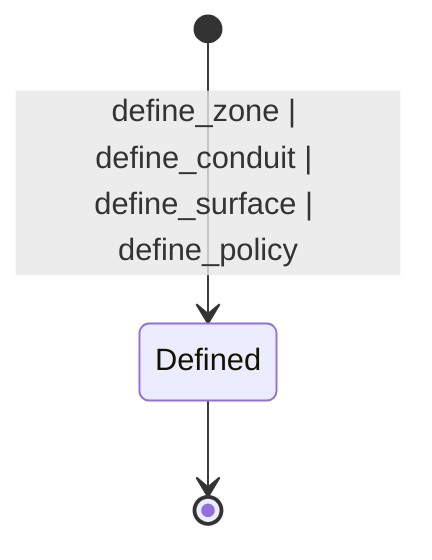
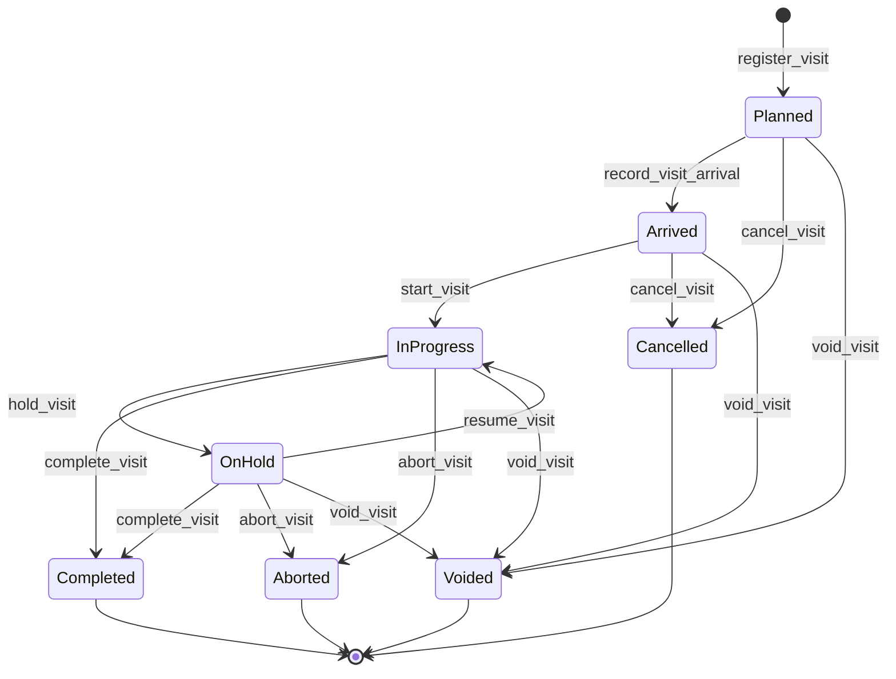

# Trust module <span class="md-maturity md-maturity--stable" title="ISA-99/IEC-62443 topology: Zone, Conduit, Surface, Policy, plus session-scoped Visit presence. Pure Policy Decision Point + first concrete entries-table observation logbook.">stable</span>

## Purpose & Scope

The Trust module owns CORA's authorization topology. Every command that crosses the system is evaluated against this topology before it reaches a decider, and the evaluator that performs that check is a pure function on Policy state. <!-- arch:count kind=aggregate bc=trust spell=true cap=true -->Five<!-- /arch:count --> aggregates carry the responsibility: `Zone` groups principals and assets that share a trust posture, `Conduit` is a governed communications path between two Zones, `Surface` is the process-level arrival point through which a request entered CORA, `Policy` is an authorization rule attached to a specific Conduit and Surface, and `Visit` tracks a principal's session-scoped presence on a Surface: the beamtime session with its planned period, arrival, presence check-in and check-out, and surface-control handover.

Trust is the **what you may do** layer. Identity (who you are) lives in [Access](../access/index.md); agent-specific configuration (tool allowlists, budgets, suspended state) lives in [Agent](../agent/index.md). The cross-module Authorize port carries an Actor id resolved by Access, a Conduit id resolved by the entry adapter, and a Surface id resolved by the transport adapter, and answers Allow or Deny by consulting Policy state.

<div class="cora-aside cora-aside--deferred" markdown>

Out of scope

- **Lifecycle FSMs on Zone, Conduit, and Policy.** All three follow an additive-state pattern: today they are immutable-once-defined, and the future `Defined → Active → Modified → Archived` (Zone, Conduit) and `Drafted → Approved → Active → Superseded` (Policy) transitions land additively when commands that exercise them ship. Adding fields to a state record that gets defaulted in the evolver is the documented forward-compatible change shape.
- **Operator-defined Surfaces and a Surface list endpoint.** Today the three Surfaces (HTTP, MCP stdio, MCP streamable HTTP) are seeded at boot from constants. Operators cannot define new Surfaces and there is no `GET /surfaces` listing. Surface ships a status enum so the version and deprecate slices can land additively, but only `Defined` is emitted today.
- **Attribute-based and relationship-based widening.** The Policy decider is pure allow-list over `(principal, command, conduit, surface)`. The AuthZEN-shaped widening that adds subject attributes, resource attributes, and a context bag is captured as a target shape and is deferred until the trigger fires.
- **Cross-policy combining rules.** Today the Authorize port resolves one Policy per `(conduit, surface)` pair. Multi-policy union or intersection logic is deferred until a real combining rule arrives.
- **Per-principal permission cache.** `list_permissions` enumerates from Policy state on every call. A materialized "what can this principal do" projection is deferred until p95 read latency demands it.
- **Cross-facility federation.** Policy resolution across facilities is out of scope. Today each deployment owns its own Trust streams.

</div>

## Aggregates

| Name | Identity | State summary | FSM |
|---|---|---|---|
| `Zone` | `id: UUID` | `id`, `name: ZoneName` | additive, no transitions today |
| `Conduit` | `id: UUID` | `id`, `name: ConduitName`, `source_zone_id`, `target_zone_id`, `logbooks: dict[str, UUID]` | additive, no transitions today |
| `Surface` | `id: UUID` | `id`, `name: SurfaceName`, `kind: SurfaceKind`, `status: SurfaceStatus` | additive, only `Defined` emitted today |
| `Policy` | `id: UUID` | `id`, `name: PolicyName`, `conduit_id`, `permitted_principal_ids: frozenset[UUID]`, `permitted_commands: frozenset[str]`, `surface_id` | additive, no transitions today |
| `Visit` | `id: UUID` | `id`, `policy_id`, `surface_id`, `type: VisitType`, `planned_start_at`, `planned_end_at`, `parent_id?`, `external_refs: frozenset[Identifier]`, `presence_entries: frozenset[PresenceEntry]`, `status: VisitStatus`, `last_status_reason?` | yes (8-state session lifecycle) |

A `Zone` is a trust-requirement-homogeneous grouping of principals and assets, defined by trust posture rather than physical location. A `Conduit` is the governed comms path between two Zones; the source-target naming is for clarity at the API layer, since the conduit itself is undirected per the topology standard. A `Surface` is the process-level arrival socket the request crossed: the protocol-bound endpoint, not the inter-zone path. A `Policy` is the explicit allow-list that gates a `(principal, command)` pair on a specific Conduit and Surface.

`Conduit.logbooks` maps logbook kind to the currently-open logbook id. Today the only logbook kind is `verdict`, opened automatically at conduit-creation, and the state encodes the at-most-one-open-per-kind invariant directly: opening a second logbook of the same kind raises rather than orphaning the first. Logbook entries themselves live in a separate typed table (`entries_conduit_verdicts`) and do not fold into Conduit state.

`Policy.surface_id` defaults to a nil sentinel UUID. The sentinel is reserved exclusively for one legacy compatibility fold: pre-Surface PolicyDefined events on disk lack the surface_id field and fold to nil, and the evaluator treats nil-surface policies as matching any caller's surface_id. Once those legacy streams are drained the wildcard branch and the sentinel default will be removed in the same change.

A `Visit` is one principal's session-scoped presence bound to exactly one `Surface` under one `Policy`: the beamtime session that authorization runs inside. It carries a planned period (`planned_start_at`, `planned_end_at`), a set of `external_refs` that anchor it to upstream beamtime-scheduling concepts (proposal, BTR, cycle), and a `presence_entries` set recording who physically or remotely checked in and out. A child Visit nests under a parent on the same Surface via `parent_id` (a commissioning Visit during a user Visit). Surface-control handover (which Visit currently drives a Surface) is tracked in a projection, not on Surface state, so the Surface aggregate stays infrastructure-stable. The actual session period (`arrived_at`, `started_at`, `completed_at`) lives on the projection alongside the planned period.

## Value Objects

| Name | Shape | Where used |
|---|---|---|
| `ZoneName` | trimmed string, 1-200 chars | `Zone.name` |
| `ConduitName` | trimmed string, 1-200 chars | `Conduit.name` |
| `SurfaceName` | trimmed string, 1-200 chars | `Surface.name` |
| `SurfaceKind` | closed StrEnum: `http` \| `mcp_stdio` \| `mcp_streamable_http` | `Surface.kind` |
| `SurfaceStatus` | closed StrEnum: `Defined` \| `Versioned` \| `Deprecated` | `Surface.status` |
| `PolicyName` | trimmed string, 1-200 chars | `Policy.name` |
| `LogbookKind` | snake_case string discriminator; today only `"verdict"` | keys of `Conduit.logbooks` |
| `AuthzResult` | tagged union `Allow()` \| `Deny(reason: str)` | return shape of `evaluate(policy, ...)` |
| `VisitStatus` | closed StrEnum: `Planned` \| `Arrived` \| `InProgress` \| `OnHold` \| `Completed` \| `Cancelled` \| `Aborted` \| `Voided` | `Visit.status` |
| `VisitType` | closed StrEnum: `user` \| `commissioning` \| `maintenance` \| `calibration` \| `staff` | `Visit.type` |
| `PresenceMode` | closed StrEnum: `physical` \| `remote` | `PresenceEntry.mode` |
| `PresenceEntry` | `(actor_id, mode, check_in_at, check_out_at?)`; an open entry has a null `check_out_at` | members of `Visit.presence_entries` |
| `Identifier` | `(scheme, value)` open-scheme anti-corruption ref from `cora.shared.identifier` | members of `Visit.external_refs` |

`SurfaceKind` is a closed enum on purpose: adding a new arrival kind (gRPC, websocket, agent-to-agent, batch) requires a code release. The kept-narrow operational vocabulary is the same discipline applied to executor shapes in Recipe and affordances in Equipment.

`AuthzResult.Deny.reason` is a diagnostic string meant to flow into logs and API responses for debugging. It is not intended for end-user display and not part of the authorization contract that callers depend on.

## FSM

Of the four topology aggregates, `Zone`, `Conduit`, and `Policy` are immutable-once-defined: the genesis event is the only event, and the additive-state pattern keeps the door open for the lifecycle transitions captured in the out-of-scope aside. `Surface` ships a status enum but only the genesis transition into `Defined` is exposed. None of the four topology aggregates ships a `version_*` or `deprecate_*` slice today. `Visit`, the fifth aggregate, runs a full eight-state session lifecycle; see its subsection below.



| From | To | Command | Event |
|---|---|---|---|
| `[*]` | `Defined` | `define_zone` | `ZoneDefined` |
| `[*]` | `Defined` | `define_conduit` | `ConduitDefined` (auto-opens the `verdict` logbook via `ConduitLogbookOpened` in the same transaction) |
| `[*]` | `Defined` | `define_surface` | `SurfaceDefined` |
| `[*]` | `Defined` | `define_policy` | `PolicyDefined` |

The logbook sub-lifecycle on `Conduit` is captured in the events table below; today the open transition fires at conduit-creation and the close transition has no command path (it lands additively when conduit-archive ships).

### Visit

`Visit` runs the one real lifecycle in the module: an eight-state session FSM.



| From | To | Command | Event |
|---|---|---|---|
| `[*]` | `Planned` | `register_visit` | `VisitRegistered` |
| `Planned` | `Arrived` | `record_visit_arrival` | `VisitArrived` |
| `Arrived` | `InProgress` | `start_visit` | `VisitStarted` |
| `InProgress` | `OnHold` | `hold_visit` | `VisitHeld` |
| `OnHold` | `InProgress` | `resume_visit` | `VisitResumed` |
| `InProgress` \| `OnHold` | `Completed` | `complete_visit` | `VisitCompleted` |
| `Planned` \| `Arrived` | `Cancelled` | `cancel_visit` | `VisitCancelled` |
| `InProgress` \| `OnHold` | `Aborted` | `abort_visit` | `VisitAborted` |
| `Planned` \| `Arrived` \| `InProgress` \| `OnHold` | `Voided` | `void_visit` | `VisitVoided` |

`Completed`, `Cancelled`, `Aborted`, and `Voided` are terminal. Every lifecycle transition is strict-not-idempotent (re-issuing from the wrong state raises a `VisitCannot<Verb>Error`); `register_visit` is the only idempotent slice. `hold`, `cancel`, `abort`, and `void` carry a reason that lands on `last_status_reason`.

Two pairs of commands are orthogonal to the lifecycle (they do not change `status`): `check_in_visit` / `check_out_visit` open and close a `PresenceEntry` for an actor (allowed while `Arrived`, `InProgress`, or `OnHold`), and `take_control_of_surface` / `release_control_of_surface` move surface-control between Visits on the same Surface (tracked in the `proj_trust_surface_active_visit` projection, not on aggregate state).

## Events

`Zone` emits <!-- arch:count kind=event bc=trust agg=zone spell=true -->one<!-- /arch:count --> event type. `Conduit` emits <!-- arch:count kind=event bc=trust agg=conduit spell=true -->three<!-- /arch:count -->. `Surface` emits <!-- arch:count kind=event bc=trust agg=surface spell=true -->one<!-- /arch:count -->. `Policy` emits <!-- arch:count kind=event bc=trust agg=policy spell=true -->one<!-- /arch:count -->. `Visit` emits <!-- arch:count kind=event bc=trust agg=visit spell=true -->thirteen<!-- /arch:count -->.

| Event | Payload sketch | When emitted |
|---|---|---|
| `ZoneDefined` | `zone_id`, `name`, `occurred_at` | `define_zone` succeeds (genesis) |
| `ConduitDefined` | `conduit_id`, `name`, `source_zone_id`, `target_zone_id`, `occurred_at` | `define_conduit` succeeds (genesis) |
| `ConduitLogbookOpened` | `conduit_id`, `logbook_id`, `kind`, `schema`, `occurred_at` | a logbook of `kind` is attached to the Conduit; carries the per-entry schema for audit |
| `ConduitLogbookClosed` | `conduit_id`, `logbook_id`, `occurred_at` | a previously-opened logbook is terminated (additive; no current command path emits it) |
| `SurfaceDefined` | `surface_id`, `name`, `kind`, `occurred_at` | `define_surface` succeeds (genesis); today only the three seeded Surfaces ever emit this |
| `PolicyDefined` | `policy_id`, `name`, `conduit_id`, `surface_id`, `permitted_principal_ids`, `permitted_commands`, `occurred_at` | `define_policy` succeeds (genesis); permitted sets serialize as sorted lists for deterministic payloads |

`ConduitLogbookOpened.schema` declares the per-row column shape of the entries that will land in the typed entries table for this logbook kind. Carrying the schema on the open event means the Conduit lifecycle audit captures the schema as of the moment the logbook was opened, which supports per-logbook schema evolution by opening a new logbook with an updated schema.

`PolicyDefined` payloads carry the permission lists sorted by string form. Same logical permission set, same payload bytes, same idempotency hash.

The <!-- arch:count kind=event bc=trust agg=visit spell=true -->thirteen<!-- /arch:count --> `Visit` events (lifecycle plus the two orthogonal command pairs):

| Event | Payload sketch | When emitted |
|---|---|---|
| `VisitRegistered` | `visit_id`, `policy_id`, `surface_id`, `type`, `planned_start_at`, `planned_end_at`, `parent_id?`, `external_refs`, `occurred_at` | `register_visit` succeeds (genesis) |
| `VisitArrived` | `visit_id`, `occurred_at` | `record_visit_arrival` succeeds |
| `VisitStarted` | `visit_id`, `occurred_at` | `start_visit` succeeds |
| `VisitHeld` | `visit_id`, `reason`, `occurred_at` | `hold_visit` succeeds |
| `VisitResumed` | `visit_id`, `occurred_at` | `resume_visit` succeeds |
| `VisitCompleted` | `visit_id`, `occurred_at` | `complete_visit` succeeds |
| `VisitCancelled` | `visit_id`, `reason`, `occurred_at` | `cancel_visit` succeeds |
| `VisitAborted` | `visit_id`, `reason`, `occurred_at` | `abort_visit` succeeds |
| `VisitVoided` | `visit_id`, `reason`, `occurred_at` | `void_visit` succeeds |
| `VisitCheckedIn` | `visit_id`, `actor_id`, `mode`, `occurred_at` | `check_in_visit` opens a `PresenceEntry` |
| `VisitCheckedOut` | `visit_id`, `actor_id`, `occurred_at` | `check_out_visit` closes the actor's open entry |
| `VisitSurfaceControlTaken` | `visit_id`, `surface_id`, `occurred_at` | `take_control_of_surface` succeeds (projection-only) |
| `VisitSurfaceControlReleased` | `visit_id`, `surface_id`, `occurred_at` | `release_control_of_surface` succeeds (projection-only) |

## Slices

<!-- arch:slices-table bc=trust -->
_Generated from the code at build time._
<!-- /arch:slices-table -->

`define_surface` is reachable today only for the bootstrap path that seeds the three system Surfaces. The route exists for operational symmetry and is exercised by the bootstrap routine; there is no operator-facing path for minting a fourth Surface.

`EvaluatePolicy` and `ListPermissions` are the two query slices that expose the Policy decider. `EvaluatePolicy` answers the yes-no question for a single `(principal, command, conduit)` tuple. `ListPermissions` enumerates the commands a principal may execute against a Policy via a Conduit and returns an `incomplete: bool` flag (always False today; reserved for the attribute-widened future where enumeration may be lossy). Both endpoints exist for UX and debugging; only the Authorize port wired by the kernel authorizes actual commands.

**Errors per slice.** Beyond Pydantic boundary 422s, each slice raises:

`DefineZone`
: `InvalidZoneName`, `ZoneAlreadyExists`, `Unauthorized`

`ListZones`
: (boundary 422 only)

`DefineConduit`
: `InvalidConduitName`, `ConduitAlreadyExists`, `ConduitLogbookAlreadyOpen` (defensive; the genesis-time auto-open cannot collide on a fresh stream), `Unauthorized`

`ListConduits`
: (boundary 422 only)

`DefineSurface`
: `InvalidSurfaceName`, `SurfaceAlreadyExists`, `Unauthorized`

`GetSurface`
: `SurfaceNotFound`

`DefinePolicy`
: `InvalidPolicyName`, `PolicyAlreadyExists`, `Unauthorized`

`ListPolicies`
: (boundary 422 only)

`EvaluatePolicy`
: `PolicyNotFound` (the Deny and Allow outcomes are normal 200 responses, not errors)

`ListPermissions`
: `PolicyNotFound`, `Unauthorized` (on-behalf queries where `evaluated_principal_id` differs from the caller require a separate permission and are denied by default)

`RegisterVisit`
: `InvalidVisitPlannedPeriod`, `InvalidVisitReason`, `VisitAlreadyExists`, `VisitParentNotFound`, `VisitParentMismatchedSurface`, `Unauthorized`

`RecordVisitArrival` / `StartVisit` / `HoldVisit` / `ResumeVisit` / `CompleteVisit` / `CancelVisit` / `AbortVisit` / `VoidVisit`
: `VisitNotFound`, `VisitCannot<Arrive|Start|Hold|Resume|Complete|Cancel|Abort|Void>`, `InvalidVisitReason` (the reason-bearing transitions: hold, cancel, abort, void), `Unauthorized`

`CheckInVisit` / `CheckOutVisit`
: `VisitNotFound`, `VisitCannotCheckIn` / `VisitAlreadyCheckedIn` (check-in), `VisitActorNotCheckedIn` (check-out), `Unauthorized`

`TakeControlOfSurface` / `ReleaseControlOfSurface`
: `VisitNotFound`, `VisitCannotTakeControl` (surface mismatch, status not eligible, or not a descendant) / `VisitCannotReleaseControl` (surface mismatch or not the current holder), `Unauthorized`

## Storage & Projections

Seven read-side artefacts back the Trust module: three topology summary projections (one per identity-bearing topology aggregate that supports list queries), one typed entries table for the per-decision authorization audit log, and three Visit tables (summary, presence, and surface-control).

```sql title="proj_trust_zone_summary"
CREATE TABLE proj_trust_zone_summary (
    zone_id     UUID        PRIMARY KEY,
    name        TEXT        NOT NULL,
    created_at  TIMESTAMPTZ NOT NULL,
    updated_at  TIMESTAMPTZ NOT NULL DEFAULT now()
);

CREATE INDEX proj_trust_zone_summary_keyset_idx
    ON proj_trust_zone_summary (created_at, zone_id);
```

```sql title="proj_trust_conduit_summary"
CREATE TABLE proj_trust_conduit_summary (
    conduit_id      UUID        PRIMARY KEY,
    name            TEXT        NOT NULL,
    source_zone_id  UUID        NOT NULL,
    target_zone_id  UUID        NOT NULL,
    created_at      TIMESTAMPTZ NOT NULL,
    updated_at      TIMESTAMPTZ NOT NULL DEFAULT now()
);

CREATE INDEX proj_trust_conduit_summary_keyset_idx
    ON proj_trust_conduit_summary (created_at, conduit_id);

CREATE INDEX proj_trust_conduit_summary_source_zone_idx
    ON proj_trust_conduit_summary (source_zone_id);

CREATE INDEX proj_trust_conduit_summary_target_zone_idx
    ON proj_trust_conduit_summary (target_zone_id);
```

```sql title="proj_trust_policy_summary"
CREATE TABLE proj_trust_policy_summary (
    policy_id   UUID        PRIMARY KEY,
    name        TEXT        NOT NULL,
    conduit_id  UUID        NOT NULL,
    created_at  TIMESTAMPTZ NOT NULL,
    updated_at  TIMESTAMPTZ NOT NULL DEFAULT now()
);

CREATE INDEX proj_trust_policy_summary_keyset_idx
    ON proj_trust_policy_summary (created_at, policy_id);

CREATE INDEX proj_trust_policy_summary_conduit_idx
    ON proj_trust_policy_summary (conduit_id);
```

```sql title="entries_conduit_verdicts"
CREATE TABLE entries_conduit_verdicts (
    event_id        UUID         PRIMARY KEY,
    conduit_id      UUID         NOT NULL,
    logbook_id      UUID         NOT NULL,
    actor_id        UUID         NOT NULL,
    command_name    TEXT         NOT NULL,
    decision        TEXT         NOT NULL CHECK (decision IN ('Allow', 'Deny')),
    reason          TEXT,
    correlation_id  UUID         NOT NULL,
    causation_id    UUID,
    occurred_at     TIMESTAMPTZ  NOT NULL,
    recorded_at     TIMESTAMPTZ  NOT NULL DEFAULT now()
);

CREATE INDEX entries_conduit_verdicts_conduit_time_idx
    ON entries_conduit_verdicts (conduit_id, occurred_at DESC);

CREATE INDEX entries_conduit_verdicts_logbook_idx
    ON entries_conduit_verdicts (logbook_id);

CREATE INDEX entries_conduit_verdicts_recorded_at_brin_idx
    ON entries_conduit_verdicts USING BRIN (recorded_at);
```

`entries_conduit_verdicts` is the first concrete entries-table observation logbook in CORA. Per-decision authorization records are high-cardinality (one row per Authorize port call across every command in production) and must not fold into Conduit state or bloat the main events table. The `event_id` primary key doubles as the idempotency and dedup key. The `(conduit_id, occurred_at DESC)` btree supports the primary read pattern of paging the latest decisions for a Conduit. The `logbook_id` btree supports per-logbook session reads. The `recorded_at` BRIN index supports retention sweeps and time-range analytics at a fraction of a btree's storage cost.

`ConduitLogbookOpened` and `ConduitLogbookClosed` events are intentionally not subscribed by `proj_trust_conduit_summary`: they are internal logbook bookkeeping that does not mutate the summary's columns. The same precedent holds in Decision's summary projection.

`Policy.permitted_principal_ids` and `Policy.permitted_commands` are intentionally not projected as filter columns on `proj_trust_policy_summary`: they are list-shaped, and a future join projection covers "all policies allowing principal X" if that read pattern crystallizes.

```sql title="proj_trust_visit_summary"
CREATE TABLE proj_trust_visit_summary (
    visit_id           UUID        PRIMARY KEY,
    policy_id          UUID        NOT NULL,
    surface_id         UUID        NOT NULL,
    type               TEXT        NOT NULL CHECK (
        type IN ('user', 'commissioning', 'maintenance', 'calibration', 'staff')
    ),
    status             TEXT        NOT NULL CHECK (
        status IN ('Planned', 'Arrived', 'InProgress', 'OnHold',
                   'Completed', 'Cancelled', 'Aborted', 'Voided')
    ),
    planned_start_at   TIMESTAMPTZ NOT NULL,
    planned_end_at     TIMESTAMPTZ NOT NULL,
    parent_id          UUID,
    external_refs      JSONB       NOT NULL DEFAULT '[]',
    created_at         TIMESTAMPTZ NOT NULL,
    arrived_at         TIMESTAMPTZ,
    started_at         TIMESTAMPTZ,
    completed_at       TIMESTAMPTZ,
    last_status_reason TEXT,
    updated_at         TIMESTAMPTZ NOT NULL DEFAULT now()
);

CREATE INDEX proj_trust_visit_summary_surface_status_idx
    ON proj_trust_visit_summary (surface_id, status);
CREATE INDEX proj_trust_visit_summary_status_planned_idx
    ON proj_trust_visit_summary (status, planned_start_at);
CREATE INDEX proj_trust_visit_summary_keyset_idx
    ON proj_trust_visit_summary (created_at, visit_id);
```

```sql title="proj_trust_visit_presence"
CREATE TABLE proj_trust_visit_presence (
    visit_id      UUID        NOT NULL REFERENCES proj_trust_visit_summary (visit_id) ON DELETE CASCADE,
    actor_id      UUID        NOT NULL,
    mode          TEXT        NOT NULL CHECK (mode IN ('physical', 'remote')),
    check_in_at   TIMESTAMPTZ NOT NULL,
    check_out_at  TIMESTAMPTZ,
    updated_at    TIMESTAMPTZ NOT NULL DEFAULT now(),
    PRIMARY KEY (visit_id, actor_id, check_in_at)
);

CREATE INDEX proj_trust_visit_presence_open_idx
    ON proj_trust_visit_presence (visit_id)
    WHERE check_out_at IS NULL;
CREATE INDEX proj_trust_visit_presence_actor_idx
    ON proj_trust_visit_presence (actor_id, check_in_at);
```

```sql title="proj_trust_surface_active_visit"
CREATE TABLE proj_trust_surface_active_visit (
    surface_id   UUID        NOT NULL,
    visit_id     UUID        NOT NULL REFERENCES proj_trust_visit_summary (visit_id) ON DELETE CASCADE,
    since_at     TIMESTAMPTZ NOT NULL,
    released_at  TIMESTAMPTZ,
    updated_at   TIMESTAMPTZ NOT NULL DEFAULT now(),
    PRIMARY KEY (surface_id, visit_id, since_at)
);

CREATE UNIQUE INDEX proj_trust_surface_active_visit_open_uq
    ON proj_trust_surface_active_visit (surface_id)
    WHERE released_at IS NULL;
CREATE INDEX proj_trust_surface_active_visit_visit_idx
    ON proj_trust_surface_active_visit (visit_id, since_at);
```

The Visit summary carries both the planned period (from genesis) and the actual period (`arrived_at`, `started_at`, `completed_at`, mirrored from the lifecycle events) so a reader sees plan-versus-actual without folding the stream. The presence table is one row per `(visit_id, actor_id, check_in_at)`; the partial index on open entries (null `check_out_at`) backs the "who is in the hutch right now" read. The surface-control table enforces at-most-one-open-row-per-surface through the partial UNIQUE index on `(surface_id) WHERE released_at IS NULL`, which is how the current controller of a Surface is resolved.

## Cross-Module boundaries

| Module | Relationship | What's exchanged |
|---|---|---|
| Access | reads-from | `Policy.permitted_principal_ids` contains `Actor.id` values; the Authorize port carries `actor_id` resolved by the Access layer; `Visit` records presence against `Actor.id` via `check_in_visit` / `check_out_visit` |
| All BCs | provides-port | every write-side decider behind the kernel's PEP is gated by the Authorize port, which resolves a `Policy` and calls the pure `evaluate(policy, ...)` |
| Conduit / Surface ids on inbound calls | reads-from | the HTTP and MCP entry adapters set `conduit_id` from the entry topology and `surface_id` from the transport, then pass both on the Authorize call |
| Equipment | aligns-with | every `Asset` is conventionally a member of exactly one Trust Zone for security policy; the link is read-time, not stored on either aggregate |
| Decision | shared-id-with | `Decision.actor_id` is an Actor id that may appear in `Policy.permitted_principal_ids`; the link is read-time |

The Authorize port is the only path through which Trust state influences command execution. Deciders never read Policy state directly; the kernel's PEP holds the only reference and answers a single `Allow` or `Deny`. This keeps every BC's write path pure and makes the Policy decider trivially testable as a function from `(policy, principal, command, conduit, surface)` to `AuthzResult`.

Cross-aggregate references inside Trust are bare UUIDs and are not verified at write time. A Conduit can be defined with a `source_zone_id` that does not resolve, a Policy can be defined against a Conduit id that does not exist; the mismatch surfaces at evaluate time, which is the natural enforcement point. This is the same eventual-consistency posture used everywhere else.

## Examples

The five examples below cover the canonical Trust authoring and evaluation flow: define a Zone, define a Conduit between two Zones, define a Policy that gates one command on that Conduit, evaluate that Policy for a `(principal, command)` pair, and enumerate the commands a principal may execute. The caller's principal goes on the `X-Principal-Id` header. For the REST and MCP equivalence, auth, and idempotency conventions these examples share, see [Reading the examples](../index.md) on the Modules landing page.

### Define a Zone

=== "REST"

    ```http
    POST /zones
    Content-Type: application/json
    Idempotency-Key: 2a7d5f0c-1b2e-3c4d-5e6f-7a8b9c0d1e2f
    X-Principal-Id: 11111111-2222-3333-4444-555555555555

    {
      "name": "Beamline 2-BM Operators"
    }
    ```

    Returns `201 Created` with the newly-assigned `zone_id`. A second call with the same idempotency key returns the same id.

=== "MCP"

    ```python
    mcp.call_tool(
        "define_zone",
        {"name": "Beamline 2-BM Operators"},
    )
    ```

### Define a Conduit between two Zones

=== "REST"

    ```http
    POST /conduits
    Content-Type: application/json
    Idempotency-Key: 7b3e9a1c-2d4f-5e6a-7b8c-9d0e1f2a3b4c
    X-Principal-Id: 11111111-2222-3333-4444-555555555555

    {
      "name": "Operator → Detector Control",
      "source_zone_id": "<operator-zone-id>",
      "target_zone_id": "<detector-zone-id>"
    }
    ```

    Returns `201 Created` with `conduit_id`. The `verdict` logbook opens automatically in the same transaction, so the very first authorization decision routed through this Conduit lands a row in `entries_conduit_verdicts` without a separate setup step.

=== "MCP"

    ```python
    mcp.call_tool(
        "define_conduit",
        {
            "name": "Operator → Detector Control",
            "source_zone_id": "<operator-zone-id>",
            "target_zone_id": "<detector-zone-id>",
        },
    )
    ```

### Define a Policy gating one command on a Conduit and Surface

=== "REST"

    ```http
    POST /policies
    Content-Type: application/json
    Idempotency-Key: 9c2a8e4f-3b5d-6c7e-8f9a-0b1c2d3e4f5a
    X-Principal-Id: 11111111-2222-3333-4444-555555555555

    {
      "name": "Operators may start runs over the operator → detector conduit",
      "conduit_id": "<conduit-id>",
      "surface_id": "<seeded-http-surface-id>",
      "permitted_principal_ids": ["<operator-actor-id>"],
      "permitted_commands": ["StartRun"]
    }
    ```

    Returns `201 Created` with `policy_id`. The permitted sets are stored as `frozenset` on the aggregate and serialized as sorted lists in the payload for deterministic bytes. An empty `permitted_principal_ids` or `permitted_commands` is allowed and yields a deny-all policy by construction.

=== "MCP"

    ```python
    mcp.call_tool(
        "define_policy",
        {
            "name": "Operators may start runs over the operator → detector conduit",
            "conduit_id": "<conduit-id>",
            "surface_id": "<seeded-http-surface-id>",
            "permitted_principal_ids": ["<operator-actor-id>"],
            "permitted_commands": ["StartRun"],
        },
    )
    ```

### Evaluate a Policy

=== "REST"

    ```http
    GET /policies/<policy-id>/evaluate?evaluated_principal_id=<operator-actor-id>&evaluated_command_name=StartRun&evaluated_conduit_id=<conduit-id>
    X-Principal-Id: 11111111-2222-3333-4444-555555555555
    ```

    Returns `200 OK` with `{"decision": "Allow", "reason": null}` for the matching tuple, or `{"decision": "Deny", "reason": "<diagnostic>"}` if any of the four checks (conduit, surface, principal, command) fails. `404 Not Found` if no Policy exists at the given id. The `evaluated_` prefix on the query params disambiguates them from the caller's own `principal_id` header.

=== "MCP"

    ```python
    mcp.call_tool(
        "evaluate_policy",
        {
            "policy_id": "<policy-id>",
            "evaluated_principal_id": "<operator-actor-id>",
            "evaluated_command_name": "StartRun",
            "evaluated_conduit_id": "<conduit-id>",
        },
    )
    ```

### Enumerate a principal's permitted commands for a Conduit

=== "REST"

    ```http
    GET /policies/<policy-id>/permissions?evaluated_principal_id=<operator-actor-id>&evaluated_conduit_id=<conduit-id>
    X-Principal-Id: 11111111-2222-3333-4444-555555555555
    ```

    Returns `200 OK` with `{"policy_id", "evaluated_principal_id", "evaluated_conduit_id", "permitted_commands": [...], "incomplete": false}`. The command list is the sorted intersection of `Policy.permitted_commands` and what the policy actually grants for the supplied principal. The `incomplete` flag is always `false` today; it is reserved for the attribute-widened future where enumeration may not be lossless. The returned set is intended for UX and debugging only; it must not drive authorization decisions, since only the kernel's Authorize port authorizes commands.

=== "MCP"

    ```python
    mcp.call_tool(
        "list_permissions",
        {
            "policy_id": "<policy-id>",
            "evaluated_principal_id": "<operator-actor-id>",
            "evaluated_conduit_id": "<conduit-id>",
        },
    )
    ```
