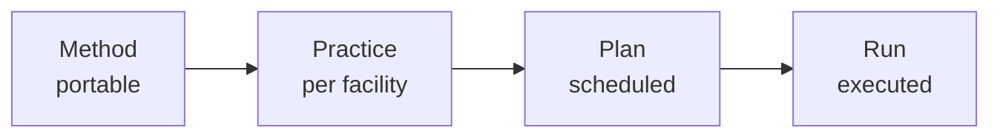

# CORA

*A unified operations platform for large-scale research facilities.*

**Continuously Overpromised, Rarely Automated.** Most facility software lives forever as a slide-deck capability. CORA is the version that ships.

## Shape

- **Solo project.** A research bet, not a startup, not a product.
- **Code is agent-written; design is human.**
- **Pre-1.0.** Foundation in place; bounded contexts grow from real APS use cases.

## Problem

Facilities run on stitched-together scripts, spreadsheets, tribal knowledge. Each instrument duplicates the same primitives in different shapes. Vendor platforms promise unification, deliver another silo. Five years in, no one trusts what the system says about its own state.

## Approach

Three commitments shape every choice.

- **Vertical before horizontal.** Build deeply for one deployment. Generalize only when a real second use case forces it.
- **Agents are principals, not features.** Same identity, authz, audit as humans. The authz model grows once, not per-surface.
- **Everything is replayable.** Postgres event sourcing. Any decision, human or agent, reconstructable from events alone.

## Recipe ladder

The mechanism that keeps the same engine portable across facilities:

A *method* names how a class of measurement works. A *practice* binds it to one facility's instruments. A *plan* schedules it. A *run* executes it, captured as events.

## Where next

-   **[Architecture →](architecture/index.md)**

    Patterns and roles.

-   **[Stack →](stack/index.md)**

    Picks and swap triggers.

-   **[Projects →](projects/index.md)**

    Pilots, starting with 35-BM.

-   **[Source →](https://github.com/xmap/cora)**

    Code, issues, history.

