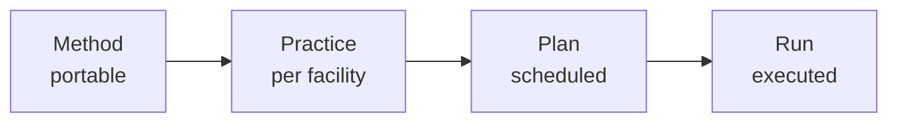

# CORA

Why did this run use that center of rotation, who or what approved it, under which recipe, and can you replay it six months from now? Today that answer is smeared across HDF5 process groups, PV snapshots, the e-logbook, and someone's memory, while TomoScan, TomoPy, EPICS, and Globus each do their part and remember none of it.

CORA is where that answer lives. It owns no servo loop, runs no reconstruction, and stores no dataset bytes. It records the work, end to end, in one append-only event log that survives every change of staff, vendor, and tool below it.

## What CORA records

Two intertwined streams, one event log
{: .cora-kicker }

- **The recipe chain.** How a class of measurement works, how this facility does it, what was scheduled, what actually happened.
- **The decisions around it.** Every choice that shaped a recipe, plan, or run, by a human or an agent, with the reason and the evidence captured at the moment of choice.

The recipe chain is the mechanism that keeps the same model portable across facilities:

A *method* names how a class of measurement works. A *practice* binds it to one facility's instruments. A *plan* schedules it. A *run* executes it, captured as events. For 2-BM micro-CT this reads: **Method** tomography, **Practice** 2-BM tomography, **Plan** scan #2351, **Run** today's measurement events.

A decision can attach at any stage: to propose a method, choose a practice, schedule a plan, or steer a run mid-flight. Each one carries who decided, what they chose, why, and the evidence they saw. Humans and agents register decisions the same way.

## Three commitments

How CORA earns the claim
{: .cora-kicker }

- **No silent decisions.** Every choice, human or agent, carries its reason and evidence at the moment it is made.
- **Agents are principals, not features.** Same identity, authorization, and operations as humans, exposed through REST and MCP alike.
- **Everything is replayable.** Any decision, human or agent, reconstructable from a Postgres event log alone.

## Where CORA sits

The spine, the edge, and the floor
{: .cora-kicker }

- **The spine, always CORA.** The event log, decisions, the recipe ladder, trust, and audit. Decision-grade latency; it never sits inside a deterministic real-time loop.
- **The execution edge, optional.** Driving operations step by step, and in time the scan loop, over a substrate-neutral ControlPort and Conductor with EPICS adapters. A facility may adopt it or keep its own execution and scan tools. At 2-BM, driving the scan loop this way is exploratory.
- **The floor, never CORA.** Servo control, position-synchronised output, FPGA trigger fan-out, sub-millisecond timing. These stay in the IOCs and motion controllers, wherever the line above is drawn.

Only the spine and the floor are fixed. How far the edge reaches between them is the facility's choice.
[Read the full model](architecture/standards.md#the-recording-spine-and-the-optional-execution-edge).

## What CORA governs

The recipe chain is the spine. Around it, CORA models the rest of what a single facility decision actually depends on: the instruments, the resources they draw on, the people and agents who act, the rules that gate them, and what gets produced. Seventeen bounded contexts, one event log.

-   :material-clipboard-flow-outline:{ .lg .middle } __Plan and run the work__

    ---

    Define a measurement once, bind it to a facility, schedule it, and execute it as events; group runs into studies and bracket them with operational procedures.

    [Recipe](architecture/modules/recipe/index.md) ·
    [Run](architecture/modules/run/index.md) ·
    [Campaign](architecture/modules/campaign/index.md) ·
    [Operation](architecture/modules/operation/index.md)

-   :material-wrench-outline:{ .lg .middle } __Equipment and resources__

    ---

    The instruments themselves, the continuously-available resources they draw on, the permit-gated spaces that contain them, and the empirical values that keep them honest.

    [Equipment](architecture/modules/equipment/index.md) ·
    [Supply](architecture/modules/supply/index.md) ·
    [Enclosure](architecture/modules/enclosure/index.md) ·
    [Calibration](architecture/modules/calibration/index.md)

-   :material-account-group-outline:{ .lg .middle } __People and agents__

    ---

    One identity model for human operators and AI agents alike, with authorization that gates every write in the system.

    [Access](architecture/modules/access/index.md) ·
    [Agent](architecture/modules/agent/index.md) ·
    [Trust](architecture/modules/trust/index.md)

-   :material-shield-check-outline:{ .lg .middle } __Safety and cautions__

    ---

    Formal regulatory clearances that gate work, and lightweight operator tribal-knowledge that warns without blocking.

    [Safety](architecture/modules/safety/index.md) ·
    [Caution](architecture/modules/caution/index.md)

-   :material-database-outline:{ .lg .middle } __Subjects, data, and decisions__

    ---

    What gets measured, the datasets it produces and the distributions, attestations, and citable editions built on them, and every reasoned choice recorded with its evidence.

    [Subject](architecture/modules/subject/index.md) ·
    [Data](architecture/modules/data/index.md) ·
    [Decision](architecture/modules/decision/index.md)

-   :material-transit-connection-variant:{ .lg .middle } __Across facilities__

    ---

    Cross-facility identity and the authorized seams that let data and trust flow between deployments.

    [Federation](architecture/modules/federation/index.md)

## Pilot

Built for micro-CT at **APS beamline 2-BM** (Argonne). CORA schedules, governs, and records 2-BM operations; the facility's own acquisition and reconstruction tools stay where they are. CORA also offers an optional execution edge (its Conductor and ControlPort layer) for driving operations directly over EPICS where a facility chooses to; at 2-BM that edge is exploratory. The scenario corpus that grounds CORA's domain model runs against real 2-BM operations.

[See the 2-BM pilot →](deployments/2-bm/index.md)

## Start here

-   __Beamline scientist__

    Could CORA run your experiments? Start with the 2-BM pilot.

    [See 2-BM →](deployments/2-bm/index.md)

-   __Software architect__

    Functional DDD, event sourcing, REST and MCP behind one model. Read how it's built.

    [Read the architecture →](architecture/index.md)

-   __Future pilot host__

    Your beamline could be the next deployment after 2-BM.

    [Read the contribution call →](reference/contributing.md)

-   __AI researcher__

    Agents as principals, ReBAC, decision strategies, append-only ledger. Got a pattern to try on a real facility? CORA can be a substrate.

    [Read the contribution call →](reference/contributing.md)

## About

- **Solo project.** A research bet, not a startup, not a product.
- **Code is agent-written; design is human.**
- **Pre-1.0.** Foundation in place; bounded contexts grow from real APS use cases.

