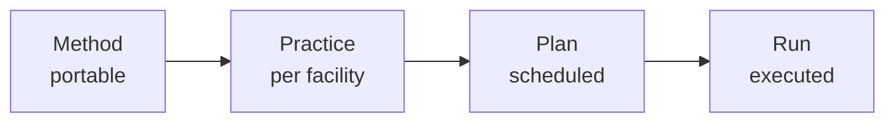

# CORA

Most facility software lives forever as a slide-deck capability. CORA is the version that ships.

## Problem

Facilities run on stitched-together scripts, spreadsheets, tribal knowledge. Each instrument duplicates the same primitives in different shapes. Vendor platforms promise unification, deliver another silo. Five years in, no one trusts what the system says about its own state.

## Approach

Three commitments shape every choice.

- **Vertical before horizontal.** Build deeply for one deployment. Generalize only when a real second use case forces it.
- **Agents are principals, not features.** Same identity, authz, audit as humans. The authz model grows once, not per-surface.
- **Everything is replayable.** Postgres event sourcing. Any decision, human or agent, reconstructable from events alone.

## Recipe ladder

The mechanism that keeps the same engine portable across facilities:

A *method* names how a class of measurement works. A *practice* binds it to one facility's instruments. A *plan* schedules it. A *run* executes it, captured as events.

For 35-BM micro-CT this reads: **Method** tomography, **Practice** 35-BM tomography, **Plan** scan #2351, **Run** today's measurement events.

## Pilot

Built first for white-beam micro-CT at **APS beamline 35-BM** (Argonne). Greenfield instrument, real operations. CORA schedules, audits, and governs the existing open-source stack (TomoScan, TomoPy, mctOptics, Noise2Inverse360) without reimplementing it.

[See the 35-BM pilot →](projects/35-bm/index.md)

## Start here

-   __Beamline scientist__

    Could CORA run your experiments? Start with the pilot.

    [See 35-BM →](projects/35-bm/index.md)

-   __Software architect__

    DDD, event sourcing, agents-as-principals. Read how it's built.

    [Read the architecture →](architecture/index.md)

-   __Future pilot host__

    Your beamline could be the next deployment after 35-BM.

    [Read the contribution call →](contributing.md)

-   __AI researcher__

    Agents-as-principals, ReBAC, decision strategies, DCB. Got a pattern to try on a real facility? CORA can be a substrate.

    [Read the contribution call →](contributing.md)

## About

- **Solo project.** A research bet, not a startup, not a product.
- **Code is agent-written; design is human.**
- **Pre-1.0.** Foundation in place; bounded contexts grow from real APS use cases.
