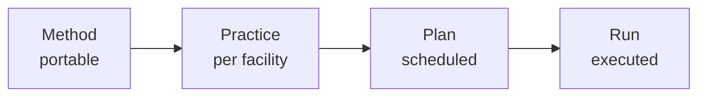

# CORA

Autonomous facilities make thousands of decisions a day. Some by humans, some by agents, most reasoned from prior runs. Without a place that records what was intended, what was decided, and what happened, the science cannot be trusted, reproduced, or handed off.

CORA is that place. It does not move motors, does not run scans, does not host datasets. It records the work, end to end, in one append-only event log that survives every change of staff, vendor, and tool below it.

## What CORA records

Two intertwined streams, one event log
{: .cora-kicker }

- **The recipe chain.** Method → Practice → Plan → Run. How a class of measurement works, how this facility does it, what was scheduled, what actually happened.
- **The decisions around it.** Every choice that shaped a recipe, plan, or run, by a human or an agent, with the reason and the evidence captured at the moment of choice.

## Three commitments

How CORA earns the claim
{: .cora-kicker }

- **No silent decisions.** Every choice, human or agent, carries its reason and evidence at the moment it is made.
- **Agents are principals, not features.** Same identity, authorization, and operations as humans, exposed through REST and MCP alike.
- **Everything is replayable.** Any decision, human or agent, reconstructable from a Postgres event log alone.

## Recipe chain and decisions

The mechanism that keeps the same model portable across facilities:

A *method* names how a class of measurement works. A *practice* binds it to one facility's instruments. A *plan* schedules it. A *run* executes it, captured as events.

For 2-BM micro-CT this reads: **Method** tomography, **Practice** 2-BM tomography, **Plan** scan #2351, **Run** today's measurement events.

A decision can attach at any stage: to propose a method, choose a practice, schedule a plan, or steer a run mid-flight. Each one carries who decided, what they chose, why, and the evidence they saw. Humans and agents register decisions the same way.

## Pilot

Built for micro-CT at **APS beamline 2-BM** (Argonne). CORA schedules, audits, and governs the existing open-source stack (TomoScan, TomoPy, mctOptics, Noise2Inverse360) without reimplementing it. The scenario corpus that grounds CORA's domain model runs against real 2-BM operations.

[See the 2-BM pilot →](deployments/2-bm/index.md)

## Start here

-   __Beamline scientist__

    Could CORA run your experiments? Start with the 2-BM pilot.

    [See 2-BM →](deployments/2-bm/index.md)

-   __Software architect__

    Functional DDD, event sourcing, REST and MCP behind one model. Read how it's built.

    [Read the architecture →](architecture/index.md)

-   __Future pilot host__

    Your beamline could be the next deployment after 2-BM.

    [Read the contribution call →](reference/contributing.md)

-   __AI researcher__

    Agents as principals, ReBAC, decision strategies, append-only ledger. Got a pattern to try on a real facility? CORA can be a substrate.

    [Read the contribution call →](reference/contributing.md)

## About

- **Solo project.** A research bet, not a startup, not a product.
- **Code is agent-written; design is human.**
- **Pre-1.0.** Foundation in place; bounded contexts grow from real APS use cases.

