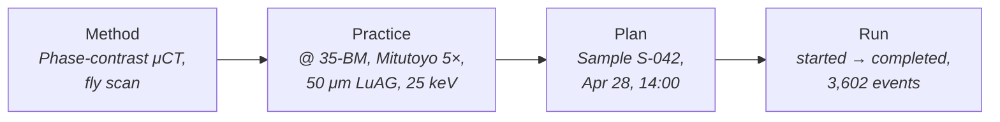

# Approach

*How CORA's primitives map to 35-BM imaging operations.*

[Substrate](substrate.md) is what already exists. This is what CORA brings on top.

## Domain map

BCs in imaging-pilot meaning:

| BC | Imaging meaning |
| --- | --- |
| `access` | Beamtime proposals, allocations, scheduling |
| `subject` | The sample (mail-in receipt, custody, link to runs, retention) |
| `equipment` | The tomo instrument and its devices: Aerotech stage, Optique Peter optics, FLIR/PCO detectors, softGlueZynq FPGA |
| `recipe` | Method/Practice catalog: phase-contrast micro-CT, nano-CT with FZP, MHz imaging |
| `run` | Scan Plans and Runs with full audit (encoder, FPGA pattern, lens changes, dropped frames) |
| `decision` | DecisionStrategy ports for COR, ROI, segmentation |
| `data` | Reconstructed volumes, segmentations, denoised outputs (dxfile/HDF5; events table is canonical) |
| `trust` | Zones (Z3/Z2/Z1/Z0) and Conduits (EPICS gateway, file transfer) |

For abstract patterns, see [Architecture](../../architecture/index.md).

## Recipe ladder

Method, Practice, Plan, Run. Methods stay portable to MAX IV; site-specific behaviour lives at Practice and Plan.

- **Method** (portable). Names physics, geometry, abstract steps. No brand. Examples: "Phase-contrast micro-CT, fly scan", "Multi-distance holotomography", "Nano-CT with FZP", "Laminography for flat samples".
- **Practice** (Method ↔ Site). Resolves a Method against one Site's Devices and calibrations. Examples: "Phase-contrast µCT @ 35-BM, Mitutoyo 5×, 50 µm LuAG, 25 keV, prop. 30 mm"; "Nano-CT @ 32-ID, FZP 16 nm, fast-scan".
- **Plan** (Practice ↔ window). Schedules a Practice against a sample, user, proposal, window. Deferrable, modifiable, cancellable.
- **Run** (executed). Captures everything: every projection, encoder reading, FPGA pattern, lens change, dropped frame, COR strategy, segmentation. FSM: started, held, resumed, completed, aborted, truncated.

## Decision strategies

Three steps interchangeable across human and agent strategies:

| Step | Strategies | Returned event shape |
| --- | --- | --- |
| COR finding | TomoPy `find_center`, `find_center_pc`, `find_center_vo`, AI probability, manual | `CORDetermined { cor_pixel, strategy_id, confidence?, decision_id }` |
| ROI selection | Locator-CT, manual bounding box | `ROISelected { bbox, strategy_id, decision_id }` |
| Segmentation | Trained model, interactive labeling, manual | `SegmentationCompleted { mask_uri, strategy_id, model_id?, decision_id }` |

The port shape ensures manual and AI COR picks produce structurally identical events. Strategy is auditable; result is a first-class entity.

## Conduits

EPICS PVs are the lingua franca. The Trust BC models the EPICS surface as a Conduit between Z1 (Control) and Z0 (Process). PV reads are observations; PV writes are actuations. Both are events.

The Conduit policy answers: which principal can issue which PV write, when, with which audit trail. IEC 62443 framing preserved; CORA does not invent a new authorization model for facility hardware.
