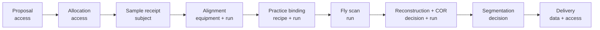

# 35-BM

*APS micro-CT. CORA's first pilot.*

A new dedicated micro-CT instrument at Argonne. White-beam micro-CT moves here from 7-BM as a clean greenfield: the right size to prove CORA's recipe ladder, the wrong size to hide weaknesses behind dataflow stitchware.

| Property | Value |
| --- | --- |
| Beamline | 35-BM |
| Modality | White-beam micro-CT |
| Site | APS, Argonne |
| Status | In design |
| Role for CORA | First pilot |

## Workflow under CORA

Every transition emits events. The full stream re-derives the deliverables.

## Why first

- **Real operations.** Working facility, real users, real failure modes, real data scale.
- **Known-good substrate.** TomoScan, TomoPy, mctOptics, Noise2Inverse360 are mature and open source. CORA schedules, audits, and governs them; it does not reimplement them.
- **A clear next customer.** The rollout ladder gives every Method abstraction a real second use case before it locks.

## Read

- [Goals](goals.md): commitments, non-commitments, success criteria
- [Substrate](substrate.md): assets, software, trust topology
- [Approach](approach.md): BCs, recipe ladder, Decision strategies
- [Samples](samples.md): sample classes targeted
- [Experiment](experiment.md): one scan end to end
- [Features](features.md): features stress-tested with success criteria
- [Horizon](horizon.md): what comes after 35-BM
