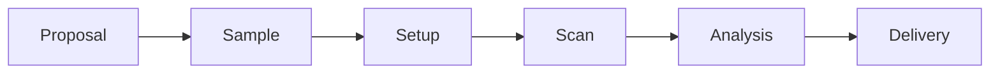

# 35-BM

*APS micro-CT. CORA's first pilot.*

A new dedicated micro-CT instrument at Argonne. White-beam micro-CT moves here from 7-BM as a clean greenfield: the right size to prove CORA's recipe ladder, the wrong size to hide weaknesses behind dataflow stitchware.

| Property | Value |
| --- | --- |
| Beamline | 35-BM |
| Modality | White-beam micro-CT |
| Site | APS, Argonne |
| Status | In design |
| Role for CORA | First pilot |

## Workflow under CORA

Every transition emits events. The full stream re-derives the deliverables. The end-to-end walk lives in [Walk](walk.md).

## Why first

- **Real operations.** Working facility, real users, real failure modes, real data scale.
- **Known-good substrate.** TomoScan, TomoPy, mctOptics, Noise2Inverse360 are mature and open source. CORA schedules, audits, and governs them; it does not reimplement them.

## Read

- [Ground](ground.md): what the pilot inherits at this beamline
- [Scope](scope.md): what the pilot commits to and what it does not
- [Walk](walk.md): one scan, end to end
- [Capabilities](capabilities.md): what the pilot leaves the beamline with
