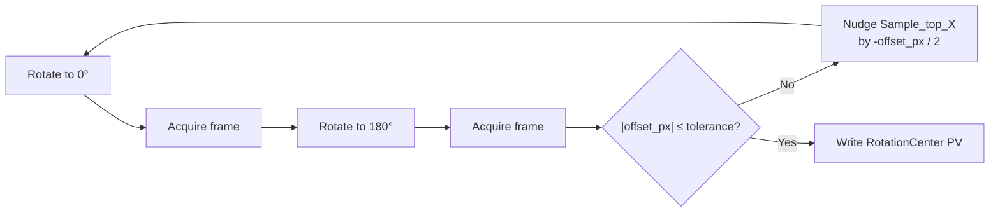

# Rotation-axis alignment under CORA

*Calibrates the rotation-axis pixel position on the detector. The `center` step in 35-BM's five-routine alignment chain, hand-walked into CORA's Procedure aggregate.*

| Property | Value |
| --- | --- |
| Procedure `kind` | `rotation_axis_alignment` |
| ISA-106 level | Operation (composes into a Run's Unit Procedure when re-run mid-scan) |
| Paired pilot test | [`apps/api/tests/integration/test_35bm_rotation_axis_alignment_pilot.py`](../../../../apps/api/tests/integration/test_35bm_rotation_axis_alignment_pilot.py) |

## What this routine is

Rotation-axis alignment is the calibration step that finds the pixel-position of the rotation axis on the detector — the value downstream micro-CT reconstruction needs to produce sharp, ring-free volumes. At 35-BM (mechanically similar to 2-BM), it's one of five ordered alignment sub-routines (`resolution → focus → center → roll → pitch`) operators run via the `xray-imaging/adjust` CLI before any science scan.

This page walks the **`center` routine** specifically. The other four are sibling Procedures with the same shape and a different `kind`.

## Operator gestures

A 0.5 mm tungsten-carbide sphere is mounted on the kinematic tip of the rotary stage. The operator iterates:

1. Rotate to 0°. Acquire an alignment frame. Note the sphere's centroid x-pixel.
2. Rotate to 180°. Acquire an alignment frame. Note the sphere's centroid x-pixel at 180°.
3. Compute the offset: `offset_px = (centroid_at_180 - centroid_at_0) / 2`.
4. If `|offset_px|` exceeds tolerance: nudge the `Sample_top_X` motor by `-offset_px / 2` (in motor units), and go back to step 1.
5. Otherwise: the rotation axis is aligned. Write the calibrated pixel position to the `RotationCenter` PV. Done.



Convergence typically takes 2-3 iterations starting from a few-pixel misalignment.

## Acceptance check

!!! success "The observable that says \"done\""
    `|sphere_centroid_x_at_180 - sphere_centroid_x_at_0| / 2 <= tolerance_px`

    `tolerance_px` is operator-set per beamtime, typically 1 px for a 1024 px-wide alignment FOV at 35-BM.

The truth-source for that comparison lives outside CORA: operators eyeball convergence via the `tomostream` live centroid overlay, or run an off-line `tomopy.find_center_vo` reconstruction-quality metric and accept the result. CORA records the operator's final `Check` (`passed=True`, `actual`, `expected`, `tolerance`, plus an evidence payload naming the source) — it does not validate the claim itself. See Open question 3 below for whether the Check needs a typed `evidence_uri` linking to the off-line tool's artifact.

## Pre-conditions

Before `start_procedure` will accept the alignment Procedure, four target Assets must be in `Active` lifecycle (not `Decommissioned`):

| Asset | Role |
| --- | --- |
| `Aerotech_ABRS_rotary` | The rotation axis. The motor that gets driven 0° → 180° each iteration. |
| `Sample_top_X` | The X-correction motor (a Kohzu CYAT-070). The thing the operator nudges to close the offset. |
| `Oryx_5MP_camera` | The detector. Captures alignment frames at 0° and 180°. |
| `Scintillator_LuAG` | Converts X-rays to visible light for the camera. |

The hexapod, sample-y, and the W-C calibration sphere itself are upstream / supporting; they're not on the Procedure's `target_asset_ids`. (Whether the calibration phantom should be a first-class `Subject` per Subject BC is itself an open question — see below.)

## Procedure in CORA terms

```python
register_procedure(
    name="35-BM rotation-axis alignment (vessel-A bakeout pre-scan)",
    kind="rotation_axis_alignment",
    target_asset_ids={Aerotech_ABRS, Sample_top_X, Oryx_5MP, Scintillator_LuAG},
)
start_procedure(procedure_id)
append_procedure_step(entries=[
  # iteration 1: large initial offset, doesn't converge
  setpoint(channel="Tomo_Rot",   target=0.0,   units="deg"),
  action  (action_name="acquire_alignment_frame", exposure_time_s=0.05),
  check   (channel="sphere_centroid_x_px", passed=True,  actual=1024, expected=1024, tolerance=5),
  setpoint(channel="Tomo_Rot",   target=180.0, units="deg"),
  action  (action_name="acquire_alignment_frame", exposure_time_s=0.05),
  check   (channel="sphere_centroid_x_px", passed=False, actual=1031, expected=1024, tolerance=1, evidence={iteration:1, offset_px:7}),
  setpoint(channel="Sample_top_X", target=-3.5, units="um", note="iter 1 X-correction: -offset_px/2"),
  # iteration 2: converges
  setpoint(channel="Tomo_Rot",   target=0.0,   units="deg"),
  action  (action_name="acquire_alignment_frame", ...),
  setpoint(channel="Tomo_Rot",   target=180.0, units="deg"),
  action  (action_name="acquire_alignment_frame", ...),
  check   (channel="sphere_centroid_x_px", passed=True, actual=1024.5, expected=1024, tolerance=1, evidence={iteration:2, offset_px:0.5}),
  # finalize: write the calibrated rotation-axis pixel position to the PV consumed by science scans
  setpoint(channel="RotationCenter", target=1024.5, units="px", note="calibrated rotation-axis pixel position for 35-BM micro-CT"),
])
complete_procedure(procedure_id)
```

The complete event-trail (Procedure stream + step logbook table + projection row) is the auditable record of "what was aligned, when, by whom, with what evidence." Today this lives only in operator notes + EPICS PV state at the moment of the next scan.

## What CORA adds

<div class="grid cards" markdown>

-   :material-clipboard-text:{ .lg .middle } __Operator-readable record__

    ---

    Survives sessions, beamtimes, and operator turnover. The Procedure stream is the canonical record of what was aligned, when, by whom, with what evidence.

-   :material-database-search:{ .lg .middle } __Cross-procedure search__

    ---

    `GET /procedures?kind=rotation_axis_alignment` lists every alignment at 35-BM. Filter by `target_asset_id` for "all alignments touching the Aerotech rotary stage."

-   :material-history:{ .lg .middle } __Audit trail__

    ---

    Every setpoint, action, and check is a row in `entries_operation_procedure_steps`, queryable independently of operator notes.

-   :material-puzzle:{ .lg .middle } __Composition with the platform__

    ---

    A Procedure with `parent_run_id` set IS a Phase-of-Run, so a re-calibration mid-Run becomes part of the Run's auditable history without operator effort.

</div>

## Failure modes worth modeling

What the operator handles today that CORA should eventually handle structurally:

| Failure mode | What operator does today | Where it could land in CORA |
| --- | --- | --- |
| Sphere drifts out of FOV at 0° or 10° during initial setup | Re-mounts the sphere | Pre-condition violation, no first-class representation yet |
| Hexapod power-cycle quirk: Y dial lands at 350 instead of 0 after reboot | Tribal knowledge — `.. warning::` block in the 2-BM operator wiki | `AssetCondition.Degraded` plus a recovery sub-procedure |
| DMM optimization lands on M2Y = 26.046 instead of the calculated 26.196 | Accepts the value, updates the effective crystal-spacing assumption | `last_status_reason` field shape fits, but no 10c slice emits it on Complete |
| Parasitic axis coupling: moving Sample Y detunes Sample top X by a few µm | Treats successful alignments as having a half-life, re-aligns when needed | Procedure → Asset.condition write coupling; the cross-BC saga in `[[project_operation_design]]` |

## Open questions

The pilot test exists primarily to surface these. Each becomes a watch item or future phase task.

| # | Question | Current encoding | Watch item |
| --- | --- | --- | --- |
| 1 | Iteration loop has no first-class shape | `iteration` key in Check evidence payload | `iteration_started`/`iteration_ended` envelope events? |
| 2 | Two-namesake-motor problem | `role` key on Setpoint payload | Context-dependent AssetPort identity? |
| 3 | External-tool delegation for Check evidence | `source` key on Check payload | Typed `evidence_uri` field linking out? |
| 4 | No discrete success boolean in PVs | `Check.passed: bool` + source + evidence | Future Decision BC `DecisionReasoning` integration |
| 5 | The `kind` field | Free-form bare-str (Supply.kind iter-1 convention) | `ProcedureKind StrEnum` promotion when pilot settles |
| 6 | Hexapod-quirk pre-condition | `.. warning::` blocks in operator wikis (untracked) | 11a `Hazard` cross-BC VO, or recovery sub-procedures |

Detail follows.

### 1. Iteration loop has no first-class shape

The `center` routine is iterative by nature, but our Setpoint/Action/Check atom doesn't reify the loop. We encode the loop via repeated step entries with an `iteration` key in the Check's `evidence` payload. That works, but: queries like "how many iterations did this alignment take?" need to scan all checks. Worth a watch item: should there be an `iteration_started` / `iteration_ended` envelope event, or is the implicit `iteration` payload key sufficient?

### 2. Two-namesake-motor problem

Operators call the same physical motor `Tomo@0deg` and `Tomo@180deg` depending on rotary-stage angle — same Asset, two semantic roles. We encode the role via a `role` payload key on the Setpoint, which preserves the operator vocabulary in the audit but doesn't let the model distinguish at the Asset / Capability layer. Worth a watch item: does AssetPort need context-dependent identity, or is the payload-side `role` sufficient?

### 3. External-tool delegation for Check evidence

The convergence Check's truth-source is off-line reconstruction (`tomopy.find_center_vo`) or live `tomostream` centroid overlay, not a CORA-tracked computation. We encode the source via a `source` payload key on the Check. That's honest but means CORA is recording the operator's claim, not validating it. Worth a watch item: does the Check entry need a typed `evidence_uri` field linking out to the off-line tool's artifact (e.g., the slice-quality plot, the centroid overlay video)?

### 4. No discrete success boolean exists in PVs

The success signal is the operator pressing "OK" or accepting the off-line metric. Currently captured via `Check.passed: bool` plus `source` and `evidence`. Maps cleanly onto a future Decision BC `DecisionReasoning` entry (each Procedure-completion decision becomes an explicit Decision row), but that integration lives beyond 10d.

### 5. The `kind` field

We used `kind="rotation_axis_alignment"` here. The other four sibling routines would be `kind="resolution_alignment"`, `kind="focus_alignment"`, `kind="roll_alignment"`, `kind="pitch_alignment"`. That's a vocabulary decision — should they share a `kind="alignment"` with a sub-discriminator, or stay as five distinct kinds? Per the Supply.kind iter-1 lock convention, free-form bare-str today; promote to a closed `StrEnum` when pilot vocabulary settles. The `ProcedureKind StrEnum promotion` watch item already covers this.

### 6. The hexapod-quirk pre-condition

Tribal-knowledge pre-conditions (the Y-dial-350 quirk, the parasitic axis coupling, the M2Y crystal-spacing override) currently live as `.. warning::` blocks in operator wikis. Where should they live in our model? Two candidates: (a) a `Hazard` cross-BC value object on the Procedure (the planned 11a phase); (b) Recovery sub-procedures invoked on detected quirks. 11a is the canonical home for hazard semantics; the hexapod quirk is a strong concrete instance for that phase's design memo.

## Sources and cross-references

**Operator sources** (the world this routine comes from):

- `xray-imaging/adjust` CLI — the automation tool currently used at 2-BM for the same routine
- 2-BM operator docs `pre_apsu/user/item_016.rst` — original "Sample → Alignment" page
- 2-BM ops docs `ops/item_050.rst` — sample motor stack reference
- `decarlof/tomoscan` — operator-facing scan API (no dedicated alignment entry-point; alignment is collect-scan + off-line reconstruction)

**CORA references** (the design context this page slots into):

- [`project_operation_design`](../../../../memory/project_operation_design.md) — Operation BC design memo with the watch items this page elaborates
- [`project_logbook_entry_storage`](../../../../memory/project_logbook_entry_storage.md) — Path-C trichotomy that the Setpoint/Action/Check + JSON-payload shape implements
- [pilot integration test](../../../../apps/api/tests/integration/test_35bm_rotation_axis_alignment_pilot.py) — the executable spec for this page
